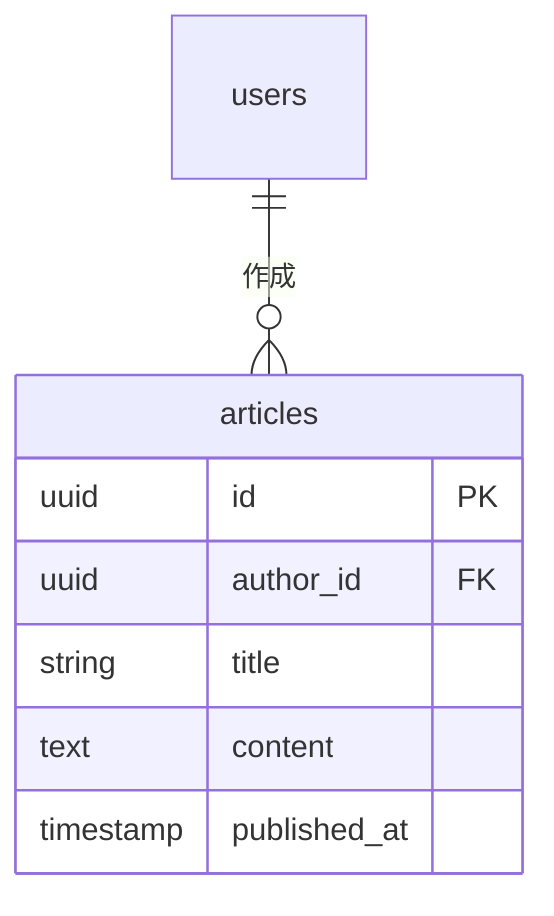
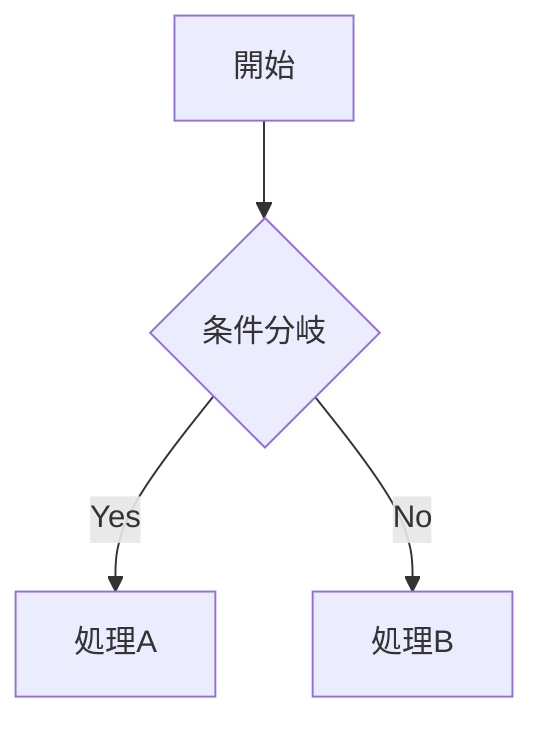
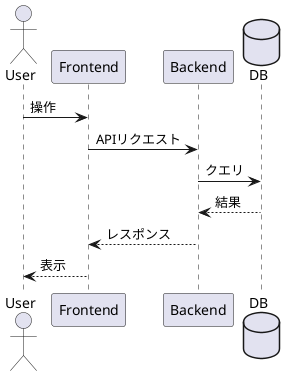

# Feature Spec Skill

## 概要

新規機能の設計段階で、機能仕様ページを `docs/functions/{feature-category}/{feature-name}.md` に作成するSkillです。

**設計方針**: アジャイル的に進めるため、ブロッカーになる箇所は早期に決定し、影響範囲が小さい箇所は比較検討案を記載してTBDとする。

## 項目の優先度

| 優先度 | 項目 | 扱い |
|--------|------|------|
| 🔴 早期決定 | 機能概要・目的・権限・関連テーブル・シーケンス図・機能影響範囲 | **必ず埋める**（他の設計・実装のブロッカーになる） |
| 🟡 中程度 | 画面設計図・機能要件・ユースケース | 大枠は埋める、詳細はTBD可 |
| 🟢 後回し可 | 非機能要件・ログ・コード影響範囲・制約事項詳細 | **比較検討案を箇条書き＋決定TBD** |

## 必須入力

このSkillを呼び出す際は、以下の情報を**詳細な仕様メモ**として提供してください：

- 機能名（大機能/中機能）
- 機能概要・目的
- 対象ユーザー・ロール
- 主要な機能要件
- Figma URL（該当する画面がある場合）

## 出力ファイル構成

```
docs/functions/
└── {feature-category}/
    └── {feature-name}.md
```

**命名規則**: 英語ケバブケース

例：
- `docs/functions/article/create-edit.md`（記事作成・編集機能）
- `docs/functions/auth/login.md`（ログイン機能）
- `docs/functions/news/translation.md`（ニュース翻訳機能）

## 出力テンプレート

```markdown
# {機能名}

## 機能概要
🔴 **早期決定**

{機能の概要説明}

## 目的
🔴 **早期決定**

{この機能が解決する課題・提供する価値}

## 機能条件

### 権限
🔴 **早期決定**

| ロール | 操作可否 |
|--------|----------|
| admin  | ○/×     |
| writer | ○/×     |
| user   | ○/×     |

### 制約事項
🟢 **後回し可**

- 案1: {制約案1} → {メリット/デメリット}
- 案2: {制約案2} → {メリット/デメリット}
- **決定: TBD**

## 画面設計図
🟡 **中程度**

{Figma MCPから取得した画像を埋め込み}

## 関連テーブル
🔴 **早期決定**

{Mermaid ER図}

## フロー図
🟡 **中程度**（必要に応じて）

{Mermaid形式}

## シーケンス図
🔴 **早期決定**

{PlantUML形式}

## 機能要件
🟡 **中程度**

### 機能仕様1: {仕様概要}
- {詳細1}
- {詳細2}

### 機能仕様2: {仕様概要}

### 機能仕様3: {仕様概要}: TBD

## 非機能要件
🟢 **後回し可**

### 非機能仕様1: {仕様概要}
- {詳細1}

### 非機能仕様2: {仕様概要}

### 非機能仕様3: {仕様概要}: TBD

## ログ
🟢 **後回し可**

### 出力タイミング
- 案1: API呼び出し時に全て出力 → 追跡しやすいがログ量増加
- 案2: エラー時のみ出力 → ログ量削減だが正常系追跡困難
- 案3: 重要操作のみ出力 → バランス型
- **決定: TBD**

### ログレベル方針
- 案1: INFO中心 → 詳細追跡可能
- 案2: WARN/ERROR中心 → 異常検知に特化
- **決定: TBD**

## ユースケース
🟡 **中程度**

### シナリオ1: {主要シナリオ}（早期決定）
{具体的な利用シナリオの説明}

### シナリオ2: {副次シナリオ}（TBD可）
{具体的な利用シナリオの説明}

## テストケース
🟡 **中程度**

**記載タイミング**: 単体テストは大枠のみ設計段階、詳細はTDD実装時。E2Eテストは実装完了後

### 単体テスト（設計段階は大枠のみ、詳細はTDD実装時に追記）

| テスト項目 | 対応仕様 | 観点 | 期待値 |
|------------|----------|------|--------|
| {項目1} | 機能仕様1 | {観点} | {期待値} |
| {項目2} | 機能仕様1, 機能仕様2 | {観点} | {期待値} |

### E2Eテスト（実装完了後に記載）

| テストシナリオ | 対応仕様 | 観点 | 期待値 |
|----------------|----------|------|--------|
| {シナリオ1} | 機能仕様1, 機能仕様2 | {観点} | {期待値} |
| {シナリオ2} | 機能仕様3 | {観点} | {期待値} |

## 影響範囲一覧

### 機能影響範囲
🔴 **早期決定**

| 関連機能 | 影響内容 |
|----------|----------|
| {機能名} | {影響}   |

### コード影響範囲
🟢 **後回し可**

- 案1: {アーキテクチャ案1} → {影響するモジュール}
- 案2: {アーキテクチャ案2} → {影響するモジュール}
- **決定: TBD**（実装時に確定）

## 作業見積もり
🟢 **後回し可**

作業見積もりが必要な場合は `/feature-spec-estimate-cost` skillを使用してこのセクションを追加してください。

```

## 図表記法

### フロー図・ER図 → Mermaid





### シーケンス図 → PlantUML



## 実行手順

1. **入力情報の確認**: ユーザーから提供された仕様メモを確認
2. **Figma画面取得**: Figma URLが提供されている場合、Figma MCPで画面を取得
3. **ER図参照**: `docs/versions/<version>/er_diagram.md` から関連テーブルを抽出
   - 存在しない場合は他の場所を探索
   - 見つからない場合はユーザーと質疑応答で決定
4. **優先度に応じた質疑応答**:
   - 🔴 早期決定項目 → AskUserQuestionツールで必ず確認・決定
   - 🟡 中程度項目 → 大枠を確認、詳細は「TBD」で残す選択肢を提示
   - 🟢 後回し項目 → 比較検討案を提示し、「TBD」で残すか確認
5. **影響機能の詳細設計書確認**:
   - **同じ大項目のサブ機能**: 大項目（F04など）を扱う場合、同じ大項目に属する全サブ機能（F04-1, F04-2, ...）の詳細設計書を必ず確認
   - **機能影響範囲に記載した関連機能**: 記載した関連機能の詳細設計書が存在する場合、`docs/functions/<category>/<name>.md` を探索して読み込み、影響内容との整合性を確認
6. **ドキュメント生成**: テンプレートに沿ってMarkdownファイルを作成

## 情報源

| 項目 | 情報源 |
|------|--------|
| 画面設計図 | Figma MCP (`get_screenshot`, `get_design_context`) |
| 関連テーブル | `docs/versions/<version>/er_diagram.md` → 探索 → 質疑応答 |
| その他 | ユーザー提供の仕様メモ + 質疑応答 |

## 注意事項

- **アジャイル原則**: 全てを決め切らない。ブロッカーになる箇所のみ早期決定
- シーケンス図とユースケースは目的が異なるため、両方記載する（重複許容）
  - シーケンス図: 技術的な処理フローを表現
  - ユースケース: ユーザー視点の利用シナリオを表現
- 🟢後回し項目は「比較検討案を箇条書き＋決定TBD」の形式で記載
- 影響範囲は機能（他機能への影響）を早期決定、コードは後回し可

## ドキュメント責務

各ドキュメントは以下のように役割分担する。

| ドキュメント | 責務 | 配置 |
|-------------|------|------|
| feature-spec | 実装仕様・テストケース・設計意図・影響範囲 | `docs/functions/<category>/<name>.md` |
| feature-spec-estimate-cost | 作業見積もり（ストーリーポイント・三点見積もり） | feature-spec内のセクションとして追加 |
| OpenAPI | REST APIの仕様 | `backend/api/openapi.yaml` |
| コード内ドキュメント | 関数・型の仕様・Why（意図・制約） | `frontend/**/*.ts`, `backend/**/*.go` |

**原則**: 設計に関するドキュメントはコード内に完結させ、feature-specには実装仕様とテストケースのみ記載する。作業見積もりが必要な場合は `/feature-spec-estimate-cost` skillを使用して追加する。

## OpenAPIとの連携（バックエンド機能の場合）

- **シーケンス図がAPI設計の元になる**: シーケンス図を参照してOpenAPIを作成
- **OpenAPI配置先**: `backend/api/openapi.yaml`
- **フロー**:
  1. feature-spec作成時にシーケンス図でAPI呼び出しを設計
  2. シーケンス図を参照してOpenAPIを更新
  3. OpenAPI記載時に決定した詳細（レスポンス形式など）はfeature-specに反映
- **不明点があれば必ずユーザーに確認する**
