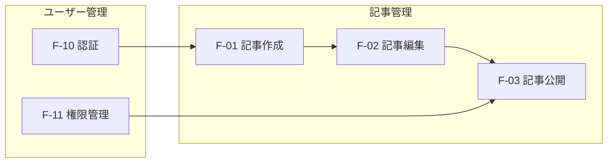
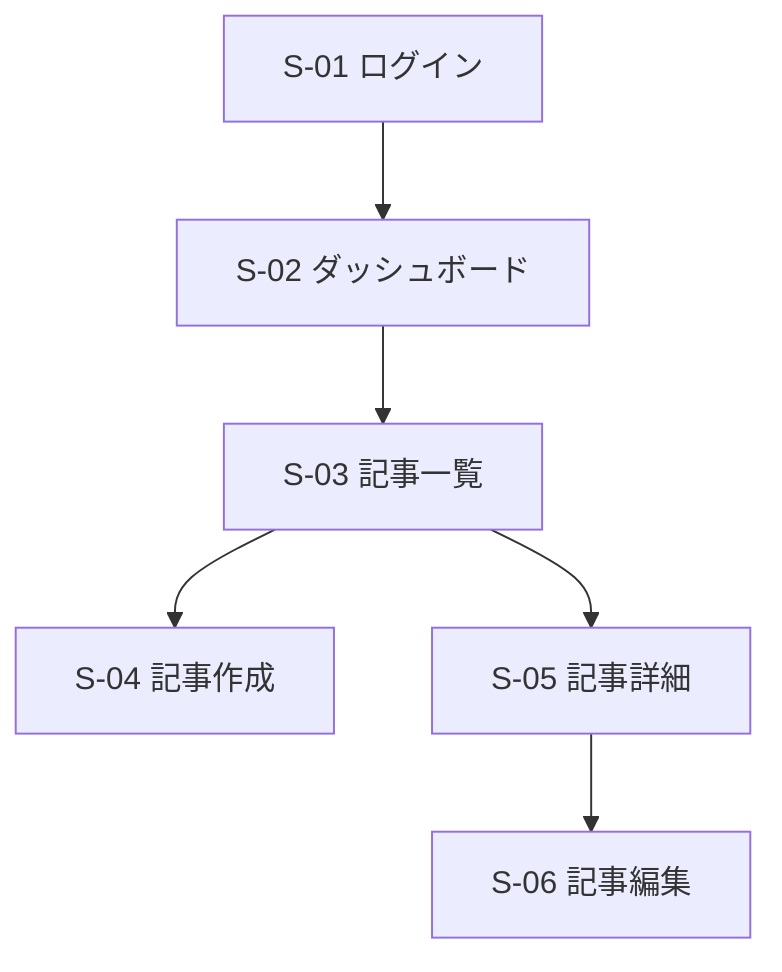
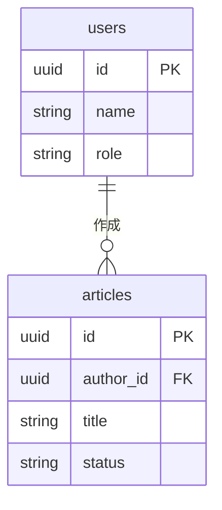
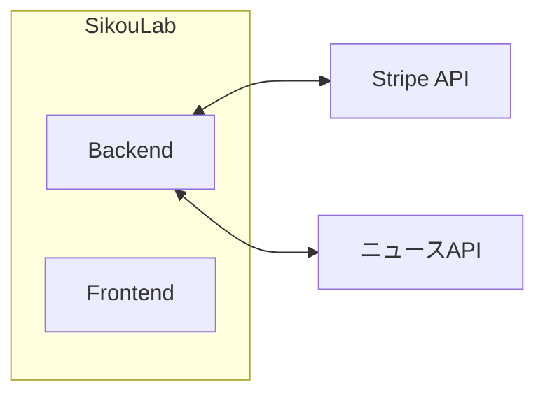

# System Design Skill

## 概要

バージョン単位の基本設計書として、`docs/versions/<version>/system-design.md` を作成するSkillです。

**位置づけ**: 要件定義書（requirements）と機能設計書（feature-spec）の間。「何を作るか」を機能・画面・データの観点で定義し、詳細設計への橋渡しとなる。

```
/requirements（要件定義）
  ↓ Why/What（ユーザー視点）を定義
/system-design（基本設計）★このSkill
  ↓ What（機能構成・画面・データ）を定義
/feature-spec（機能設計）
  ↓ How（詳細仕様）を定義
実装
```

**補足**: 技術スタック・アーキテクチャ詳細・コーディング規約などは `docs/development_guidelines.md` で別途管理する。基本設計書には記載しない。

## 必須入力

このSkillを呼び出す際は、以下の情報を提供してください：

- **バージョン番号**（例: `1_0_0`, `1_1_0`）
- **対応する要件定義書**（`docs/versions/<version>/requirements.md`）

## 出力ファイル

```
docs/versions/<version>/system-design.md
```

例: `docs/versions/1_0_0/system-design.md`

## 出力テンプレート

```markdown
# バージョン X.X.X 基本設計書

## 1. システム概要

### 1.1 本バージョンの位置づけ
{このバージョンで実現する範囲の概要}

### 1.2 前提・制約
{ビジネス的な前提条件を箇条書きで記載}

※ 技術スタック・アーキテクチャ詳細は `docs/development_guidelines.md` を参照

## 2. 機能一覧

### 2.1 機能階層

| ID | 機能名 | 概要 | 対応ストーリー | 優先度 |
|----|--------|------|---------------|--------|
| F-01 | {大機能名} | {概要} | US-01 | MUST |
| F-01-1 | {子機能} | {概要} | US-01 | MUST |
| F-01-2 | {子機能} | {概要} | US-01, US-02 | MUST |
| F-02 | {大機能名} | {概要} | US-03 | WANT |

※ IDは要件定義書と統一

### 2.2 機能相関図

{機能間の依存・連携関係を可視化}



※ 日本語のsubgraph名は必ずダブルクォートで囲む

### 2.3 機能依存関係

| 機能ID | 依存先 | 依存内容 |
|--------|--------|----------|
| F-03 | F-01, F-02 | 記事が存在すること |
| F-03 | F-11 | 公開権限の確認 |

## 3. 画面設計

**Figma**: [{Figmaファイル名}]({FigmaのURL})

### 3.1 画面一覧

| 画面ID | 画面名 | 概要 | 対応機能 |
|--------|--------|------|----------|
| S-01 | {画面名} | {概要} | F-01 |
| S-02 | {画面名} | {概要} | F-02, F-03 |

### 3.2 画面遷移図



## 4. データ設計

### 4.1 テーブル一覧

| テーブル名 | 概要 | 関連機能 |
|-----------|------|----------|
| users | ユーザー情報 | F-10, F-11 |
| articles | 記事情報 | F-01, F-02, F-03 |

### 4.2 ER図（概要）



※ 各テーブルの詳細カラム定義は機能設計書（feature-spec）で記載

## 5. 外部インターフェース

### 5.1 外部API連携

| 連携先 | 用途 | 対応機能 | 更新頻度 |
|--------|------|----------|----------|
| {API名} | {用途} | F-XX | {バッチ/イベント駆動等} |

### 5.2 外部システム連携図



## 6. 権限マトリクス

### 6.1 ロール×機能

| 機能 | admin | writer | user |
|------|-------|--------|------|
| {機能名} | ○ | ○ | × |

### 6.2 サブスクリプション状態×アクセス

| 状態 | アクセス可否 |
|------|-------------|
| active | 全機能利用可能 |
| past_due | {制限内容} |
| canceled | {制限内容} |

## 7. 用語定義

| 用語 | 定義 |
|------|------|
| {用語} | {このドキュメント内での意味} |
```

## 実行手順

1. **要件定義書の参照**: 対応する `requirements.md` を読み込む
2. **機能一覧の展開**: 要件定義書の機能IDを引き継ぎ、必要に応じて子機能に分解
3. **機能相関の整理**: 機能間の依存・連携をMermaid図で可視化
4. **画面設計**: 画面一覧と遷移図を作成
5. **データ設計**: テーブル一覧とER図を作成
6. **外部IF整理**: 外部API・システム連携を整理
7. **権限マトリクス作成**: ロール×機能、サブスク状態×アクセスを整理
8. **質疑応答**: 不明点があればAskUserQuestionで確認
9. **SUMMARY.md更新**: `docs/SUMMARY.md` を更新

## feature-specとの連携

基本設計書で定義した機能・画面・データの詳細仕様は、機能設計書（feature-spec）で記載する。

```
/system-design 実行
  └─ 機能一覧に「F-01: 記事作成」、画面に「S-04: 記事作成画面」を定義
       ※ 出力ファイル: docs/versions/<version>/system-design.md
       ↓
/feature-spec 実行
  └─ 「F-01: 記事作成」の詳細仕様を docs/functions/articles/creation.md に作成
       └─ S-04の詳細レイアウト、入力項目、バリデーションルール
       └─ articlesテーブルの詳細カラム定義
       └─ シーケンス図、ユースケース
```

## ID体系

本スキルおよび関連スキルで統一して使用するID体系：

| プレフィックス | 用途 | 例 |
|---------------|------|-----|
| US-XX | ユーザーストーリー | US-01 |
| F-XX | 大機能 | F-01 |
| F-XX-Y | 子機能 | F-01-1 |
| S-XX | 画面 | S-01 |

## 注意事項

- **IDの一貫性**: 要件定義書の機能ID（F-XX）を引き継ぐ
- **詳細は feature-spec へ**: 画面の詳細レイアウト、テーブルの全カラム定義、シーケンス図などは機能設計書で記載
- **Mermaid図の活用**: 相関・遷移・ER図はMermaid形式で記載し、可視化する
- **日本語subgraph**: Mermaidで日本語のsubgraph名を使う場合は必ずダブルクォート（`"`）で囲む
- **技術詳細は別管理**: アーキテクチャ詳細、技術スタック、コーディング規約は `docs/development_guidelines.md` で管理。基本設計書には記載しない

## 不明点の解消

設計中に以下のような状況に遭遇した場合、`/ask` スキルを活用してください：

- 抽象的で具体化が難しい
- 情報が不足している
- 判断基準や優先順位が不明確
- トレードオフの選択に迷う

`/ask` は暗黙知を言語化するインタビュー型スキルです。質問を通じて前提・制約・判断基準を明確にし、トレードオフ表を作成できます。
