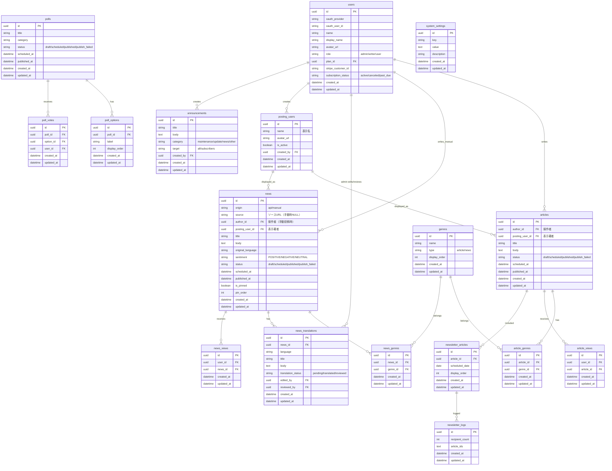
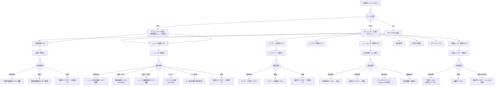
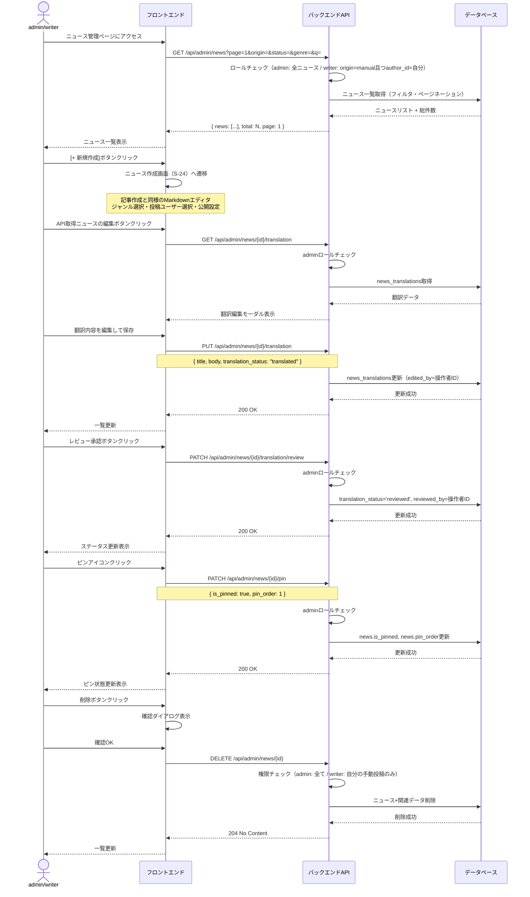
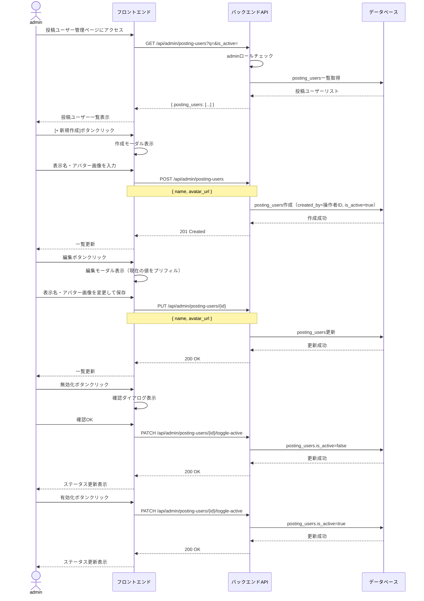

# 管理者ページ

## 機能概要

admin権限およびwriter権限向けの管理画面。
コンテンツ管理（記事・ニュース・アンケート）、ユーザー管理、ニュースレター管理、設定管理、アナリティクス、お知らせ通知を提供するアクセス拠点。

## 目的

- 管理者がコンテンツ（記事・ニュース・アンケート）を一元管理できるようにする
- writerが自身の担当コンテンツ（記事・ニュース）を管理できるようにする
- ユーザーのロール管理・アカウント停止を効率的に行えるようにする
- システム設定値を画面上から変更できるようにする
- アナリティクスで利用状況を可視化する
- サーバーメンテナンスやアップデート情報をユーザーに通知する

## 機能条件

### 権限

| ロール | ダッシュボード(F-12) | 記事管理(F-12-1-1) | ニュース管理(F-12-1-2) | アンケート管理(F-12-1-3) | ユーザー管理(F-12-2) | ニュースレター管理(F-12-3) | 設定管理(F-12-4) | ジャンル管理 | アナリティクス(F-12-5) | お知らせ通知(F-12-6) | 投稿ユーザー管理(F-12-7) |
|--------|---|---|---|---|---|---|---|---|---|---|---|
| admin  | ○ | ○（全記事） | ○（全ニュース） | ○ | ○ | ○ | ○ | ○ | ○ | ○ | ○ |
| writer | ○ | ○（自分の記事のみ） | ○（自分の手動投稿のみ） | × | × | × | × | ○ | × | × | × |
| user   | × | × | × | × | × | × | × | × | × | × | × |

**writerの管理者ページアクセスについて**
- writerは管理者ダッシュボード（S-18）にアクセス可能
- サイドバーに管理者ページへのリンクが表示される（admin/writerのみ）
- writerに表示されるメニューは記事管理・ニュース管理（自分の手動投稿のみ）
- ニュース管理ではAPI取得ニュースの翻訳編集・レビューはadminのみ、手動投稿ニュースの作成・編集はadmin/writer

### 制約事項
🟢 **後回し可**

- 管理者ページのアクセス制御
  - 案1: ミドルウェアでロールチェック → シンプル、RBAC（ADR-011）と一致
  - 案2: ルートグループ+レイアウトで制御 → Next.js App Routerと親和性高
  - **決定: 案1（ミドルウェアでロールチェック）を採用**

## 画面設計図
🟡 **中程度**

Pencil未定義（S-18〜S-22全て未定義）

### S-18 管理者ダッシュボード

サイドバーは一般ユーザーと共通。admin/writerロールのみ「∨ 管理」タブが表示される。

```
┌─────────────────────────────────────────────────────────────────────┐
│ SikouLab    │ メインコンテンツ                                       │
│             │                                                        │
│ ┌─────────┐ │ ┌──────────────────────────────────────────────────┐   │
│ │ダッシュ  │ │ │ 管理者ダッシュボード                             │   │
│ │ボード    │ │ ├──────────────────────────────────────────────────┤   │
│ ├─────────┤ │ │                                                  │   │
│ │∨ 記事    │ │ │ ┌──────────┐ ┌──────────┐ ┌──────────┐          │   │
│ │  株式市場│ │ │ │ 記事管理 │ │ニュース  │ │アンケート │          │   │
│ │  テクノロ│ │ │ │ 記事数   │ │管理      │ │管理      │          │   │
│ │  ジー    │ │ │ │ [詳細→]  │ │ニュース数│ │アンケート │          │   │
│ │  ビジネス│ │ │ └──────────┘ │ [詳細→]  │ │数        │          │   │
│ ├─────────┤ │ │              └──────────┘ │ [詳細→]  │          │   │
│ │ニュース  │ │ │                            └──────────┘          │   │
│ ├─────────┤ │ │                                                  │   │
│ │投票      │ │ │ ┌──────────┐ ┌──────────┐ ┌──────────┐          │   │
│ ├─────────┤ │ │ │ユーザー  │ │ニュース  │ │設定管理  │          │   │
│ │∨ 管理    │ │ │ │管理      │ │レター    │ │          │          │   │
│ │  記事管理│ │ │ │ユーザー数│ │管理      │ │ [詳細→]  │          │   │
│ │  ニュース│ │ │ │ [詳細→]  │ │ [詳細→]  │ └──────────┘          │   │
│ │  管理    │ │ │ └──────────┘ └──────────┘                        │   │
│ │  アンケ  │ │ │                                                  │   │
│ │  ート管理│ │ │ ┌────────────────────────────────────────────┐  │   │
│ │  ユーザー│ │ │ │ アナリティクス（Metabase）       [詳細→]   │  │   │
│ │  管理    │ │ │ └────────────────────────────────────────────┘  │   │
│ │  ニュース│ │ │                                                  │   │
│ │  レター  │ │ │ ┌────────────────────────────────────────────┐  │   │
│ │  設定管理│ │ │ │ お知らせ通知                     [作成→]   │  │   │
│ │  アナリ  │ │ │ └────────────────────────────────────────────┘  │   │
│ │  ティクス│ │ └──────────────────────────────────────────────────┘   │
│ │  お知らせ│ │                                                        │
│ │  通知    │ │                                                        │
│ │  投稿    │ │                                                        │
│ │  ユーザー│ │                                                        │
│ │  管理    │ │                                                        │
│ └─────────┘ │                                                        │
└─────────────────────────────────────────────────────────────────────┘
```

**writerの場合**: 記事管理・ニュース管理カードのみ表示。他のメニューは非表示。

### S-19 記事管理

```
┌─────────────────────────────────────────────────────────────────────┐
│ サイドバー  │ メインコンテンツ                                       │
│（S-18参照） │                                                        │
│             │ ┌──────────────────────────────────────────────────┐   │
│             │ │ 記事管理                          [+ 新規作成]   │   │
│             │ ├──────────────────────────────────────────────────┤   │
│             │ │                                                  │   │
│             │ │ [検索...              ] [ステータス▼] [ジャンル▼] │   │
│             │ │                                                  │   │
│             │ │ ┌────────────────────────────────────────────┐   │   │
│             │ │ │ タイトル │ 著者 │ ステータス │ 公開日 │ 操作 │   │   │
│             │ │ ├────────────────────────────────────────────┤   │   │
│             │ │ │ 記事1    │ 山田 │ 公開中     │ 01/15 │ ✏🗑 │   │   │
│             │ │ │ 記事2    │ 鈴木 │ 予約待ち   │ 01/20 │ ✏🗑 │   │   │
│             │ │ │ 記事3    │ 田中 │ 下書き     │   -   │ ✏🗑 │   │   │
│             │ │ │ 記事4    │ 山田 │ 公開失敗   │   -   │ ✏🗑 │   │   │
│             │ │ └────────────────────────────────────────────┘   │   │
│             │ │                                                  │   │
│             │ │ [< 1 2 3 ... >]  ページネーション                │   │
│             │ └──────────────────────────────────────────────────┘   │
└─────────────────────────────────────────────────────────────────────┘
```

**writer表示時**: 自分が著者の記事のみ一覧表示。

### S-20 ニュース管理

```
┌─────────────────────────────────────────────────────────────────────┐
│ サイドバー  │ メインコンテンツ                                       │
│（S-18参照） │                                                        │
│             │ ┌──────────────────────────────────────────────────┐   │
│             │ │ ニュース管理                     [+ 新規作成]    │   │
│             │ ├──────────────────────────────────────────────────┤   │
│             │ │                                                  │   │
│             │ │ [検索...   ] [取得元▼] [ステータス▼] [ジャンル▼] │   │
│             │ │                                                  │   │
│             │ │ ┌────────────────────────────────────────────────┐│  │
│             │ │ │タイトル│取得元│著者│ステータス│ピン│公開日│操作││  │
│             │ │ ├────────────────────────────────────────────────┤│  │
│             │ │ │News1  │API  │ -  │公開中   │   │01/15│✏🗑 ││  │
│             │ │ │News2  │手動 │山田│公開中   │📌1│01/14│✏🗑 ││  │
│             │ │ │News3  │手動 │鈴木│予約待ち │   │01/20│✏🗑 ││  │
│             │ │ │News4  │API  │ -  │公開中   │   │01/14│✏🗑 ││  │
│             │ │ └────────────────────────────────────────────────┘│  │
│             │ │                                                  │   │
│             │ │ [< 1 2 3 ... >]  ページネーション                │   │
│             │ └──────────────────────────────────────────────────┘   │
└─────────────────────────────────────────────────────────────────────┘
```

**取得元凡例**

| 表示 | origin | 説明 |
|------|--------|------|
| API | api | 外部APIから自動取得したニュース |
| 手動 | manual | admin/writerが手動作成したニュース |

**ステータス凡例**

| 表示 | status | 説明 |
|------|--------|------|
| 下書き | draft | 手動投稿の下書き |
| 予約待ち | scheduled | 予約日時待ち |
| 公開中 | published | 公開済み |
| 公開失敗 | publish_failed | 予約公開のバッチ処理失敗 |

**翻訳ステータス凡例（API取得ニュースの編集時に表示）**

| 表示 | translation_status | 説明 |
|------|-------------------|------|
| 未翻訳 | pending | 自動取得後、未翻訳 |
| 翻訳済 | translated | 翻訳API処理済、レビュー待ち |
| レビュー済 | reviewed | 管理者がレビュー完了 |

**writer表示時**: 自分が作成した手動投稿ニュースのみ一覧表示。API取得ニュースは非表示。

### S-25 投稿ユーザー管理

```
┌─────────────────────────────────────────────────────────────────────┐
│ サイドバー  │ メインコンテンツ                                       │
│（S-18参照） │                                                        │
│             │ ┌──────────────────────────────────────────────────┐   │
│             │ │ 投稿ユーザー管理                  [+ 新規作成]   │   │
│             │ ├──────────────────────────────────────────────────┤   │
│             │ │                                                  │   │
│             │ │ [検索...                           ] [状態▼]     │   │
│             │ │                                                  │   │
│             │ │ ┌──────────────────────────────────────────────┐ │   │
│             │ │ │ アバター │ 表示名   │ 状態 │ 作成日 │ 操作   │ │   │
│             │ │ ├──────────────────────────────────────────────┤ │   │
│             │ │ │ [img]   │ 山田太郎 │ 有効 │ 01/10 │ ✏ ⛔   │ │   │
│             │ │ │ [img]   │ 鈴木花子 │ 有効 │ 01/12 │ ✏ ⛔   │ │   │
│             │ │ │ [img]   │ 田中一郎 │ 無効 │ 01/05 │ ✏ ✅   │ │   │
│             │ │ └──────────────────────────────────────────────┘ │   │
│             │ └──────────────────────────────────────────────────┘   │
└─────────────────────────────────────────────────────────────────────┘
```

**アイコン凡例**

| アイコン | 操作 | 説明 |
|----------|------|------|
| ✏ | 編集 | 表示名・アバターの編集モーダル |
| ⛔ | 無効化 | is_active=falseに変更。確認ダイアログ付き |
| ✅ | 有効化 | is_active=trueに変更。無効ユーザーのみ表示 |

### S-21 アンケート管理

```
┌─────────────────────────────────────────────────────────────────────┐
│ サイドバー  │ メインコンテンツ                                       │
│（S-18参照） │                                                        │
│             │ ┌──────────────────────────────────────────────────┐   │
│             │ │ アンケート管理                     [+ 新規作成]  │   │
│             │ ├──────────────────────────────────────────────────┤   │
│             │ │                                                  │   │
│             │ │ [検索...          ] [ステータス▼] [カテゴリ▼]    │   │
│             │ │                                                  │   │
│             │ │ ┌──────────────────────────────────────────────┐ │   │
│             │ │ │ タイトル │ カテゴリ│ステータス│投票数│ 操作  │ │   │
│             │ │ ├──────────────────────────────────────────────┤ │   │
│             │ │ │ 調査1   │ 株式   │ 公開中  │ 120 │ ✏🗑  │ │   │
│             │ │ │ 調査2   │ AI     │ 予約待ち│   0 │ ✏🗑  │ │   │
│             │ │ │ 調査3   │ 経済   │ 下書き  │   0 │ ✏🗑  │ │   │
│             │ │ └──────────────────────────────────────────────┘ │   │
│             │ │                                                  │   │
│             │ │ [< 1 2 3 ... >]  ページネーション                │   │
│             │ └──────────────────────────────────────────────────┘   │
└─────────────────────────────────────────────────────────────────────┘
```

### S-22 ユーザー管理

```
┌─────────────────────────────────────────────────────────────────────┐
│ サイドバー  │ メインコンテンツ                                       │
│（S-18参照） │                                                        │
│             │ ┌──────────────────────────────────────────────────┐   │
│             │ │ ユーザー管理                                     │   │
│             │ ├──────────────────────────────────────────────────┤   │
│             │ │                                                  │   │
│             │ │ [検索...              ] [ロール▼] [ステータス▼]  │   │
│             │ │                                                  │   │
│             │ │ ┌──────────────────────────────────────────────┐ │   │
│             │ │ │ 名前   │ メール    │ ロール │ 状態 │ 操作    │ │   │
│             │ │ ├──────────────────────────────────────────────┤ │   │
│             │ │ │ 山田   │ y@...    │ admin  │ 有効 │ ✏       │ │   │
│             │ │ │ 鈴木   │ s@...    │ writer │ 有効 │ ✏ ⛔    │ │   │
│             │ │ │ 田中   │ t@...    │ user   │ 有効 │ ✏ ⛔    │ │   │
│             │ │ │ 佐藤   │ sa@...   │ user   │ 停止 │ ✏ ✅    │ │   │
│             │ │ └──────────────────────────────────────────────┘ │   │
│             │ │                                                  │   │
│             │ │ [< 1 2 3 ... >]  ページネーション                │   │
│             │ └──────────────────────────────────────────────────┘   │
└─────────────────────────────────────────────────────────────────────┘
```

**アイコン凡例**

| アイコン | 操作 | 説明 |
|----------|------|------|
| ✏ | ロール変更 | ロール選択ドロップダウン表示 |
| ⛔ | アカウント停止 | 確認ダイアログ付き |
| ✅ | アカウント復帰 | 停止中ユーザーのみ表示 |

## 関連テーブル



## フロー図



## シーケンス図

### 記事管理（F-12-1-1）


### ニュース管理（F-12-1-2）



### 投稿ユーザー管理（F-12-7）



### アンケート管理（F-12-1-3）


### ユーザー管理（F-12-2）


### ニュースレター管理（F-12-3）


### 設定管理（F-12-4）


### お知らせ通知（F-12-6）


## 機能要件
🟡 **中程度**

### 機能要件1: 記事管理(F-12-1-1)

- 機能仕様1: 記事一覧をページネーション付きで表示する
  - admin: 全記事を表示
  - writer: `author_id`=自分の記事のみ表示
  - 表示項目: タイトル、著者名、ステータス、公開日、操作ボタン

- 機能仕様2: 検索・フィルタ機能を提供する
  - キーワード検索（タイトル部分一致）
  - ステータスフィルタ（draft/scheduled/published/publish_failed）
  - ジャンルフィルタ

- 機能仕様3: 記事を編集する
  - 編集ボタンで記事作成・編集画面（S-05）に遷移する
  - 既存の記事作成・編集機能（F-04-1, F-04-2）を再利用

- 機能仕様4: 記事を削除する
  - 確認ダイアログ付き
  - admin: 全記事を削除可能
  - writer: 自分の記事のみ削除可能

- 機能仕様5: 新規作成ボタンで記事作成画面（S-05）に遷移する

- 機能仕様6: 記事作成時にジャンルを選択・新規追加する
  - 既存ジャンルから選択、または新規ジャンルを追加
  - writerも新規ジャンル追加可能
  - 新規ジャンルは`genres`テーブルに自動作成

### 機能要件2: ニュース管理(F-12-1-2)

- 機能仕様1: ニュース一覧をページネーション付きで表示する
  - admin: 全ニュースを表示（API取得 + 手動投稿）
  - writer: `origin=manual`且つ`author_id`=自分の手動投稿ニュースのみ表示
  - 表示項目: タイトル、取得元（API/手動）、著者、ステータス、ピン状態、公開日、操作ボタン

- 機能仕様2: 検索・フィルタ機能を提供する
  - キーワード検索（タイトル部分一致）
  - 取得元フィルタ（api/manual）
  - ステータスフィルタ（draft/scheduled/published/publish_failed）
  - ジャンルフィルタ

- 機能仕様3: 手動ニュースを新規作成する
  - [+ 新規作成]ボタンでニュース作成画面（S-24）に遷移
  - Markdownエディタで本文を入力（記事作成と同様のUI）
  - `origin=manual`, `author_id`=操作者ID で作成
  - 公開設定: 即時公開 / 予約公開 / 下書き保存
  - admin/writerともに実行可能

- 機能仕様4: 手動ニュースを編集する
  - 編集ボタンでニュース編集画面（S-24）に遷移
  - admin: 全手動ニュースを編集可能
  - writer: 自分の手動投稿のみ編集可能

**手動ニュース作成・編集フォーム バリデーションルール（F-05-7）**

記事作成（F-04-1 `article/create-edit.md`）と同様のUI構成。差分は以下の通り。

| フィールド | 必須 | ルール | 記事との差分 |
|-----------|:----:|--------|-------------|
| title | ○ | 1〜200文字 | 同一 |
| body | ○ | Markdown形式、1文字以上 | 同一 |
| posting_user_id | ○ | `is_active=true`の投稿ユーザーのみ選択可 | 同一 |
| genre_ids | ○ | 1つ以上選択。`type=news`のジャンルのみ | `type=article` → `type=news` |
| stock_ids | - | 任意。関連銘柄を検索・選択（複数可） | 同一 |
| status | ○ | `draft` / `published` / `scheduled` のいずれか | 同一 |
| scheduled_at | △ | `status=scheduled`の場合のみ必須。現在日時より未来であること | 同一 |
| include_newsletter | - | **なし**（ニュースはニュースレター対象外） | 記事のみ |
| origin | - | `manual`固定（自動設定、フォーム非表示） | ニュースのみ |
| author_id | - | 操作者ID（自動設定、フォーム非表示） | ニュースのみ |

- 機能仕様5: API取得ニュースの翻訳内容を編集する
  - 翻訳タイトル・本文の編集
  - `edited_by`に操作者IDを記録
  - adminのみ実行可能

- 機能仕様6: 翻訳をレビュー承認する
  - `translation_status`を`reviewed`に更新
  - `reviewed_by`に操作者IDを記録
  - adminのみ実行可能

- 機能仕様7: ニュースをピン固定/解除する
  - `is_pinned=true`に設定し、`pin_order`で表示順を制御
  - 複数ピン時は`pin_order`の昇順（1が最上位）
  - ピン解除時は`is_pinned=false`, `pin_order=NULL`
  - ピンされたニュースは24時間経過制限+10件表示枠の制約内で優先表示
  - adminのみ実行可能

- 機能仕様8: ニュースを削除する
  - 確認ダイアログ付き
  - admin: 全ニュースを削除可能
  - writer: 自分の手動投稿のみ削除可能
  - 関連する`news_translations`, `news_genres`, `stock_news`も削除

- 機能仕様9: ニュースにジャンルを紐づけ・変更する
  - 外部API取得時に自動的にジャンルを紐づけ
  - ニュース編集時にジャンルの追加・削除が可能
  - 複数ジャンルの紐づけ可能（`news_genres`テーブル）
  - admin/writerともに操作可能

**ステータス凡例**

| 表示 | status | 説明 |
|------|--------|------|
| 下書き | draft | 手動投稿の下書き |
| 予約待ち | scheduled | 予約日時待ち |
| 公開中 | published | 公開済み |
| 公開失敗 | publish_failed | 予約公開のバッチ処理失敗 |

**翻訳ステータス凡例（API取得ニュースの編集時に表示）**

| 表示 | translation_status | 説明 |
|------|-------------------|------|
| 未翻訳 | pending | 自動取得後、未翻訳 |
| 翻訳済 | translated | 翻訳API処理済、レビュー待ち |
| レビュー済 | reviewed | 管理者がレビュー完了 |

### 機能要件3: アンケート管理(F-12-1-3)

- 機能仕様1: アンケート一覧をページネーション付きで表示する
  - 表示項目: タイトル、カテゴリ、ステータス、投票数、操作ボタン

- 機能仕様2: 検索・フィルタ機能を提供する
  - キーワード検索（タイトル部分一致）
  - ステータスフィルタ（draft/scheduled/published/publish_failed）
  - カテゴリフィルタ

- 機能仕様3: アンケートを新規作成する
  - 入力項目: タイトル、カテゴリ（5種程度）、選択肢（最大9つ）
  - 公開設定: 即時公開 / 予約公開
  - 予約公開の場合は`scheduled_at`を設定

- 機能仕様4: 選択肢のバリデーション
  - 最小2つ、最大9つ
  - 各選択肢は空文字不可
  - `display_order`を自動付与

- 機能仕様5: アンケートを編集する
  - 公開中アンケートの選択肢変更は不可（投票データ整合性のため）
  - 下書き・予約待ちの場合は全項目編集可能

- 機能仕様6: アンケートを削除する
  - 確認ダイアログ付き
  - 関連する`poll_options`, `poll_votes`, `poll_bookmarks`も削除

### 機能要件4: ユーザー管理(F-12-2)

- 機能仕様1: ユーザー一覧をページネーション付きで表示する
  - 表示項目: 表示名、メールアドレス（OAuth）、ロール、ステータス、操作ボタン

- 機能仕様2: 検索・フィルタ機能を提供する
  - キーワード検索（名前・メールアドレス部分一致）
  - ロールフィルタ（admin/writer/user）

- 機能仕様3: ユーザーのロールを変更する
  - 確認ダイアログ付き
  - 変更可能なロール: admin, writer, user
  - 自分自身のロール変更は禁止

- 機能仕様4: アカウントを停止する
  - 確認ダイアログ付き
  - 自分自身の停止は禁止
  - 停止中ユーザーはログイン不可

- 機能仕様5: アカウントを復帰する
  - 停止中ユーザーのみ操作可能

**アイコン凡例**

| アイコン | 操作 | 説明 |
|----------|------|------|
| ✏ | ロール変更 | ロール選択ドロップダウン表示 |
| ⛔ | アカウント停止 | 確認ダイアログ付き |
| ✅ | アカウント復帰 | 停止中ユーザーのみ表示 |

### 機能要件5: ニュースレター管理(F-12-3)

- 機能仕様1: 当日配信予定の記事を一覧表示する
  - `scheduled_date`=当日の記事を取得
  - `display_order`順にソート

- 機能仕様2: 最大5件まで表示する
  - 5件に達した場合、追加ボタンを無効化

- 機能仕様3: 公開済み記事から選択して追加する
  - 記事選択モーダルで記事一覧を表示
  - 検索・フィルタ機能（ジャンル・日付）
  - 過去の記事も追加可能

- 機能仕様4: 最大5件制限を適用する
  - 既存5件の場合は追加不可

- 機能仕様5: 同一記事の重複登録を禁止する
  - `article_id`のユニークチェック

- 機能仕様6: 記事作成時のチェックボックスで追加する
  - 記事作成・編集画面に「この記事をニュースレターに含める」チェックボックス（F-04-1連携）
  - チェック時、当日の`newsletter_articles`に自動追加

- 機能仕様7: 記事を削除する
  - 確認ダイアログ付き

- 機能仕様8: 過去の配信履歴を一覧表示する
  - `newsletter_logs`から取得（新しい順）
  - 表示項目: 配信日時・記事数・受信者数

- 機能仕様9: 履歴詳細を表示する
  - クリックで配信された記事IDを確認可能

- 機能仕様10: ニュースレター配信記事の表示順をドラッグ＆ドロップで変更する
  - 対象: newsletter_articlesテーブルのdisplay_orderカラム
  - ニュースレター内の記事表示順序を制御

### 機能要件6: 設定管理(F-12-4)

- 機能仕様1: システム設定値一覧を表示する
  - `system_settings`テーブルのkey-value一覧表示
  - 説明文（`description`）をツールチップで表示

- 機能仕様2: 設定値を編集する
  - インライン編集（テーブル行内で直接編集）
  - バリデーション: 数値型設定は範囲チェック

- 機能仕様3: 初期設定値（想定）
  - `articles_per_page`: 記事一覧表示件数（デフォルト: 10）
  - `news_per_page`: ニュース一覧表示件数（デフォルト: 10）
  - `trend_score_view_weight`: トレンドスコアView数係数（デフォルト: 1）
  - `trend_score_stock_weight`: トレンドスコア人気銘柄紐付き係数（デフォルト: 2）

- 機能仕様4: ジャンル一覧を表示する
  - `genres`テーブルの一覧表示
  - タイプ（article/news）でタブ分け

- 機能仕様5: ジャンルを追加・編集する（admin/writer）
  - 入力項目: ジャンル名、タイプ（article/news）、表示順
  - admin/writerともに新規追加・編集可能
  - 初期ジャンル: 株式市場、AI、経済（議事録 0126_design_notes.md）

- 機能仕様6: ジャンルの表示順を変更する
  - `display_order`を更新

### 機能要件7: アナリティクス(F-12-5)

- 機能仕様1: Metabase埋め込みダッシュボードを表示する
  - iframeでMetabaseダッシュボードを埋め込み
  - 認証はMetabase Embedding SDKまたはJWT署名付きURL

- 機能仕様2: 表示指標（議事録 0107.md）
  - 記事のインサイト（閲覧数・いいね数・ブックマーク数）
  - ニュースのインサイト（閲覧数・いいね数・ブックマーク数）
  - ピックされた銘柄（記事・ニュースに紐付いた銘柄のランキング）
  - 入会退会者数（MAU推移）

### 機能要件8: お知らせ通知(F-12-6)

- 機能仕様1: お知らせを作成・送信する
  - 入力項目: タイトル、本文、カテゴリ（メンテナンス/アップデート/重要ニュース）
  - 送信対象: 全ユーザー or 特定条件

- 機能仕様2: 通知カテゴリ
  - メンテナンス: サーバー停止時間の事前告知（深夜2〜6時、議事録 0126.md）
  - アップデート: 機能追加・変更のサマリー通知
  - 重要ニュース: 管理者が判断した重要情報の強制通知（議事録 0120.md）

- 機能仕様3: 通知履歴を確認する
  - 過去の送信履歴を一覧表示
  - 表示項目: タイトル、カテゴリ、送信日時、送信対象数

### 機能要件9: 投稿ユーザー管理(F-12-7)

- 機能仕様1: 投稿ユーザー一覧を表示する
  - 表示項目: アバター、表示名、状態（有効/無効）、作成日、操作ボタン
  - 検索: 表示名の部分一致
  - フィルタ: 状態（有効/無効）

- 機能仕様2: 投稿ユーザーを新規作成する
  - 入力項目: 表示名（必須）、アバター画像（任意）
  - `created_by`に操作者IDを自動記録
  - `is_active=true`で作成
  - adminのみ実行可能

- 機能仕様3: 投稿ユーザーを編集する
  - 編集可能項目: 表示名、アバター画像
  - 編集モーダルで操作
  - adminのみ実行可能

- 機能仕様4: 投稿ユーザーを無効化する
  - 確認ダイアログ付き
  - `is_active=false`に更新
  - 無効化された投稿ユーザーは記事・ニュース作成時の選択肢に表示されない
  - 既に紐づいている記事・ニュースの表示著者名は維持される
  - adminのみ実行可能

- 機能仕様5: 投稿ユーザーを有効化する
  - 無効化されたユーザーのみ操作可能
  - `is_active=true`に更新
  - adminのみ実行可能

## 非機能要件
🟢 **後回し可**

### 非機能要件1: パフォーマンス

- 非機能仕様1: 一覧画面の初期表示: 2秒以内
- 非機能仕様2: CRUD操作のレスポンス: 1秒以内
- 非機能仕様3: ページネーションのページサイズ: デフォルト20件

### 非機能要件2: セキュリティ

- 非機能仕様1: 全APIエンドポイントにロールベースアクセス制御を適用
- 非機能仕様2: CSRF対策
- 非機能仕様3: 管理者操作の監査ログ（ロール変更・アカウント停止・設定変更）

### 非機能要件3: アカウント停止の実装方式

- 案1: `subscription_status`に`suspended`を追加 → 既存カラム流用、ステータス混在
- 案2: `users`テーブルに`is_suspended`カラム追加 → 明確な分離、マイグレーション必要
- **決定: TBD**

### 非機能要件4: 通知配信方式

- 案1: アプリ内通知のみ → 実装簡易、到達率低
- 案2: メール通知 → 到達率高、コスト有
- 案3: アプリ内 + メール → カバレッジ最大、実装コスト高
- **決定: TBD**

## ログ
🟢 **後回し可**

### 出力タイミング
- 案1: 全管理者操作を記録 → 追跡しやすいがログ量増加
- 案2: 重要操作のみ（ロール変更・アカウント停止・設定変更・削除） → バランス型
- **決定: TBD**

### ログレベル方針
- 案1: INFO中心（管理者操作記録） → 詳細追跡可能
- 案2: WARN/ERROR中心 → 異常検知に特化
- **決定: TBD**

## ユースケース
🟡 **中程度**

### シナリオ1: adminが記事を管理する（早期決定）
1. adminが管理者ダッシュボードにアクセス
2. 記事管理カードをクリック
3. 記事一覧が表示される（全記事）
4. 検索欄でキーワード検索し、対象記事を見つける
5. 編集ボタンをクリックし、記事編集画面（S-05）に遷移
6. 編集完了後、記事管理画面に戻る

### シナリオ2: writerが自分の記事を管理する（早期決定）
1. writerがサイドバーの管理者ページリンクをクリック
2. ダッシュボードに記事管理のみ表示される
3. 記事管理をクリック
4. 自分の記事のみ一覧表示される
5. 不要な下書き記事を削除する

### シナリオ3: adminがニュースの翻訳をレビューする（早期決定）
1. adminがニュース管理ページにアクセス
2. 翻訳ステータスで「翻訳済」をフィルタ
3. レビュー対象のニュースを選択し、翻訳内容を確認
4. 問題なければレビュー承認ボタンをクリック
5. ステータスが「レビュー済」に更新される

### シナリオ4: adminがアンケートを作成する（早期決定）
1. adminがアンケート管理ページにアクセス
2. 新規作成ボタンをクリック
3. タイトル「今週注目の銘柄は？」、カテゴリ「株式」を入力
4. 選択肢を5つ入力（AAPL, GOOGL, MSFT, AMZN, TSLA）
5. 予約公開を選択し、来週月曜日を設定
6. 保存するとアンケート一覧に追加される

### シナリオ5: adminがユーザーにwriter権限を付与する（早期決定）
1. adminがユーザー管理ページにアクセス
2. 対象ユーザーを検索
3. ロール変更ドロップダウンで「writer」を選択
4. 確認ダイアログで「OK」
5. ユーザーのロールがwriterに変更され、記事投稿が可能になる

### シナリオ6: adminがニュースレターの配信記事を設定する（早期決定）
1. adminがニュースレター管理ページにアクセス
2. 「記事を追加」ボタンをクリック
3. 記事選択モーダルから配信したい記事を選択（最大5件）
4. ドラッグ＆ドロップで配信順を並び替える
5. 翌朝7時30分に選択した記事が配信される

### シナリオ7: adminが配信履歴を確認する（早期決定）
1. adminがニュースレター管理ページにアクセス
2. 配信履歴セクションで過去の配信日時・記事数・受信者数を確認
3. 特定の履歴をクリックし、配信された記事の詳細を確認

### シナリオ8: adminがメンテナンス通知を送信する（早期決定）
1. adminがお知らせ通知ページにアクセス
2. 新規通知作成ボタンをクリック
3. タイトル「サーバーメンテナンスのお知らせ」を入力
4. 本文に日時（深夜2〜6時）と影響範囲を記載
5. カテゴリ「メンテナンス」、対象「全ユーザー」を選択
6. 送信ボタンで通知が配信される

### シナリオ9: adminがシステム設定を変更する（早期決定）
1. adminが設定管理ページにアクセス
2. 「trend_score_view_weight」の値を1から1.5に変更
3. 保存ボタンをクリック
4. トレンドスコア計算に反映される

### シナリオ10: admin/writerが手動ニュースを作成する（早期決定）
1. admin/writerがニュース管理ページにアクセス
2. [+ 新規作成]ボタンをクリック
3. ニュース作成画面（S-24）でタイトル・本文（Markdown）を入力
4. ジャンルを選択し、投稿ユーザーを選択
5. 予約公開を選択し、日時を設定
6. 保存するとニュース一覧に「予約待ち」として追加される

### シナリオ11: writerが自分の手動投稿ニュースを管理する（早期決定）
1. writerがニュース管理ページにアクセス
2. 自分が作成した手動投稿ニュースのみ一覧表示される
3. 下書きのニュースを編集し、公開設定を変更
4. 不要なニュースを削除する

### シナリオ12: adminがニュースをピン固定する（早期決定）
1. adminがニュース管理ページにアクセス
2. トレンド上位に固定したいニュースのピンアイコンをクリック
3. ピン順序を設定（1 = 最上位）
4. ニュース一覧でピンマーク（📌1）が表示される
5. トレンドニュース表示で該当ニュースが上位に固定される

### シナリオ13: adminが投稿ユーザーを管理する（早期決定）
1. adminが投稿ユーザー管理ページにアクセス
2. [+ 新規作成]ボタンをクリック
3. 表示名「山田太郎」とアバター画像を設定
4. 保存すると一覧に追加される
5. 退職した投稿ユーザーを無効化する（⛔ボタン）
6. 無効化されたユーザーは記事・ニュース作成時の選択肢に表示されなくなる

## テストケース
🟡 **中程度**

**記載タイミング**: 単体テストは大枠のみ設計段階、詳細はTDD実装時。E2Eテストは実装完了後

### 単体テスト（設計段階は大枠のみ、詳細はTDD実装時に追記）

| テスト項目 | 対応仕様 | 観点 | 期待値 |
|------------|----------|------|--------|
| ダッシュボード表示（admin） | 機能要件1/機能仕様1 | 全メニュー表示 | 全カードが表示される |
| ダッシュボード表示（writer） | 機能要件1/機能仕様1 | 制限メニュー表示 | 記事管理+ニュース管理のみ表示 |
| ダッシュボードアクセス拒否（user） | 機能要件1/機能仕様1 | 権限チェック | 403エラー |
| 記事一覧取得（admin） | 機能要件1/機能仕様1 | 全記事取得 | 全記事が返される |
| 記事一覧取得（writer） | 機能要件1/機能仕様1 | 自分の記事のみ | author_id=自分の記事のみ返される |
| 記事検索 | 機能要件1/機能仕様2 | キーワード・フィルタ | フィルタ結果が返される |
| 記事編集 | 機能要件1/機能仕様3 | 記事作成画面へ遷移 | 記事編集画面に遷移 |
| 記事削除（admin） | 機能要件1/機能仕様4 | 他人の記事削除 | 削除成功 |
| 記事削除（writer: 自分） | 機能要件1/機能仕様4 | 自分の記事削除 | 削除成功 |
| 記事削除（writer: 他人） | 機能要件1/機能仕様4 | 他人の記事削除 | 403エラー |
| ニュース一覧取得（admin） | 機能要件2/機能仕様1 | 全ニュース取得 | API+手動の全ニュースが返される |
| ニュース一覧取得（writer） | 機能要件2/機能仕様1 | 自分の手動投稿のみ | origin=manual且つauthor_id=自分のニュースのみ返される |
| ニュース検索 | 機能要件2/機能仕様2 | キーワード・フィルタ | フィルタ結果が返される |
| 手動ニュース作成 | 機能要件2/機能仕様3 | 正常作成 | origin=manual, author_id=操作者で作成 |
| 手動ニュース編集（admin） | 機能要件2/機能仕様4 | 他人の手動投稿編集 | 編集成功 |
| 手動ニュース編集（writer: 自分） | 機能要件2/機能仕様4 | 自分の手動投稿編集 | 編集成功 |
| 手動ニュース編集（writer: 他人） | 機能要件2/機能仕様4 | 他人の手動投稿編集 | 403エラー |
| 手動ニュース作成: タイトル未入力 | 機能要件2/F-05-7バリデーション | 必須チェック | バリデーションエラー |
| 手動ニュース作成: 本文未入力 | 機能要件2/F-05-7バリデーション | 必須チェック | バリデーションエラー |
| 手動ニュース作成: タイトル201文字 | 機能要件2/F-05-7バリデーション | 文字数上限 | バリデーションエラー |
| 手動ニュース作成: 投稿ユーザー未選択 | 機能要件2/F-05-7バリデーション | 必須チェック | バリデーションエラー |
| 手動ニュース作成: 無効な投稿ユーザー指定 | 機能要件2/F-05-7バリデーション | is_active=falseのユーザー | バリデーションエラー |
| 手動ニュース作成: ジャンル未選択 | 機能要件2/F-05-7バリデーション | 必須チェック | バリデーションエラー |
| 手動ニュース予約公開: 正常 | 機能要件2/機能仕様3 | status=scheduled+未来日時 | 予約状態で保存される |
| 手動ニュース予約公開: 過去日時 | 機能要件2/F-05-7バリデーション | 過去のscheduled_at | バリデーションエラー |
| 手動ニュース予約公開: scheduled_at未指定 | 機能要件2/F-05-7バリデーション | status=scheduledでscheduled_at=null | バリデーションエラー |
| 手動ニュース下書き保存 | 機能要件2/機能仕様3 | status=draftで保存 | 下書き状態で保存される |
| 手動ニュース: origin自動設定 | 機能要件2/機能仕様3 | origin=manual固定 | origin=manualで作成される |
| 翻訳編集（admin） | 機能要件2/機能仕様5 | edited_by記録 | 翻訳更新+edited_by設定 |
| 翻訳編集（writer） | 機能要件2/機能仕様5 | 権限チェック | 403エラー |
| レビュー承認（admin） | 機能要件2/機能仕様6 | ステータス更新 | reviewed+reviewed_by設定 |
| レビュー承認（writer） | 機能要件2/機能仕様6 | 権限チェック | 403エラー |
| ニュースピン設定（admin） | 機能要件2/機能仕様7 | ピン固定 | is_pinned=true, pin_order設定 |
| ニュースピン解除（admin） | 機能要件2/機能仕様7 | ピン解除 | is_pinned=false, pin_order=NULL |
| ニュースピン設定（writer） | 機能要件2/機能仕様7 | 権限チェック | 403エラー |
| ニュース削除（admin） | 機能要件2/機能仕様8 | 関連データ削除 | ニュース+関連データ削除成功 |
| ニュース削除（writer: 自分の手動） | 機能要件2/機能仕様8 | 自分の手動投稿削除 | 削除成功 |
| ニュース削除（writer: API取得） | 機能要件2/機能仕様8 | API取得ニュース削除 | 403エラー |
| アンケート一覧取得 | 機能要件3/機能仕様1 | 投票数含む | アンケートリストが返される |
| アンケート検索 | 機能要件3/機能仕様2 | キーワード・フィルタ | フィルタ結果が返される |
| アンケート作成 | 機能要件3/機能仕様3 | 正常作成 | polls+poll_options作成成功 |
| アンケート選択肢バリデーション | 機能要件3/機能仕様4 | 最小2・最大9 | 範囲外でエラー |
| アンケート編集 | 機能要件3/機能仕様5 | 正常編集 | アンケート更新成功 |
| 公開中アンケート編集制限 | 機能要件3/機能仕様5 | 選択肢変更不可 | 422エラー |
| アンケート削除 | 機能要件3/機能仕様6 | 関連データ削除 | polls+options+votes+bookmarks削除 |
| ユーザー一覧取得 | 機能要件4/機能仕様1 | ページネーション | ユーザーリスト返却 |
| ユーザー検索 | 機能要件4/機能仕様2 | キーワード・フィルタ | フィルタ結果が返される |
| ロール変更 | 機能要件4/機能仕様3 | 正常変更 | ロール更新成功 |
| 自分のロール変更禁止 | 機能要件4/機能仕様3 | 自己変更防止 | 400エラー |
| アカウント停止 | 機能要件4/機能仕様4 | 正常停止 | ステータス更新成功 |
| 自分のアカウント停止禁止 | 機能要件4/機能仕様4 | 自己停止防止 | 400エラー |
| アカウント復帰 | 機能要件4/機能仕様5 | 正常復帰 | ステータス復帰成功 |
| 配信記事一覧取得 | 機能要件5/機能仕様1 | 当日配信記事の取得 | 当日の記事リストが返される |
| 配信記事追加 | 機能要件5/機能仕様3, 機能仕様4 | 記事の追加・5件制限 | 記事が追加される |
| 5件超過エラー | 機能要件5/機能仕様4 | 上限チェック | 422エラーが返される |
| 重複登録禁止 | 機能要件5/機能仕様5 | 同一記事の2重登録 | 409エラーが返される |
| 配信記事削除 | 機能要件5/機能仕様7 | 記事の削除 | 削除が成功する |
| 配信履歴取得 | 機能要件5/機能仕様8 | 履歴の取得 | 履歴リストが返される |
| 表示順変更 | 機能要件5/機能仕様10 | display_orderの更新 | 順序が更新される |
| 設定値一覧取得 | 機能要件6/機能仕様1 | 全設定取得 | system_settings一覧返却 |
| 設定値更新 | 機能要件6/機能仕様2 | 値更新 | 更新成功 |
| ジャンル一覧取得 | 機能要件6/機能仕様4 | ジャンル一覧取得 | genresリスト返却 |
| ジャンル追加 | 機能要件6/機能仕様5 | 正常追加 | genres作成成功 |
| アナリティクス表示 | 機能要件7/機能仕様1 | Metabase埋め込み | ダッシュボード表示 |
| お知らせ通知作成 | 機能要件8/機能仕様1 | 正常作成・送信 | 通知作成+配信成功 |
| お知らせ通知履歴取得 | 機能要件8/機能仕様3 | 履歴一覧 | 通知リスト返却 |
| 投稿ユーザー一覧取得 | 機能要件9/機能仕様1 | 一覧取得 | 投稿ユーザーリスト返却 |
| 投稿ユーザー作成 | 機能要件9/機能仕様2 | 正常作成 | created_by=操作者で作成成功 |
| 投稿ユーザー作成（writer） | 機能要件9/機能仕様2 | 権限チェック | 403エラー |
| 投稿ユーザー編集 | 機能要件9/機能仕様3 | 正常編集 | 表示名・アバター更新成功 |
| 投稿ユーザー無効化 | 機能要件9/機能仕様4 | 無効化 | is_active=false更新成功 |
| 投稿ユーザー有効化 | 機能要件9/機能仕様5 | 有効化 | is_active=true更新成功 |
| 無効ユーザー選択不可 | 機能要件9/機能仕様4 | 選択肢非表示 | is_active=falseのユーザーが選択肢に表示されない |

### E2Eテスト（実装完了後に記載）

| テストシナリオ | 対応仕様 | 観点 | 期待値 |
|----------------|----------|------|--------|
| admin記事管理フロー | 機能要件1 | 一覧→検索→編集遷移→削除 | TBD（実装完了後に記載） |
| writer記事管理フロー | 機能要件1 | 自分の記事のみ操作可能 | TBD（実装完了後に記載） |
| 手動ニュース作成・公開フロー | 機能要件2 | 新規作成→編集→公開 | TBD（実装完了後に記載） |
| writerニュース管理フロー | 機能要件2 | 自分の手動投稿のみ操作可能 | TBD（実装完了後に記載） |
| ニュースピン管理フロー | 機能要件2 | ピン設定→順序変更→解除 | TBD（実装完了後に記載） |
| ニュース翻訳レビューフロー | 機能要件2 | 一覧→翻訳編集→レビュー承認 | TBD（実装完了後に記載） |
| アンケート作成・予約公開フロー | 機能要件3 | 作成→選択肢設定→予約公開 | TBD（実装完了後に記載） |
| ユーザーロール変更フロー | 機能要件4 | 検索→ロール変更→確認 | TBD（実装完了後に記載） |
| アカウント停止・復帰フロー | 機能要件4 | 停止→ログイン不可→復帰 | TBD（実装完了後に記載） |
| 設定値変更フロー | 機能要件6 | 設定一覧→値変更→反映確認 | TBD（実装完了後に記載） |
| ニュースレター配信記事追加フロー | 機能要件5 | 追加ボタン→記事選択→一覧更新 | TBD（実装完了後に記載） |
| 重複登録エラー | 機能要件5/機能仕様5 | 同一記事の2回目追加 | TBD（実装完了後に記載） |
| 配信履歴確認フロー | 機能要件5 | 履歴セクション表示→詳細確認 | TBD（実装完了後に記載） |
| お知らせ通知送信フロー | 機能要件8 | 作成→送信→履歴確認 | TBD（実装完了後に記載） |
| 投稿ユーザーCRUDフロー | 機能要件9 | 作成→編集→無効化→有効化 | TBD（実装完了後に記載） |

## 影響範囲一覧

### 機能影響範囲

| 関連機能 | 影響内容 |
|----------|----------|
| F-01（認証） | adminロールによるアクセス制御。ログイン時にロール情報を取得 |
| F-04（記事） | 記事管理（F-12-1-1）から記事作成・編集画面（S-05）への遷移 |
| F-04-1, F-04-2（記事作成・編集） | 管理者による他人の記事編集・削除機能の追加 |
| F-04-2（予約投稿） | 記事管理画面での予約記事一覧表示・管理 |
| F-05（ニュース） | ニュース管理（F-12-1-2）での一覧・翻訳編集・手動投稿管理 |
| F-05-2（ニュース翻訳） | 翻訳レビューフローの管理画面側インターフェース |
| F-05-3（トレンドニュース） | ピン固定機能によるトレンド表示順への影響 |
| F-05-7（ニュース手動投稿） | ニュース作成画面（S-24）への遷移・投稿ユーザー選択連携 |
| F-06-1（アンケート） | アンケート管理（F-12-1-3）での作成・編集・削除API |
| F-08（ブックマーク） | アンケート削除時のpoll_bookmarks連動削除 |
| F-04-1（記事作成・編集） | 「この記事をニュースレターに含める」チェックボックスの追加（F-12-3連携）。投稿ユーザー選択機能の追加 |
| F-11（ニュースレター） | newsletter_articlesテーブルを共有。配信バッチのデータソース |
| F-11-2（定期配信バッチ） | newsletter_articlesから配信記事を取得 |

### コード影響範囲
🟢 **後回し可**

- フロントエンド: 管理者ページ（`/admin`配下のルーティング・レイアウト・各画面コンポーネント）
- バックエンド: `/api/admin/`プレフィックスの管理者用APIエンドポイント群
- ミドルウェア: ロールチェックミドルウェア（admin/writer判定）
- **決定: TBD**（実装時に確定）

## 作業見積もり

### 他機能との重複整理

以下の機能仕様は他の詳細設計書で実装されるため、F-12の見積もりスコープから除外する。

| F-12の機能仕様 | 実装先 | 除外理由 |
|---|---|---|
| F-12-1-1 機能仕様3: 記事を編集する（S-05遷移） | F-04-1 `article/create-edit.md` | 記事編集画面・編集APIはF-04-1で実装 |
| F-12-1-1 機能仕様5: 新規作成→S-05遷移 | F-04-1 `article/create-edit.md` | 記事作成画面はF-04-1で実装 |
| F-12-1-1 機能仕様6: 記事作成時のジャンル選択・新規追加 | F-04-1 `article/create-edit.md` | ジャンル選択UI・genres作成APIはF-04-1で定義済み |
| F-12-1-2 機能仕様6（一部）: 外部API取得時の自動ジャンル紐づけ | F-05-1 `news/fetch.md` | ニュース取得バッチでの自動紐づけはF-05-1で実装 |
| F-12-3 機能仕様6: 記事作成時のNLチェックボックス | F-04-1 `article/create-edit.md` | `include_newsletter`チェックボックスはF-04-1で定義済み |
| F-12-1-1 テスト（一部）: writer権限チェック（編集・削除） | F-04-1 `article/create-edit.md` | 記事CRUD権限テストはF-04-1のテストケースに記載済み |
| F-05-7 ニュース手動投稿: 作成・編集画面（S-24） | F-05-7 `news/create-edit.md`（新規） | ニュース作成・編集画面・APIはF-05-7で実装 |

**F-12スコープ**: 上記を除いた管理者専用の一覧画面・管理操作・管理APIのみを見積もる。

### 見積もりサマリー

| 項目 | ストーリーポイント | 目安時間 |
|------|------------------|----------|
| バックエンド | 38-43sp | 9.5-10.75時間 |
| フロントエンド | 42-46sp | 10.5-11.5時間 |
| テスト | 30-35sp | 7.5-8.75時間 |
| **合計** | **110-124sp** | **27.5-31時間** |

**目安**: 4sp = 1時間（実装＋単体テスト＋レビューを含む、あくまで参考値）

### タスク一覧

| タスク | ストーリーポイント | 備考 |
|--------|------------------|------|
| **バックエンド** |||
| Admin middleware + ルーティング基盤 | 2 | ロールチェック（admin/writer判定）、/api/admin/プレフィックス |
| 記事管理API（F-12-1-1） | 2 | admin専用リスト（ページネーション・フィルタ）+ 削除のみ。作成/編集APIはF-04で実装済 |
| ニュース管理API（F-12-1-2） | 8 | 一覧（ロール別フィルタ）・翻訳編集・レビュー承認・ピン管理・削除・ジャンル編集。手動投稿作成/編集APIはF-05-7で実装。**分割推奨** |
| アンケート管理API（F-12-1-3） | 5 | CRUD全て。選択肢バリデーション（2-9個）・公開中編集制限 |
| ユーザー管理API（F-12-2） | 5 | 一覧・ロール変更・停止・復帰。自己変更禁止チェック |
| ニュースレター管理API（F-12-3） | 4 | 記事選択・5件制限・重複チェック・順序変更・履歴取得。NLチェックボックスはF-04-1で実装済 |
| 設定管理API（F-12-4） | 3 | 設定値CRUD + ジャンルCRUD。型チェック・範囲バリデーション |
| 投稿ユーザー管理API（F-12-7） | 3 | CRUD + 有効/無効切替。シンプルだが権限チェック必要 |
| アナリティクスAPI（F-12-5） | 3-5 | Metabase Embedding SDK/JWT署名。外部連携の不確実性あり |
| お知らせ通知API（F-12-6） | 3-5 | CRUD + 通知配信。プッシュ通知サービス連携の不確実性あり |
| **フロントエンド** |||
| Admin layout + サイドバー + ルーティング | 3 | 共通レイアウト・ロールベースメニュー制御・ルートグループ |
| ダッシュボード画面（S-18） | 3 | カード形式の統計表示・各管理画面へのナビゲーション |
| 記事管理画面（S-19） | 5 | テーブル・検索・フィルタ・ページネーション。編集/作成はS-05（F-04-1）への遷移のみ |
| ニュース管理画面（S-20） | 7 | テーブル・フィルタ（取得元/ステータス）・翻訳編集モーダル・レビュー承認UI・ピン管理UI・ロール別表示制御。**分割推奨** |
| アンケート管理画面（S-21） | 5 | テーブル・フィルタ・作成/編集モーダル（選択肢動的追加） |
| ユーザー管理画面（S-22） | 5 | テーブル・フィルタ・ロール変更ドロップダウン・停止/復帰UI |
| 投稿ユーザー管理画面（S-25） | 3 | テーブル・検索・作成/編集モーダル・有効/無効切替 |
| ニュースレター管理画面 | 5-7 | 記事選択モーダル・**ドラッグ&ドロップ並べ替え**・配信履歴。NLチェックボックスはF-04-1のS-05で実装済。**分割推奨** |
| 設定管理画面 | 3 | インライン編集・ジャンルタブ・表示順変更 |
| アナリティクス画面（F-12-5） | 2-3 | Metabase iframeの埋め込み。SDK連携の不確実性あり |
| お知らせ通知画面（F-12-6） | 3 | 作成フォーム・通知履歴一覧 |
| **テスト** |||
| バックエンド単体テスト | 14 | admin専用APIのテスト（投稿ユーザー管理+ニュースピン管理追加）。記事CRUD権限テストはF-04で実施済。**分割推奨** |
| フロントエンド単体テスト | 8 | 管理画面コンポーネント（投稿ユーザー管理画面追加）。記事作成/編集コンポーネントはF-04で実施済。**分割推奨** |
| E2Eテスト | 8-13 | 管理者専用フロー（手動ニュース管理+ピン管理+投稿ユーザーCRUD追加）。記事作成/編集E2EはF-04でカバー済。**分割推奨** |

### リスク要因

- **Metabase連携（F-12-5）**: Embedding SDK/JWT署名の実装経験がなく、調査工数が発生する可能性
- **通知配信方式（F-12-6）**: 通知方式が未決定（TBD）。アプリ内通知/メール/プッシュ通知で実装コストが大きく変動
- **アカウント停止方式（非機能要件3）**: 実装方式が未決定（TBD）。`subscription_status`流用 or `is_suspended`カラム追加で影響範囲が異なる
- **依存機能の完了状況**: F-01（認証）・F-04（記事）・F-05（ニュース）・F-06（アンケート）の実装が前提。未完了の場合、管理者機能のAPI層構築に追加工数が発生
- **ドラッグ&ドロップ**: ニュースレター管理のDnDライブラリ選定・実装の不確実性
- **ニュース管理の権限分岐**: admin/writerでの表示・操作制御が複雑。API取得ニュース vs 手動投稿ニュースでの操作可否が異なる

### 依存関係

- **F-01（認証）**: ロールチェックミドルウェア・セッション管理が前提
- **F-04（記事）**: 記事作成/編集API・画面（S-05）を再利用。記事管理はadmin専用リスト+削除のみ新規
- **F-04-1（記事作成・編集）**: ジャンル選択・NLチェックボックス・投稿ユーザー選択はF-04-1で実装
- **F-05（ニュース）**: ニューステーブル・翻訳テーブルに依存。自動ジャンル紐づけはF-05-1で実装済
- **F-05-7（ニュース手動投稿）**: ニュース作成・編集画面（S-24）はF-05-7で実装。投稿ユーザー選択連携
- **F-06（アンケート）**: アンケート投票APIに依存。CRUD（作成/編集/削除）はF-12で新規実装
- **F-08（ブックマーク）**: アンケート削除時のpoll_bookmarks連動削除
- **F-11（ニュースレター）**: newsletter_articlesテーブルを共有。配信バッチはF-11で実装
- **F-12-7（投稿ユーザー管理）**: 記事・ニュース作成時の投稿ユーザー選択に必要

### 分割推奨タスク

以下のタスクは8sp超のため、エピック/サブタスクへの分割を推奨:

| タスク | 推奨分割 |
|--------|----------|
| ニュース管理API（8sp） | 一覧+フィルタ（3sp） + 翻訳管理（3sp） + ピン管理（2sp） |
| ニュース管理画面（7sp） | テーブル+フィルタ（3sp） + 翻訳/レビューUI（2sp） + ピン管理UI（2sp） |
| ニュースレター管理画面（5-7sp） | 記事リスト管理（3sp） + DnD並べ替え（3sp） + 配信履歴（2sp） |
| BE単体テスト（14sp） | コンテンツ管理API（5sp） + ユーザー/NL管理API（4sp） + 設定/通知/投稿ユーザーAPI（5sp） |
| FE単体テスト（8sp） | コンテンツ管理画面（3sp） + ユーザー/NL管理画面（2sp） + 投稿ユーザー/その他画面（3sp） |
| E2Eテスト（8-13sp） | 権限・認証フロー（2sp） + コンテンツ管理フロー（4sp） + その他管理フロー（5sp） |
