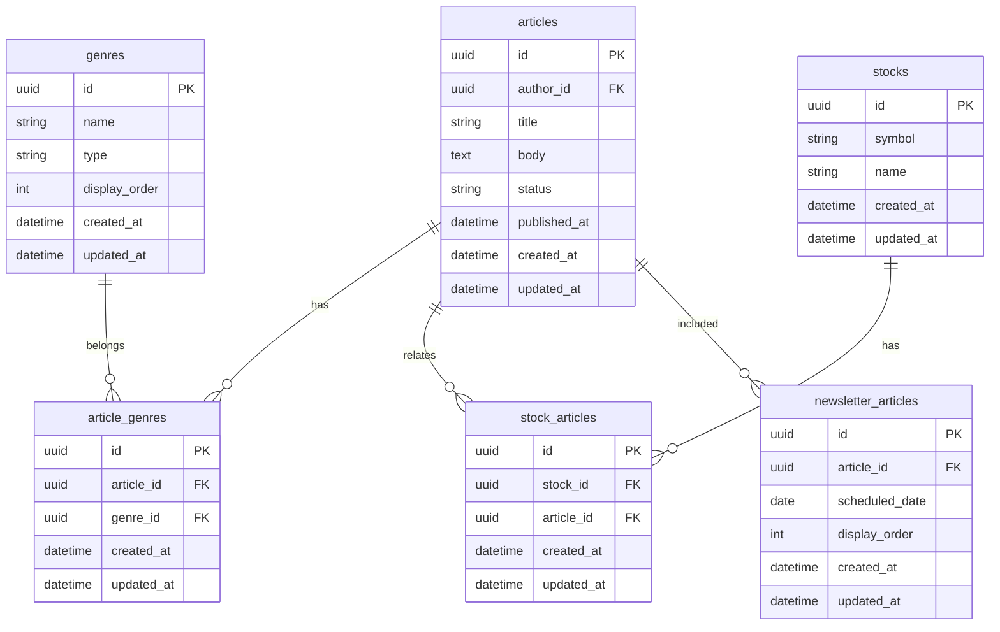
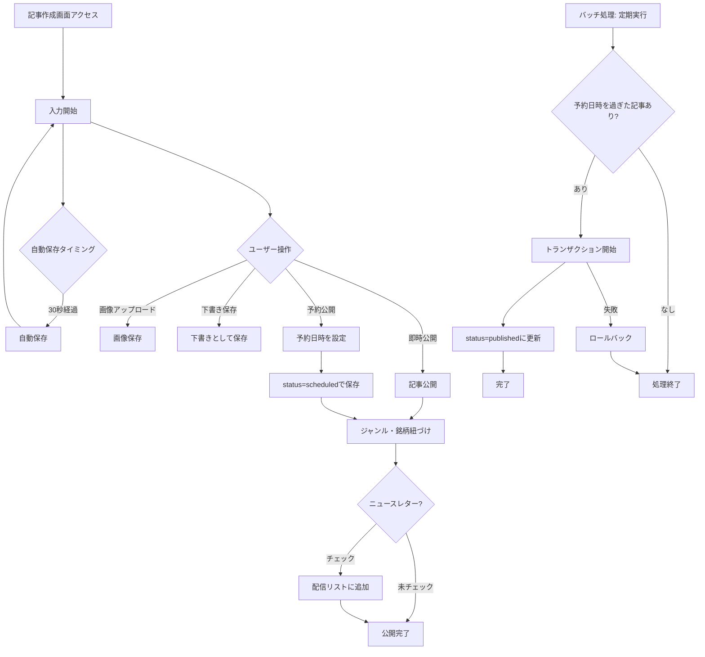
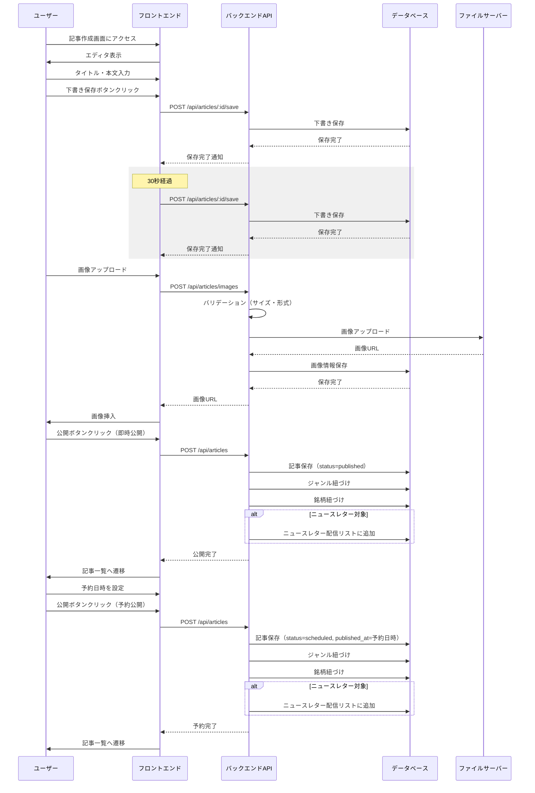
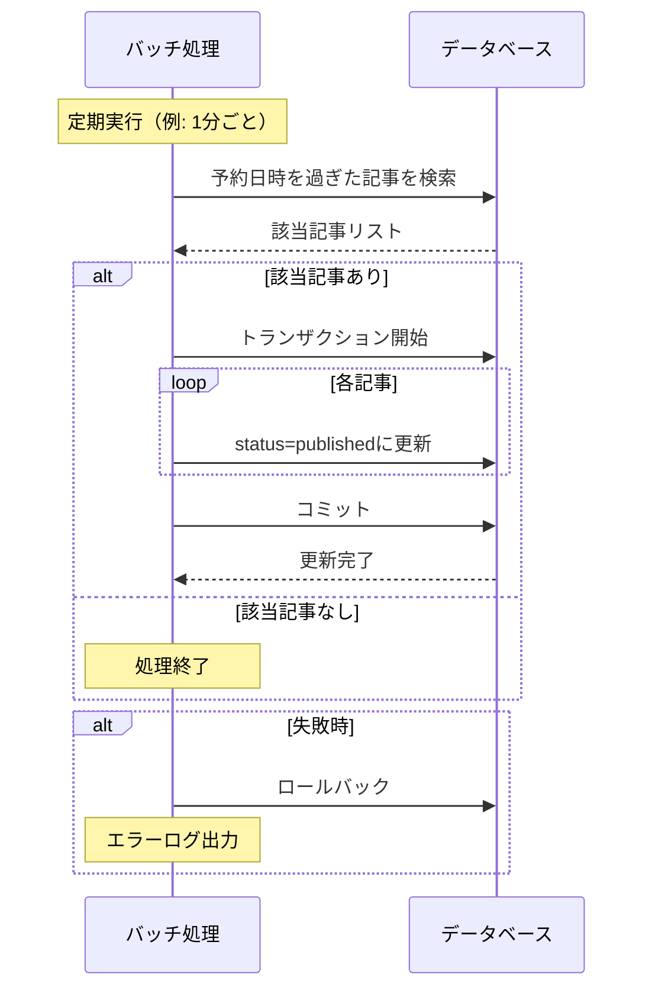

# 記事作成・編集

## 機能概要

記事投稿権限を持つユーザーが、専門家の知見を記事として作成・編集・公開できる機能。Markdownエディタ、ジャンル選択、関連銘柄選択、即時/予約公開を提供する。

## 目的

- 専門家が思考プロセスを記事として発信できるようにする
- 予約投稿により継続的な発信をサポートする

## 機能条件

### 権限

| ロール | 作成・公開 | 編集 | 削除 |
|--------|-----------|------|------|
| admin  | ○（全て） | ○（全て） | ○（全て） |
| writer | ○ | ○（自分のみ） | ○（自分のみ） |
| user   | × | × | × |

### 制約事項
🟢 **後回し可**

- 画像保存先
  - 案1: Cloud Storage（GCP） → スケーラブル、GCPエコシステムと統合
  - 案2: S3（AWS） → スケーラブル、コスト抑えめ
  - 案3: Cloudinary → 画像処理機能豊富
  - 案4: ローカルストレージ → 実装簡易、スケーラビリティ低
  - **決定: TBD**

- 自動保存間隔
  - 案1: 30秒 → ユーザビリティ高、DB負荷中
  - 案2: 60秒 → バランス型
  - 案3: 変更時のみ → DB負荷低、実装複雑
  - **決定: TBD**

## 画面設計図
🟡 **中程度**

Figma未定義（実装のみ）

### レイアウト構成（暫定）

```
┌─────────────────────────────────────────────────────────┐
│ [戻る] 記事作成 / 記事編集        [下書き保存] [公開]    │
├─────────────────────────────────────────────────────────┤
│                                                           │
│ タイトル                                                  │
│ ┌────────────────────────────────────────────────────┐  │
│ │                                                    │  │
│ └────────────────────────────────────────────────────┘  │
│                                                           │
│ ジャンル選択                                              │
│ [ジャンル1] [ジャンル2] [ジャンル3] ...                   │
│                                                           │
│ Markdownエディタ                                          │
│ ┌────────────────────────────────────────────────────┐  │
│ │ [H1] [H2] [H3] [B] [I] [リンク] [画像] [コード]    │  │
│ ├────────────────────────────────────────────────────┤  │
│ │                                                    │  │
│ │ ## 見出し                                          │  │
│ │ 本文...                                           │  │
│ │                                                    │  │
│ └────────────────────────────────────────────────────┘  │
│                                                           │
│ 関連銘柄                                                  │
│ [銘柄検索] [選択: AAPL, GOOGL]                           │
│                                                           │
│ 公開設定                                                  │
│ ○ 即時公開  ○ 予約公開                                   │
│ 予約日時: [2025/01/01] [12:00]                           │
│                                                           │
│ ニュースレター                                           │
│ ☐ この記事をニュースレターに含める                       │
│                                                           │
└─────────────────────────────────────────────────────────┘
```

## 関連テーブル



## フロー図



## シーケンス図



### バッチ処理（予約公開）



## 機能要件
🟡 **中程度**

**主要要件（早期決定）**
- タイトル、本文の入力
- 既存記事の編集
- ジャンルの選択（複数可）
- 関連銘柄の検索・選択（複数可）
- Markdownエディタによるリッチな編集
- 即時公開・予約公開・下書き保存の選択
- 画像のアップロード・挿入
- 画像情報のDB保存（記事と画像の紐づけ管理）
- 自動保存（30秒ごと）
- ニュースレター配信リストへの追加

**詳細要件（TBD可）**
- Markdownエディタの具体的な機能: TBD
- 画像サイズ・フォーマットの制限: TBD
- 予約投稿のバッチ処理との連携: TBD
- ニュースレター配信リストの最大件数超過時の挙動: TBD

## 非機能要件
🟢 **後回し可**

### パフォーマンス
- 自動保存: 3秒以内に完了
- 画像アップロード: 5秒以内に完了
- プレビュー表示: 1秒以内にレンダリング

### セキュリティ
- 画像アップロードは認証済みユーザーのみ
- ファイルサイズ制限（最大5MB）
- 許可ファイル形式（jpg, png, gif, webp）

### UX
- 自動保存中はインジケーター表示
- 保存失敗時はエラーメッセージ表示
- 離脱防止のため、編集中に警告表示

## ログ
🟢 **後回し可**

### 出力タイミング
- 案1: 全操作時に出力（記事作成・更新・画像アップロード・自動保存） → 追跡しやすいがログ量増加
- 案2: エラー時のみ出力 → ログ量削減だが正常系追跡困難
- 案3: 重要操作のみ出力（記事公開・画像アップロード・エラー） → バランス型
- **決定: TBD**

### ログレベル方針
- 案1: INFO中心（記事作成・更新・公開をINFO） → 詳細追跡可能
- 案2: WARN/ERROR中心（保存失敗・画像アップロード失敗のみ） → 異常検知に特化
- 案3: INFO（記事公開）+ WARN（保存失敗）+ ERROR（システムエラー） → バランス型
- **決定: TBD**

## ユースケース
🟡 **中程度**

### シナリオ1: 記事作成・即時公開（早期決定）
1. ユーザーが記事作成画面にアクセス
2. タイトル、本文を入力
3. ジャンルを選択
4. 関連銘柄を検索・選択
5. 公開ボタンをクリック
6. 記事が公開される

### シナリオ2: 予約投稿（早期決定）
1. ユーザーが記事作成画面にアクセス
2. タイトル、本文を入力
3. 予約公開を選択
4. 翌日の日時を設定
5. 公開ボタンをクリック
6. 指定日時に自動公開される

### シナリオ3: 下書き保存
1. ユーザーが記事作成画面にアクセス
2. タイトル、本文を入力
3. 下書き保存ボタンをクリック
4. 下書きとして保存される

### シナリオ4: 画像アップロード
1. ユーザーが記事編集中に画像をアップロード
2. バリデーション（サイズ・形式）が実行される
3. 画像がファイルサーバーに保存される
4. 画像URLが本文に挿入される

### シナリオ5: 記事編集
1. ユーザーが既存記事の編集画面にアクセス
2. タイトル、本文を編集
3. 公開ボタンをクリック
4. 記事が更新される

## テストケース
🟡 **中程度**

**記載タイミング**: 単体テストは大枠のみ設計段階、詳細はTDD実装時。E2Eテストは実装完了後

### 単体テスト（設計段階は大枠のみ、詳細はTDD実装時に追記）

| テスト項目 | 観点 | 期待値 |
|------------|------|--------|
| 記事作成 | タイトル・本文・ジャンル・銘柄を指定して記事作成 | articlesテーブルにレコード作成、ジャンル・銘柄が紐づく |
| 記事更新 | 既存記事のタイトル・本文を更新 | articlesテーブルが更新される |
| 自動保存 | 30秒経過後に自動保存が実行される | 下書きとして保存される |
| 画像アップロード | 画像ファイルをアップロード | 画像URLが返される |
| 即時公開 | status=publishedで記事作成 | 記事が即時公開される |
| 予約公開 | status=scheduled、published_atを指定して記事作成 | 記事が予約状態で保存される |
| ニュースレター登録 | ニュースレターチェックONで記事作成 | newsletter_articlesに登録される |
| 権限チェック（writer） | writerが自分の記事を編集 | 編集可能 |
| 権限チェック（他人の記事） | writerが他人の記事を編集 | 403エラー |
| バッチ処理（予約公開） | 予約日時を過ぎた記事がある状態でバッチ実行 | status=publishedに更新される |
| バッチ処理（該当なし） | 予約日時を過ぎた記事がない状態でバッチ実行 | 何も更新されない |
| バッチ処理（失敗時） | バッチ処理中にエラー発生 | ロールバックされる |

### E2Eテスト（実装完了後に記載）

| テストシナリオ | 観点 | 期待値 |
|----------------|------|--------|
| 記事作成・公開フロー | 入力→ジャンル選択→銘柄選択→公開→一覧表示 | TBD（実装完了後に記載） |
| 予約投稿フロー | 入力→予約日時設定→公開→予約記事一覧表示 | TBD（実装完了後に記載） |
| 自動保存フロー | 入力開始→30秒経過→自動保存通知表示 | TBD（実装完了後に記載） |
| 画像アップロードフロー | 画像選択→アップロード→本文に挿入 | TBD（実装完了後に記載） |

## 影響範囲一覧

### 機能影響範囲

| 関連機能 | 影響内容 |
|----------|----------|
| F-04-2 | 予約設定した記事の自動公開 |
| F-12-3 | ニュースレター配信リストに追加 |

### コード影響範囲
🟢 **後回し可**

- フロントエンド: 記事作成・編集画面、Markdownエディタ
- バックエンド: 記事作成・更新API、画像アップロード
- ストレージ: 画像ファイル保存
- **決定: TBD**（実装時に確定）

## API仕様（参考）

### 記事作成
```
POST /api/articles
```

### 記事更新
```
PUT /api/articles/:id
```

### 下書き保存
```
POST /api/articles/:id/save
```

### 画像アップロード
```
POST /api/articles/images
```

## 作業見積もり
🟢 **後回し可**

作業見積もりが必要な場合は `/feature-spec-estimate-cost` skillを使用してこのセクションを追加してください。
