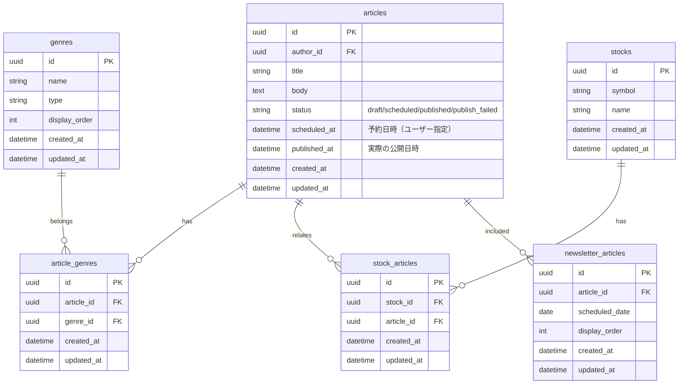
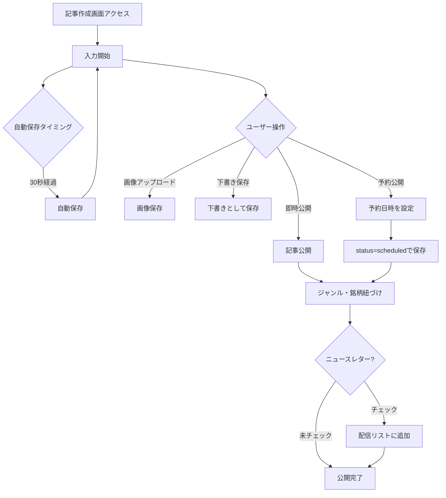
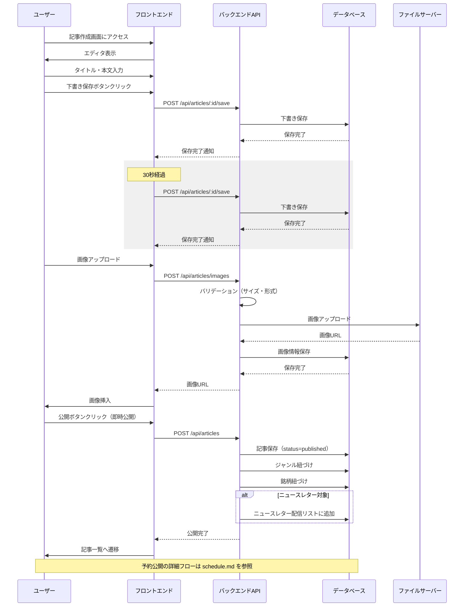

# 記事作成・編集

## 機能概要

記事投稿権限を持つユーザーが、専門家の知見を記事として作成・編集・公開できる機能。Markdownエディタ、ジャンル選択、関連銘柄選択、即時/予約公開を提供する。

## 目的

- 専門家が思考プロセスを記事として発信できるようにする
- 予約投稿により継続的な発信をサポートする（バッチ処理の詳細は [schedule.md](./schedule.md)）

## 機能条件

### 権限

| ロール | 作成・公開 | 編集 | 削除 |
|--------|-----------|------|------|
| admin  | ○（全て） | ○（全て） | ○（全て） |
| writer | ○ | ○（自分のみ） | ○（自分のみ） |
| user   | × | × | × |

### 制約事項
🟢 **後回し可**

- 画像保存先
  - 案1: Cloud Storage（GCP） → スケーラブル、GCPエコシステムと統合
  - 案2: S3（AWS） → スケーラブル、コスト抑えめ
  - 案3: Cloudinary → 画像処理機能豊富
  - 案4: ローカルストレージ → 実装簡易、スケーラビリティ低
  - **決定: TBD**

- 自動保存間隔
  - 案1: 30秒 → ユーザビリティ高、DB負荷中
  - 案2: 60秒 → バランス型
  - 案3: 変更時のみ → DB負荷低、実装複雑
  - **決定: TBD**

## 画面設計図
🟡 **中程度**

Pencil未定義（実装のみ）

### レイアウト構成（暫定）

```
┌─────────────────────────────────────────────────────────┐
│ [戻る] 記事作成 / 記事編集        [下書き保存] [公開]    │
├─────────────────────────────────────────────────────────┤
│                                                           │
│ タイトル                                                  │
│ ┌────────────────────────────────────────────────────┐  │
│ │                                                    │  │
│ └────────────────────────────────────────────────────┘  │
│                                                           │
│ ジャンル選択                                              │
│ [ジャンル1] [ジャンル2] [ジャンル3] ...                   │
│                                                           │
│ Markdownエディタ                                          │
│ ┌────────────────────────────────────────────────────┐  │
│ │ [H1] [H2] [H3] [B] [I] [リンク] [画像] [コード]    │  │
│ ├────────────────────────────────────────────────────┤  │
│ │                                                    │  │
│ │ ## 見出し                                          │  │
│ │ 本文...                                           │  │
│ │                                                    │  │
│ └────────────────────────────────────────────────────┘  │
│                                                           │
│ 関連銘柄                                                  │
│ [銘柄検索] [選択: AAPL, GOOGL]                           │
│                                                           │
│ 公開設定                                                  │
│ ○ 即時公開  ○ 予約公開                                   │
│ 予約日時: [2025/01/01] [12:00]                           │
│                                                           │
│ ニュースレター                                           │
│ ☐ この記事をニュースレターに含める                       │
│                                                           │
└─────────────────────────────────────────────────────────┘
```

## 関連テーブル



## フロー図



## シーケンス図



## 機能要件
🟡 **中程度**

### 機能要件1: 記事入力・編集（F-04-1）
- 機能仕様1: タイトル、本文の入力
- 機能仕様2: 既存記事の編集
- 機能仕様3: Markdownエディタによるリッチな編集
  - Markdownエディタの具体的な機能: TBD

### 機能要件2: ジャンル・銘柄選択（F-04-1）
- 機能仕様1: ジャンルの選択（複数可）
- 機能仕様2: 既存ジャンルから選択、または新規ジャンルを追加する
  - 新規ジャンル追加ボタンでジャンル名を入力
  - writerも新規ジャンル追加可能
  - 新規ジャンルは`genres`テーブルに自動作成される
  - タイプは自動的に"article"に設定
- 機能仕様3: 関連銘柄の検索・選択（複数可）

### 機能要件3: 公開設定（F-04-1）
- 機能仕様1: 即時公開・予約公開・下書き保存の選択（予約公開の詳細は [schedule.md](./schedule.md) 参照）

### 機能要件4: 画像アップロード（F-04-1）
- 機能仕様1: 画像のアップロード・挿入
- 機能仕様2: 画像情報のDB保存（記事と画像の紐づけ管理）
  - 画像サイズ・フォーマットの制限: TBD

### 機能要件5: 自動保存（F-04-1）
- 機能仕様1: 自動保存（30秒ごと）

### 機能要件6: ニュースレター登録
- 機能仕様1: ニュースレター配信リストへの追加
  - ニュースレター配信リストの最大件数超過時の挙動: TBD

## 非機能要件
🟢 **後回し可**

### 非機能要件1: パフォーマンス
- 非機能仕様1: 自動保存: 3秒以内に完了
- 非機能仕様2: 画像アップロード: 5秒以内に完了
- 非機能仕様3: プレビュー表示: 1秒以内にレンダリング

### 非機能要件2: セキュリティ
- 非機能仕様1: 画像アップロードは認証済みユーザーのみ
- 非機能仕様2: ファイルサイズ制限（最大5MB）
- 非機能仕様3: 許可ファイル形式（jpg, png, gif, webp）

### 非機能要件3: UX
- 非機能仕様1: 自動保存中はインジケーター表示
- 非機能仕様2: 保存失敗時はエラーメッセージ表示
- 非機能仕様3: 離脱防止のため、編集中に警告表示

## ログ
🟢 **後回し可**

### 出力タイミング
- 案1: 全操作時に出力（記事作成・更新・画像アップロード・自動保存） → 追跡しやすいがログ量増加
- 案2: エラー時のみ出力 → ログ量削減だが正常系追跡困難
- 案3: 重要操作のみ出力（記事公開・画像アップロード・エラー） → バランス型
- **決定: TBD**

### ログレベル方針
- 案1: INFO中心（記事作成・更新・公開をINFO） → 詳細追跡可能
- 案2: WARN/ERROR中心（保存失敗・画像アップロード失敗のみ） → 異常検知に特化
- 案3: INFO（記事公開）+ WARN（保存失敗）+ ERROR（システムエラー） → バランス型
- **決定: TBD**

## ユースケース
🟡 **中程度**

### シナリオ1: 記事作成・即時公開（早期決定）
1. ユーザーが記事作成画面にアクセス
2. タイトル、本文を入力
3. ジャンルを選択
4. 関連銘柄を検索・選択
5. 公開ボタンをクリック
6. 記事が公開される

### シナリオ2: 予約投稿
※ 詳細は [schedule.md](./schedule.md) を参照

### シナリオ3: 下書き保存
1. ユーザーが記事作成画面にアクセス
2. タイトル、本文を入力
3. 下書き保存ボタンをクリック
4. 下書きとして保存される

### シナリオ4: 画像アップロード
1. ユーザーが記事編集中に画像をアップロード
2. バリデーション（サイズ・形式）が実行される
3. 画像がファイルサーバーに保存される
4. 画像URLが本文に挿入される

### シナリオ5: 記事編集
1. ユーザーが既存記事の編集画面にアクセス
2. タイトル、本文を編集
3. 公開ボタンをクリック
4. 記事が更新される

## テストケース
🟡 **中程度**

**記載タイミング**: 単体テストは大枠のみ設計段階、詳細はTDD実装時。E2Eテストは実装完了後

### 単体テスト（設計段階は大枠のみ、詳細はTDD実装時に追記）

| テスト項目 | 観点 | 期待値 |
|------------|------|--------|
| 記事作成 | タイトル・本文・ジャンル・銘柄を指定して記事作成 | articlesテーブルにレコード作成、ジャンル・銘柄が紐づく |
| 記事更新 | 既存記事のタイトル・本文を更新 | articlesテーブルが更新される |
| 自動保存 | 30秒経過後に自動保存が実行される | 下書きとして保存される |
| 画像アップロード | 画像ファイルをアップロード | 画像URLが返される |
| 即時公開 | status=publishedで記事作成 | 記事が即時公開される |
| 予約公開 | status=scheduled、scheduled_atを指定して記事作成 | 記事が予約状態で保存される（バッチ処理のテストは [schedule.md](./schedule.md) 参照） |
| ニュースレター登録 | ニュースレターチェックONで記事作成 | newsletter_articlesに登録される |
| 権限チェック（writer） | writerが自分の記事を編集 | 編集可能 |
| 権限チェック（他人の記事） | writerが他人の記事を編集 | 403エラー |

### E2Eテスト（実装完了後に記載）

| テストシナリオ | 観点 | 期待値 |
|----------------|------|--------|
| 記事作成・公開フロー | 入力→ジャンル選択→銘柄選択→公開→一覧表示 | TBD（実装完了後に記載） |
| 自動保存フロー | 入力開始→30秒経過→自動保存通知表示 | TBD（実装完了後に記載） |
| 画像アップロードフロー | 画像選択→アップロード→本文に挿入 | TBD（実装完了後に記載） |

## 影響範囲一覧

### 機能影響範囲

| 関連機能 | 影響内容 |
|----------|----------|
| F-04-1 | 作成・編集した記事がデータソース |
| F-04-2 | 予約設定した記事の自動公開（[schedule.md](./schedule.md)） |
| F-04-3 | 作成した記事が記事一覧に表示される |
| F-04-4 | 作成した記事が人気記事算出の対象 |
| F-04-5 | 作成した記事が詳細ページで表示される |
| F-12-3 | ニュースレター配信リストに追加 |

### コード影響範囲
🟢 **後回し可**

- フロントエンド: 記事作成・編集画面、Markdownエディタ
- バックエンド: 記事作成・更新API、画像アップロード
- ストレージ: 画像ファイル保存
- **決定: TBD**（実装時に確定）

## API仕様（参考）

### 記事作成
```
POST /api/articles
```

**リクエストボディ（例）**
- `title`: タイトル
- `body`: 本文（Markdown）
- `status`: `draft` | `published` | `scheduled`
- `scheduled_at`: 予約日時（status=scheduledの場合に指定）
- `genre_ids`: ジャンルID配列
- `stock_ids`: 銘柄ID配列
- `include_newsletter`: ニュースレターに含めるか

### 記事更新
```
PUT /api/articles/:id
```

### 下書き保存
```
POST /api/articles/:id/save
```

### 画像アップロード
```
POST /api/articles/images
```

## 作業見積もり

### 見積もりサマリー

| 項目 | ストーリーポイント | 目安時間 |
|------|------------------|----------|
| **合計** | 52-55sp | 13-13.75時間 |

**目安**: 4sp = 1時間（実装＋単体テスト＋レビューを含む、あくまで参考値）

### タスク一覧

| タスク | SP | 備考 |
|--------|-----|------|
| **バックエンド** | | |
| 記事作成API（POST /api/articles） | 5 | ジャンル・銘柄紐づけ、ニュースレター登録を含むトランザクション |
| 記事更新API（PUT /api/articles/:id） | 3 | 権限チェック（admin/writer）含む |
| 下書き保存API（POST /api/articles/:id/save） | 2 | 既存パターンの小拡張 |
| 画像アップロードAPI（POST /api/articles/images） | 5 | バリデーション＋Storage連携、画像DB保存 |
| 権限制御ミドルウェア | 3 | admin全件、writer自分のみのロジック |
| openapi.yaml定義 | 2 | 4エンドポイント分のスキーマ定義 |
| DBマイグレーション | 2 | articles（scheduled_at追加、status値拡張）, article_genres, stock_articles, newsletter_articles |
| **フロントエンド** | | |
| 記事作成・編集画面（基本UI） | 5 | タイトル入力、ジャンル選択、銘柄選択、公開設定 |
| Markdownエディタ統合 | 5-8 | ライブラリ選定・ツールバー・プレビュー、不確実性あり |
| 画像アップロードUI | 3 | エディタ内画像挿入、プログレス表示 |
| 自動保存機能（FE） | 3 | 30秒タイマー、インジケーター、離脱防止 |
| 関連銘柄検索・選択UI | 3 | 検索API連携、複数選択 |
| 予約公開日時ピッカー | 2 | 日時選択UI |
| ニュースレターチェックUI | 1 | チェックボックス1つ |
| **テスト** | | |
| 単体テスト | 5sp | API・Markdownエディタ・自動保存・権限制御の単体テスト |
| E2Eテスト | 3sp | 作成/編集/下書き/公開/画像アップロードの主要フロー |

### リスク要因

- **画像保存先未決定（TBD）**: Storage連携の実装がCloud Storage/S3/Cloudinary/ローカルで大きく異なる。決定次第SPが変動する可能性あり
- **Markdownエディタのライブラリ選定**: 採用ライブラリにより実装難易度が変動（5-8sp幅）
- **自動保存間隔未決定（TBD）**: 変更時のみ保存を選択した場合、差分検知の実装が追加（+2sp程度）

### 依存関係

- DBマイグレーション → 全API実装の前提
- openapi.yaml定義 → API実装の前提
- 画像保存先の決定（TBD） → 画像アップロードAPI実装
- 記事作成API → 記事作成・編集画面UI
- Markdownエディタライブラリ選定 → Markdownエディタ統合
