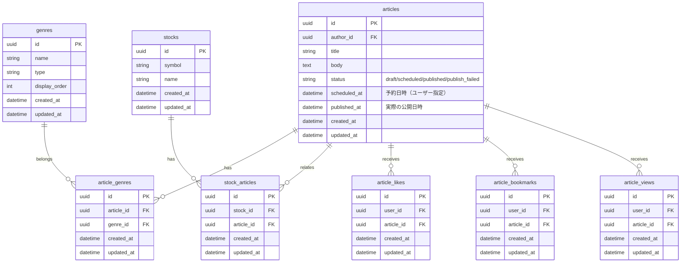
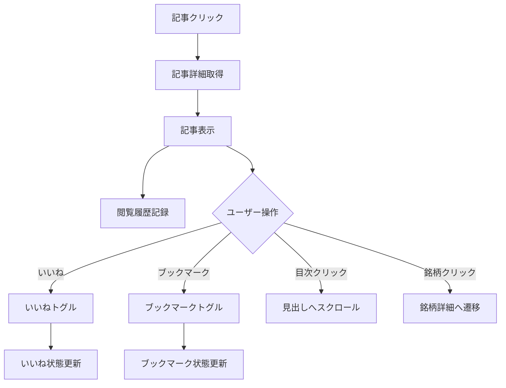
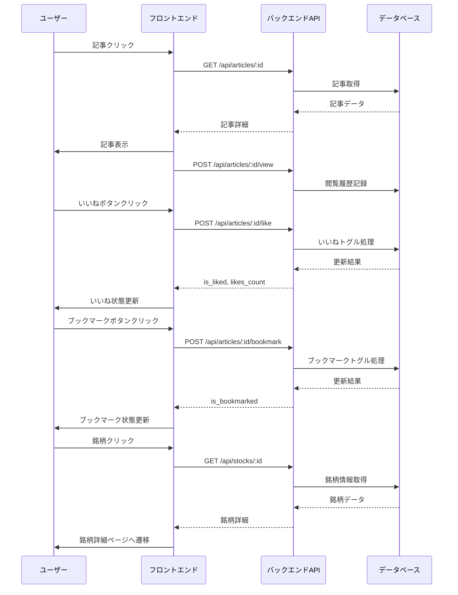

# 記事詳細ページ

## 機能概要

1つの記事の全文を表示し、ユーザーが専門家の思考プロセスを深く理解できる画面。目次自動生成、関連銘柄表示、いいね・ブックマーク機能を提供する。

## 目的

- 専門家の思考プロセスを深く理解できるようにする
- 関連銘柄を通じて投資判断材料を提供する

## 機能条件

### 権限

| ロール | 閲覧 | いいね | ブックマーク |
|--------|------|--------|------------|
| admin  | ○ | ○ | ○ |
| writer | ○ | ○ | ○ |
| user   | ○ | ○ | ○ |

### 制約事項
🟢 **後回し可**

- 目次の表示位置
  - 案1: 左サイドに固定表示 → 常に見える、スクロール連携しやすい
  - 案2: 記事上部に配置 → モバイルフレンドリー
  - **決定: TBD**

- 関連銘柄のリアルタイム価格表示
  - 案1: 表示 → ユーザー価値高、APIコスト増
  - 案2: 非表示 → 実装簡易
  - **決定: TBD**

## 画面設計図
🟡 **中程度**

Pencil: `docs/versions/1_0_0/SikouLab.pen` ノードID: 未定義

### レイアウト構成（暫定）

```
┌─────────────────────────────────────────────────────────┐
│ ヘッダー                                                 │
│ [戻る] 記事タイトル                                       │
│                                                           │
│ ジャンルラベル  投稿日時  著者情報                        │
│                                                           │
│ ┌─────────────────────────────────────────────────────┐  │
│ │ アクションバー                                         │  │
│ │ [いいね 42] [ブックマーク]                            │  │
│ ├─────────────────────────────────────────────────────┤  │
│ │                                                       │  │
│ │ 記事本文（Markdownレンダリング）                      │  │
│ │                                                       │  │
│ │ ## 見出し1                                            │  │
│ │ 本文...                                               │  │
│ │                                                       │  │
│ └─────────────────────────────────────────────────────┘  │
│                                                           │
│ ┌─────────────────────────────────────────────────────┐  │
│ │ 関連銘柄                                              │  │
│ │ ┌────────────────┐ ┌────────────────┐              │  │
│ │ │ AAPL           │ │ GOOGL          │              │  │
│ │ │ Apple Inc.     │ │ Alphabet Inc.  │              │  │
│ │ └────────────────┘ └────────────────┘              │  │
│ └─────────────────────────────────────────────────────┘  │
└─────────────────────────────────────────────────────────┘
```

## 関連テーブル



## フロー図



## シーケンス図



## 機能要件
🟡 **中程度**

### 機能要件1: 記事コンテンツ表示（F-04-5）
- 機能仕様1: 記事タイトル、本文（Markdownレンダリング）を表示
- 機能仕様2: 投稿日時、著者情報、ジャンルラベルを表示

### 機能要件2: 目次機能（F-04-5）
- 機能仕様1: H2、H3見出しから目次を自動生成
- 機能仕様2: 目次クリックで該当見出しへスクロール
- 機能仕様3: 現在位置の見出しをハイライト
  - 目次の表示位置: TBD

### 機能要件3: 関連銘柄表示（F-04-5）
- 機能仕様1: 関連銘柄を表示
  - 関連銘柄のリアルタイム価格表示: TBD
- 機能仕様2: 銘柄クリックで銘柄詳細ページへ遷移

### 機能要件4: いいね・ブックマーク操作（F-04-5）
- 機能仕様1: いいねボタンでトグル操作
- 機能仕様2: ブックマークボタンでトグル操作

### 機能要件5: 閲覧履歴記録（F-04-5）
- 機能仕様1: 閲覧履歴を記録
  - 記事が存在しない場合の404処理: TBD

## 非機能要件
🟢 **後回し可**

### 非機能要件1: パフォーマンス
- 非機能仕様1: 初期表示: 3秒以内（Lighthouse基準）
- 非機能仕様2: Markdownレンダリング: 1秒以内

### 非機能要件2: UX
- 非機能仕様1: 読み込み中はスケルトン表示
- 非機能仕様2: エラー発生時は適切なエラーメッセージ表示
- 非機能仕様3: 記事が存在しない場合は404ページへ遷移

## ログ
🟢 **後回し可**

### 出力タイミング
- 案1: 全操作時に出力（記事閲覧・いいね・ブックマーク・閲覧履歴記録） → 追跡しやすいがログ量増加
- 案2: エラー時のみ出力 → ログ量削減だが正常系追跡困難
- 案3: 重要操作のみ出力（閲覧履歴記録・エラー） → バランス型
- **決定: TBD**

### ログレベル方針
- 案1: INFO中心（記事閲覧・いいね・ブックマークをINFO） → 詳細追跡可能
- 案2: WARN/ERROR中心（404エラー・取得失敗のみ） → 異常検知に特化
- 案3: INFO（閲覧履歴記録）+ WARN（記事未存在）+ ERROR（システムエラー） → バランス型
- **決定: TBD**

## ユースケース
🟡 **中程度**

### シナリオ1: 記事閲覧（早期決定）
1. ユーザーが記事をクリック
2. 記事詳細ページが表示される
3. タイトル、本文、著者情報が表示される
4. 目次から見出しをクリック
5. 該当見出しへスクロール

### シナリオ2: いいね操作（早期決定）
1. ユーザーがいいねボタンをクリック
2. いいね状態がトグルされる（未いいね→いいね、いいね→未いいね）
3. いいね数が更新される

### シナリオ3: ブックマーク操作（早期決定）
1. ユーザーがブックマークボタンをクリック
2. ブックマーク状態がトグルされる（未ブックマーク→ブックマーク、ブックマーク→未ブックマーク）

### シナリオ4: 銘柄遷移（早期決定）
1. ユーザーが関連銘柄を確認
2. 銘柄をクリック
3. 銘柄詳細情報を取得
4. 銘柄詳細ページへ遷移

## テストケース
🟡 **中程度**

**記載タイミング**: 単体テストは大枠のみ設計段階、詳細はTDD実装時。E2Eテストは実装完了後

### 単体テスト（設計段階は大枠のみ、詳細はTDD実装時に追記）

| テスト項目 | 観点 | 期待値 |
|------------|------|--------|
| 記事詳細取得 | 記事IDを指定して記事詳細を取得 | 記事タイトル・本文・著者情報・ジャンル・銘柄が返される |
| 記事未存在エラー | 存在しない記事IDを指定 | 404エラーが返される |
| 目次生成 | Markdown本文からH2・H3見出しを抽出 | 目次データが生成される |
| いいねトグル | いいねボタンクリック | いいね状態がトグルされる、likes_countが更新される |
| ブックマークトグル | ブックマークボタンクリック | ブックマーク状態がトグルされる |
| 閲覧履歴記録 | 記事閲覧時 | article_viewsにレコード作成される |
| Markdownレンダリング | Markdown本文をHTMLに変換 | 正しくHTMLに変換される |
| 関連銘柄取得 | 記事IDから関連銘柄を取得 | 銘柄リストが返される |

### E2Eテスト（実装完了後に記載）

| テストシナリオ | 観点 | 期待値 |
|----------------|------|--------|
| 記事閲覧フロー | 記事一覧→記事クリック→記事詳細表示 | TBD（実装完了後に記載） |
| 目次操作フロー | 記事閲覧→目次クリック→見出しへスクロール | TBD（実装完了後に記載） |
| いいね操作フロー | 記事閲覧→いいねクリック→状態更新 | TBD（実装完了後に記載） |
| 銘柄遷移フロー | 記事閲覧→銘柄クリック→銘柄詳細へ遷移 | TBD（実装完了後に記載） |

## 影響範囲一覧

### 機能影響範囲

| 関連機能 | 影響内容 |
|----------|----------|
| F-04-1 | 作成・編集した記事の表示先 |
| F-04-2 | 予約公開された記事の表示先 |
| F-04-3 | 記事カードから詳細ページへ遷移 |
| F-04-4 | 人気記事から詳細ページへ遷移 |
| F-04-5 | 詳細ページ自身 |
| F-03 | 銘柄クリックで銘柄詳細ページへ遷移 |
| F-08 | いいね・ブックマーク操作 |
| F-12-5 | 記事閲覧履歴が閲覧数集計に使用される |

### コード影響範囲
🟢 **後回し可**

- フロントエンド: 記事詳細画面、目次自動生成、Markdownレンダリング
- バックエンド: 記事詳細取得API、閲覧履歴記録

### 技術選定

**ADR**: [docs/adr/013-markdown-library.md](../../adr/013-markdown-library.md)

| 用途 | ライブラリ | プラグイン |
|------|------------|------------|
| **Markdownレンダリング** | react-markdown | rehype-slug, rehype-autolink-headings, @jsdevtools/rehype-toc |
| **目次自動生成** | @jsdevtools/rehype-toc | - |
| **スクロール連携** | カスタム実装 | Intersection Observer API |

## API仕様（参考）

### 記事詳細取得
```
GET /api/articles/:id
```

### いいね操作
```
POST /api/articles/:id/like
```

### ブックマーク操作
```
POST /api/articles/:id/bookmark
```

## 作業見積もり

### 見積もりサマリー

| 項目 | ストーリーポイント | 目安時間 |
|------|------------------|----------|
| **合計** | 26sp | 6.5時間 |

**目安**: 4sp = 1時間（実装＋単体テスト＋レビューを含む、あくまで参考値）

### タスク一覧

| タスク | ストーリーポイント | 備考 |
|--------|------------------|------|
| **フロントエンド** | | |
| 記事詳細画面ベース | 3sp | レイアウト、ヘッダー、アクションバー、メタ情報表示 |
| Markdownレンダリング | 2sp | react-markdown導入（ADR-013選定済み）、スタイリング |
| 目次自動生成・スクロール連動 | 2sp | rehype-toc導入、スクロール位置検出・ハイライト実装 |
| いいね・ブックマーク操作 | 3sp | API連携、状態管理、トグル処理 |
| 関連銘柄表示・遷移 | 2sp | 銘柄カード表示、クリック時遷移 |
| スケルトン・エラー処理 | 2sp | ローディング状態、404ページ |
| **バックエンド** | | |
| 記事詳細取得API | 3sp | 記事+ジャンル+銘柄+著者情報取得、認証 |
| いいねトグルAPI | 2sp | トグル処理、likes_count集計 |
| ブックマークトグルAPI | 2sp | トグル処理 |
| 閲覧履歴記録API | 1sp | 非同期処理、エラー無視 |
| **テスト** | | |
| 単体テスト | 2sp | API・状態管理・目次生成ロジックの単体テスト |
| E2Eテスト | 2sp | 4シナリオ（閲覧・目次・いいね・銘柄遷移） |

### リスク要因

- **パフォーマンス要件**: 初期表示3秒以内の要件を満たすための最適化工数

### 依存関係

- F-01（ログイン機能）: 認証機能が必要
- F-03（個別銘柄ページ）: 銘柄詳細取得APIが先行実装されていること
- F-08（ブックマーク機能）: ブックマーク一覧との整合性
