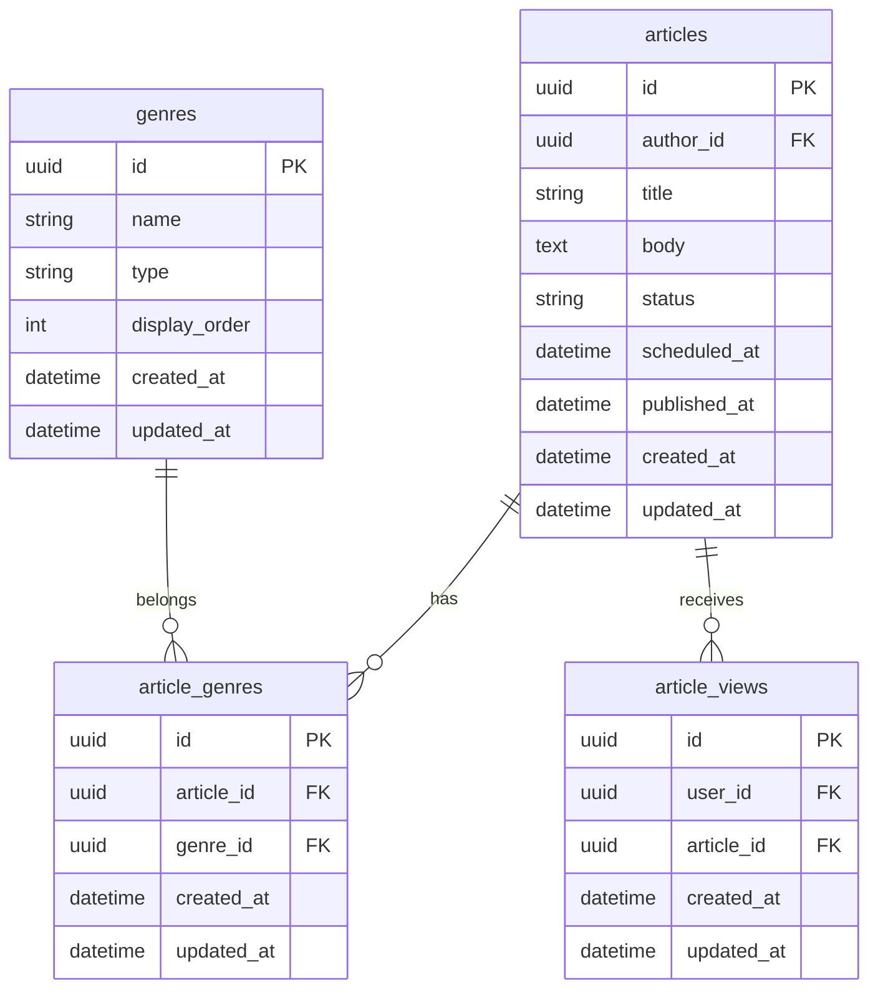
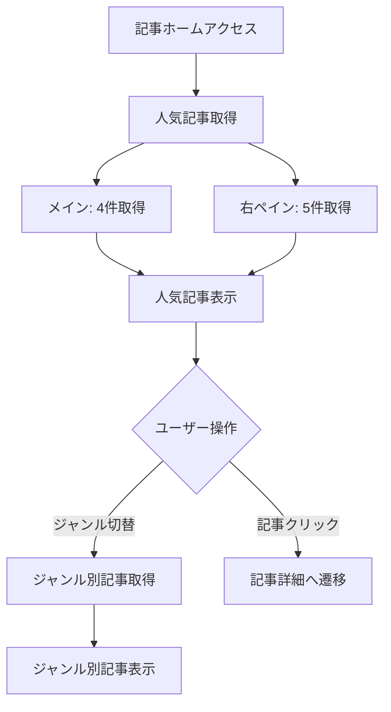
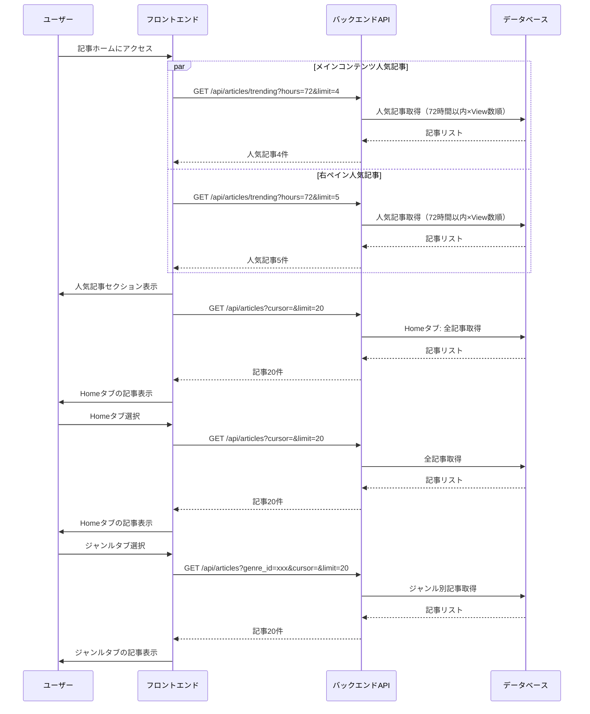

# 記事ホーム画面

## 機能概要

専門家の記事をジャンル別に閲覧し、人気記事（72時間以内×View数）を素早く発見できる画面。

## 目的

- ログイン後すぐに今日の注目記事を一目で確認できるようにする
- ジャンル別に記事を整理し、興味のある記事を効率的に見つけられるようにする

## 機能条件

### 権限

| ロール | 閲覧 |
|--------|------|
| admin  | ○ |
| writer | ○ |
| user   | ○ |

### 制約事項
🟢 **後回し可**

- 無限スクロールかページネーションか
  - 案1: 無限スクロール → モダンなUX、実装容易
  - 案2: ページネーション → SEO友好、伝統的なUX
  - **決定: 無限スクロール**

- 人気記事の算出ロジック
  - 案1: View数のみ → シンプル
  - 案2: View数 × 経過時間の加重係数 → 新しさを重視
  - **決定: 指数減衰（Hacker News方式）**
    - 計算式: (View数 - 1) / (経過時間 + 2)^1.8
    - 特徴: 新しさ重視のView数スコアリング

## 画面設計図
🟡 **中程度**

Pencil: `docs/versions/1_0_0/SikouLab.pen` ノードID: `OkU4H`

### レイアウト構成

```
┌─────────────────────────────────────────────────────────────────────┐
│ サイドバー  │ メインコンテンツ        │ 人気記事（右ペイン）        │
│（左端）      │                        │                            │
│ ┌────────┐  │ ┌──────────────────┐  │ ┌────────────────────────┐ │
│ │ブランド │  │ │ 人気記事（72時間） │  │ │ 人気記事ランキング       │ │
│ │ロゴ    │  │ │ ┌────────────┐   │  │ │ （全ジャンル対象）      │ │
│ ├────────┤  │ │ │ 最新1件（大）│   │  │ ├────────────────────┤ │
│ │ダッシュ │  │ │ └────────────┘   │  │ │ 1. 記事タイトル       │ │
│ │ボード  │  │ │ ┌────────────┐   │  │ ├────────────────────┤ │
│ ├────────┤  │ │ │ 2件目      │   │  │ │ 2. 記事タイトル       │ │
│ │▶ 記事  │  │ │ └────────────┘   │  │ ├────────────────────┤ │
│ │├ジャン1│  │ │ ┌────────────┐   │  │ │ 3. 記事タイトル       │ │
│ │├ジャン2│  │ │ │ 3件目      │   │  │ ├────────────────────┤ │
│ │└...   │  │ │ └────────────┘   │  │ │ 4. 記事タイトル       │ │
│ ├────────┤  │ │ ┌────────────┐   │  │ ├────────────────────┤ │
│ │ニュース │  │ │ │ 4件目      │   │  │ │ 5. 記事タイトル       │ │
│ ├────────┤  │ │ └────────────┘   │  │ └────────────────────┘ │
│ │投票    │  │ └──────────────────┘  │                            │
│ ├────────┤  │                        │ ┌────────────────────────┐ │
│ │アバター │  │ ┌──────────────────┐  │ │ 広告枠（予備）         │ │
│ │ユーザー │  │ │ ジャンル別記事     │  │ └────────────────────────┘ │
│ ├────────┤  │ │ [タブ選択]        │  │                            │
│ │設定    │  │ │ ┌────────────┐   │  │                            │
│ └────────┘  │ │ │ 記事カード1 │   │  │                            │
│             │ │ └────────────┘   │  │                            │
│             │ │ ┌────────────┐   │  │                            │
│             │ │ │ 記事カード2 │   │  │                            │
│             │ │ └────────────┘   │  │                            │
│             │ └──────────────────┘  │                            │
└─────────────────────────────────────────────────────────────────────┘
```

**人気記事（右ペイン）**
- 表示件数: 5件
- レイアウト: コンパクトなリスト形式
- 各アイテム: 記事タイトルのみ（簡易表示）
- 算出ロジック: ジャンルを問わず全記事から算出（メインコンテンツと共通）
- クリック時: 記事詳細ページへ遷移


## 関連テーブル



## フロー図



## シーケンス図




## 機能要件
🟡 **中程度**

### 機能要件1: 人気記事算出（F-04-4）
- 機能仕様1: 人気記事は72時間以内の記事を対象に、指数減衰スコア順で算出する
  - 計算式: (View数 - 1) / (経過時間 + 2)^1.8
  - ジャンルを問わず全記事から算出

### 機能要件2: メインコンテンツ人気記事表示（F-04-4）
- 機能仕様1: メインコンテンツに人気記事を4件表示する
  - 最新1件を大きく、残り3件を小さく表示

### 機能要件3: 右ペイン人気記事表示（F-04-4）
- 機能仕様1: 右ペインに人気記事を5件表示する
  - コンパクトなリスト形式
  - 記事タイトルのみ

### 機能要件4: ジャンル別記事切り替え（F-04-3）
- 機能仕様1: タブバーでジャンル別記事を切り替える
  - Homeタブ: 全記事を表示
  - ジャンルタブ: 該当ジャンルの記事のみ表示

### 機能要件5: 記事詳細遷移（F-04-5）
- 機能仕様1: 記事カードから詳細ページへ遷移する

### 機能要件6: サイドバー展開状態永続化
- 機能仕様1: サイドバー記事タブの展開状態を保存し永続化する

### 機能要件7: 無限スクロール（F-04-3）
- 機能仕様1: 無限スクロールで記事を読み込む
  - cursor方式、初期20件、スクロールで追加20件

### 機能要件8: 読み込み中表示
- 機能仕様1: 読み込み中のスケルトン表示: TBD

### 機能要件9: エラー表示
- 機能仕様1: エラー発生時のエラーメッセージ表示: TBD

## 非機能要件
🟢 **後回し可**

### 非機能要件1: パフォーマンス
- 非機能仕様1: 初期表示は3秒以内（Lighthouse基準）
- 非機能仕様2: 追加読み込みは1秒以内

### 非機能要件2: UX
- 非機能仕様1: 読み込み中はスケルトン表示する
- 非機能仕様2: エラー発生時は適切なエラーメッセージを表示する

## ログ
🟢 **後回し可**

### 出力タイミング
- 案1: 全操作時に出力（人気記事取得・ジャンル別記事取得） → 追跡しやすいがログ量増加
- 案2: エラー時のみ出力 → ログ量削減だが正常系追跡困難
- 案3: 重要操作のみ出力（人気記事取得・エラー） → バランス型
- **決定: TBD**

### ログレベル方針
- 案1: INFO中心（記事取得をINFO） → 詳細追跡可能
- 案2: WARN/ERROR中心（取得失敗のみ） → 異常検知に特化
- 案3: INFO（人気記事取得）+ WARN（取得失敗）+ ERROR（システムエラー） → バランス型
- **決定: TBD**

## ユースケース
🟡 **中程度**

### シナリオ1: 記事閲覧（早期決定）
1. ユーザーが記事ホームにアクセス
2. メインコンテンツに人気記事4件、右ペインに人気記事5件が表示される
3. ジャンルタブをクリック
4. 該当ジャンルの記事が表示される
5. 記事をクリック
6. 記事詳細ページへ遷移

## テストケース
🟡 **中程度**

**記載タイミング**: 単体テストは大枠のみ設計段階、詳細はTDD実装時。E2Eテストは実装完了後

### 単体テスト（設計段階は大枠のみ、詳細はTDD実装時に追記）

| テスト項目 | 対応仕様 | 観点 | 期待値 |
|------------|----------|------|--------|
| 人気記事取得（メイン） | 機能要件1/機能仕様1, 機能要件2/機能仕様1 | 72時間以内×View数順で記事取得 | 人気記事4件が返される |
| 人気記事取得（右ペイン） | 機能要件1/機能仕様1, 機能要件3/機能仕様1 | 72時間以内×View数順で記事取得 | 人気記事5件が返される |
| ジャンル別記事取得 | 機能要件4/機能仕様1 | ジャンルIDを指定して記事取得 | 該当ジャンルの記事20件が返される |
| ジャンル一覧取得 | 機能要件4/機能仕様1 | ジャンル一覧を取得 | ジャンルリストが返される |
| サイドバー展開状態永続化 | 機能要件6/機能仕様1 | サイドバーの記事タブ展開状態を保存 | user_settingsテーブルに保存される |
| 記事カード表示 | 機能要件5/機能仕様1 | 記事カードに必要な情報が含まれる | タイトル・著者・ジャンル・日時が返される |

### E2Eテスト（実装完了後に記載）

| テストシナリオ | 対応仕様 | 観点 | 期待値 |
|----------------|----------|------|--------|
| 記事ホームアクセスフロー | 機能要件1/機能仕様1, 機能要件2/機能仕様1, 機能要件3/機能仕様1 | ログイン→記事ホーム表示→人気記事表示 | TBD（実装完了後に記載） |
| ジャンル切替フロー | 機能要件4/機能仕様1 | ジャンルタブクリック→ジャンル別記事表示 | TBD（実装完了後に記載） |
| 記事遷移フロー | 機能要件5/機能仕様1 | 記事カードクリック→記事詳細へ遷移 | TBD（実装完了後に記載） |

## 影響範囲一覧

### 機能影響範囲

| 関連機能 | 影響内容 |
|----------|----------|
| F-04-1 | 作成した記事が記事一覧に表示される |
| F-04-2 | 予約公開された記事が表示される |
| F-04-3 | 記事一覧ページ自身 |
| F-04-4 | 人気記事算出結果の表示先 |
| F-04-5 | 記事カードから詳細ページへ遷移 |
| サイドバー共通 | 記事タブ展開状態の永続化機能 |

### コード影響範囲
🟢 **後回し可**

- フロントエンド: 記事ホーム画面、右ペイン人気記事、タブバー
- バックエンド: 人気記事取得API、ジャンル別記事取得API
- **決定: TBD**（実装時に確定）
## 作業見積もり

### 見積もりサマリー

| 項目 | ストーリーポイント | 目安時間 |
|------|------------------|----------|
| **合計** | 31-34sp | 7.75-8.5時間 |

**目安**: 4sp = 1時間（実装＋単体テスト＋レビューを含む、あくまで参考値）

### タスク一覧

| タスク | ストーリーポイント | 対応仕様 | 備考 |
|--------|------------------|----------|------|
| **バックエンド** | | | |
| 人気記事取得API実装 | 5-8 | 仕様1 | 指数減衰ロジック実装、パフォーマンス検証 |
| ジャンル別記事取得API実装 | 3 | 仕様4 | cursorベースページネーション |
| ジャンル一覧取得API実装 | 2 | 仕様4 | 既存パターン |
| **フロントエンド** | | | |
| 記事ホームページレイアウト | 3 | 仕様2,3 | 3カラムレイアウト（サイドバー・メイン・右ペイン） |
| メインコンテンツ人気記事表示 | 2 | 仕様2 | 4件表示（1件大、3件小） |
| 右ペイン人気記事表示 | 2 | 仕様3 | 5件リスト形式 |
| タブバー実装 | 2 | 仕様4 | Home/ジャンル切替 |
| 無限スクロール実装 | 2 | 仕様7 | cursor方式、Intersection Observer |
| 記事カードコンポーネント | 2 | 仕様5 | 詳細遷移、既存パターン流用可能 |
| サイドバー展開状態永続化 | 1 | 仕様6 | localStorage/Cookie/DB |
| スケルトン表示 | 1 | 仕様8 | 読み込み中UI |
| エラー処理UI | 1 | 仕様9 | エラーメッセージ表示 |
| **テスト** | | | |
| 単体テスト | 3sp | 仕様1-9 | API取得・タブ切替・無限スクロール・状態保持の単体テスト |
| E2Eテスト | 2sp | 仕様2,4,7 | 人気記事表示→遷移、ジャンル切替→再取得、無限スクロール |

### リスク要因

- **指数減衰ロジックのパフォーマンス**: 記事数が増えた際のクエリパフォーマンス、インデックス設計の不確実性
- **無限スクロールのUX**: スクロール検知の感度、ブラウザ互換性
- **3カラムレイアウトのレスポンシブ**: モバイル表示の最適化方針未確定

### 依存関係

- 人気記事API → フロントエンド人気記事表示
- ジャンル一覧API → タブバー実装
- 記事詳細画面（F-04-5）: 記事カード遷移先
