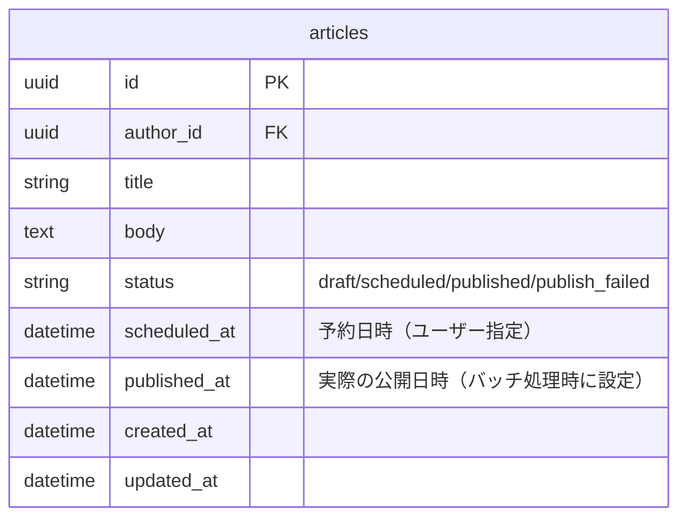
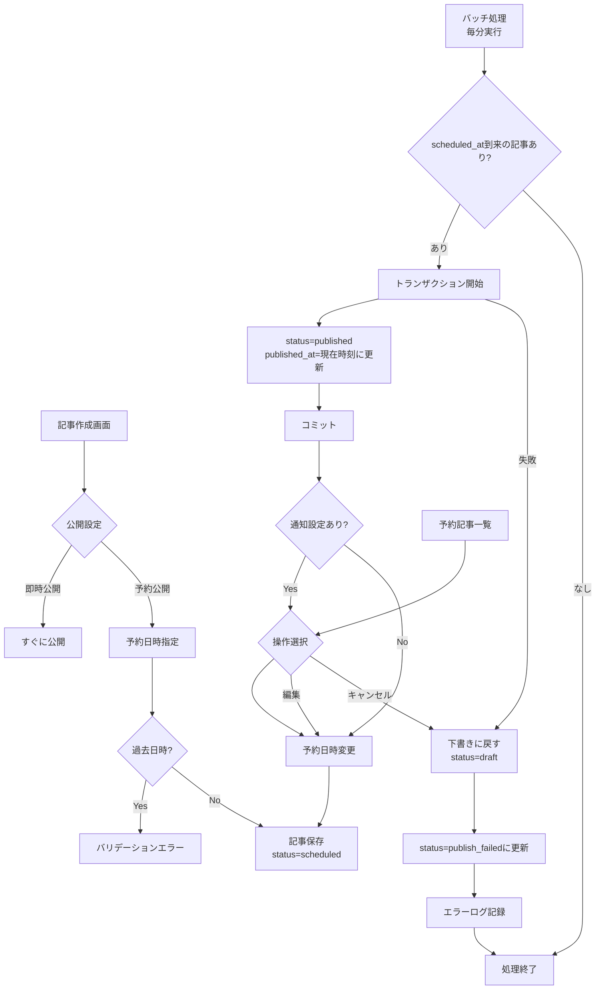
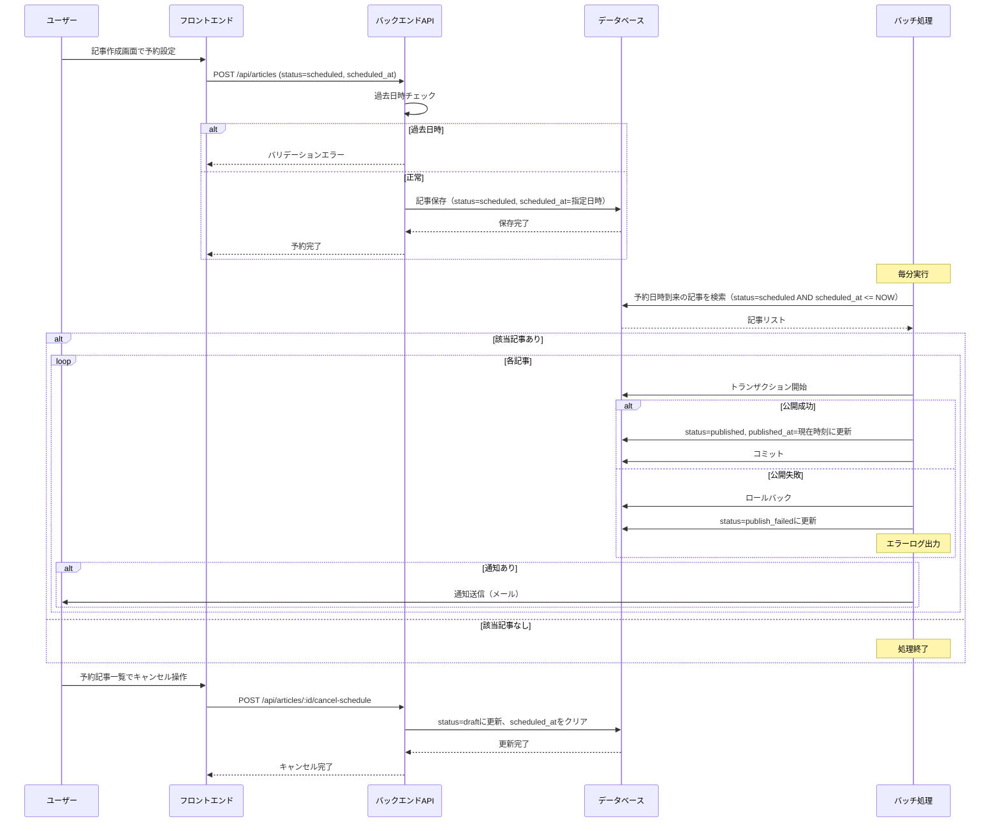

# 予約投稿

## 機能概要

記事の公開日時を事前に指定し、指定日時に自動的に公開する機能。バッチ処理により予約日時到来の記事を自動公開する。

## 目的

- 継続的な発信をサポートする
- 専門家が効率的に記事のスケジュール配信できるようにする

## 機能条件

### 権限

| ロール | 予約投稿 | 一覧表示 | 編集 | キャンセル |
|--------|----------|----------|------|-----------|
| admin  | ○ | ○（全て） | ○（全て） | ○（全て） |
| writer | ○ | ○（自分のみ） | ○（自分のみ） | ○（自分のみ） |
| user   | × | × | × | × |

* 一覧表示: 予約記事一覧画面の閲覧
* 編集: 予約記事の予約日時・内容の変更
* キャンセル: 予約を取り消して下書きに戻す操作

### 制約事項
🟢 **後回し可**

- バッチ処理の実装方式
  - 案1: cron → 定期実行のデファクトスタンダード
  - 案2: Cloud Scheduler → GCPネイティブ、管理容易
  - 案3: Lambda + EventBridge → サーバーレス、スケーラブル
  - **決定: TBD**

- 通知機能の実装方式
  - **決定: メール** → 実装簡易、到達率高

- 予約日時のタイムゾーン
  - **決定: JST** → ユーザビリティ高、夏時間考慮必要

## 画面設計図
🟡 **中程度**

Figma未定義（実装のみ）

### レイアウト構成（暫定）

```
通常時:
┌────────────────────────────────────────────────────────────┐
│ 記事管理 > 予約記事                                          │
│                                                              │
│ ┌────────────────────────────────────────────────────────┐  │
│ │ タイトル     │ 著者 │ 予約日時       │ ステータス │ 操作 │
│ ├────────────────────────────────────────────────────────┤  │
│ │ 記事タイトル1 │ 山田 │ 01/01 12:00 ▼ │ 予約待ち   │ 🗑  │
│ │ 記事タイトル2 │ 鈴木 │ 01/02 09:00   │ 完了       │     │
│ │ 記事タイトル3 │ 田中 │ 01/03 15:00 ▼ │ 公開失敗   │ 🗑  │
│ └────────────────────────────────────────────────────────┘  │
└────────────────────────────────────────────────────────────┘

予約日時タップ時（ドラムロール展開）:
┌────────────────────────────────────────────────────────────┐
│ │ 記事タイトル1 │ 山田 │ ┌────────────┐ │ 予約待ち │ ✅ ✖ │
│ │               │      │ │  01 / 01   │ │          │      │
│ │               │      │ │  12 : 00   │ │          │      │
│ │               │      │ └────────────┘ │          │      │
└────────────────────────────────────────────────────────────┘
```

**ステータス凡例**
| ステータス | status値 | 説明 |
|------------|----------|------|
| 予約待ち | scheduled | 予約日時到来を待機中 |
| 完了 | published | バッチ処理により公開済み |
| 公開失敗 | publish_failed | バッチ処理での公開に失敗 |

**アイコン凡例**
| アイコン | 操作 | 説明 |
|----------|------|------|
| 🗑 | 予約取消 | 予約を取り消して下書きに戻す |
| ✅ | 完了 | 変更した予約日時を適用する |
| ✖ | 閉じる | ドラムロールを閉じて通常表示に戻る |

**操作仕様**
- 予約日時セルをタップするとドラムロール（日時ピッカー）が展開される
- 展開中は操作列が ✅（完了）✖（閉じる）に切り替わる
- ✅ タップで変更をAPIに送信して適用
- ✖ タップで通常表示に戻る（日時に変更がある場合は確認ダイアログを表示）
- 🗑 タップ時は確認ダイアログを表示し、承認後に予約を取り消す

## 関連テーブル



## フロー図



## シーケンス図



## 機能要件
🟡 **中程度**

**主要要件（早期決定）**
- 予約日時の指定（日時ピッカー）
- 過去の日時は選択不可（バリデーション）
- 指定日時に自動公開（バッチ処理）
- 予約記事の一覧表示
- 予約日時の変更
- 予約のキャンセル（下書きに戻す）

**バッチ処理の詳細動作**
- 毎分実行し、`scheduled_at <= NOW` の記事を検索
- statusを`published`に更新
- `published_at`を現在時刻に更新
- 公開失敗時は`publish_failed`に設定

**詳細要件（TBD可）**
- バッチ処理の実装方式: TBD
- 通知機能の有無・実装方式: TBD
- 予約日時のタイムゾーン扱い: TBD

## 非機能要件
🟢 **後回し可**

### パフォーマンス
- バッチ処理: 毎分実行、1分以内に完了
- 予約記事一覧: 3秒以内に表示

### 信頼性
- バッチ処理の失敗時はログ記録
- バッチ処理の二重実行防止

### UX
- 予約日時は分単位で指定可能
- 予約キャンセル後は下書きに戻る

## ログ
🟢 **後回し可**

### 出力タイミング
- 案1: 全操作時に出力（予約作成・予約キャンセル・自動公開） → 追跡しやすいがログ量増加
- 案2: エラー時のみ出力 → ログ量削減だが正常系追跡困難
- 案3: 重要操作のみ出力（自動公開・エラー） → バランス型
- **決定: TBD**

### ログレベル方針
- 案1: INFO中心（予約作成・自動公開をINFO） → 詳細追跡可能
- 案2: WARN/ERROR中心（バッチ処理失敗のみ） → 異常検知に特化
- 案3: INFO（自動公開）+ WARN（バッチ処理失敗）+ ERROR（システムエラー） → バランス型
- **決定: TBD**

## ユースケース
🟡 **中程度**

### シナリオ1: 予約投稿（早期決定）
1. ユーザーが記事作成画面にアクセス
2. タイトル、本文を入力
3. 予約公開を選択
4. 翌日の日時を設定（過去の日時は選択不可）
5. 公開ボタンをクリック
6. 予約記事として保存される（status=scheduled）
7. バッチ処理により指定日時に自動公開される
   - statusがpublishedに更新
   - published_atが現在時刻に設定

### シナリオ2: 予約キャンセル（早期決定）
1. ユーザーが予約記事一覧を確認
2. キャンセルボタンをクリック
3. ステータスが下書きに戻る

## テストケース
🟡 **中程度**

**記載タイミング**: 単体テストは大枠のみ設計段階、詳細はTDD実装時。E2Eテストは実装完了後

### 単体テスト（設計段階は大枠のみ、詳細はTDD実装時に追記）

| テスト項目 | 観点 | 期待値 |
|------------|------|--------|
| 予約記事作成 | status=scheduled、scheduled_atを指定して記事作成 | 記事が予約状態で保存される |
| 予約記事一覧取得 | status=scheduledの記事を取得 | 予約記事リストが返される |
| 予約キャンセル | 予約記事のステータスをdraftに変更 | status=draftに更新される |
| バッチ処理（予約日時到来） | 予約日時到来の記事を検索してpublishedに更新 | status=published、published_at=現在時刻に更新される |
| バッチ処理（予約日時未到来） | 予約日時未到来の記事は更新しない | 更新されない |
| 過去日時の予約設定 | 過去の日時を指定して予約設定 | バリデーションエラーが返される |
| 通知送信（15分前） | 予約公開15分前に通知送信 | 通知が送信される |

### E2Eテスト（実装完了後に記載）

| テストシナリオ | 観点 | 期待値 |
|----------------|------|--------|
| 予約投稿フロー | 記事作成→予約日時設定→公開→予約記事一覧表示 | TBD（実装完了後に記載） |
| 自動公開フロー | 予約記事作成→バッチ処理実行→自動公開 | TBD（実装完了後に記載） |
| 予約キャンセルフロー | 予約記事一覧→キャンセル→下書きに戻る | TBD（実装完了後に記載） |
| 予約日時変更フロー | 予約記事編集→予約日時変更→保存 | TBD（実装完了後に記載） |

## 影響範囲一覧

### 機能影響範囲

| 関連機能 | 影響内容 |
|----------|----------|
| F-04-1 | 予約設定した記事の作成・編集 |
| F-12-1-1 | 管理者ページでの予約記事一覧・管理 |

### コード影響範囲
🟢 **後回し可**

- バックエンド: バッチ処理の実装
- **決定: TBD**（実装時に確定）

## API仕様（参考）

### 予約記事作成（記事作成APIに含まれる）
```
POST /api/articles
{
  "status": "scheduled",
  "scheduled_at": "2025-01-01T12:00:00+09:00"
}
```

### 予約記事一覧取得
```
GET /api/articles/scheduled
```

### 予約キャンセル
```
POST /api/articles/:id/cancel-schedule
```

## 作業見積もり

### 見積もりサマリー

| 項目 | ストーリーポイント | 目安時間 |
|------|------------------|----------|
| **合計** | 27sp | 6.75時間 |

**目安**: 4sp = 1時間（実装＋単体テスト＋レビューを含む、あくまで参考値）

### タスク一覧

| タスク | SP | 備考 |
|--------|-----|------|
| 予約公開バッチ処理 | 5 | 毎分実行、トランザクション制御、publish_failed対応、エラーログ |
| 予約記事一覧API（GET /api/articles/scheduled） | 3 | 権限制御（admin全件/writer自分のみ）、ステータスフィルタ |
| 予約キャンセルAPI（POST /api/articles/:id/cancel-schedule） | 2 | status=draft、scheduled_atクリア、確認ダイアログ連携 |
| 予約日時変更API（PUT /api/articles/:id/schedule） | 2 | scheduled_at更新、過去日時バリデーション |
| 予約記事一覧UI（テーブル表示） | 3 | ステータス表示（予約待ち/完了/公開失敗）、予約取消アイコン |
| ドラムロール日時ピッカー | 3 | タップ展開/閉じる、完了/閉じるアイコン切替、確認ダイアログ |
| メール通知機能 | 3 | メール送信基盤、テンプレート、公開成功/失敗時の通知 |
| バッチ処理の二重実行防止 | 3 | ロック機構の実装 |
| openapi.yaml定義 | 3 | 3エンドポイント分のスキーマ定義 |

### リスク要因

- **バッチ処理の実装方式未決定（TBD）**: cron/Cloud Scheduler/Lambda+EventBridgeの選択により実装難易度が変動
- **メール送信基盤**: 既存の送信基盤がない場合、追加の基盤構築が必要（+3sp程度）

### 依存関係

- DBマイグレーション（[create-edit.md](./create-edit.md) で実施） → 全API実装の前提
- openapi.yaml定義 → API実装の前提
- バッチ処理の実装方式の決定（TBD） → バッチ処理実装
- 予約記事一覧API → 予約記事一覧UI
- メール送信基盤 → メール通知機能
