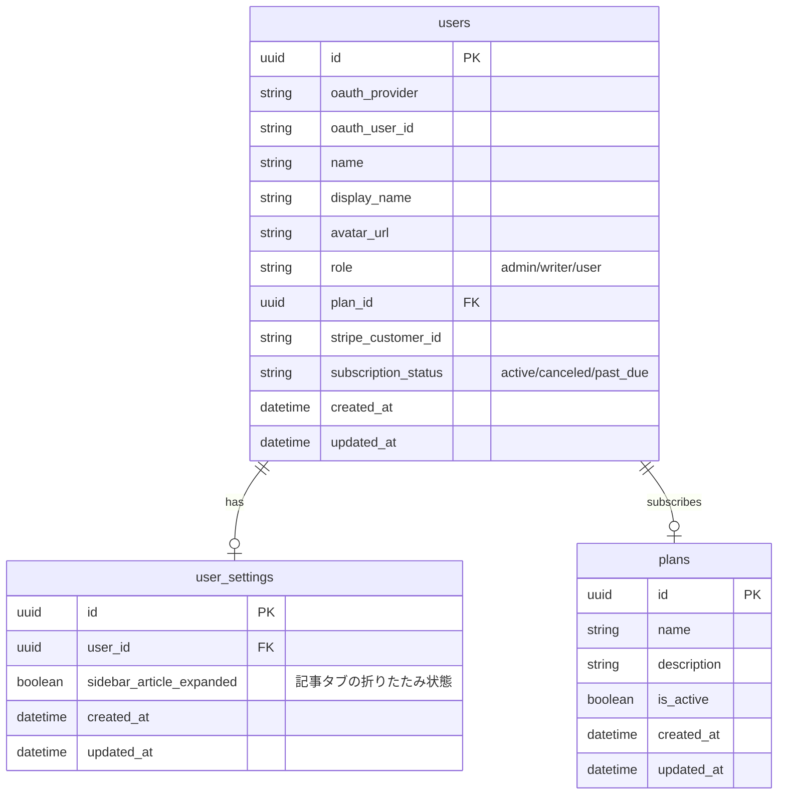
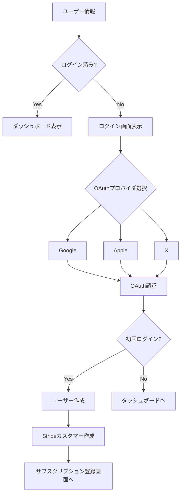
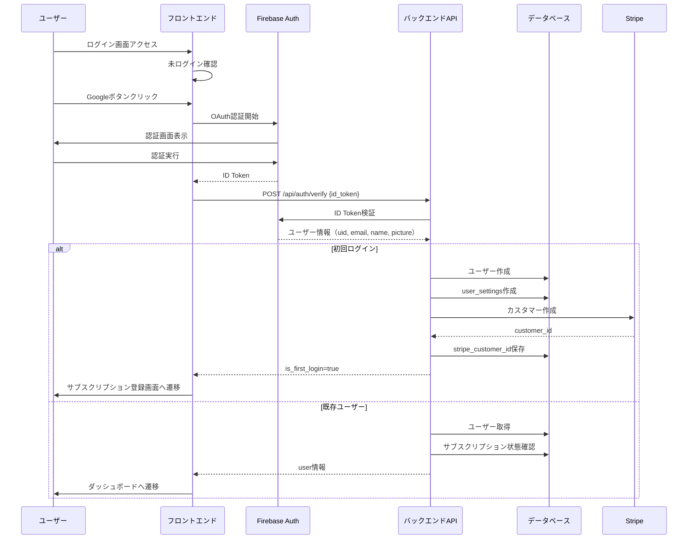

# ログイン機能

## 機能概要

Firebase Authenticationを使用し、Google / Apple / X によるOAuth認証を実装して、ユーザーがサービスに安全にログインできるようにする。認証プロセスはOAuthプロバイダ側に完全に委任し、初回ログイン時は取得したユーザー情報を基に本システム側で自動登録を行い、既存ユーザーはダッシュボードへ遷移する。

## 目的

- 未ログインユーザーを認証し、サービスへアクセス可能にする
- 認証プロセスはOAuthプロバイダに完全に委任し、初回ログイン時は取得したユーザー情報を基に本システム側で自動登録を行い、サブスクリプション登録へ誘導する
- セッション管理によりログイン状態を維持する

## 機能条件

### アクセス可否

| 状態 | 操作可否 |
|--------|----------|
| 未ログイン | ○ |
| ログイン済み | - |

※ ログイン画面は未ログイン状態の場合のみアクセス可能

### 制約事項
🟢 **後回し可**

- セッション有効期限
  - 案1: 7日 → ユーザビリティ高、セキュリティリスク中
  - 案2: 24時間 → セキュリティ高、ユーザビリティ低
  - 案3: リメンバーme機能で切替 → 開発コスト増
  - **決定: TBD**

- OAuthプロバイダごとの取得項目
  - Google: email, name, picture
  - Apple: email, name（非公開の場合はemailのみ）
  - X: email, name, profile_image_url
  - **決定: TBD**

## 画面設計図
🟡 **中程度**

Pencil未定義（実装のみ）

### レイアウト構成（暫定）

```
┌─────────────────────────────────────────────────────────┐
│                                                           │
│                    シコウラボ                             │
│                                                           │
│                  専門家の思考プロセスを                    │
│                   のぞけるプラットフォーム                  │
│                                                           │
│  ┌───────────────────────────────────────────────────┐  │
│  │                                                   │  │
│  │            OAuthプロバイダでログイン               │  │
│  │                                                   │  │
│  │  ┌──────────────────────────────────────────┐    │  │
│  │  │ [G]  Google で続ける                      │    │  │
│  │  └──────────────────────────────────────────┘    │  │
│  │                                                   │  │
│  │  ┌──────────────────────────────────────────┐    │  │
│  │  │   Apple で続ける                          │    │  │
│  │  └──────────────────────────────────────────┘    │  │
│  │                                                   │  │
│  │  ┌──────────────────────────────────────────┐    │  │
│  │  │   X で続ける                               │    │  │
│  │  └──────────────────────────────────────────┘    │  │
│  │                                                   │  │
│  └───────────────────────────────────────────────────┘  │
│                                                           │
│  ログインすることで利用規約に同意したものとみなされます      │
│                                                           │
└─────────────────────────────────────────────────────────┘
```

## 関連テーブル



## フロー図



## シーケンス図



## 機能要件
🟡 **中程度**

### 機能要件1: OAuth認証（F-01）
- 機能仕様1: Firebase Authenticationを使用したGoogle / Apple / X によるOAuth認証

### 機能要件2: ユーザー自動登録（F-01）
- 機能仕様1: 初回ログイン時のユーザー自動登録（users、user_settings）
- 機能仕様2: 初回ログイン時のStripeカスタマー作成

### 機能要件3: セッション管理（F-01）
- 機能仕様1: セッション管理（httpOnly Cookie、SameSite=Lax）
- 機能仕様2: ログアウト機能

### 機能要件4: アクセス制御（F-01）
- 機能仕様1: 未ログイン時のアクセス制限（保護されたページへリダイレクト）

### 機能要件5: セキュリティ詳細（F-01）
- 機能仕様1: CSRFトークンの検証: TBD
- 機能仕様2: セッション有効期限: TBD
- 機能仕様3: OAuthステートの検証: TBD
- 機能仕様4: リメンバーme機能: TBD

## 非機能要件
🟢 **後回し可**

### 非機能要件1: パフォーマンス
- 非機能仕様1: OAuthリダイレクト: 3秒以内
- 非機能仕様2: セッション確認: 500ms以内

### 非機能要件2: セキュリティ
- 非機能仕様1: Firebase Authenticationのセキュリティ機能を活用（OAuth 2.0 / OpenID Connect準拠）
- 非機能仕様2: ID Token検証によるユーザー認証
- 非機能仕様3: httpOnly Cookie（SameSite=Lax）
- 非機能仕様4: セッションハイジャック対策

### 非機能要件3: 可用性
- 非機能仕様1: OAuthプロバイダ障害時: エラーメッセージ表示、リトライ誘導

## ログ
🟢 **後回し可**

### 出力タイミング
- 案1: 全認証操作時に出力（Firebase認証・ID Token検証・ユーザー作成・Stripe連携） → 追跡しやすいがログ量増加
- 案2: エラー時のみ出力 → ログ量削減だが正常系追跡困難
- 案3: 重要操作のみ出力（初回ログイン時のユーザー作成・Stripe連携・認証エラー） → バランス型
- **決定: TBD**

### ログレベル方針
- 案1: INFO中心（認証開始・成功・ユーザー作成をINFO） → 詳細追跡可能
- 案2: WARN/ERROR中心（認証エラー・Stripe連携エラーのみ） → 異常検知に特化
- 案3: INFO（認証成功・ユーザー作成）+ WARN（認証失敗）+ ERROR（システムエラー） → バランス型
- **決定: TBD**

## ユースケース
🟡 **中程度**

### シナリオ1: 初回ログイン（早期決定）
1. ユーザーがサービスにアクセス
2. ログイン画面が表示される
3. Googleボタンをクリック
4. Google認証画面が表示され、ユーザー認証はGoogle側に完全に委任される
5. 認証を完了
6. 取得したユーザー情報を基に本システム側で自動登録される
7. サブスクリプション登録画面へ遷移

### シナリオ2: 既存ユーザーログイン（早期決定）
1. ユーザーがサービスにアクセス
2. ログイン画面が表示される
3. Appleボタンをクリック
4. Apple認証画面が表示され、ユーザー認証はApple側に完全に委任される
5. 認証を完了
6. ダッシュボードへ遷移

### シナリオ3: ログアウト（TBD可）
1. ユーザーがログアウトボタンをクリック
2. セッションが削除される
3. ログイン画面へ遷移

## テストケース
🟡 **中程度**

**記載タイミング**: 単体テストは大枠のみ設計段階、詳細はTDD実装時。E2Eテストは実装完了後

### 単体テスト（設計段階は大枠のみ、詳細はTDD実装時に追記）

| テスト項目 | 観点 | 期待値 |
|------------|------|--------|
| ID Token検証 | Firebaseから取得したID Tokenの検証 | 有効なトークンの場合はユーザー情報が返される |
| ID Token検証（無効） | 無効なID Tokenの場合のエラー処理 | 401認証エラーが返される |
| ユーザー情報取得 | Firebaseからユーザー情報取得 | uid, email, name, pictureが取得できる |
| 初回ログイン処理 | ユーザー作成・user_settings作成・Stripeカスタマー作成 | users, user_settingsテーブルにレコード作成、stripe_customer_idが保存される |
| 既存ユーザーログイン | ユーザー取得・サブスクリプション状態確認 | ユーザー情報とサブスクリプション状態が返される |
| ログアウト処理 | Firebaseサインアウト・セッション削除 | Firebaseセッションが無効化され、本システム側のセッションも削除される |
| セッション確認 | 有効なセッションでユーザー情報取得 | ユーザー情報が返される |
| セッション確認（無効） | 無効なセッションで401エラー | 認証エラーが返される |

### E2Eテスト（実装完了後に記載）

| テストシナリオ | 観点 | 期待値 |
|----------------|------|--------|
| 初回ログインフロー | 未ログイン→Firebase認証→ユーザー作成→サブスク画面遷移 | TBD（実装完了後に記載） |
| 既存ユーザーログインフロー | 未ログイン→Firebase認証→ダッシュボード遷移 | TBD（実装完了後に記載） |
| ログアウトフロー | ログイン済み→Firebaseサインアウト→ログイン画面遷移 | TBD（実装完了後に記載） |
| 保護されたページへのアクセス | 未ログイン状態で保護ページアクセス→ログイン画面へリダイレクト | TBD（実装完了後に記載） |

## 影響範囲一覧

### 機能影響範囲

| 関連機能 | 影響内容 |
|----------|----------|
| F-10-2 | 初回ログイン時にサブスクリプション登録へ遷移 |
| F-12-2 | ユーザー情報が自動登録される |
| 全機能 | 未ログイン時はアクセス制限 |

### コード影響範囲
🟢 **後回し可**

- フロントエンド: Firebase Authentication SDK、認証画面、セッション管理
- バックエンド: Firebase Admin SDK（ID Token検証）、セッション管理、ユーザー登録
- 外部サービス: Firebase Authentication、Stripe
- **決定: TBD**（実装時に確定）

## API仕様（参考）

### ID Token検証
```http
POST /api/auth/verify
Content-Type: application/json

{
  "id_token": "string"
}
```

### ログアウト
```http
POST /api/auth/logout
```

### セッション確認
```http
GET /api/auth/me
```

## 作業見積もり

### 見積もりサマリー

| 項目 | ストーリーポイント | 目安時間 |
|------|------------------|----------|
| **合計** | 22-24sp | 5.5-6時間 |

**目安**: 4sp = 1時間（実装＋単体テスト＋レビューを含む、あくまで参考値）

### タスク一覧

| タスク | ストーリーポイント | 備考 |
|--------|------------------|------|
| **バックエンド** | | |
| Firebaseプロジェクト設定 | 2 | コンソール設定・プロバイダ有効化・環境変数 |
| Firebase Admin SDK導入 | 2 | SDKインストール・初期化・ID Token検証 |
| ユーザー登録ロジック | 3 | users/user_settings作成・既存ユーザー判定 |
| Stripe連携 | 2-3 | カスタマー作成・エラーハンドリング |
| ログアウトAPI | 1 | Firebaseサインアウト・セッション削除 |
| セッション確認API | 1 | ユーザー情報返却 |
| **フロントエンド** | | |
| Firebase SDK導入 | 2 | SDKインストール・初期化・認証関数実装 |
| 認証画面実装 | 2 | UI実装・OAuthボタン・ローディング状態 |
| セッション管理 | 2 | Cookie管理・未ログイン時リダイレクト |
| **テスト** | | |
| 単体テスト | 3sp | Firebase/Stripeモック・認証フロー |
| E2Eテスト | 2-3sp | OAuthログイン/ログアウト/セッション確認の主要フロー |

### リスク要因

- **Stripe連携**: テスト環境での挙動確認が必要
- **Firebase設定**: プロバイダごとの設定差異（Appleは特に手順が多い）
- **セッション管理**: httpOnly Cookieの設定・ドメイン跨ぎ対応

### 依存関係

- Firebaseプロジェクト作成・設定完了後、実装可能
- Stripeテスト環境の事前準備が必要
