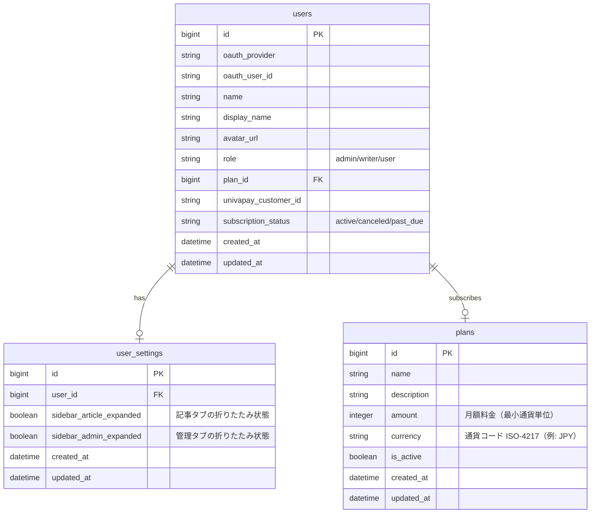
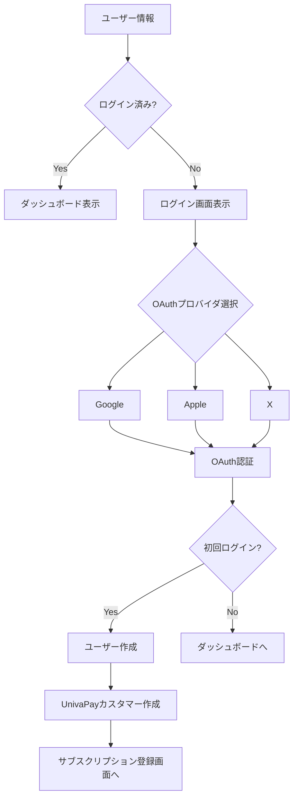
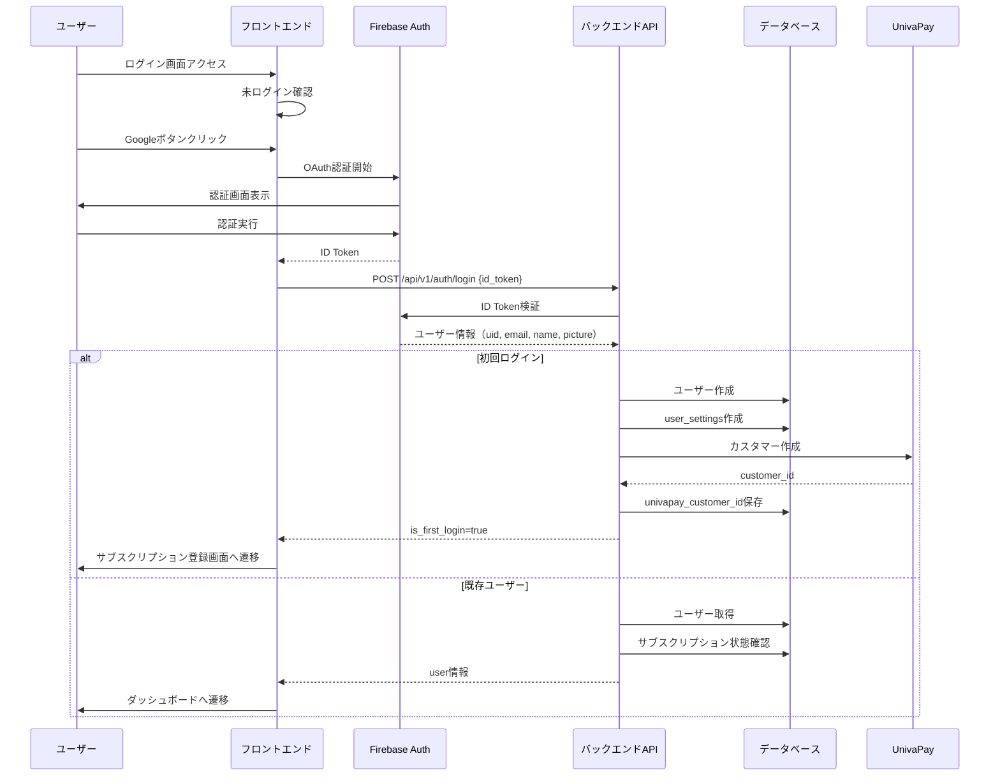

# ログイン機能

## 機能概要

Firebase Authenticationを使用し、Google / Apple / X によるOAuth認証を実装して、ユーザーがサービスに安全にログインできるようにする。認証プロセスはOAuthプロバイダ側に完全に委任し、初回ログイン時は取得したユーザー情報を基に本システム側で自動登録を行い、既存ユーザーはダッシュボードへ遷移する。

## 目的

- 未ログインユーザーを認証し、サービスへアクセス可能にする
- 認証プロセスはOAuthプロバイダに完全に委任し、初回ログイン時は取得したユーザー情報を基に本システム側で自動登録を行い、サブスクリプション登録へ誘導する
- セッション管理によりログイン状態を維持する

## 機能条件

### アクセス可否

| 状態 | 操作可否 |
|--------|----------|
| 未ログイン | ○ |
| ログイン済み | - |

※ ログイン画面は未ログイン状態の場合のみアクセス可能

### 制約事項
✅ **決定済み**

- セッション有効期限
  - **決定: 7日固定**（ADR-017関連決定）
  - リメンバーme機能はなし（実装コスト削減）

- CSRF対策方式
  - **決定: SameSite=Lax**（ADR-017承認済み）
  - 費用対効果の観点から採用（実装15分 vs Double Submitの6-8時間）

- OAuthプロバイダごとの取得項目
  - **決定: デフォルト案**
  - Google: name, email, picture
  - Apple: name, email（非公開の場合はemailのみ）
  - X: name, profile_image_url

## 画面設計図
🟡 **中程度**

Pencil未定義（実装のみ）

### レイアウト構成（暫定）

```
┌─────────────────────────────────────────────────────────┐
│                                                           │
│                    シコウラボ                             │
│                                                           │
│                  専門家の思考プロセスを                    │
│                   のぞけるプラットフォーム                  │
│                                                           │
│  ┌───────────────────────────────────────────────────┐  │
│  │                                                   │  │
│  │            OAuthプロバイダでログイン               │  │
│  │                                                   │  │
│  │  ┌──────────────────────────────────────────┐    │  │
│  │  │ [G]  Google でログイン                      │    │  │
│  │  └──────────────────────────────────────────┘    │  │
│  │                                                   │  │
│  │  ┌──────────────────────────────────────────┐    │  │
│  │  │   Apple でログイン                          │    │  │
│  │  └──────────────────────────────────────────┘    │  │
│  │                                                   │  │
│  │  ┌──────────────────────────────────────────┐    │  │
│  │  │   X でログイン                               │    │  │
│  │  └──────────────────────────────────────────┘    │  │
│  │                                                   │  │
│  └───────────────────────────────────────────────────┘  │
│                                                           │
│  ログインすることで利用規約に同意したものとみなされます      │
│                                                           │
└─────────────────────────────────────────────────────────┘
```

## 関連テーブル


```mermaid
erDiagram
    %% 正: docs/versions/1_0_0/data-model.md
    users ||--o| user_settings : "has"
    users ||--o| plans : "subscribes"

    users {
        bigint id PK
        string oauth_provider
        string oauth_user_id
        string name
        string display_name
        string avatar_url
        string role "admin/writer/user"
        bigint plan_id FK
        string univapay_customer_id
        string subscription_status "active/canceled/past_due"
        datetime created_at
        datetime updated_at
    }

    user_settings {
        bigint id PK
        bigint user_id FK
        boolean sidebar_article_expanded "記事タブの折りたたみ状態"
        boolean sidebar_admin_expanded "管理タブの折りたたみ状態"
        datetime created_at
        datetime updated_at
    }

    plans {
        bigint id PK
        string name
        string description
        integer amount "月額料金（最小通貨単位）"
        string currency "通貨コード ISO-4217（例: JPY）"
        boolean is_active
        datetime created_at
        datetime updated_at
    }
```

## フロー図


```mermaid
flowchart TD
    A[ユーザー情報] --> B{ログイン済み?}
    B -->|Yes| C[ダッシュボード表示]
    B -->|No| D[ログイン画面表示]

    D --> E{OAuthプロバイダ選択}
    E --> F[Google]
    E --> G[Apple]
    E --> H[X]

    F --> I[OAuth認証]
    G --> I
    H --> I

    I --> J{初回ログイン?}
    J -->|Yes| K[ユーザー作成]
    K --> L[UnivaPayカスタマー作成]
    L --> M[サブスクリプション登録画面へ]
    J -->|No| N[ダッシュボードへ]
```

## シーケンス図


```mermaid
sequenceDiagram
    participant User as ユーザー
    participant Front as フロントエンド
    participant Firebase as Firebase Auth
    participant API as バックエンドAPI
    participant DB as データベース
    participant UnivaPay as UnivaPay

    User->>Front: ログイン画面アクセス
    Front->>Front: 未ログイン確認

    User->>Front: Googleボタンクリック
    Front->>Firebase: OAuth認証開始
    Firebase->>User: 認証画面表示
    User->>Firebase: 認証実行
    Firebase-->>Front: ID Token

    Front->>API: POST /api/v1/auth/login {id_token}
    API->>Firebase: ID Token検証
    Firebase-->>API: ユーザー情報（uid, email, name, picture）

    alt 初回ログイン
        API->>DB: ユーザー作成
        API->>DB: user_settings作成
        API->>UnivaPay: カスタマー作成
        UnivaPay-->>API: customer_id
        API->>DB: univapay_customer_id保存
        API-->>Front: is_first_login=true
        Front->>User: サブスクリプション登録画面へ遷移
    else 既存ユーザー
        API->>DB: ユーザー取得
        API->>DB: サブスクリプション状態確認
        API-->>Front: user情報
        Front->>User: ダッシュボードへ遷移
    end
```

## 機能要件
🟡 **中程度**

### 機能要件1: OAuth認証（F-01）
- 機能仕様1: Firebase Authenticationを使用したGoogle / Apple / X によるOAuth認証

### 機能要件2: ユーザー自動登録（F-01）
- 機能仕様1: 初回ログイン時のユーザー自動登録（users、user_settings）
- 機能仕様2: 初回ログイン時のUnivaPayカスタマー作成

### 機能要件3: セッション管理（F-01）
- 機能仕様1: セッション管理（httpOnly Cookie、SameSite=Lax）
- 機能仕様2: ログアウト機能

### 機能要件4: アクセス制御（F-01）
- 機能仕様1: 未ログイン時のアクセス制限（保護されたページへリダイレクト）

### 機能要件5: セキュリティ詳細（F-01）
- 機能仕様1: CSRF対策: **SameSite=Lax**（HttpOnly + Secure + SameSite=LaxのCookie設定）。追加のCSRFトークンは不要（ADR-017参照、費用対効果で決定）
- 機能仕様2: セッション有効期限: **7日**（CookieのMaxAgeで設定）
- 機能仕様3: OAuthステートの検証: **Firebase SDK任せ**（Firebase Authenticationのデフォルト実装に依存）
- 機能仕様4: リメンバーme機能: **なし**（7日固定）

## 非機能要件
🟢 **後回し可**

### 非機能要件1: パフォーマンス
- 非機能仕様1: OAuthリダイレクト: 3秒以内
- 非機能仕様2: セッション確認: 500ms以内

### 非機能要件2: セキュリティ
- 非機能仕様1: Firebase Authenticationのセキュリティ機能を活用（OAuth 2.0 / OpenID Connect準拠）
- 非機能仕様2: ID Token検証によるユーザー認証（Firebase Admin SDK）
- 非機能仕様3: httpOnly Cookie（HttpOnly + Secure + SameSite=Lax）
- 非機能仕様4: セッションハイジャック対策（SameSite=Lax + HTTPS強制）
- 非機能仕様5: CSRF対策（SameSite=Lax、追加トークン不要・ADR-017参照）

### 非機能要件3: 可用性
- 非機能仕様1: OAuthプロバイダ障害時: エラーメッセージ表示、リトライ誘導

## ログ
🟢 **後回し可**

### 出力タイミング
- 案1: 全認証操作時に出力（Firebase認証・ID Token検証・ユーザー作成・UnivaPay連携） → 追跡しやすいがログ量増加
- 案2: エラー時のみ出力 → ログ量削減だが正常系追跡困難
- 案3: 重要操作のみ出力（初回ログイン時のユーザー作成・UnivaPay連携・認証エラー） → バランス型
- **決定: TBD**

### ログレベル方針
- 案1: INFO中心（認証開始・成功・ユーザー作成をINFO） → 詳細追跡可能
- 案2: WARN/ERROR中心（認証エラー・UnivaPay連携エラーのみ） → 異常検知に特化
- 案3: INFO（認証成功・ユーザー作成）+ WARN（認証失敗）+ ERROR（システムエラー） → バランス型
- **決定: TBD**

## ユースケース
🟡 **中程度**

### シナリオ1: 初回ログイン（早期決定）
1. ユーザーがサービスにアクセス
2. ログイン画面が表示される
3. Googleボタンをクリック
4. Google認証画面が表示され、ユーザー認証はGoogle側に完全に委任される
5. 認証を完了
6. 取得したユーザー情報を基に本システム側で自動登録される
7. サブスクリプション登録画面へ遷移

### シナリオ2: 既存ユーザーログイン（早期決定）
1. ユーザーがサービスにアクセス
2. ログイン画面が表示される
3. Appleボタンをクリック
4. Apple認証画面が表示され、ユーザー認証はApple側に完全に委任される
5. 認証を完了
6. ダッシュボードへ遷移

### シナリオ3: ログアウト（TBD可）
1. ユーザーがログアウトボタンをクリック
2. セッションが削除される
3. ログイン画面へ遷移

## テストケース
🟢 **実装済み**

### 単体テスト（バックエンド）

#### Usecase: Login（機能要件1、機能要件2）

| テスト項目 | 対応仕様 | 入力・条件 | 期待値 |
|------------|----------|------------|--------|
| TC-AUTH-01 | 機能要件1/機能仕様1 | 有効なID Token（既存ユーザー） | 正常系 | ユーザー情報が返される、isFirstLogin=false |
| TC-AUTH-02 | 機能要件1/機能仕様1 | 無効なID Token | 異常系 | ErrInvalidTokenが返される |
| TC-AUTH-03 | 機能要件2/機能仕様1 | 初回ログイン（ユーザー不在） | 正常系 | isFirstLogin=true、Createが呼ばれる |
| TC-AUTH-04 | 機能要件2/機能仕様2 | 初回ログイン + UnivaPay APIエラー | 異常系 | ユーザー作成済みだがunivapay_customer_idはnull、500エラー |

#### Usecase: GetCurrentUser（機能要件3）

| テスト項目 | 対応仕様 | 入力・条件 | 期待値 |
|------------|----------|------------|--------|
| TC-AUTH-05 | 機能要件3/機能仕様1 | 有効なセッショントークン | 正常系 | ユーザー情報が返される |
| TC-AUTH-06 | 機能要件3/機能仕様1 | 無効なセッショントークン | 異常系 | ErrInvalidTokenが返される |

#### Middleware: RequireAuth（機能要件4）

| テスト項目 | 対応仕様 | 入力・条件 | 期待値 |
|------------|----------|------------|--------|
| TC-AUTH-07 | 機能要件4/機能仕様1 | Cookieあり・有効なトークン | 正常系 | 200、next handler実行、contextにUser設定 |
| TC-AUTH-08 | 機能要件4/機能仕様1 | Cookieなし | 異常系 | 401 |
| TC-AUTH-09 | 機能要件4/機能仕様1 | Cookieあり・無効なトークン（検証失敗） | 異常系 | 401 |
| TC-AUTH-10 | 機能要件4/機能仕様1 | トークン有効だがDBにユーザー不在 | 異常系 | 401 |

#### Middleware: RequireRole（機能要件4）

| テスト項目 | 対応仕様 | 入力・条件 | 期待値 |
|------------|----------|------------|--------|
| TC-AUTH-11 | 機能要件4/機能仕様1 | admin + adminエンドポイント | 正常系 | 200 |
| TC-AUTH-12 | 機能要件4/機能仕様1 | user + adminエンドポイント | 異常系 | 403 |
| TC-AUTH-13 | 機能要件4/機能仕様1 | writer + adminエンドポイント | 異常系 | 403 |
| TC-AUTH-14 | 機能要件4/機能仕様1 | writer + writerエンドポイント | 正常系 | 200 |
| TC-AUTH-15 | 機能要件4/機能仕様1 | user + writerエンドポイント | 異常系 | 403 |
| TC-AUTH-16 | 機能要件4/機能仕様1 | admin + writerエンドポイント（階層権限） | 正常系 | 200（admin > writer > user） |
| TC-AUTH-17 | 機能要件4/機能仕様1 | contextにUser不在 | 異常系 | 401 |
| TC-AUTH-18 | 機能要件4/機能仕様1 | 不明なrole | 異常系 | 403 |

#### Middleware: RequireSubscription（機能要件4）

| テスト項目 | 対応仕様 | 入力・条件 | 期待値 |
|------------|----------|------------|--------|
| TC-AUTH-19 | 機能要件4/機能仕様1 | subscription_status=active | 正常系 | 200 |
| TC-AUTH-20 | 機能要件4/機能仕様1 | subscription_status=canceled | 異常系 | 403 |
| TC-AUTH-21 | 機能要件4/機能仕様1 | subscription_status=past_due | 異常系 | 403 |
| TC-AUTH-22 | 機能要件4/機能仕様1 | contextにUser不在 | 異常系 | 401 |

#### Handler: POST /api/v1/auth/login（機能要件1、機能要件5）

| テスト項目 | 対応仕様 | 入力・条件 | 期待値 |
|------------|----------|------------|--------|
| TC-AUTH-23 | 機能要件5/機能仕様1 | 本番環境 | 正常系 | 200、Cookie Secure=true、HttpOnly=true、SameSite=Lax、MaxAge=604800 |
| TC-AUTH-24 | 機能要件5/機能仕様1 | 開発環境 | 正常系 | 200、Cookie Secure=false、HttpOnly=true、SameSite=Lax、MaxAge=604800 |
| TC-AUTH-25 | 機能要件1/機能仕様1 | id_tokenが空文字 | 境界値 | 400 |
| TC-AUTH-26 | 機能要件1/機能仕様1 | 不正なJSONボディ | 異常系 | 400 |
| TC-AUTH-27 | 機能要件1/機能仕様1 | ErrInvalidToken | 異常系 | 401 |
| TC-AUTH-28 | 機能要件1/機能仕様1 | その他のエラー | 異常系 | 500 |

#### Handler: GET /api/v1/auth/me（機能要件3）

| テスト項目 | 対応仕様 | 入力・条件 | 期待値 |
|------------|----------|------------|--------|
| TC-AUTH-29 | 機能要件3/機能仕様1 | 有効なCookie | 正常系 | 200、ユーザー情報 |
| TC-AUTH-30 | 機能要件3/機能仕様1 | Cookie不在 | 異常系 | 401 |
| TC-AUTH-31 | 機能要件3/機能仕様1 | ErrInvalidToken | 異常系 | 401 |
| TC-AUTH-32 | 機能要件3/機能仕様1 | その他のエラー | 異常系 | 500 |

#### Handler: POST /api/v1/auth/logout（機能要件3）

| テスト項目 | 対応仕様 | 入力・条件 | 期待値 |
|------------|----------|------------|--------|
| TC-AUTH-33 | 機能要件3/機能仕様2 | 本番環境のログアウト | 正常系 | 204、Cookie value=""、MaxAge=-1、Secure=true |
| TC-AUTH-34 | 機能要件3/機能仕様2 | 開発環境のログアウト | 正常系 | 204、Cookie value=""、MaxAge=-1、Secure=false |

---

### 単体テスト（フロントエンド）

#### Middleware: パスマッチング（機能要件4）

| テスト項目 | 対応仕様 | 入力・条件 | 期待値 |
|------------|----------|------------|--------|
| TC-FE-01 | 機能要件4/機能仕様1 | `'/'` は完全一致のみ | 正常系 | `/login` や `/articles` にはマッチしない |
| TC-FE-02 | 機能要件4/機能仕様1 | 非ルートパスはサブパスにマッチ | 正常系 | `/articles/123` は `/articles` にマッチ、`/articles-legacy` はマッチしない |
| TC-FE-03 | 機能要件4/機能仕様1 | 公開パス・保護パスの判定 | 正常系 | `/login` は公開、`/` と `/articles/2026` は保護 |

#### Middleware: ルートガード（機能要件4）

| テスト項目 | 対応仕様 | 入力・条件 | 期待値 |
|------------|----------|------------|--------|
| TC-FE-04 | 機能要件4/機能仕様1 | セッションなし + 保護パス | 異常系 | 307、Location: /login |
| TC-FE-05 | 機能要件4/機能仕様1 | セッションあり + /login | 正常系 | 307、Location: / |
| TC-FE-06 | 機能要件4/機能仕様1 | セッションなし + /subscription | 正常系 | 200（通過・NextResponse.next()） |
| TC-FE-07 | 機能要件4/機能仕様1 | セッションあり + 保護パス | 正常系 | 200（通過・NextResponse.next()） |

#### Providers（機能要件1、機能要件3）

| テスト項目 | 対応仕様 | 入力・条件 | 期待値 |
|------------|----------|------------|--------|
| TC-FE-08 | 機能要件1/機能仕様1 | AuthProviderが含まれている | 正常系 | isLoading=false、useAuthが使える |
| TC-FE-09 | 機能要件1/機能仕様1 | QueryClientProviderが含まれている | 正常系 | useQueryClientが値を返す |

#### 認証APIクライアント（機能要件1、機能要件3）

| テスト項目 | 対応仕様 | 入力・条件 | 期待値 |
|------------|----------|------------|--------|
| TC-FE-10 | 機能要件1/機能仕様1 | authApi.login 成功 | 正常系 | user情報、is_first_login=false |
| TC-FE-11 | 機能要件2/機能仕様1 | authApi.login 初回ログイン | 正常系 | is_first_login=true |
| TC-FE-12 | 機能要件1/機能仕様1 | authApi.login 無効なID Token | 異常系 | 401エラー |
| TC-FE-13 | 機能要件1/機能仕様1 | authApi.login ネットワークエラー | 異常系 | Network Error |
| TC-FE-14 | 機能要件3/機能仕様1 | authApi.getMe 成功 | 正常系 | user情報 |
| TC-FE-15 | 機能要件3/機能仕様1 | authApi.getMe 未認証 | 異常系 | 401エラー |
| TC-FE-16 | 機能要件3/機能仕様2 | authApi.logout 成功 | 正常系 | 204 No Content |
| TC-FE-17 | 機能要件3/機能仕様2 | authApi.logout 未認証 | 異常系 | 401エラー |

#### 認証コンテキスト（機能要件1、機能要件3）

| テスト項目 | 対応仕様 | 入力・条件 | 期待値 |
|------------|----------|------------|--------|
| TC-FE-18 | 機能要件1/機能仕様1 | 初期状態 | 正常系 | user=null、isLoading=false、isAuthenticated=false |
| TC-FE-19 | 機能要件1/機能仕様1 | loginWithGoogle 成功 | 正常系 | user情報がセット、isAuthenticated=true |
| TC-FE-20 | 機能要件2/機能仕様1 | loginWithGoogle 初回ログイン | 正常系 | `/subscription` へpush |
| TC-FE-21 | 機能要件1/機能仕様1 | loginWithApple 成功 | 正常系 | isAuthenticated=true |
| TC-FE-22 | 機能要件1/機能仕様1 | loginWithX 成功 | 正常系 | isAuthenticated=true |
| TC-FE-23 | 機能要件3/機能仕様2 | logout 成功 | 正常系 | user=null、isAuthenticated=false |
| TC-FE-24 | 機能要件4/機能仕様1 | ログインページでの動作 | 正常系 | getMe未呼び出し、authApi.login未呼び出し、user=null |
| TC-FE-25 | 機能要件3/機能仕様1 | refresh 成功 | 正常系 | getMeが呼ばれる |
| TC-FE-26 | 機能要件5/機能仕様2 | onAuthStateChanged getIdToken呼び出し | 正常系 | getIdToken(forceRefresh=true) が呼ばれ、authApi.login が呼ばれる |
| TC-FE-27 | 機能要件5/機能仕様2 | トークンリフレッシュ成功 | 正常系 | user情報がセット、isAuthenticated=true |
| TC-FE-28 | 機能要件5/機能仕様2 | getIdToken失敗 | 異常系 | user=null、isAuthenticated=false |
| TC-FE-29 | 機能要件5/機能仕様2 | login失敗（401等） | 異常系 | user=null、isAuthenticated=false |

#### ログイン画面（機能要件1）

| テスト項目 | 対応仕様 | 入力・条件 | 期待値 |
|------------|----------|------------|--------|
| TC-FE-30 | 機能要件1/機能仕様1 | 画面表示（ロゴとタイトル） | 正常系 | "SikouLab"、利用規約文言が表示される |
| TC-FE-31 | 機能要件1/機能仕様1 | 画面表示（OAuthボタン） | 正常系 | Google / Apple / X のボタンが表示される |
| TC-FE-32 | 機能要件1/機能仕様1 | Googleボタンクリック | 正常系 | `loginWithGoogle` が1回呼ばれる |
| TC-FE-33 | 機能要件1/機能仕様1 | Appleボタンクリック | 正常系 | `loginWithApple` が1回呼ばれる |
| TC-FE-34 | 機能要件1/機能仕様1 | Xボタンクリック | 正常系 | `loginWithX` が1回呼ばれる |
| TC-FE-35 | 機能要件1/機能仕様1 | アクセシビリティ | 正常系 | 各ボタンに `type="button"` が設定されている |
| TC-FE-36 | 機能要件1/機能仕様1 | ダークモード対応 | 正常系 | 基本要素が表示される |

---

### E2Eテスト（実装完了後に記載）

| テストシナリオ | 対応仕様 | 観点 | 期待値 |
|----------------|----------|------|--------|
| 初回ログインフロー | 機能要件2 | 正常系 | 未ログイン→Firebase認証→ユーザー作成→サブスク画面遷移 |
| 既存ユーザーログインフロー | 機能要件1 | 正常系 | 未ログイン→Firebase認証→ダッシュボード遷移 |
| ログアウトフロー | 機能要件3 | 正常系 | ログイン済み→Firebaseサインアウト→ログイン画面遷移 |
| 保護されたページへのアクセス | 機能要件4 | 異常系 | 未ログイン状態で保護ページアクセス→ログイン画面へリダイレクト |

---

## カバレッジマトリックス

### バックエンド（Usecase + Middleware + Handler）

| テストケース | 正常系 | 異常系 | 境界値 | 分岐網羅 | 状態遷移 |
|------------|--------|--------|--------|----------|----------|
| TC-AUTH-01~04 | ✓ | ✓ | | ✓ | |
| TC-AUTH-05~06 | ✓ | ✓ | | | |
| TC-AUTH-07~10 | ✓ | ✓ | | ✓ | |
| TC-AUTH-11~18 | ✓ | ✓ | | ✓ | |
| TC-AUTH-19~22 | ✓ | ✓ | | | |
| TC-AUTH-23~28 | ✓ | ✓ | ✓ | ✓ | |
| TC-AUTH-29~32 | ✓ | ✓ | | | |
| TC-AUTH-33~34 | ✓ | | | | |

### フロントエンド（Middleware + Providers + API + Context + UI）

| テストケース | 正常系 | 異常系 | 境界値 | 分岐網羅 | 状態遷移 |
|------------|--------|--------|--------|----------|----------|
| TC-FE-01~03 | ✓ | | | ✓ | |
| TC-FE-04~07 | ✓ | ✓ | | ✓ | |
| TC-FE-08~09 | ✓ | | | | |
| TC-FE-10~17 | ✓ | ✓ | | ✓ | |
| TC-FE-18~29 | ✓ | ✓ | | ✓ | ✓ |
| TC-FE-30~36 | ✓ | | | ✓ | |

### 網羅性まとめ

- **正常系**: 有効なToken、初回ログイン、既存ユーザー、セッション管理、権限チェック、OAuthプロバイダ、Cookie設定
- **異常系**: 無効Token、期限切れ、Cookie不在、権限エラー、サブスクリプション状態エラー、ネットワークエラー
- **境界値**: 空文字、不正JSON、JWTフォーマット境界、環境（本番/開発）
- **分岐網羅**: OAuthプロバイダ、初回/既存ユーザー、サブスクリプション状態、role階層、公開/保護パス
- **状態遷移**: 未ログイン→ログイン→ログアウト、トークンリフレッシュ、セッション期限切れ

## 影響範囲一覧

### 機能影響範囲

| 関連機能 | 影響内容 |
|----------|----------|
| F-10-2 | 初回ログイン時にサブスクリプション登録へ遷移 |
| F-12-2 | ユーザー情報が自動登録される |
| 全機能 | 未ログイン時はアクセス制限 |

### コード影響範囲
🟢 **後回し可**

- フロントエンド: Firebase Authentication SDK、認証画面、セッション管理
- バックエンド: Firebase Admin SDK（ID Token検証）、セッション管理、ユーザー登録
- 外部サービス: Firebase Authentication、UnivaPay
- **決定: TBD**（実装時に確定）

## API仕様（参考）

### ログイン
```http
POST /api/v1/auth/login
Content-Type: application/json

{
  "id_token": "string"
}
```

### セッション確認
```http
GET /api/v1/auth/me
```

### ログアウト
```http
POST /api/v1/auth/logout
```

## 作業見積もり

### 見積もりサマリー

| 項目 | ストーリーポイント | 目安時間 |
|------|------------------|----------|
| **合計** | 22-24sp | 5.5-6時間 |

**目安**: 4sp = 1時間（実装＋単体テスト＋レビューを含む、あくまで参考値）

### タスク一覧

| タスク | ストーリーポイント | 備考 |
|--------|------------------|------|
| **バックエンド** | | |
| Firebaseプロジェクト設定 | 2 | コンソール設定・プロバイダ有効化・環境変数 |
| Firebase Admin SDK導入 | 2 | SDKインストール・初期化・ID Token検証 |
| ユーザー登録ロジック | 3 | users/user_settings作成・既存ユーザー判定 |
| UnivaPay連携 | 2-3 | カスタマー作成・エラーハンドリング |
| ログアウトAPI | 1 | Firebaseサインアウト・セッション削除 |
| セッション確認API | 1 | ユーザー情報返却 |
| **フロントエンド** | | |
| Firebase SDK導入 | 2 | SDKインストール・初期化・認証関数実装 |
| 認証画面実装 | 2 | UI実装・OAuthボタン・ローディング状態 |
| セッション管理 | 2 | Cookie管理・未ログイン時リダイレクト |
| **テスト** | | |
| 単体テスト | 3sp | Firebase/UnivaPayモック・認証フロー |
| E2Eテスト | 2-3sp | OAuthログイン/ログアウト/セッション確認の主要フロー |

### リスク要因

- **UnivaPay連携**: テスト環境での挙動確認が必要
- **Firebase設定**: プロバイダごとの設定差異（Appleは特に手順が多い）
- **セッション管理**: httpOnly Cookieの設定・ドメイン跨ぎ対応

### 依存関係

- Firebaseプロジェクト作成・設定完了後、実装可能
- UnivaPayテスト環境の事前準備が必要
