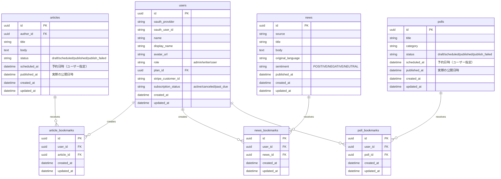

# ブックマーク機能

## 機能概要

記事・ニュース・アンケートをブックマークし、後から簡単にアクセスできるようにする機能。

## 目的

- ユーザーが気に入ったコンテンツを保存できるようにする
- 複数のコンテンツ種別（記事・ニュース・アンケート）を一箇所で管理できるようにする

## 機能条件

### 権限

| ロール | ブックマーク操作 | ブックマーク一覧閲覧 |
|--------|----------------|------------------|
| admin  | ○ | ○ |
| writer | ○ | ○ |
| user   | ○ | ○ |

### 制約事項
🟢 **後回し可**

- ブックマーク数上限: **無制限**
  - ユーザー価値重視の設計
  - 将来的にパフォーマンス問題が発生した場合は上限を検討

## 画面設計図
🟡 **中程度**

**Pencil**: ブックマーク一覧画面は未定義（TBD）

### レイアウト構成（暫定）

```
┌─────────────────────────────────────────────────────────┐
│ ヘッダー                                                 │
│ [戻る] ブックマーク                                    │
├─────────────────────────────────────────────────────────┤
│ [記事(12)] [ニュース(5)] [アンケート(3)]                 │
├─────────────────────────────────────────────────────────┤
│                                                       │
│ ┌─────────────────────────────────────────────────────┐  │
│ │ [ブックマーク解除] 記事タイトル                   │  │
│ │ ジャンルラベル  投稿日時  著者情報                │  │
│ │ 要約文...                                          │  │
│ └─────────────────────────────────────────────────────┘  │
│                                                       │
│ ┌─────────────────────────────────────────────────────┐  │
│ │ [ブックマーク解除] 記事タイトル                   │  │
│ │ ジャンルラベル  投稿日時  著者情報                │  │
│ │ 要約文...                                          │  │
│ └─────────────────────────────────────────────────────┘  │
│                                                       │
│ 空状態メッセージ:                                       │
│ 「ブックマークしたコンテンツがここに表示されます」       │
└─────────────────────────────────────────────────────────┘
```

## 関連テーブル

※ 正: docs/versions/1_0_0/system_datas.md



## フロー図


## シーケンス図

### シーケンス1: ブックマーク操作（記事）


### シーケンス2: ブックマーク一覧取得


## 機能要件
🟡 **中程度**

### 機能要件1: ブックマーク操作（F-08-1）
- 機能仕様1: 記事詳細画面でブックマークボタンを押下でトグル操作
- 機能仕様2: ニュース詳細画面でブックマークボタンを押下でトグル操作
- 機能仕様3: アンケート詳細画面でブックマークボタンを押下でトグル操作
- 機能仕様4: 各詳細画面でブックマーク状態を表示（オン/オフ）

### 機能要件2: ブックマーク一覧表示（F-08-2）
- 機能仕様1: タブ形式で種別を切り替え（記事/ニュース/アンケート）
- 機能仕様2: ブックマーク順（新しい順）で表示
- 機能仕様3: 各ブックマークにタイトル・メタ情報を表示
- 機能仕様4: コンテンツクリックで詳細ページへ遷移
- 機能仕様5: 一覧からブックマーク解除可能
- 機能仕様6: 該当タブにブックマークがない場合、空状態メッセージを表示

## 非機能要件
🟢 **後回し可**

### 非機能要件1: パフォーマンス
- 非機能仕様1: ブックマーク操作レスポンス: 500ms以内
- 非機能仕様2: ブックマーク一覧取得: 1秒以内

### 非機能要件2: UX
- 非機能仕様1: ブックマーク操作は即座にフィードバックを表示
- 非機能仕様2: エラー発生時は適切なエラーメッセージ表示
- 非機能仕様3: オプティミスティックUIで操作感を向上

## ログ
🟢 **後回し可**

### 出力タイミング
- 案1: 全操作時に出力（ブックマーク操作・一覧取得） → 追跡しやすいがログ量増加
- 案2: エラー時のみ出力 → ログ量削減だが正常系追跡困難
- **決定: TBD**

### ログレベル方針
- 案1: INFO中心（ブックマーク操作をINFO） → 詳細追跡可能
- 案2: WARN/ERROR中心（404エラー・取得失敗のみ） → 異常検知に特化
- **決定: TBD**

## ユースケース
🟡 **中程度**

### シナリオ1: 記事をブックマーク（早期決定）
1. ユーザーが記事詳細ページを閲覧
2. ブックマークボタンをクリック
3. ブックマーク状態がオンになる
4. ボタンのアイコンが変化

### シナリオ2: ブックマーク一覧から記事を確認（早期決定）
1. ユーザーがブックマーク一覧にアクセス
2. 記事タブを選択
3. ブックマークした記事一覧が表示される
4. 記事をクリックして詳細ページへ遷移

### シナリオ3: ブックマーク解除（早期決定）
1. ユーザーがブックマーク一覧を閲覧
2. ブックマーク解除ボタンをクリック
3. 該当記事が一覧から消える

### シナリオ4: タブ切り替え（早期決定）
1. ユーザーがブックマーク一覧の記事タブを閲覧
2. ニュースタブをクリック
3. ニュースブックマーク一覧が表示される

## テストケース
🟡 **中程度**

**記載タイミング**: 単体テストは大枠のみ設計段階、詳細はTDD実装時。E2Eテストは実装完了後

### 単体テスト（設計段階は大枠のみ、詳細はTDD実装時に追記）

| テスト項目 | 対応仕様 | 観点 | 期待値 |
|------------|----------|------|--------|
| 記事ブックマーク追加 | 機能要件1/機能仕様1 | 記事詳細画面で未ブックマーク状態でトグル実行 | article_bookmarksにレコード作成、is_bookmarked: true |
| 記事ブックマーク削除 | 機能要件1/機能仕様1 | 記事詳細画面でブックマーク済み状態でトグル実行 | article_bookmarksからレコード削除、is_bookmarked: false |
| ニュースブックマーク追加 | 機能要件1/機能仕様2 | ニュース詳細画面で未ブックマーク状態でトグル実行 | news_bookmarksにレコード作成、is_bookmarked: true |
| ニュースブックマーク削除 | 機能要件1/機能仕様2 | ニュース詳細画面でブックマーク済み状態でトグル実行 | news_bookmarksからレコード削除、is_bookmarked: false |
| アンケートブックマーク追加 | 機能要件1/機能仕様3 | アンケート詳細画面で未ブックマーク状態でトグル実行 | poll_bookmarksにレコード作成、is_bookmarked: true |
| アンケートブックマーク削除 | 機能要件1/機能仕様3 | アンケート詳細画面でブックマーク済み状態でトグル実行 | poll_bookmarksからレコード削除、is_bookmarked: false |
| ブックマーク状態表示 | 機能要件1/機能仕様4 | 各詳細画面でブックマーク状態表示 | オン/オフ状態が正しく表示される |
| ブックマーク一覧取得（記事） | 機能要件2/機能仕様1,2 | タイプ指定で一覧取得 | ブックマーク順で記事一覧が返される |
| ブックマーク一覧取得（ニュース） | 機能要件2/機能仕様1,2 | タイプ指定で一覧取得 | ブックマーク順でニュース一覧が返される |
| ブックマーク一覧取得（アンケート） | 機能要件2/機能仕様1,2 | タイプ指定で一覧取得 | ブックマーク順でアンケート一覧が返される |
| ブックマーク解除（一覧） | 機能要件2/機能仕様5 | 一覧画面から解除実行 | ブックマーク削除、一覧から消える |
| 空状態表示 | 機能要件2/機能仕様6 | ブックマークなしのタブ選択 | 空状態メッセージ表示 |

### E2Eテスト（実装完了後に記載）

| テストシナリオ | 対応仕様 | 観点 | 期待値 |
|----------------|----------|------|--------|
| 記事ブックマークフロー | 機能要件1/機能仕様1 | 記事詳細→ブックマーククリック→状態更新 | TBD（実装完了後に記載） |
| ブックマーク一覧閲覧フロー | 機能要件2/機能仕様1,2,3,5,6 | 一覧アクセス→タブ選択→コンテンツ確認 | TBD（実装完了後に記載） |
| タブ切り替えフロー | 機能要件2/機能仕様1 | 記事タブ→ニュースタブ切り替え | TBD（実装完了後に記載） |

## 影響範囲一覧

### 機能影響範囲

| 関連機能 | 影響内容 |
|----------|----------|
| F-04-5 | 記事詳細画面にブックマークボタン追加 |
| F-05-6 | ニュース詳細画面にブックマークボタン追加（WANT機能） |
| F-06-1 | アンケート詳細・投票画面にブックマークボタン追加 |
| F-08 | ブックマーク機能自身（一覧画面・API） |
| S-16 | ブックマーク一覧画面（新規） |

### コード影響範囲
🟢 **後回し可**

- 案1: フロントエンド（ブックマーク一覧画面・各詳細画面のボタン）＋ バックエンド（ブックマークAPI）
- **決定: 案1を採用（実装時に確定）**

## 作業見積もり

### 見積もりサマリー

| 項目 | ストーリーポイント | 目安時間 |
|------|------------------|----------|
| **合計** | 27sp | 6.75時間 |

**目安**: 4sp = 1時間（実装＋単体テスト＋レビューを含む、あくまで参考値）

### タスク一覧

| タスク | ストーリーポイント | 備考 |
|--------|------------------|------|
| **バックエンド** |||
| DBマイグレーション（3テーブル） | 2 | 同一パターン×3、シンプルな中間テーブル |
| ブックマークトグルAPI（3種類） | 3 | 存在確認→作成/削除のトグルロジック、3種共通パターン |
| ブックマーク一覧取得API | 3 | type別フィルタリング、JOIN、ソート |
| OpenAPI定義更新 | 1 | 4エンドポイント分 |
| **フロントエンド** |||
| ブックマークボタンコンポーネント | 2 | 共通コンポーネント、オン/オフ状態表示 |
| 各詳細画面へのボタン統合（3画面） | 3 | 記事・ニュース・アンケート各詳細画面 |
| ブックマーク一覧画面 | 5 | 新規画面、タブUI、リスト表示、空状態、遷移 |
| オプティミスティックUI | 2 | トグル操作の即時反映 |
| **テスト** |||
| 単体テスト（BE） | 3 | トグルAPI×3種 + 一覧API |
| 単体テスト（FE） | 2 | ボタンコンポーネント + 一覧画面 |
| E2Eテスト | 1 | 実装完了後に記載・実装 |

### リスク要因

- F-05-6（ニュース詳細）がWANT機能のため、スコープ変更の可能性あり
- ブックマーク一覧画面のPencilデザインが未定義（TBD）→ 実装時に画面設計の追加工数が発生する可能性

### 依存関係

- 記事詳細画面（F-04-5）、ニュース詳細画面（F-05-6）、アンケート画面（F-06-1）の実装が先行している必要あり
- ブックマーク一覧画面（S-16）のPencilデザイン確定
