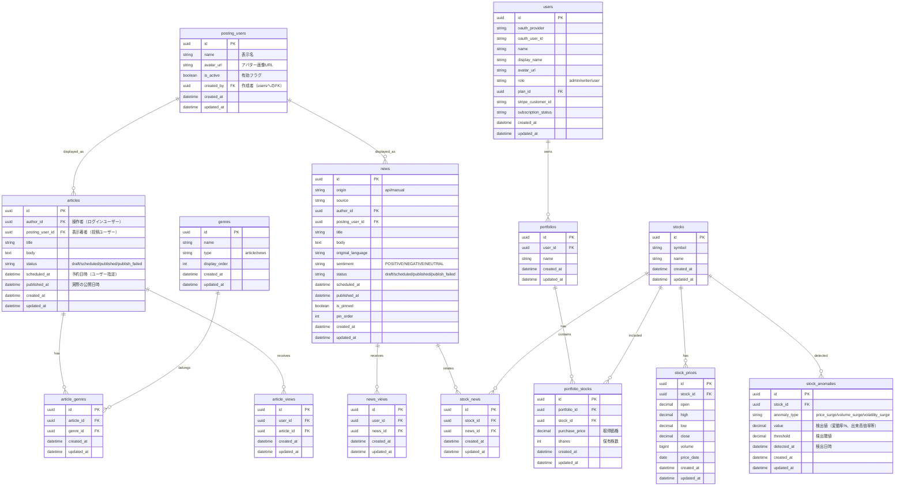

# ダッシュボード

## 機能概要

ログイン後のホーム画面。相場インデックス、人気記事・ニュース、ポートフォリオ、関連ニュース、相場異変レーダーの5つのウィジェットを1画面で提供し、ユーザーが投資に必要な情報を一目で把握できるようにする。

## 目的

- ログイン直後に市場の概況（主要指数の動向）を把握できるようにする（US-01）
- 人気記事・ニュースを素早く発見し、情報収集の起点とする（US-01, US-08）
- ポートフォリオのパフォーマンスと関連ニュースを効率的に確認する（US-04, US-07）
- 市場の異常を早期に検知し、投資判断のきっかけを提供する

## 機能条件

### 権限

| ロール | 閲覧 |
|--------|------|
| admin  | ○ |
| writer | ○ |
| user   | ○ |

### 制約事項

🟢 **後回し可**

- 相場インデックスの更新頻度
  - 案1: リアルタイム（30秒〜2分間隔でポーリング） → ユーザー価値高、APIコスト増
  - 案2: ページロード時のみ取得（キャッシュ5分TTL） → コスト削減、情報鮮度低下
  - **決定: TBD**

## 画面設計図
🟡 **中程度**

Pencil: `docs/versions/1_0_0/SikouLab.pen` ノードID: `AwSoL`

### ウィジェット詳細

**S-02-1: 相場インデックス**
- 表示形式: 3指数（S&P500, NASDAQ, DOW JONES）を横並びで表示
- 各指数の表示項目: 指数名・現在値・前日比変動率・変動方向アイコン（▲/▼）
- 背景色: #F5F5F5（薄いグレー）
- 角丸: 12px
- 高さ: 80px
- パディング: 16px
- ギャップ: 16px（指数間）

**S-02-2: 記事・ニュースハイライト**
- ヘッダー（高さ40px）
- カードグリッド
  - PC表示: 6件
  - モバイル表示: 4件
- 各カードの表示項目: サムネイル、タイトル、日時、ジャンルラベル、コンテンツ種別（記事/ニュース）
- ギャップ: 16px（カード間）

**S-02-3: ポートフォリオウィジェット**
- 背景色: #FFFFFF（白）
- 枠線: #E5E5E5（薄いグレー）
- 角丸: 12px
- パディング: 20px
- 表示項目: 銘柄コード（ティッカー色 #63B7E2）、変動率（色分け: 緑/赤）
- 最大5銘柄まで表示
- 空状態時は「ポートフォリオを作成」CTAを表示

**S-02-4: 関連ニュースウィジェット**
- 背景色: #FFFFFF（白）
- 枠線: #E5E5E5（薄いグレー）
- 角丸: 12px
- パディング: 20px
- 表示項目: タイトル、日時、関連銘柄ティッカー（ティッカー色 #63B7E2）
- 最大5件、日時降順
- 空状態時は空ステータスメッセージを表示

**S-02-5: 相場異常レーダー**
- ヘッダー（高さ40px）
  - 検出件数バッジ（赤 #FFEBEE 背景）
- 検出グリッド
  - カード形式で表示
  - 枠線色: #FFCDD2（赤系）
  - 表示項目: 銘柄コード（ティッカー色 #63B7E2）、異常種別ラベル、検出からの経過時間
- 異常種別:
  - `price_surge`: 異常高騰（+15%以上の価格変動）
  - `volume_surge`: 出来高急増（通常の3倍以上）
  - `volatility_surge`: ボラティリティ急増
- 空状態時は「異常は検出されていません」メッセージを表示

## 関連テーブル

## フロー図
🟡 **中程度**（必要に応じて）

ダッシュボードは読み取り専用の表示画面であり、主要なユーザー操作は各ウィジェットからの遷移のみ。処理フローはシーケンス図で表現しているため、本セクションでは画面内の遷移フローを記載する。

## シーケンス図

### ダッシュボード初回ロード

## 機能要件
🟡 **中程度**

### 機能要件1: 相場インデックス表示（F-02-1）

- 機能仕様1: S&P500、NASDAQ、DOW JONESの3指数を横並びで表示する
  - 表示項目: 指数名、現在値、前日比変動率、変動方向アイコン（▲/▼）
  - 変動方向の色分け: 上昇=緑（`#4CAF50`, bg `#E8F5E9`）、下落=赤（`#F44336`, bg `#FFEBEE`）
- 機能仕様2: 外部株価APIから指数データを取得し、キャッシュする
  - 更新頻度: TBD（制約事項参照）

### 機能要件2: 人気記事・ニュースハイライト表示（F-02-2）

- 機能仕様1: 人気記事3件と人気ニュース3件を混合してカードグリッドで表示する（PC 6件、モバイル 4件）
  - 各カードの表示項目: サムネイル、タイトル、日時、ジャンルラベル、コンテンツ種別（記事/ニュース）
  - 記事の算出ロジック: 指数減衰スコア（HN方式）。詳細は article/home.md 機能要件1を参照
  - ニュースの算出ロジック: View×1pt + 銘柄ポートフォリオ登録数×2pt。詳細は news/home.md 機能要件1を参照
- 機能仕様2: カードクリックで記事詳細（S-04）またはニュース外部URL/詳細ページへ遷移する

### 機能要件3: ポートフォリオウィジェット表示（F-02-3）

- 機能仕様1: デフォルトポートフォリオ（最初に作成されたもの）の銘柄リストを表示する
  - 表示項目: 銘柄コード（ティッカー色 `#63B7E2`）、変動率（色分け: 緑/赤）
  - 最大5銘柄まで表示
- 機能仕様2: ポートフォリオが複数ある場合、ウィジェットヘッダーのポートフォリオ名クリックで切り替え可能
- 機能仕様3: 空状態（ポートフォリオ未作成時）は「ポートフォリオを作成」CTAを表示する
- 機能仕様4: ポートフォリオ詳細データの取得・計算ロジックは portfolio/home.md 機能要件1を参照

### 機能要件4: 関連ニュースウィジェット表示（F-02-4）

- 機能仕様1: ポートフォリオ内銘柄に関連するニュースを最大5件、日時降順で表示する
  - 表示項目: タイトル、日時、関連銘柄ティッカー（ティッカー色 `#63B7E2`）
- 機能仕様2: ポートフォリオ未作成または関連ニュースなし時は空状態メッセージを表示する
- 機能仕様3: ニュースクリックで外部URLまたはニュース詳細ページへ遷移する

### 機能要件5: 相場異常レーダー表示（F-02-5）

- 機能仕様1: 直近24時間以内に検出された異常をカード形式で表示する
  - 表示項目: 銘柄コード（ティッカー色 `#63B7E2`）、異常種別ラベル、検出からの経過時間
  - 異常種別:
    - `price_surge`: 異常高騰（+15%以上の価格変動）
    - `volume_surge`: 出来高急増（通常の3倍以上）
    - `volatility_surge`: ボラティリティ急増
  - カードの枠線色: `#FFCDD2`（赤系）
- 機能仕様2: ヘッダーに検出件数バッジ（赤 `#FFEBEE` 背景）を表示する
- 機能仕様3: 銘柄コードクリックで銘柄詳細（S-10）へ遷移する
- 機能仕様4: 検出なし時は「異常は検出されていません」メッセージを表示する

### 機能要件6: 異常検出バッチ処理

- 機能仕様1: 定期バッチで全市場銘柄を対象に異常を検出し、`stock_anomalies`テーブルに保存する
  - 検出条件:
    - **価格急変（price_surge）**: 前日終値比で±15%以上の変動
    - **出来高急増（volume_surge）**: 直近20日間の平均出来高の3倍以上
    - **ボラティリティ急増（volatility_surge）**: 直近20日間のボラティリティの2倍以上
  - 実行頻度: 株価データ更新時（30秒〜2分間隔）
- 機能仕様2: 24時間以上経過した検出結果は表示対象外とする

## 非機能要件
🟢 **後回し可**

### 非機能要件1: パフォーマンス

- 非機能仕様1: ダッシュボード初回表示は3秒以内（全ウィジェット並列ロード）
- 非機能仕様2: 各ウィジェットはスケルトン表示で独立してロード完了する

### 非機能要件2: キャッシュ戦略

- 非機能仕様1: 市場インデックス → アプリケーションキャッシュ（TTL: TBD）
- 非機能仕様2: 人気記事・ニュース → APIレスポンスキャッシュ（TTL: 5分）
- 非機能仕様3: ポートフォリオデータ → ユーザー単位キャッシュ（TTL: 1分）
- 非機能仕様4: 異常検出 → APIレスポンスキャッシュ（TTL: 1分）

### 非機能要件3: 空状態・エラー

- 非機能仕様1: 各ウィジェットは独立してエラーハンドリングする（1ウィジェットの失敗が他に影響しない）
- 非機能仕様2: エラー時は「データを取得できませんでした」+ リトライボタンを表示

## ログ
🟢 **後回し可**

### 出力タイミング
- 案1: API呼び出し時に全て出力 → 追跡しやすいがログ量増加
- 案2: エラー時のみ出力 → ログ量削減だが正常系追跡困難
- 案3: 重要操作のみ出力（外部API呼び出し・異常検出バッチ起動時） → バランス型
- **決定: TBD**

### ログレベル方針
- 案1: INFO中心 → 詳細追跡可能
- 案2: WARN/ERROR中心 → 異常検知に特化
- **決定: TBD**

## ユースケース
🟡 **中程度**

### シナリオ1: 日常の情報チェック
1. ユーザーがログイン後、ダッシュボードが表示される
2. 相場インデックスで市場全体の動向を確認
3. 人気記事・ニュースから気になるコンテンツをクリック
4. 記事詳細またはニュース外部URLへ遷移

### シナリオ2: ポートフォリオ確認
1. ダッシュボードのポートフォリオウィジェットで保有銘柄の変動率を確認
2. 関連ニュースウィジェットで保有銘柄に関連するニュースを確認
3. 気になるニュースをクリックして詳細を確認

### シナリオ3: 異常検出への対応
1. 相場異常レーダーに赤枠カードが表示されている
2. 銘柄コード（ティッカー）をクリックして銘柄詳細ページへ遷移
3. 銘柄詳細で価格チャートやニュースを確認して投資判断

### シナリオ4: ポートフォリオ未作成ユーザー
1. ダッシュボードが表示される
2. ポートフォリオウィジェットに「ポートフォリオを作成」CTAが表示される
3. 関連ニュースウィジェットに空状態メッセージが表示される
4. CTAをクリックしてポートフォリオ作成フローへ

## テストケース
🟡 **中程度**

**記載タイミング**: 単体テストは大枠のみ設計段階、詳細はTDD実装時。E2Eテストは実装完了後

### 単体テスト（設計段階は大枠のみ、詳細はTDD実装時に追記）

| テスト項目 | 対応仕様 | 観点 | 期待値 |
|------------|----------|------|--------|
| 市場インデックス取得 | 機能要件1/機能仕様1,2 | 3指数のデータ取得 | S&P500, NASDAQ, DOW JONESのデータが返される |
| 市場インデックスキャッシュ | 機能要件1/機能仕様2 | キャッシュ有効期間内の再取得 | キャッシュからデータが返される（外部API未呼出） |
| 人気記事取得 | 機能要件2/機能仕様1 | 72時間以内×指数減衰スコア順 | 人気記事3件が返される |
| 人気ニュース取得 | 機能要件2/機能仕様1 | 24時間以内×スコア順 | 人気ニュース3件が返される |
| ハイライト混合レスポンス | 機能要件2/機能仕様1 | 記事+ニュースの混合 | articles 3件 + news 3件の構造で返される |
| ポートフォリオ一覧取得 | 機能要件3/機能仕様1 | ユーザーのポートフォリオ取得 | パフォーマンス計算済みのポートフォリオ一覧が返される |
| ポートフォリオ空状態 | 機能要件3/機能仕様3 | ポートフォリオ未作成時 | 空配列が返される |
| 関連ニュース取得 | 機能要件4/機能仕様1 | ポートフォリオ銘柄の関連ニュース | 関連ニュース最大5件が日時降順で返される |
| 関連ニュース空状態 | 機能要件4/機能仕様2 | ポートフォリオ未作成時 | 空配列が返される |
| 異常検出取得 | 機能要件5/機能仕様1 | 直近24時間の異常検出 | 検出結果がdetected_at降順で返される |
| 異常検出件数バッジ | 機能要件5/機能仕様2 | total_countの正確性 | 24時間以内の全件数が返される |
| 異常検出空状態 | 機能要件5/機能仕様4 | 検出なし時 | 空配列とtotal_count=0が返される |
| 異常検出バッチ（価格急変） | 機能要件6/機能仕様1 | 前日比±15%以上 | stock_anomaliesにprice_surgeレコード作成 |
| 異常検出バッチ（出来高急増） | 機能要件6/機能仕様1 | 20日平均の3倍以上 | stock_anomaliesにvolume_surgeレコード作成 |
| 異常検出バッチ（ボラ急増） | 機能要件6/機能仕様1 | 20日ボラの2倍以上 | stock_anomaliesにvolatility_surgeレコード作成 |
| 異常検出24時間超過除外 | 機能要件6/機能仕様2 | 24時間以上経過した検出 | 表示対象外となる |

### E2Eテスト（実装完了後に記載）

| テストシナリオ | 対応仕様 | 観点 | 期待値 |
|----------------|----------|------|--------|
| ダッシュボード初回ロード | 全機能要件 | ログイン→ダッシュボード表示→全ウィジェット表示 | TBD（実装完了後に記載） |
| 記事クリック遷移 | 機能要件2/機能仕様2 | 記事カードクリック→記事詳細ページ | TBD（実装完了後に記載） |
| 銘柄クリック遷移 | 機能要件5/機能仕様3 | 異変レーダーのティッカークリック→銘柄詳細 | TBD（実装完了後に記載） |
| ポートフォリオ未作成フロー | 機能要件3/機能仕様3 | CTA表示→クリック→ポートフォリオ作成 | TBD（実装完了後に記載） |

## 影響範囲一覧

### 機能影響範囲

**※ 詳細設計対象の大項目（およびそのサブ機能）を必ず含めること**

| 関連機能 | 影響内容 |
|----------|----------|
| F-01 | 認証後のリダイレクト先（ダッシュボード自身） |
| F-04（article/home.md） | 人気記事算出ロジックを共有（指数減衰スコア） |
| F-05（news/home.md） | トレンドニュース算出ロジックを共有（スコアリング） |
| F-09（portfolio/home.md） | ポートフォリオ一覧API・パフォーマンス計算を共有 |
| F-03-7 | 銘柄詳細への遷移先（異変レーダーから） |
| 共通: サイドバー | サイドバーの共通コンポーネント使用 |
| 共通: ヘッダー | グローバル検索バー・ユーザーエリアの共通コンポーネント使用 |

### コード影響範囲
🟢 **後回し可**

- フロントエンド: ダッシュボードページ、5ウィジェットコンポーネント、共通ヘッダー
- バックエンド: ダッシュボード専用API 3本（market-indices, highlights, portfolio-news, anomalies）、異常検出バッチ
- **決定: TBD**（実装時に確定）

## 作業見積もり

### 見積もりサマリー

| 項目 | ストーリーポイント | 目安時間 |
|------|------------------|----------|
| **合計** | 58-61sp | 14.5-15.25h |

**目安**: 4sp = 1時間（実装＋単体テスト＋レビューを含む、あくまで参考値）

### タスク一覧

| タスク | ストーリーポイント | 備考 |
|--------|------------------|------|
| **バックエンド** |||
| market-indices API（外部API連携+キャッシュ） | 5 | 外部API連携、キャッシュ戦略の不確実性 |
| highlights API（スコア算出+混合レスポンス） | 5 | 指数減衰スコア+ニューススコア計算、複数テーブル結合 |
| portfolio-news API | 3 | ポートフォリオ銘柄の関連ニュース参照 |
| anomalies API | 2 | 24h以内の検出結果フィルタリング |
| 異常検出バッチ（3種類の検出ロジック） | 5-8 | 全銘柄スキャン、price/volume/volatility検出（分割推奨） |
| **フロントエンド** |||
| ダッシュボードページレイアウト | 3 | サイドバー+メインコンテンツ構成 |
| 相場インデックスウィジェット（F-02-1） | 3 | 3指数表示+変動方向の色分けロジック |
| 記事・ニュースハイライトウィジェット（F-02-2） | 5 | カードグリッド+混合コンテンツ+レスポンシブ |
| ポートフォリオウィジェット（F-02-3） | 5 | ポートフォリオ切り替え+空状態+CTA |
| 関連ニュースウィジェット（F-02-4） | 3 | ニュースリスト+空状態 |
| 相場異変レーダーウィジェット（F-02-5） | 3 | カード形式+件数バッジ+枠線色 |
| 各ウィジェットのスケルトン/エラー/リトライ | 3 | 5ウィジェット分の共通処理 |
| **テスト** |||
| 単体テスト | 8 | API 4本+バッチ+ウィジェット5つ |
| E2Eテスト | 5 | 主要4シナリオ |

### リスク要因

- **異常検出バッチのパフォーマンス**: 全市場銘柄スキャンの処理時間・リソース消費
- **外部株価APIのレート制限**: 市場インデックス取得頻度の制約
- **キャッシュ戦略の最適化**: 各ウィジェットのTTL設定が情報鮮度とパフォーマンスに影響

### 依存関係

- 認証機能（F-01）の実装完了が前提
- 株価データ取得バッチ（F-03関連）が稼働している前提
- ニュース取得バッチ（F-05-1）が稼働している前提
- ポートフォリオ機能（F-09）のAPI実装完了が前提
- 記事機能（F-04）の人気記事APIが実装済みである前提
