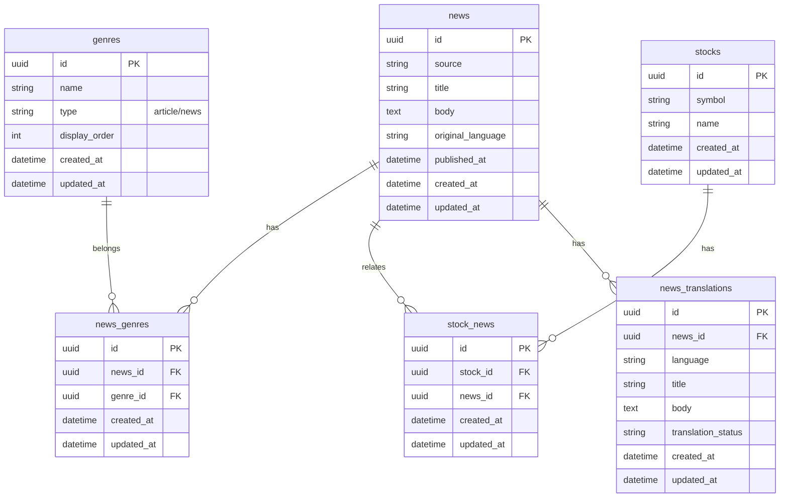
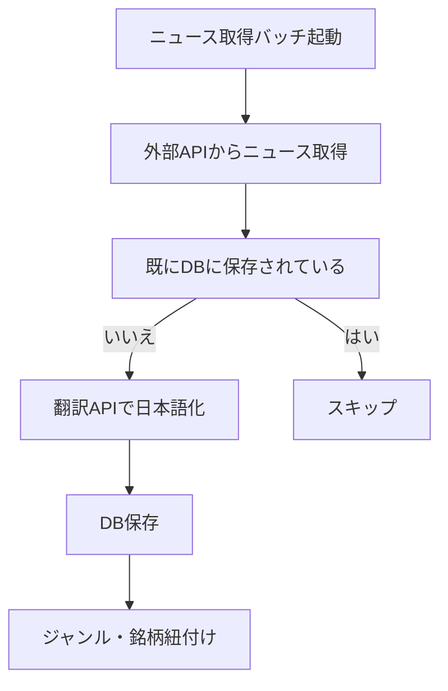
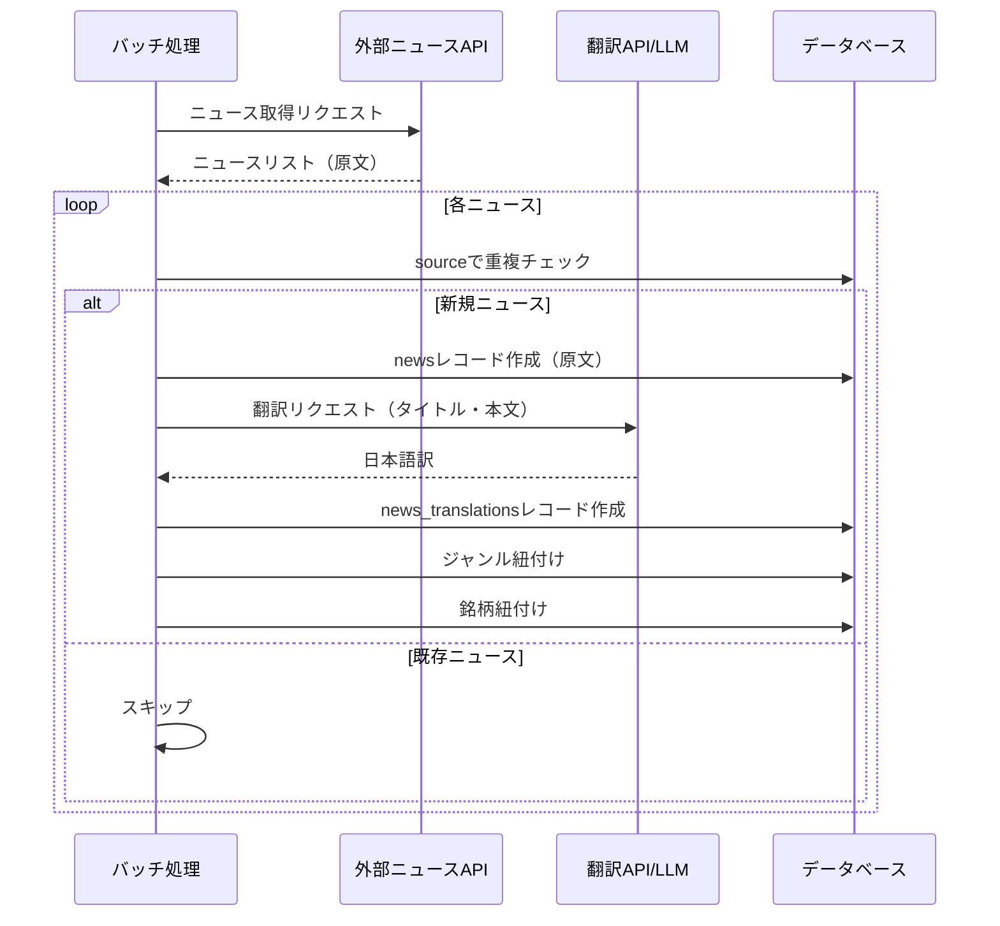

# ニュース自動取得・翻訳

## 機能概要

外部APIから金融ニュースを自動取得し、日本語に翻訳してデータベースに保存するバッチ処理。

## 目的

- 外部APIのニュースを自動収集し、手作業なしで公開する
- 最新の金融ニュースを日本語で迅速に提供する
- 翻訳APIで日本語化し、日本語ユーザーに対応する

## 機能条件

### 制約事項
🟢 **後回し可**

- ニュース取得元API
  - 案1: NewsAPI.org → 無料枠100件/日、有料プランで拡張
  - 案2: Alpha Vantage → 無料枠25件/日、5件/分制限
  - 案3: Finnhub → 無料枠60件/分、APIキー必須
  - **決定: TBD**
  - **補足**: APIによっては既取得ニュースの除外機能が提供される場合があり、その場合はDBでの重複チェックが不要になる可能性あり

- 翻訳API
  - 案1: Google Cloud Translation API → 高品質、従量課金
  - 案2: DeepL API → 高品質、月額枠制限
  - 案3: OpenAI GPT-4 → 文脈理解、コスト高
  - **決定: TBD**

- ニュース取得頻度
  - 案1: 1分ごと → リアルタイム性重視
  - 案2: 3分ごと → コストバランス
  - 案3: 10分ごと → コスト重視
  - **決定: TBD**

- ジャンル・ティッカー紐付けロジック
  - 案1: キーワードマッチング → シンプル
  - 案2: LLMによる分類 → 高精度、コスト高
  - **決定: TBD**

## 関連テーブル

## フロー図

## シーケンス図
🔴 **早期決定**

## 機能要件
🟡 **中程度**

### 機能要件1: ニュース自動取得(F-05-1)

- 機能仕様1: 定期バッチで外部APIからニュースを取得する
- 取得頻度: TBD（1分/3分/10分のいずれか）
- 取得件数: API上限に依存
- 重複チェック: sourceで判定

### 機能要件2: 日本語翻訳(F-05-2)

- 機能仕様1: 取得したニュースを日本語に翻訳する
- 翻訳対象: タイトル・本文
- 翻訳API: TBD（Google/DeepL/GPT-4）
- キャッシュ: 同一URLの翻訳結果を再利用

### 機能要件3: 共通仕様

- 機能仕様1: ジャンル・銘柄の紐付け
- ニュース本文からキーワード抽出し、既存ジャンル・銘柄と紐付け
- 紐付けロジック: TBD

## 非機能要件
🟢 **後回し可**

### 非機能要件1: バッチ処理パフォーマンス
- 非機能仕様1: バッチ処理完了: API取得件数によるが5分以内

### 非機能要件2: 可用性
- 非機能仕様1: 外部API障害時: リトライ、エラーログ記録
- 翻訳API障害時: 原文のまま保存、後で再翻訳

### 非機能要件3: 保守性
- 非機能仕様1: ジャンルの追加・編集が容易な構造
- ニュースソースの追加が容易な構造

## ログ
🟢 **後回し可**

### 出力タイミング
- 案1: 全操作時に出力（ニュース取得・翻訳・紐付け） → 追跡しやすいがログ量増加
- 案2: エラー時のみ出力 → ログ量削減だが正常系追跡困難
- 案3: 重要操作のみ出力（取得成功・エラー） → バランス型
- **決定: TBD**

### ログレベル方針
- 案1: INFO中心（取得成功・バッチ開始/終了） → 詳細追跡可能
- 案2: WARN/ERROR中心 → 異常検知に特化
- 案3: INFO（取得成功）+ WARN（翻訳失敗）+ ERROR（システムエラー） → バランス型
- **決定: TBD**

## ユースケース
🟡 **中程度**

### シナリオ1: バッチ処理成功（早期決定）
1. バッチ処理が定期実行される
2. 外部APIからニュースを取得
3. 重複チェックを行う
4. 新規ニュースを翻訳
5. データベースに保存
6. ジャンル・銘柄を紐付け

### シナリオ2: 外部API障害時（早期決定）
1. バッチ処理が定期実行される
2. 外部APIへの接続に失敗
3. エラーログを記録
4. リトライ処理を実行

## テストケース
🟡 **中程度**

**記載タイミング**: 単体テストは大枠のみ設計段階、詳細はTDD実装時。E2Eテストは実装完了後

### 単体テスト（設計段階は大枠のみ、詳細はTDD実装時に追記）

| テスト項目 | 対応仕様 | 観点 | 期待値 |
|------------|----------|------|--------|
| ニュース取得バッチ | 機能要件1/機能仕様1 | 外部APIからニュースを取得 | ニュースリストが返される |
| 重複チェック | 機能要件1/機能仕様1 | sourceで重複判定 | 既存ニュースはスキップされる |
| 翻訳処理 | 機能要件2/機能仕様1 | タイトル・本文の翻訳 | 日本語訳が返される |
| 翻訳キャッシュ | 機能要件2/機能仕様1 | 同一URLの翻訳結果再利用 | キャッシュされた翻訳が返される |
| ジャンル紐付け | 機能要件3/機能仕様1 | ニュースとジャンルの紐付け | news_genresにレコード作成 |
| 銘柄紐付け | 機能要件3/機能仕様1 | ニュースと銘柄の紐付け | stock_newsにレコード作成 |

### E2Eテスト（実装完了後に記載）

| テストシナリオ | 対応仕様 | 観点 | 期待値 |
|----------------|----------|------|--------|
| バッチ処理フロー | 機能要件1/機能仕様1, 機能要件2/機能仕様1 | 外部API取得→翻訳→DB保存→紐付け | TBD（実装完了後に記載） |

## 影響範囲一覧

### 機能影響範囲
🔴 **早期決定**

| 関連機能 | 影響内容 |
|----------|----------|
| F-05-3 | トレンドニュースのデータソース |
| F-05-4 | ジャンル別ニュースのデータソース |
| F-05-5 | ジャンル詳細ページのデータソース |
| F-02-4 | ダッシュボードの関連ニュースウィジェット |
| F-03-7 | 個別銘柄ページの関連ニュース |
| F-09-2 | ポートフォリオ関連ニュースページ |

### コード影響範囲
🟢 **後回し可**

- バックエンド: ニュース取得バッチ、翻訳処理
- 外部サービス: ニュースAPI、翻訳API
- **決定: TBD**（実装時に確定）

## 作業見積もり

### 見積もりサマリー

| 項目 | ストーリーポイント | 目安時間 |
|------|------------------|----------|
| **合計** | 25-30sp | 約6.25-7.5時間 |

**目安**: 4sp = 1時間（実装＋単体テスト＋レビューを含む、あくまで参考値）

### タスク一覧

| タスク | ストーリーポイント | 備考 |
|--------|------------------|------|
| **バックエンド** |||
| ニュース取得バッチ実装 | 5sp | 外部API連携・エラーハンドリング・リトライ処理 |
| 重複チェック処理 | 2sp | sourceでのDB照合 |
| 翻訳API連携 | 5sp | 外部API連携・キャッシュ処理・翻訳失敗時のフォールバック |
| ジャンル・銘柄紐付けロジック | 3-8sp | 紐付けロジックがTBD（キーワードマッチング or LLM） |
| バッチスケジューラ設定 | 2sp | cron/ジョブスケジューラ設定 |
| **テスト** |||
| 単体テスト | 5sp | APIモック・外部連携テスト・重複チェックテスト |
| E2Eテスト | 3sp | バッチ処理フロー（取得→翻訳→保存→紐付け） |

### リスク要因

- **外部API選定未定**: ニュースAPI・翻訳APIの仕様によって実装工数が変動
- **紐付けロジック未定**: キーワードマッチング（3sp） or LLM（8sp）で大きく変動
- **APIレート制限**: 1分ごとの実行場合、無料枠超過による課金・制限回避の検討が必要
- **翻訳品質**: 翻訳APIの品質によっては後の手動修正作業が発生する可能性

### 依存関係

- ニュースAPI・翻訳APIの選定とアカウント登録
- ジャンル・銘柄マスタデータの登録
- バッチ実行環境（cron/ジョブスケジューラ）の構築
