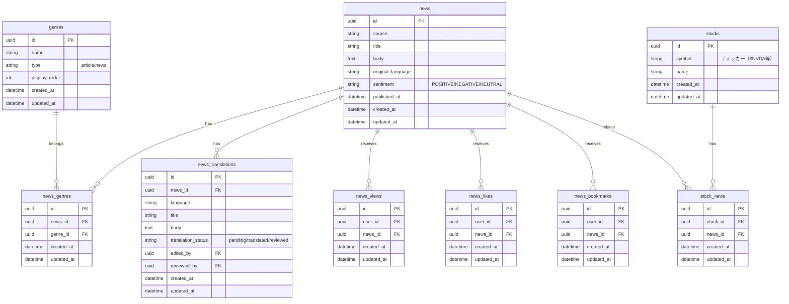
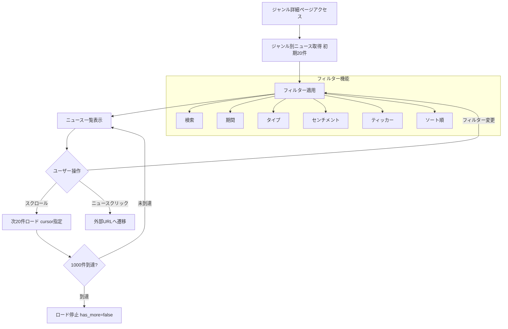
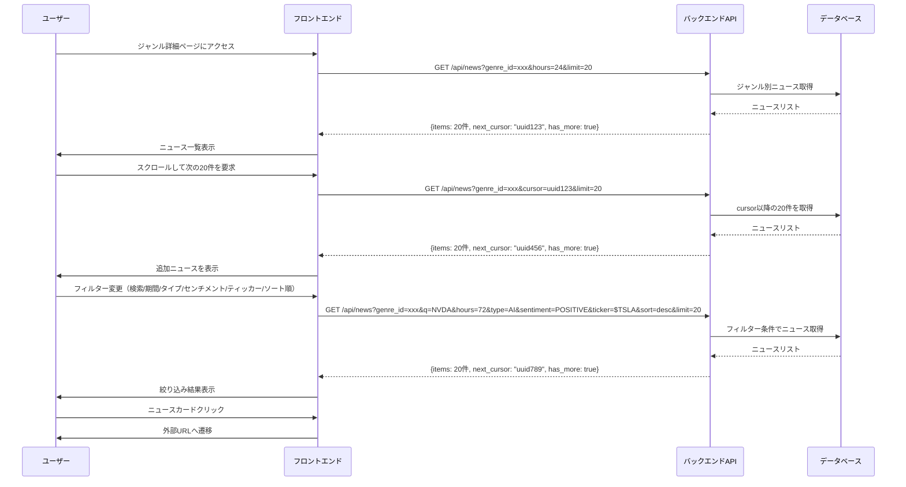

# ジャンル詳細ページ

## 機能概要

特定ジャンルのニュースを一覧表示し、複数フィルター（期間・タイプ・センチメント・ティッカー・検索）とページネーションで閲覧する画面。

## 目的

- 特定ジャンルに興味があるユーザーが、そのジャンルのニュースを網羅的に閲覧できるようにする
- 複数のフィルターを組み合わせて、関心のあるニュースを効率的に絞り込めるようにする

## 機能条件

### 権限

| ロール | 閲覧 |
|--------|------|
| admin  | ○ |
| writer | ○ |
| user   | ○ |

### 制約事項
🟢 **後回し可**

- **決定済み**: ページネーション方式は無限スクロール（記事ホームと統一）

## 画面設計図
🟡 **中程度**

Pencil: 未定義（実装時に確定）

### レイアウト構成

**PC（横並び全展開型）**:
```
┌─────────────────────────────────────────────────────────────────────┐
│ サイドバー  │ メインコンテンツ                                     │
│             │                                                      │
│ ┌────────┐  │ ┌──────────────────────────────────────────────────┐ │
│ │ブランド │  │ │株式市場                                         │ │
│ │ロゴ    │  │ ├──────────────────────────────────────────────────┤ │
│ ├────────┤  │ │[検索...] [24h▼] [All▼] [All▼] [最新順▼] [$___]    │ │
│ │ダッシュ │  │ ├──────────────────────────────────────────────────┤ │
│ │ボード  │  │ │ ┌────────────────────────────────────────────┐   │ │
│ ├────────┤  │ │ │ ニュースカード                            │   │ │
│ │▶ 記事  │  │ │ │ タイトル...                                 │   │ │
│ │├ジャン1│  │ │ │ サマリー...                                 │   │ │
│ │└...   │  │ │ └────────────────────────────────────────────┘   │ │
│ ├────────┤  │ │ ┌────────────────────────────────────────────┐   │ │
│ │▼ ニュース│  │ │ │ ニュースカード2                            │   │ │
│ ├────────┤  │ │ │ タイトル...                                 │   │ │
│ │投票    │  │ │ │ サマリー...                                 │   │ │
│ ├────────┤  │ │ └────────────────────────────────────────────┘   │ │
│ │アバター │  │ │                                                   │ │
│ │ユーザー │  │ │                   （スクロールで続きを表示）        │ │
│ └────────┘  │ └──────────────────────────────────────────────────┘ │
└─────────────────────────────────────────────────────────────────────┘

凡例: [検索]=検索 [24h]=期間 [All]=タイプ [All]=センチメント [最新順]=ソート順 [$___]=ティッカー
```

**モバイル（縦積み全展開型）**:
```
┌─────────────────────────────┐
│ ☰        株式市場          │
├─────────────────────────────┤
│ 検索: [__________________]   │
│ 期間: [24h ▼]                │
│ タイプ: [All ▼]              │
│ センチメント: [All ▼]        │
│ ティッカー: [$_______]        │
├─────────────────────────────┤
│ ┌─────────────────────────┐ │
│ │ ニュースカード           │ │
│ │ タイトル...              │ │
│ │ サマリー...              │ │
│ └─────────────────────────┘ │
│ ┌─────────────────────────┐ │
│ │ ニュースカード2          │ │
│ │ タイトル...              │ │
│ │ サマリー...              │ │
│ └─────────────────────────┘ │
│                             │
│         [次へ]              │
└─────────────────────────────┘
```

### フィルター仕様

| フィルター | 選択肢/仕様 | UI方式 |
|-----------|-------------|--------|
| **検索** | ニュースタイトル、銘柄名、全文検索（OR検索） | テキスト入力 |
| **期間** | 24h, 72h, 1週間, 1ヶ月, 全期間 | ドロップダウン |
| **タイプ** | All（全て）+ ニュースジャンル（株式市場・AI・経済等） | ドロップダウン |
| **センチメント** | All, POSITIVE, NEGATIVE | ドロップダウン |
| **ティッカー** | 複数入力可能（$NVDA等）、完全一致、AND条件、enterで確定 | テキスト入力（タグ形式） |
| **ソート順** | 最新順（降順）、古い順（昇順） | ドロップダウン |

### 無限スクロール仕様

| 項目 | 値 |
|------|-----|
| 1回のロード件数 | 20件 |
| 最大ロード数 | 1000件（50ページ分） |
| 方式 | cursorベース |

## 関連テーブル



## フロー図



## シーケンス図



## 機能要件
🟡 **中程度**

### 機能要件1: ジャンル詳細ページ(F-05-5)

- 機能仕様1: ジャンル別のニュース一覧ページを表示する
- 対象ジャンル: ニュースホームの「もっと見る」から遷移
- デフォルト期間: 直近24時間
- 無限スクロール: cursor方式、初期20件、スクロールで追加20件
- 最大ロード数: 1000件（50ページ分）

- 機能仕様2: 複数フィルターでニュースを絞り込む
- 検索: ニュースタイトル、銘柄名、全文検索（OR検索）
- 期間: 24h, 72h, 1週間, 1ヶ月, 全期間
- タイプ: All（全て）+ ニュースジャンル（株式市場・AI・経済等）
- センチメント: All, POSITIVE, NEGATIVE
- ティッカー: 複数入力可能（$NVDA等）、完全一致、AND条件（全ティッカーに関連するニュースを表示）、enterで確定
- ソート順: 最新順（降順）、古い順（昇順）
- フィルター変更時は自動再取得

- 機能仕様3: ニュースカードから外部URLへ遷移する
- ※ ニュース詳細ページ（F-05-6）はWANT機能

- 機能仕様4: ニュース閲覧時にView数を記録する
- ユーザー単位の重複カウント防止

## 非機能要件
🟢 **後回し可**

### 非機能要件1: ページ表示パフォーマンス
- 非機能仕様1: 初期表示: 3秒以内
- 無限スクロール（追加20件）: 1秒以内
- フィルター変更: 1秒以内

### 非機能要件2: 空状態表示
- 非機能仕様1: ニュースが0件の場合: 空状態表示

### 非機能要件3: 無限スクロールの UX
- 非機能仕様1: スクロール検知: Intersection Observer 使用
- ロード中表示: スピナーまたはスケルトン
- 最大到達時: 「これ以上ニュースはありません」表示

## ログ
🟢 **後回し可**

### 出力タイミング
- 案1: 全View記録時に出力 → 追跡しやすいがログ量増加
- 案2: エラー時のみ出力 → ログ量削減だが正常系追跡困難
- 案3: サンプリングで出力 → バランス型
- **決定: TBD**

### ログレベル方針
- 案1: INFO中心（View記録） → 詳細追跡可能
- 案2: WARN/ERROR中心 → 異常検知に特化
- **決定: TBD**

## ユースケース
🟡 **中程度**

### シナリオ1: ジャンル詳細閲覧（早期決定）
1. ユーザーがニュースホームの「もっと見る」をクリック
2. ジャンル詳細ページへ遷移
3. 該当ジャンルのニュース一覧が表示される（デフォルト24時間、最新順）
4. 期間フィルターを「72時間」に変更
5. 絞り込まれたニュースが表示される
6. ニュースをクリックして外部URLへ遷移

### シナリオ2: 無限スクロール（早期決定）
1. ユーザーがジャンル詳細ページにアクセス
2. 初期20件が表示される
3. スクロールすると、次の20件が自動的に読み込まれる
4. スクロールを続けると、最大1000件まで表示される
5. 1000件到達後は、これ以上読み込まれない

### シナリオ3: 複数フィルター併用（早期決定）
1. ユーザーがジャンル詳細ページにアクセス
2. 検索ボックスに「NVDA」を入力
3. センチメントを「POSITIVE」に変更
4. ソート順を「古い順」に変更
5. ニュースがさらに絞り込まれて表示される

## テストケース
🟡 **中程度**

**記載タイミング**: 単体テストは大枠のみ設計段階、詳細はTDD実装時。E2Eテストは実装完了後

### 単体テスト（設計段階は大枠のみ、詳細はTDD実装時に追記）

| テスト項目 | 対応仕様 | 観点 | 期待値 |
|------------|----------|------|--------|
| ジャンル別ニュース取得 | 機能要件1/機能仕様1 | ジャンルIDでニュース取得 | 該当ジャンルのニュース20件が返される |
| 無限スクロール（初期） | 機能要件1/機能仕様1 | cursorなしで先頭20件取得 | 先頭20件とnext_cursorが返される |
| 無限スクロール（2回目以降） | 機能要件1/機能仕様1 | cursorありで次20件取得 | 次の20件と次のnext_cursorが返される |
| 最大ロード数制限 | 機能要件1/機能仕様1 | 1000件到達時の挙動 | has_more=false、next_cursor=null |
| 検索フィルター | 機能要件1/機能仕様2 | タイトル・銘柄名・全文で検索 | 検索条件に一致するニュースが返される |
| 期間フィルター | 機能要件1/機能仕様2 | 時間条件でニュース絞り込み | 指定期間内のニュースが返される |
| タイプフィルター | 機能要件1/機能仕様2 | ジャンルでニュース絞り込み | 指定ジャンルのニュースが返される |
| センチメントフィルター | 機能要件1/機能仕様2 | センチメントでニュース絞り込み | 指定センチメントのニュースが返される |
| ティッカーフィルター | 機能要件1/機能仕様2 | ティッカーでニュース絞り込み | 指定ティッカーのニュースが返される |
| ソート順フィルター | 機能要件1/機能仕様2 | 最新順/古い順でソート | 指定順序でニュースが返される |
| 複数フィルター併用 | 機能要件1/機能仕様2 | 複数条件でAND検索 | 全フィルター条件を満たすニュースが返される |
| View数記録 | 機能要件1/機能仕様4 | ニュース閲覧時にView記録 | news_viewsにレコード作成 |
| 重複View防止 | 機能要件1/機能仕様4 | 同一ユーザーの重複カウント防止 | 1ユーザー1Viewのみ記録 |

### E2Eテスト（実装完了後に記載）

| テストシナリオ | 対応仕様 | 観点 | 期待値 |
|----------------|----------|------|--------|
| ジャンル詳細フロー | 機能要件1/機能仕様1, 機能要件1/機能仕様2 | 「もっと見る」→ジャンル詳細ページ→期間フィルター | TBD（実装完了後に記載） |
| 無限スクロールフロー | 機能要件1/機能仕様1 | スクロール→追加20件ロード→1000件で停止 | TBD（実装完了後に記載） |
| 複数フィルターフロー | 機能要件1/機能仕様2 | 検索×センチメント×期間×ソート順の併用 | TBD（実装完了後に記載） |

## 影響範囲一覧

### 機能影響範囲

| 関連機能 | 影響内容 |
|----------|----------|
| F-05-4 | ニュースホームの「もっと見る」から遷移 |
| F-05-1 | ニュース取得バッチで作成されたデータを表示 |

### コード影響範囲
🟢 **後回し可**

- フロントエンド: ジャンル詳細ページ、フィルターUI（検索・期間・タイプ・センチメント・ティッカー・ソート順）、無限スクロール（cursor方式、Intersection Observer）
- バックエンド: ジャンル別ニュースAPI（全フィルター対応、cursorベースページネーション、最大1000件制限）
- **決定: TBD**（実装時に確定）

## 作業見積もり

### 見積もりサマリー

| 項目 | ストーリーポイント | 目安時間 |
|------|------------------|----------|
| **合計** | 33-41 | 8.25-10.25時間 |

**目安**: 4sp = 1時間（実装＋単体テスト＋レビューを含む、あくまで参考値）

### タスク一覧

| タスク | ストーリーポイント | 備考 |
|--------|------------------|------|
| **バックエンド** |||
| ジャンル別ニュース取得API実装（cursorベースページネーション） | 5 | cursor方式、next_cursor生成、最大1000件制限 |
| 複数フィルター対応（検索・期間・タイプ・センチメント・ティッカー・ソート順） | 8 | ティッカーのAND条件、全文検索、OR検索、複数条件組み合わせ |
| View数記録API実装 | 2 | 重複カウント防止ロジック |
| **フロントエンド** |||
| ジャンル詳細ページUI実装（レイアウト構成） | 3 | PC横並び・モバイル縦積み対応 |
| 無限スクロール実装（Intersection Observer） | 5 | cursor連携、スピナー表示、最大1000件制御 |
| 6種類フィルターUI実装 | 5-8 | 検索・期間・タイプ・センチメント・ティッカー（タグ入力）・ソート順 |
| 空状態・エラー状態UI | 1 | ニュース0件時の表示 |
| **テスト** |||
| バックエンド単体テスト | 3 | 13項目のテストケース（ページネーション、フィルター、View記録） |
| フロントエンド単体テスト | 1-2 | コンポーネント単体テスト |

### リスク要因

- **ティッカーフィルターのAND条件**: 複数ティッカーの全てに関連するニュースを取得するクエリの複雑さ（JOINとGROUP BY）
- **全文検索のパフォーマンス**: 大量のニュースデータに対する全文検索の性能影響
- **cursorベースページネーションの実装**: next_cursor生成ロジック、ソート順との整合性
- **無限スクロールのUX**: スクロール検知のタイミング、ロード中表示、1000件到達時の挙動
- **E2Eテストの実装**: 実装完了後に詳細設計が必要（現在TBD）

### 依存関係

- **F-05-4（ニュースホーム）**: 「もっと見る」ボタンからの遷移元
- **F-05-1（ニュース取得バッチ）**: 表示するニュースデータの事前取得
- **stocks・stock_newsテーブル**: ティッカーフィルターに必要（未実装の場合は追加作業が発生）
- **sentimentカラム**: センチメントフィルターに必要（既にnewsテーブルに追加済み）

### 備考

- **不確実性の理由（6種類フィルターUI: 5-8sp）**: ティッカーのタグ入力UIの複雑さ、複数フィルターの状態管理、フィルター変更時の再取得制御
- **8sp超タスクの分割判断**: 「複数フィルター対応（8sp）」はバックエンドの中核機能のため分割せず、フロントエンドの「6種類フィルターUI（5-8sp）」は状況に応じて分割を検討
- **E2Eテスト**: 実装完了後に詳細設計・実装が必要（現在見積もり対象外）
