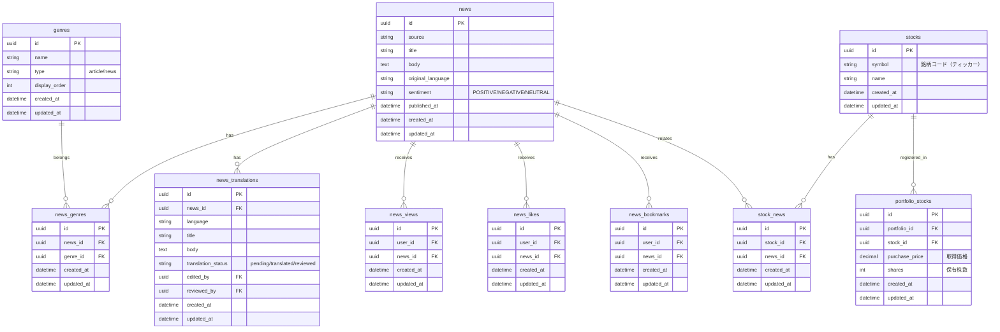

# ニュースホーム画面

## 機能概要

トレンドニュース（直近24時間以内のスコアリング順）とジャンル別ニュースを一画面で閲覧し、関心のあるニュースを素早く発見できる画面。

## 目的

- トレンドニュースで注目情報を素早く発見できるようにする
- ジャンル別にニュースを整理し、興味のあるニュースを効率的に見つけられるようにする

## 機能条件

### 権限

| ロール | 閲覧 |
|--------|------|
| admin  | ○ |
| writer | ○ |
| user   | ○ |

### 制約事項

- なし

## 画面設計図
🟡 **中程度**

Pencil: `docs/versions/1_0_0/SikouLab.pen` ノードID: `HaPem`（サイドバーのみ）

### レイアウト構成（暫定）

```
┌─────────────────────────────────────────────────────────────────────┐
│ サイドバー  │ メインコンテンツ                                     │
│（左端）      │                                                      │
│ ┌────────┐  │ ┌──────────────────────────────────────────────────┐ │
│ │ブランド │  │ │ トレンドニュース（直近24時間）                    │ │
│ │ロゴ    │  │ │ ┌────────────────────────────────────────────┐   │ │
│ ├────────┤  │ │ │ トレンドニュース1（大）                     │   │ │
│ │ダッシュ │  │ │ └────────────────────────────────────────────┘   │ │
│ │ボード  │  │ │ ┌────────┐ ┌────────┐ ┌────────┐              │ │
│ ├────────┤  │ │ │ 2件目  │ │ 3件目  │ │ 4件目  │              │ │
│ │▶ 記事  │  │ │ └────────┘ └────────┘ └────────┘              │ │
│ │├ジャン1│  │ └──────────────────────────────────────────────────┘ │
│ │├ジャン2│  │                                                      │
│ │└...   │  │ ┌──────────────────────────────────────────────────┐ │
│ ├────────┤  │ │ ジャンル別ニュース                                 │ │
│ │▼ ニュース│  │ │ ┌────────────────┐ ┌────────────────┐        │ │
│ ├────────┤  │ │ │ 株式市場（5件）  │ │ AI（5件）       │        │ │
│ │投票    │  │ │ │ ┌────────────┐ │ │ ┌────────────┐ │        │ │
│ ├────────┤  │ │ │ │ 最新1件（大）│ │ │ │ 最新1件（大）│ │        │ │
│ │アバター │  │ │ │ └────────────┘ │ │ │ └────────────┘ │        │ │
│ │ユーザー │  │ │ │ ┌────────────┐ │ │ │ ┌────────────┐ │        │ │
│ ├────────┤  │ │ │ │ 2件目      │ │ │ │ │ 2件目      │ │        │ │
│ │設定    │  │ │ │ └────────────┘ │ │ │ └────────────┘ │        │ │
│ └────────┘  │ │ └────────────────┘ └────────────────┘        │ │
│             │ └──────────────────────────────────────────────────┘ │
└─────────────────────────────────────────────────────────────────────┘
```

## 関連テーブル



※ ニュース取得バッチ関連のテーブル定義は `news/fetch.md` を参照

## フロー図


※ ニュース取得バッチのフローは `news/fetch.md` を参照

## シーケンス図


※ ニュース取得バッチのシーケンスは `news/fetch.md` を参照

## 機能要件
🟡 **中程度**

### 機能要件1: トレンドニュース表示(F-05-3)

- 機能仕様1: 直近24時間以内のニュースをスコアリング順に10個表示する

**スコアリング式**
```
スコア = View数 × 1pt + Σ(各銘柄のポートフォリオ登録数 × 2pt)
```

**用語定義**
- **銘柄紐付け数**: ある銘柄がユーザーのポートフォリオに登録されている数
  - 例: AAPLが80人のポートフォリオに登録されている → 銘柄紐付け数 = 80
  - 例: TSLAが50人のポートフォリオに登録されている → 銘柄紐付け数 = 50

**計算例**
- ニュースにAAPL（80人）とTSLA（50人）が紐づいている場合
  - 銘柄紐付けスコア = 80 × 2pt + 50 × 2pt = **260pt**
  - 合計スコア = View数 × 1pt + 260pt

**表示レイアウト**
- 最新1件を大きく、残り9件を小さく表示

### 機能要件2: ジャンル別ニュース表示(F-05-4)

- 機能仕様1: 3ジャンルで各5件を最新順に表示する
- 初期ジャンル: 株式市場・AI・経済（追加可能）
- 最新1件を大きく、残り4件を小さく表示
- 「もっと見る」クリックでジャンル詳細ページへ遷移

### 機能要件3: 共通仕様

- 機能仕様1: ニュース閲覧時にView数を記録する
- ユーザー単位の重複カウント防止

- 機能仕様2: ニュースカードから外部URLへ遷移する
- ※ ニュース詳細ページ（F-05-6）はWANT機能

## 非機能要件
🟢 **後回し可**

### 非機能要件1: ページ表示パフォーマンス
- 非機能仕様1: ニュースホーム表示: 3秒以内

### 非機能要件2: 空状態表示
- 非機能仕様1: ニュースデータが空の場合: 空状態表示

## ログ
🟢 **後回し可**

### 出力タイミング
- 案1: 全View記録時に出力 → 追跡しやすいがログ量増加
- 案2: エラー時のみ出力 → ログ量削減だが正常系追跡困難
- 案3: サンプリングで出力 → バランス型
- **決定: TBD**

### ログレベル方針
- 案1: INFO中心（View記録） → 詳細追跡可能
- 案2: WARN/ERROR中心 → 異常検知に特化
- **決定: TBD**

## ユースケース
🟡 **中程度**

### シナリオ1: ニュース閲覧（早期決定）
1. ユーザーがニュースホームにアクセス
2. トレンドニュース10件、ジャンル別ニュース各5件が表示される
3. ニュースカードをクリック
4. 外部URLへ遷移

### シナリオ2: ジャンル詳細へ遷移（早期決定）
1. ユーザーがジャンル別セクションの「もっと見る」をクリック
2. ジャンル詳細ページへ遷移

## テストケース
🟡 **中程度**

**記載タイミング**: 単体テストは大枠のみ設計段階、詳細はTDD実装時。E2Eテストは実装完了後

### 単体テスト（設計段階は大枠のみ、詳細はTDD実装時に追記）

| テスト項目 | 対応仕様 | 観点 | 期待値 |
|------------|----------|------|--------|
| トレンドニュース取得 | 機能要件1/機能仕様1 | 24時間以内×スコア順 | トレンドニュース10件が返される |
| ジャンル別ニュース取得 | 機能要件2/機能仕様1 | ジャンル指定でニュース取得 | 各ジャンル5件が返される |
| View数記録 | 機能要件3/機能仕様1 | ニュース閲覧時にView記録 | news_viewsにレコード作成 |
| 重複View防止 | 機能要件3/機能仕様1 | 同一ユーザーの重複カウント防止 | 1ユーザー1Viewのみ記録 |

### E2Eテスト（実装完了後に記載）

| テストシナリオ | 対応仕様 | 観点 | 期待値 |
|----------------|----------|------|--------|
| ニュースホームアクセスフロー | 機能要件1/機能仕様1, 機能要件2/機能仕様1 | ログイン→ニュースホーム表示→トレンド/ジャンル別表示 | TBD（実装完了後に記載） |
| ニュース遷移フロー | 機能要件3/機能仕様2 | ニュースカードクリック→外部URL遷移 | TBD（実装完了後に記載） |

## 影響範囲一覧

### 機能影響範囲

| 関連機能 | 影響内容 |
|----------|----------|
| F-05-1 | ニュース取得バッチで作成されたデータを表示 |
| F-05-5 | 「もっと見る」でジャンル詳細ページへ遷移 |

### コード影響範囲
🟢 **後回し可**

- フロントエンド: ニュースホーム画面、トレンドニュース、ジャンル別ニュース
- バックエンド: トレンドニュースAPI、ジャンル別ニュースAPI
- **決定: TBD**（実装時に確定）

## 作業見積もり

### 見積もりサマリー

| 項目 | ストーリーポイント | 目安時間 |
|------|------------------|----------|
| **合計** | **18sp** | **4.5時間** |

**目安**: 4sp = 1時間（実装＋単体テスト＋レビューを含む、あくまで参考値）

### タスク一覧

| タスク | ストーリーポイント | 備考 |
|--------|------------------|------|
| **バックエンド** |||
| トレンドニュースAPI実装 | 3 | スコアリングロジック（View×1 + 銘柄ポートフォリオ登録数×2）、24時間フィルタ、ソート |
| ジャンル別ニュースAPI実装 | 2 | 3ジャンル各5件、最新順ソート |
| View記録API実装 | 2 | 重複防止（ユーザー単位）、news_viewsテーブルへ登録 |
| **フロントエンド** |||
| ニュースホーム画面実装 | 3 | トレンド/ジャンル別セクション、レスポンシブレイアウト |
| ニュースカードコンポーネント | 2 | サイズバリエーション（大/小）、外部URLリンク |
| View記録連携 | 1 | ニュースクリック時にView記録API呼び出し |
| **テスト** |||
| 単体テスト | 3sp | API・スコアリングロジック・重複防止・コンポーネントの単体テスト |
| E2Eテスト | 2sp | ニュースホーム表示→クリック→遷移フロー |

### リスク要因

- **スコアリング式の複雑さ**: 銘柄ごとのポートフォリオ登録数集計にパフォーマンス要件がある場合、追加対応が必要
- **重複防止ロジック**: ユーザー単位の重複チェックでDB負荷が高まる場合、キャッシュ検討が必要
- **外部URLのバリデーション**: 不正なURLの扱い、セキュリティ考慮

### 依存関係

- ニュース取得バッチ（F-05-1）が先行してデータを作成している前提
- ポートフォリオ機能（F-02）がポートフォリオ登録を管理している前提
