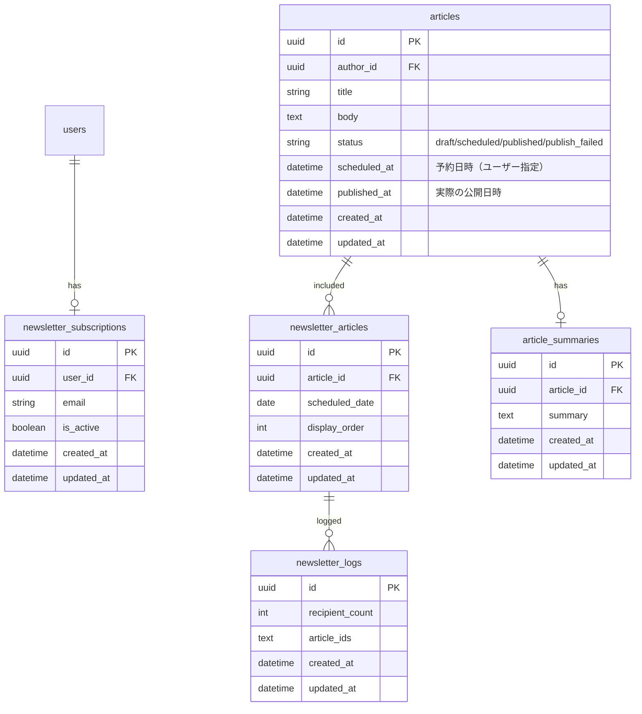
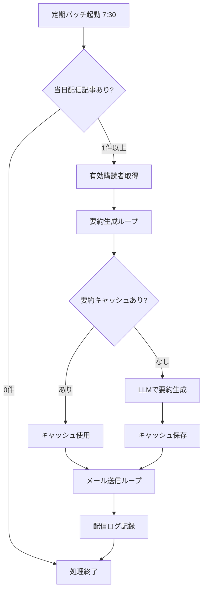
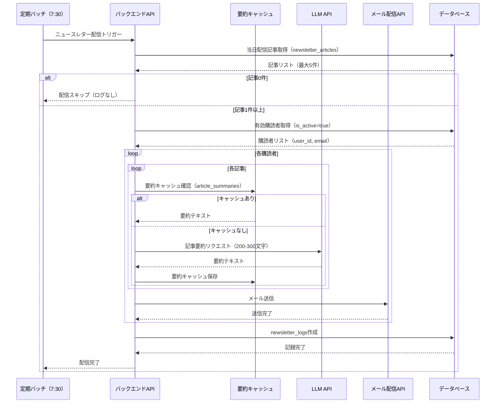

# ニュースレター機能

## 機能概要

メール登録ユーザーに選択した記事の要約を毎日配信（朝7:30）。配信記事0件の場合は送信なし。

## 目的

- ROM専ユーザーが能動的にログインしなくても記事をキャッチアップできる
- 記事を読むことがサービス加入理由であるため、リマインドとして機能する

## 機能条件

### 権限

| ロール | 購読登録/解除 | 配信記事選定 |
|--------|--------------|------------|
| admin  | ○ | ○ |
| writer | ○ | - |
| user   | ○ | - |

### 制約事項

- 1日1回、朝7:30に配信
- 配信記事0件の場合は送信しない
- LLM要約は200-300文字

## 画面設計図

### 配信メールイメージ

**件名**: 【シコウラボ】今日の記事要約（YYYY/MM/DD）

```
┌─────────────────────────────────────────────────────────────────────┐
│                                                                     │
│  ┌──────────────────────────────────────────────────────────────┐  │
│  │                                                              │  │
│  │  📧 シコウラボ ニュースレター                                  │  │
│  │                                                              │  │
│  │  本日の記事要約をお届けします。                                │  │
│  │                                                              │  │
│  ├──────────────────────────────────────────────────────────────┤  │
│  │                                                              │  │
│  │  1. 記事タイトル                                              │  │
│  │     著者名 | 公開日時                                          │  │
│  │     要約: 200-300文字の要約文がここに表示されます...           │  │
│  │     [記事を読む]                                              │  │
│  │                                                              │  │
│  ├──────────────────────────────────────────────────────────────┤  │
│  │                                                              │  │
│  │  2. 記事タイトル                                              │  │
│  │     著者名 | 公開日時                                          │  │
│  │     要約: 200-300文字の要約文がここに表示されます...           │  │
│  │     [記事を読む]                                              │  │
│  │                                                              │  │
│  ├──────────────────────────────────────────────────────────────┤  │
│  │  ...（最大5件まで繰り返し）                                     │  │
│  │                                                              │  │
│  ├──────────────────────────────────────────────────────────────┤  │
│  │                                                              │  │
│  │  購読解除: [解除リンク]                                        │  │
│  │                                                              │  │
│  └──────────────────────────────────────────────────────────────┘  │
│                                                                     │
└─────────────────────────────────────────────────────────────────────┘
```

**配信設定**
- 配信時刻: 毎日朝7:30（JST）
- 最大記事数: 5件
- 配信対象: `is_active=true` の購読者

### ユーザー向け画面
- メールアドレス登録・解除: `F-10-3（設定画面）`を参照

### 管理者画面
- 配信リスト管理・履歴確認: `F-12-3（管理者画面）`を参照

## 関連テーブル



※ 正: `docs/versions/1_0_0/system_datas.md`

## フロー図



## シーケンス図



## 機能要件

### 機能要件1: 記事要約生成(F-11-1)

- 機能仕様1: LLMで記事を200-300文字に要約する
  - 要約文字数: 200-300文字（プロンプトで制御）
  - 入力: タイトル・本文・関連銘柄情報
  - 出力形式: プレーンテキスト

- 機能仕様2: 要約キャッシュを管理する
  - 同じ記事の再要約を避けるため、`article_summaries`テーブルに保存
  - 記事更新時に要約再生成

### 機能要件2: 定期配信(F-11-2)

- 機能仕様1: 毎日朝7:30にバッチ処理を実行する
  - Cron等のスケジューラーで実行
  - タイムゾーン: JST

- 機能仕様2: 当日配信記事を取得する
  - `newsletter_articles`テーブルから`scheduled_date`=当日の記事を取得
  - `display_order`順にソート

- 機能仕様3: 記事0件の場合は送信しない
  - 記事0件の場合、処理をスキップ（ログも残さない）

- 機能仕様4: 有効購読者全員にメールを送信する
  - `newsletter_subscriptions.is_active=true`のユーザー
  - BCC形式または一括送信APIを使用

## 非機能要件
🟢 **後回し可**

### 非機能要件1: 配信パフォーマンス
- 非機能仕様1: 要約生成: 1記事10秒以内
- 非機能仕様2: メール送信: 1000件5分以内

### 非機能要件2: エラーハンドリング
- 非機能仕様1: LLM API障害時: リトライ3回、失敗時は要約なしで配信
- 非機能仕様2: メールAPI障害時: リトライ3回、失敗時はログ記録して継続

### 非機能要件3: プライバシー
- 非機能仕様1: メールアドレスは暗号化して保存
- 非機能仕様2: 配信解除はワンクリックで可能

## ログ
🟢 **後回し可**

### 出力タイミング
- 案1: 配信実行時に全て出力 → 追跡しやすいがログ量増加
- 案2: エラー時のみ出力 → ログ量削減だが正常系追跡困難
- 案3: 重要操作のみ出力（配信開始・完了・エラー） → バランス型
- **決定: TBD**

### ログレベル方針
- 案1: INFO中心（配信記録・要約生成） → 詳細追跡可能
- 案2: WARN/ERROR中心 → 異常検知に特化
- **決定: TBD**

## ユースケース
🟡 **中程度**

### シナリオ1: 定期配信実行（早期決定）
1. 朝7:30にバッチ処理が起動
2. 当日配信記事を取得（3件）
3. 有効購読者を取得（100人）
4. 各記事の要約キャッシュを確認
5. キャッシュがなければLLMで要約生成し、キャッシュに保存
6. 要約を使って購読者全員にメール送信
7. 配信ログを記録

### シナリオ2: 配信記事0件時（早期決定）
1. 朝7:30にバッチ処理が起動
2. 当日配信記事を取得→0件
3. 処理をスキップ（メール不送、ログ不記録）

### シナリオ3: LLM API障害時（TBD）
1. 朝7:30にバッチ処理が起動
2. 要約生成でLLM API呼び出し→エラー
3. リトライ3回→失敗
4. 要約なしでメール配信（本文抜粋を使用）

## テストケース
🟡 **中程度**

**記載タイミング**: 単体テストは大枠のみ設計段階、詳細はTDD実装時。E2Eテストは実装完了後

### 単体テスト（設計段階は大枠のみ、詳細はTDD実装時に追記）

| テスト項目 | 対応仕様 | 観点 | 期待値 |
|------------|----------|------|--------|
| 配信記事取得（当日分） | 機能要件2/機能仕様2 | scheduled_date=当日の記事取得 | 当日の記事リストが返される |
| 配信記事0件時スキップ | 機能要件2/機能仕様3 | 記事0件の場合の処理 | 配信処理がスキップされる |
| LLM要約生成 | 機能要件1/機能仕様1 | 200-300文字の要約生成 | 要約テキストが返される |
| 要約キャッシュ | 機能要件1/機能仕様2 | 同一記事の再要約回避 | キャッシュから要約が返される |
| メール送信 | 機能要件2/機能仕様4 | 有効購読者へのメール送信 | 全員にメールが送信される |
| 配信ログ記録 | 機能要件2/機能仕様1, 機能仕様4 | newsletter_logsへの記録 | 受信者数・記事IDが保存される |

### E2Eテスト（実装完了後に記載）

| テストシナリオ | 対応仕様 | 観点 | 期待値 |
|----------------|----------|------|--------|
| 定期配信フロー | 機能要件2/機能仕様1, 機能仕様2, 機能仕様4 | バッチ起動→要約生成→メール送信→ログ記録 | TBD（実装完了後に記載） |
| 配信記事0件時フロー | 機能要件2/機能仕様3 | バッチ起動→スキップ | TBD（実装完了後に記載） |

## 影響範囲一覧

### 機能影響範囲

| 関連機能 | 影響内容 |
|----------|----------|
| F-04 | 記事データの参照 |
| F-04-1 | 作成された記事の要約生成 |
| F-10-3 | メールアドレス登録・解除（購読管理） |
| F-12-3 | 管理者ページでの配信リスト管理 |

### コード影響範囲
🟢 **後回し可**

- フロントエンド: メールアドレス登録ウィジェット（F-10-3）
- バックエンド: 購読API・配信記事管理API・定期バッチ処理
- **決定: TBD**（実装時に確定）

## 作業見積もり

### 見積もりサマリー

| 項目 | ストーリーポイント | 目安時間 |
|------|------------------|----------|
| **合計** | 25-28sp | 約6.3-7.0時間 |

**目安**: 4sp = 1時間（実装＋単体テスト＋レビューを含む、あくまで参考値）

### タスク一覧

| タスク | ストーリーポイント | 備考 |
|--------|------------------|------|
| **バックエンド** |||
| DBマイグレーション（article_summaries） | 1 | テーブル1つ、他テーブルはF-10-3/F-12-3で作成 |
| LLM要約生成サービス | 5-8 | 外部API連携・プロンプト設計・文字数制御 |
| 要約キャッシュ管理 | 2 | article_summaries CRUD・記事更新時の再生成 |
| 定期バッチ処理（スケジューラー） | 3 | Cron設定・メインロジック・0件スキップ |
| メール送信サービス | 5 | 外部メールAPI連携・HTMLテンプレート・解除リンク |
| 配信ログ記録 | 1 | newsletter_logsへの記録 |
| **テスト** |||
| 単体テスト | 5 | LLM/メールAPIモック・バッチ処理・キャッシュ管理 |
| E2Eテスト | 3 | 定期配信フロー・0件スキップフロー |

### リスク要因

- **LLM API選定・プロンプト設計**: 要約品質の安定化に調整工数が発生する可能性（5→8spの幅）
- **メール配信API選定**: SendGrid/SES等のサービス選定と設定で追加工数の可能性
- **メールテンプレート**: HTML形式のレスポンシブ対応でクロスメーラー検証が必要

### 依存関係

- **F-10-3**（設定画面）: `newsletter_subscriptions`テーブル・購読者データが必要
- **F-12-3**（管理者画面）: `newsletter_articles`・`newsletter_logs`テーブル・配信記事データが必要
- **F-04**（記事機能）: `articles`テーブルの記事データを参照

### 注意事項

- F-10-3・F-12-3・F-04が未実装の場合、本機能の単独実装・テストは不可。実装順序は **F-04 → F-10-3 → F-12-3 → F-11** を推奨
- LLM API・メール配信APIのサービス選定が未確定のため、選定後に見積もりの再評価を推奨
- フロントエンド工数は本見積もりに含まない（F-10-3・F-12-3側で計上）
