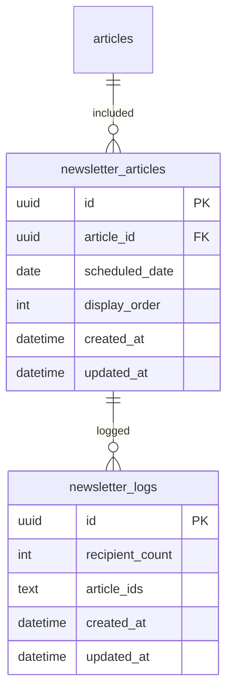
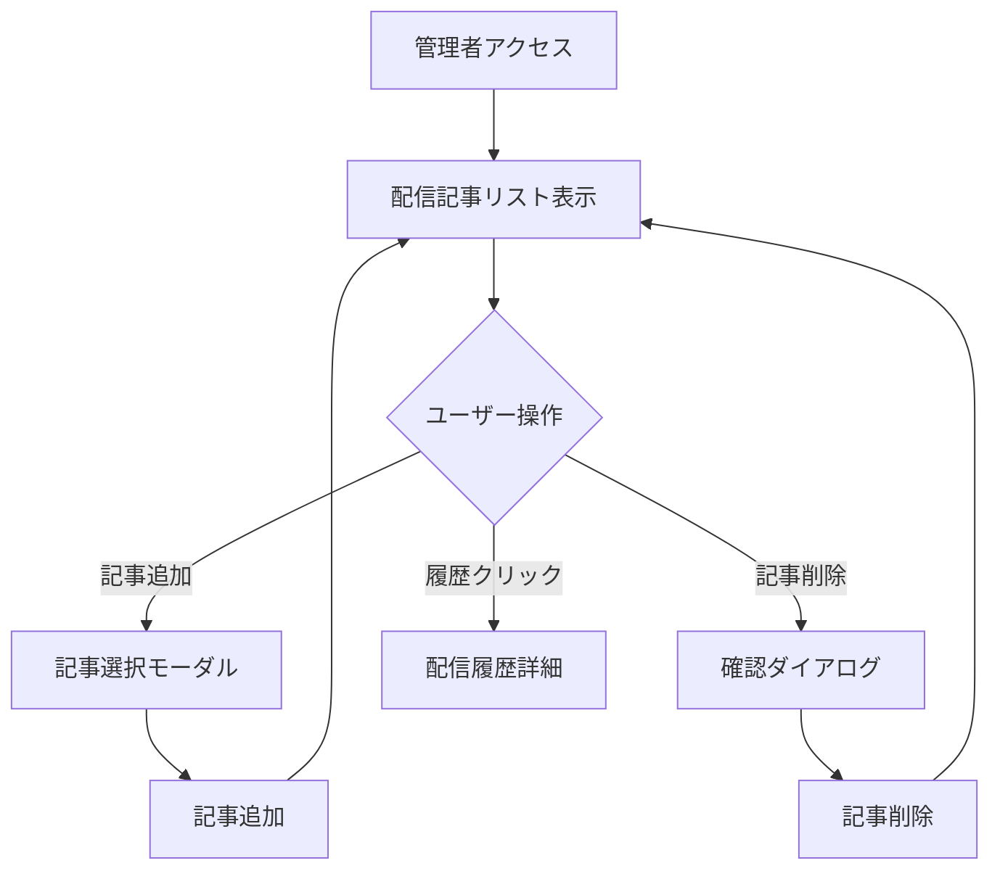
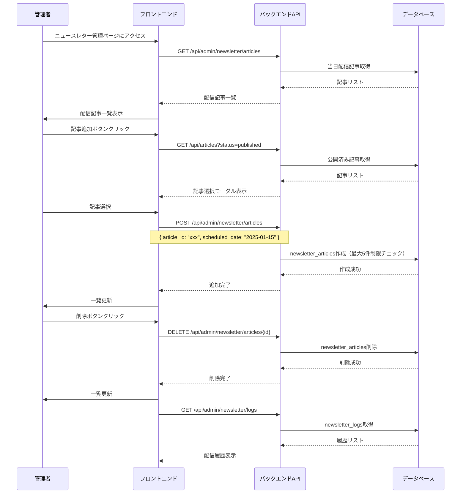

# ニュースレター管理（管理者）

## 機能概要

管理者ページでニュースレターの配信リストを管理（最大5記事）し、配信履歴を確認する機能。記事投稿時のチェックボックスで配信リストに追加可能。

## 目的

- 管理者が効率的に配信記事を選定できるようにする
- 配信履歴を参照し、過去の配信内容を確認できるようにする

## 機能条件

### 権限

| ロール | 閲覧 | 記事追加/削除 | 履歴確認 |
|--------|------|---------------|----------|
| admin  | ○ | ○ | ○ |
| writer | × | × | × |
| user   | × | × | × |

### 制約事項

- 配信記事最大5件
- 同一記事の重複登録不可

## 画面設計図
🟡 **中程度**

※ 管理者ページ（F-12）の一部として実装

### レイアウト構成

```
┌─────────────────────────────────────────────────────────────────────┐
│ サイドバー  │ メインコンテンツ                                     │
│（管理者用）   │                                                      │
│             │ ┌──────────────────────────────────────────────────┐ │
│             │ │ ニュースレター管理                              │ │
│             │ ├──────────────────────────────────────────────────┤ │
│             │ │                                                  │ │
│             │ │ ┌────────────────────────────────────────────┐   │ │
│             │ │ │ 配信記事リスト（当日分）                  │   │ │
│             │ │ │ ┌──────────────────────────────────────┐ │   │ │
│             │ │ │ │ [追加]                      │ │   │ │
│             │ │ │ └──────────────────────────────────────┘ │   │ │
│             │ │ │                                                  │ │
│             │ │ │ ┌──────────────────────────────────────┐ │   │ │
│             │ │ │ │ 1. 記事タイトル            [削除] │ │   │ │
│             │ │ │ │    公開日: 2025-01-15                │ │   │ │
│             │ │ │ └──────────────────────────────────────┘ │   │ │
│             │ │ │ ┌──────────────────────────────────────┐ │   │ │
│             │ │ │ │ 2. 記事タイトル            [削除] │ │   │ │
│             │ │ │ │    公開日: 2025-01-14                │ │   │ │
│             │ │ └──────────────────────────────────────┘ │   │ │
│             │ │                                                  │ │
│             │ │ ┌────────────────────────────────────────────┐ │   │ │
│             │ │ │ 配信履歴                                  │ │   │ │
│             │ │ │ ┌──────────────────────────────────────┐ │   │ │
│             │ │ │ │ 2025-01-15 (3件)  受信者: 120人  │ │   │ │
│             │ │ │ │ 2025-01-14 (2件)  受信者: 118人  │ │   │ │
│             │ │ │ └──────────────────────────────────────┘ │   │ │
│             │ │ └────────────────────────────────────────────┘ │   │ │
│             │ └──────────────────────────────────────────────────┘ │
└─────────────────────────────────────────────────────────────────────┘
```

### 記事作成画面の追加UI

記事作成・編集画面（F-04-1）に以下のチェックボックスを追加：

```
┌─────────────────────────────────────────┐
│ 記事作成                             │
├─────────────────────────────────────────┤
│                                     │
│ タイトル: [________________]          │
│                                     │
│ 本文:                              │
│ [____________________________]        │
│ [____________________________]        │
│                                     │
│ ☑ ニュースレター配信リストに追加    │
│ ☐ 未定                             │
│                                     │
│         [保存] [プレビュー]            │
│                                     │
└─────────────────────────────────────────┘
```

## 関連テーブル
🔴 **早期決定**



※ `articles` テーブルの詳細は `article/home.md` を参照

## フロー図



## シーケンス図



## 機能要件
🟡 **中程度**

### 機能要件1: 配信記事一覧表示(F-12-3)

- 機能仕様1: 当日配信予定の記事を一覧表示する
  - `scheduled_date`=当日の記事を取得
  - `display_order`順にソート

- 機能仕様2: 最大5件まで表示する
  - 5件に達した場合、追加ボタンを無効化

### 機能要件2: 配信記事追加(F-12-3)

- 機能仕様1: 公開済み記事から選択して追加する
  - 記事選択モーダルで記事一覧を表示
  - 検索・フィルタ機能（ジャンル・日付）
  - 過去の記事も追加可能

- 機能仕様2: 最大5件制限を適用する
  - 既存5件の場合は追加不可

- 機能仕様3: 同一記事の重複登録を禁止する
  - `article_id`のユニークチェック

- 機能仕様4: 記事作成時のチェックボックスで追加する
  - 記事作成・編集画面に「ニュースレター配信リストに追加」チェックボックス
  - チェック時、当日の`newsletter_articles`に自動追加

### 機能要件3: 配信記事削除(F-12-3)

- 機能仕様1: 記事を削除する
  - 確認ダイアログ付き

### 機能要件4: 配信履歴確認(F-12-3)

- 機能仕様1: 過去の配信履歴を一覧表示する
  - `newsletter_logs`から取得（新しい順）
  - 表示項目: 配信日時・記事数・受信者数

- 機能仕様2: 履歴詳細を表示する
  - クリックで配信された記事IDを確認可能

### 機能要件5: 表示順変更(F-12-3)

- 機能仕様1: ドラッグ＆ドロップで表示順を変更する
  - `display_order`を更新

## 非機能要件
🟢 **後回し可**

### 非機能要件1: 操作パフォーマンス
- 非機能仕様1: 記事追加・削除: 1秒以内

### 非機能要件2: バリデーション
- 非機能仕様1: 最大5件超過時のエラーメッセージ表示
- 非機能仕様2: 重複登録時のエラーメッセージ表示

## ログ
🟢 **後回し可**

### 出力タイミング
- 案1: 全操作時に出力（追加・削除・表示順変更） → 追跡しやすいがログ量増加
- 案2: エラー時のみ出力 → ログ量削減だが正常系追跡困難
- **決定: TBD**

### ログレベル方針
- 案1: INFO中心（管理者操作記録） → 詳細追跡可能
- 案2: WARN/ERROR中心 → 異常検知に特化
- **決定: TBD**

## ユースケース
🟡 **中程度**

### シナリオ1: 配信記事追加（早期決定）
1. 管理者がニュースレター管理ページにアクセス
2. 「追加」ボタンをクリック
3. 記事選択モーダルが表示される（過去の記事も選択可能）
4. 配信したい記事を選択
5. 配信記事リストに追加される

### シナリオ2: 記事作成時の追加（早期決定）
1. 管理者が記事を作成
2. 「ニュースレター配信リストに追加」にチェック
3. 記事を保存
4. 自動的に当日の配信リストに追加される

### シナリオ3: 配信記事削除（早期決定）
1. 管理者が配信記事一覧を表示
2. 削除ボタンをクリック
3. 確認ダイアログで「OK」
4. 記事がリストから削除される

### シナリオ4: 配信履歴確認（早期決定）
1. 管理者が配信履歴セクションを確認
2. 過去の配信日時・記事数・受信者数が表示される

## テストケース
🟡 **中程度**

**記載タイミング**: 単体テストは大枠のみ設計段階、詳細はTDD実装時。E2Eテストは実装完了後

### 単体テスト（設計段階は大枠のみ、詳細はTDD実装時に追記）

| テスト項目 | 対応仕様 | 観点 | 期待値 |
|------------|----------|------|--------|
| 配信記事一覧取得 | 機能要件1/機能仕様1 | 当日配信記事の取得 | 当日の記事リストが返される |
| 配信記事追加 | 機能要件2/機能仕様1, 機能仕様2 | 記事の追加・5件制限 | 記事が追加される |
| 重複登録禁止 | 機能要件2/機能仕様3 | 同一記事の2重登録 | 409エラーが返される |
| 配信記事削除 | 機能要件3/機能仕様1 | 記事の削除 | 削除が成功する |
| 配信履歴取得 | 機能要件4/機能仕様1 | 履歴の取得 | 履歴リストが返される |
| 表示順変更 | 機能要件5/機能仕様1 | display_orderの更新 | 順序が更新される |

### E2Eテスト（実装完了後に記載）

| テストシナリオ | 対応仕様 | 観点 | 期待値 |
|----------------|----------|------|--------|
| 配信記事追加フロー | 機能要件2/機能仕様1, 機能仕様2 | 追加ボタン→記事選択→一覧更新 | TBD（実装完了後に記載） |
| 重複登録エラー | 機能要件2/機能仕様3 | 同一記事の2回目追加 | TBD（実装完了後に記載） |
| 配信履歴確認フロー | 機能要件4/機能仕様1 | 履歴セクション表示 | TBD（実装完了後に記載） |

## 影響範囲一覧

### 機能影響範囲

| 関連機能 | 影響内容 |
|----------|----------|
| F-04 | 記事作成画面にチェックボックス追加 |
| F-04-1 | 記事作成・編集機能との連携 |
| F-11 | 配信記事リストの管理対象 |
| F-11-2 | 定期配信バッチのデータソース |
| F-12 | 管理者ページの一部として実装 |

### コード影響範囲
🟢 **後回し可**

- フロントエンド: 管理者ページ・記事作成画面
- バックエンド: 配信記事管理API・履歴取得API
- **決定: TBD**（実装時に確定）

## 作業見積もり

### 見積もりサマリー

| 項目 | ストーリーポイント | 目安時間 |
|------|------------------|----------|
| **合計** | 32sp | 約8時間 |

**目安**: 4sp = 1時間（実装＋単体テスト＋レビューを含む、あくまで参考値）

### タスク一覧

| タスク | ストーリーポイント | 備考 |
|--------|------------------|------|
| **バックエンド** | **11sp** ||
| DBマイグレーション（newsletter_articles, newsletter_logs） | 1sp | テーブル2つ新規作成（定義済み） |
| 配信記事一覧取得API（GET） | 2sp | scheduled_date=当日フィルタ、display_order順ソート |
| 配信記事追加API（POST） | 3sp | 5件制限チェック・重複チェック（標準的なバリデーション） |
| 配信記事削除API（DELETE） | 1sp | 標準的なCRUD削除 |
| 配信履歴取得API（GET） | 2sp | 標準的なリスト取得 |
| 表示順変更API（PUT） | 2sp | display_orderの一括更新 |
| **フロントエンド** | **13sp** ||
| ニュースレター管理ページ（配信記事リスト表示） | 3sp | 管理者ページ(F-12)内の新規セクション |
| 記事選択モーダル（検索・フィルタ機能） | 3sp | 既存記事一覧UIを流用可能 |
| ドラッグ＆ドロップ並び替え | 3sp | 最大5件のため軽量実装で十分 |
| 配信履歴セクション | 2sp | 読み取り専用リスト表示 |
| 記事作成画面チェックボックス追加（F-04連携） | 2sp | 既存フォームへのチェックボックス1つ追加 |
| **テスト** | **8sp** ||
| バックエンド単体テスト | 3sp | 標準CRUD＋バリデーションテスト |
| フロントエンド単体テスト | 2sp | コンポーネント・状態管理テスト |
| E2Eテスト | 3sp | 追加・削除・履歴確認の主要フロー |

### リスク要因

- **F-04連携**: 記事作成画面の既存実装状況により影響範囲が変動
- **記事選択モーダル**: 既存UIの流用度合いにより工数変動の可能性

### 依存関係

- F-04（記事作成・編集）: チェックボックス追加のため記事作成画面の実装が前提
- F-12（管理者ページ）: 管理者ページフレームワークの実装が前提
- F-11（ニュースレター配信）: newsletter_articlesテーブルを共有
