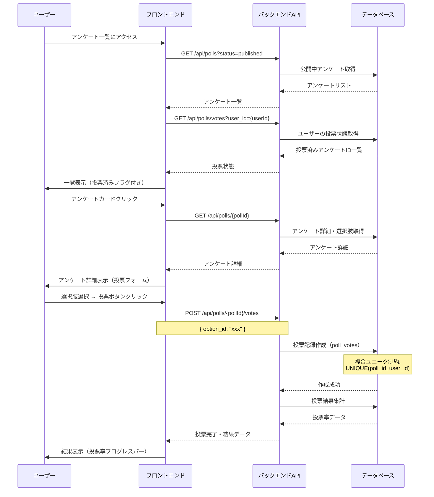

# アンケート機能

## 機能概要

ユーザーが最大9択のアンケートに1回投票できる機能。投票結果は選択肢別の投票率で表示される。

## 目的

- ユーザー参加型コンテンツを提供し、コミュニティ活性化を図る
- 投票結果を集計・可視化し、ユーザー意識の傾向を把握する

## 機能条件

### 権限

| ロール | 閲覧 | 投票 | ブックマーク |
|--------|------|------|--------------|
| admin  | ○ | ○ | ○ |
| writer | ○ | ○ | ○ |
| user   | ○ | ○ | ○ |

### 制約事項

- 1ユーザー1アンケート1回投票（`poll_votes`テーブルの複合ユニーク制約で保証）
- 最大9択まで（`poll_options`のレコード数で制御）
- 投票後は結果表示（投票率）に切り替わる

## 画面設計図
🟡 **中程度**

Pencil: `docs/versions/1_0_0/SikouLab.pen` ノードID: `OruNZ`

### S-14 アンケート一覧画面

**構成要素**
- サイドバー（共通コンポーネント）
- ヘッダー: 「アンケート」タイトル
- メインコンテンツ: アンケートカード一覧（グリッドレイアウト）

**アンケートカードの表示項目**
- サムネイル画像
- タイトル
- カテゴリ（ラベル表示）
- 公開日

**レイアウト構成**
```
┌─────────────────────────────────────────────────────────────────────┐
│ サイドバー  │ メインコンテンツ                                     │
│（共通）     │                                                      │
│             │ ┌──────────────────────────────────────────────────┐ │
│             │ │ アンケート                                      │ │
│             │ ├──────────────────────────────────────────────────┤ │
│             │ │                                                  │ │
│             │ │ ┌──────────┐ ┌──────────┐ ┌──────────┐          │ │
│             │ │ │[サムネイル]│ │[サムネイル]│ │[サムネイル]│          │ │
│             │ │ │          │ │          │ │          │          │ │
│             │ │ │ タイトル │ │ タイトル │ │ タイトル │          │ │
│             │ │ │ カテゴリ │ │ カテゴリ │ │ カテゴリ │          │ │
│             │ │ │ 公開日   │ │ 公開日   │ │ 公開日   │          │ │
│             │ │ └──────────┘ └──────────┘ └──────────┘          │ │
│             │ │                                                  │ │
│             │ │ ┌──────────┐ ┌──────────┐ ┌──────────┐          │ │
│             │ │ │[サムネイル]│ │[サムネイル]│ │[サムネイル]│          │ │
│             │ │ │          │ │          │ │          │          │ │
│             │ │ │ タイトル │ │ タイトル │ │ タイトル │          │ │
│             │ │ │ カテゴリ │ │ カテゴリ │ │ カテゴリ │          │ │
│             │ │ │ 公開日   │ │ 公開日   │ │ 公開日   │          │ │
│             │ │ └──────────┘ └──────────┘ └──────────┘          │ │
│             │ └──────────────────────────────────────────────────┘ │
└─────────────────────────────────────────────────────────────────────┘
```

**カード詳細構成（1カード）**
```
┌──────────────────┐
│  [サムネイル画像]  │  またはアイコン/プレースホルダー
├──────────────────┤
│ アンケートタイトル │
│ [カテゴリ] 公開日  │
└──────────────────┘
```

### S-15 アンケート詳細・投票画面（未定義）

**投票前（未投票状態）**
```
┌─────────────────────────────────────────┐
│ アンケートタイトル                       │
│ カテゴリ | 公開日                        │
├─────────────────────────────────────────┤
│                                         │
│ ○ 選択肢1                               │
│ ○ 選択肢2                               │
│ ○ 選択肢3                               │
│ ○ 選択肢4                               │
│                                         │
│         [投票する]                       │
│                                         │
└─────────────────────────────────────────┘
```

**投票後（結果表示）**
```
┌─────────────────────────────────────────┐
│ アンケートタイトル                       │
│ カテゴリ | 公開日                        │
├─────────────────────────────────────────┤
│                                         │
│ ● 選択肢1  40%  ████████░░              │
│ ○ 選択肢2  30%  ██████░░░░              │
│ ○ 選択肢3  20%  ████░░░░░░              │
│ ○ 選択肢4  10%  ██░░░░░░░░              │
│                                         │
│         投票完了                         │
│        総投票数: 100票                   │
│                                         │
└─────────────────────────────────────────┘
```

## 関連テーブル


※ ブックマーク機能（F-08）の詳細は `bookmark/home.md` を参照

## フロー図
🟡 **中程度**


## シーケンス図



## 機能要件
🟡 **中程度**

### 機能要件1: アンケート一覧表示(F-06)

- 機能仕様1: 公開中のアンケートをカード形式で一覧表示する
  - 表示項目: タイトル・カテゴリ・公開日
  - ソート順: 公開日降順（最新順）
  - カード状態: 未投票は「投票する」、投票済みは「投票済み」ラベル

- 機能仕様2: ユーザーの投票状態を一覧画面で識別する
  - 投票済みの場合、カードに「投票済み」ラベルを表示
  - 未投票の場合、「投票する」ボタンを表示

### 機能要件2: アンケート投票実行(F-06-1)

- 機能仕様1: アンケート詳細画面で選択肢を表示する
  - 最大9択まで表示
  - 選択肢はラジオボタン形式で単一選択

- 機能仕様2: 投票実行時に選択肢を記録する
  - 1ユーザー1アンケート1回投票（重複投票禁止）
  - 投票時に`poll_votes`テーブルにレコード作成
  - 複合ユニーク制約`UNIQUE(poll_id, user_id)`でデータベースレベルで保証

- 機能仕様3: 投票完了後に結果表示に切り替える
  - 投票後に投票率を計算して表示
  - 自分が投票した選択肢をハイライト表示
  - 総投票数も表示

### 機能要件3: 投票結果表示(F-06-1)

- 機能仕様1: 選択肢別の投票率を計算・表示する
  - 投票率 = 選択肢の投票数 / 総投票数 × 100%
  - プログレスバーで視覚的に表現

- 機能仕様2: 投票済みユーザーの場合、結果を即時表示する
  - アンケート詳細アクセス時に投票状態を確認
  - 投票済みの場合、投票フォームではなく結果表示

## 非機能要件
🟢 **後回し可**

### 非機能要件1: ページ表示パフォーマンス
- 非機能仕様1: アンケート一覧表示: 2秒以内
- 非機能仕様2: 投票実行〜結果表示: 1秒以内

### 非機能要件2: 空状態表示
- 非機能仕様1: アンケートデータが空の場合: 空状態表示
- 非機能仕様2: 投票結果が0票の場合: 0%として表示

### 非機能要件3: 同時実行性
- 案1: 楽観的ロック（versionカラム） → 簡単実装だが競合で再试行必要
- 案2: 悲観的ロック（SELECT FOR UPDATE） → 整合性保証だがDB負荷増加
- 案3: 複合ユニーク制約のみ → 今回採用（DBレベルで重複防止）
- **決定: 案3**

## ログ
🟢 **後回し可**

### 出力タイミング
- 案1: 全投票記録時に出力 → 追跡しやすいがログ量増加
- 案2: エラー時のみ出力 → ログ量削減だが正常系追跡困難
- 案3: サンプリングで出力 → バランス型
- **決定: TBD**

### ログレベル方針
- 案1: INFO中心（投票記録） → 詳細追跡可能
- 案2: WARN/ERROR中心 → 異常検知に特化
- **決定: TBD**

## ユースケース
🟡 **中程度**

### シナリオ1: アンケート投票（早期決定）
1. ユーザーがアンケート一覧にアクセス
2. 公開中アンケートがカード形式で表示される
3. 未投票のアンケートを選択してクリック
4. アンケート詳細画面で選択肢が表示される
5. 選択肢を選択して「投票する」ボタンをクリック
6. 投票が完了し、結果（投票率）が表示される
7. 一覧に戻ると、該当アンケートが「投票済み」表示になる

### シナリオ2: 投票済みアンケートの結果確認（早期決定）
1. ユーザーがアンケート一覧にアクセス
2. 投票済みのアンケートカードをクリック
3. アンケート詳細画面で結果（投票率）が即時表示される
4. 自分が投票した選択肢がハイライト表示される

## テストケース
🟡 **中程度**

**記載タイミング**: 単体テストは大枠のみ設計段階、詳細はTDD実装時。E2Eテストは実装完了後

### 単体テスト（設計段階は大枠のみ、詳細はTDD実装時に追記）

| テスト項目 | 対応仕様 | 観点 | 期待値 |
|------------|----------|------|--------|
| アンケート一覧取得 | 機能要件1/機能仕様1 | 公開中アンケートが取得できる | status=publishedのアンケートが返される |
| ユーザー投票状態確認 | 機能要件1/機能仕様2 | ユーザーの投票済みアンケートを特定 | poll_votesに存在するpoll_id一覧が返される |
| 投票実行（正常系） | 機能要件2/機能仕様2 | poll_votesにレコードが作成される | 投票記録が作成され、結果が返される |
| 重複投票禁止 | 機能要件2/機能仕様2 | 2回目の投票はエラーになる | 複合ユニーク制約違反で409エラー |
| 投票率計算 | 機能要件3/機能仕様1 | 各選択肢の投票率が正しく計算される | 投票数/総数×100のパーセンテージが返される |
| 最大9択制限 | 機能要件2/機能仕様1 | 選択肢が9個以下の場合のみ投票可能 | 10個以上の場合はバリデーションエラー |

### E2Eテスト（実装完了後に記載）

| テストシナリオ | 対応仕様 | 観点 | 期待値 |
|----------------|----------|------|--------|
| アンケート投票フロー | 機能要件2/機能仕様2, 機能要件3/機能仕様1 | 一覧→詳細→投票→結果表示 | TBD（実装完了後に記載） |
| 投票済みアンケート結果表示 | 機能要件3/機能仕様2 | 一覧→詳細→結果即時表示 | TBD（実装完了後に記載） |
| 重複投票エラー | 機能要件2/機能仕様2 | 2回目の投票がブロックされる | TBD（実装完了後に記載） |

## 影響範囲一覧

### 機能影響範囲

| 関連機能 | 影響内容 |
|----------|----------|
| F-06 | 本機能自身 |
| F-06-1 | アンケート投票画面（詳細機能） |
| F-08 | ブックマーク機能（poll_bookmarksテーブル） |
| F-12-1-3 | 管理者ページのアンケート管理（作成・編集・削除・予約投稿） |

### コード影響範囲
🟢 **後回し可**

- フロントエンド: アンケート一覧画面、アンケート詳細画面
- バックエンド: アンケートAPI、投票API、結果集計API
- **決定: TBD**（実装時に確定）

## 作業見積もり

### 見積もりサマリー

| 項目 | ストーリーポイント | 目安時間 |
|------|------------------|----------|
| **合計** | 27-30sp | 6.75-7.5時間 |

**目安**: 4sp = 1時間（実装＋単体テスト＋レビューを含む、あくまで参考値）

### タスク一覧

| タスク | ストーリーポイント | 備考 |
|--------|------------------|------|
| **バックエンド** |||
| DBマイグレーション（polls, poll_options, poll_votes, poll_bookmarks） | 1 | スキーマ定義済み・既存パターン流用 |
| GET /api/polls（一覧取得・ステータスフィルタ） | 3 | 新規ドメイン初期構築コスト含む |
| GET /api/polls/votes（ユーザー投票状態取得） | 1 | 単純なクエリ |
| GET /api/polls/{pollId}（詳細・選択肢取得） | 2 | poll_optionsとのJOIN |
| POST /api/polls/{pollId}/votes（投票実行＋結果計算） | 5 | バリデーション・エラー処理・集計ロジック |
| **フロントエンド** |||
| アンケート一覧画面（カードグリッド・投票状態表示） | 3 | カードコンポーネント・状態ラベル |
| アンケート詳細・投票画面（ラジオボタン・投票実行） | 3 | フォーム制御・API連携 |
| 投票結果表示（プログレスバー・ハイライト） | 3 | 投票率可視化・状態切替 |
| **テスト** |||
| 単体テスト | 3-5 | API（一覧・詳細・投票・重複・計算）＋FEコンポーネント |
| E2Eテスト | 3 | 投票フロー・結果表示・重複投票ブロック |

### リスク要因

- 投票率計算の端数処理: 合計100%にならないケースの表示方針が未定義
- 同時投票時のパフォーマンス: 大量同時アクセス時のDB負荷（現時点ではユニーク制約のみで対応）

### 依存関係

- F-08 ブックマーク機能: poll_bookmarksテーブルの実装タイミング調整
- F-12-1-3 管理者アンケート管理: アンケート作成・編集APIは本機能スコープ外
