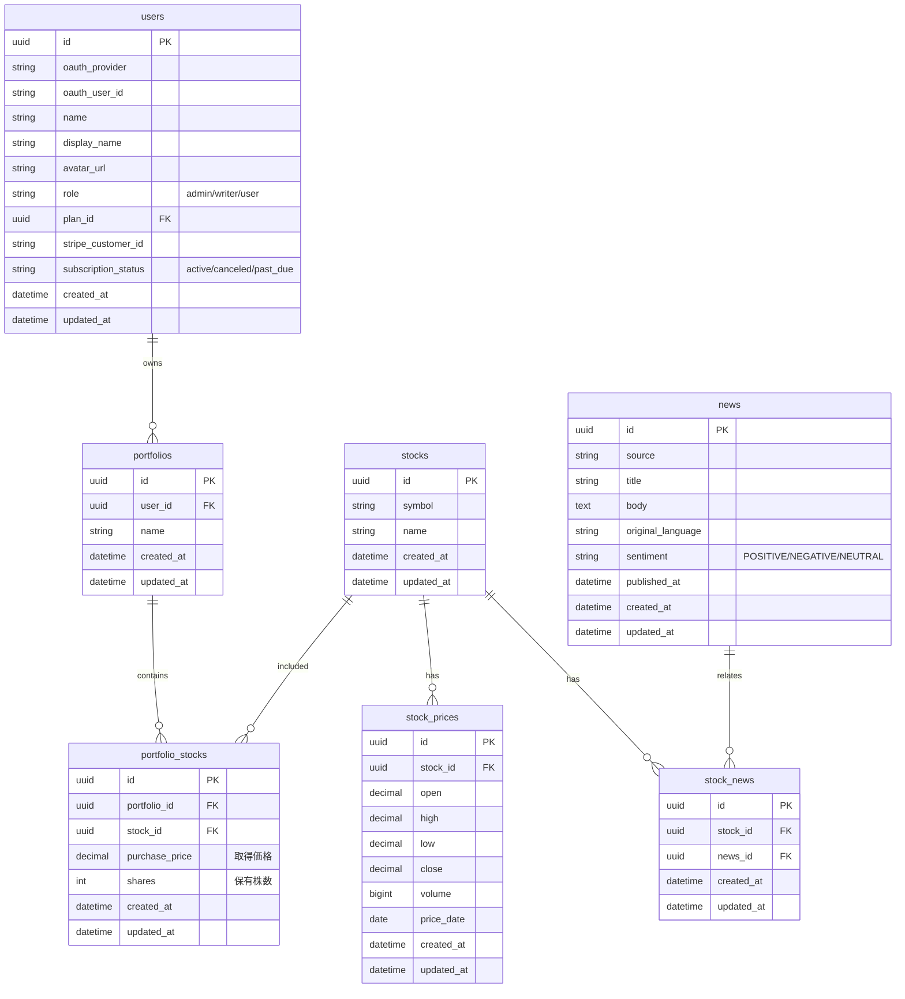
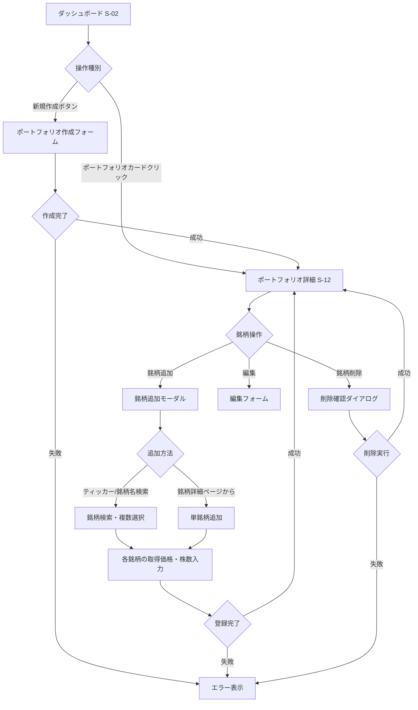
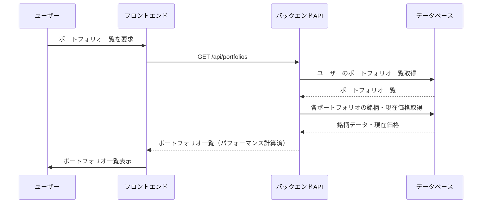
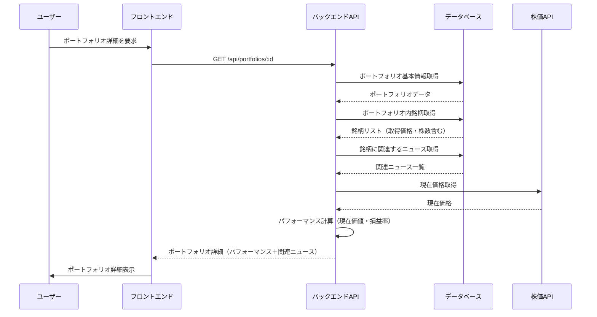
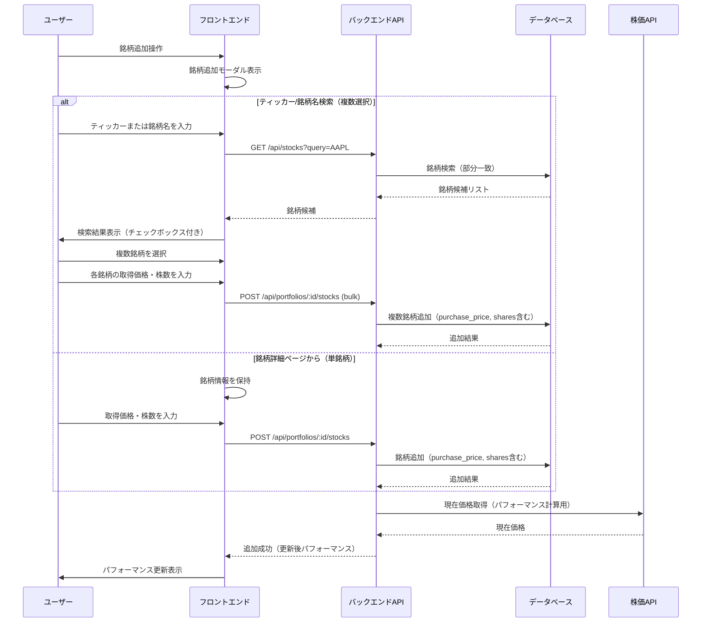

# ポートフォリオ機能

## 機能概要

ユーザーが保有・注目する銘柄をまとめて管理する機能。
最大5つまでポートフォリオを作成可能で、各ポートフォリオには取得価格・保有株数を含めて銘柄を登録できる。
ポートフォリオ全体のパフォーマンス（現在価値・損益率）を確認でき、関連ニュースを専用ページで一覧表示する。

## 目的

- **投資家のパフォーマンス可視化**: 保有銘柄の現在価値・損益率を一目で確認したい（US-04）
- **効率的な情報収集**: ポートフォリオに関連するニュースだけをまとめて確認したい（US-07）
- **柔軟な銘柄管理**: 複数のポートフォリオで用途別に銘柄を管理したい

## 機能条件

### 権限

| ロール | 閲覧 | 作成・編集・削除 | 銘柄追加・削除 |
|--------|------|----------------|----------------|
| admin  | ○ | ○ | ○ |
| writer | ○ | ○ | ○ |
| user   | ○ | ○ | ○ |

### 制約事項

- ポートフォリオ作成数: **最大5つまで**
- 1ポートフォリオあたりの銘柄数: **制限なし**
- 取得価格・保有株数: **必須入力**（損益計算のため）

🟢 **後回し可**

- リアルタイム価格更新: TBD
  - 案1: リアルタイム更新 → ユーザー価値高、APIコスト増
  - 案2: 15分〜1時間キャッシュ → コスト削減、情報鮮度低下
  - **決定: TBD**

## 画面設計図
🟡 **中程度**

**注意**: S-11（ポートフォリオ一覧）はダッシュボード（S-02）内のS-02-3セクションに含まれます。Pencilファイル（`docs/versions/1_0_0/SikouLab.pen`）には未定義です。

### S-11: ポートフォリオ一覧（ダッシュボード内）

```
┌─────────────────────────────────────────────────────────┐
│ ダッシュボード（S-02）                                   │
│ ┌───────────────────────────────────────────────────┐  │
│ │ S-02-1: 相場インデックス                           │  │
│ │ S&P500: 4,520.50 ▲0.8% │ NASDAQ: ... │ DOW: ... │  │
│ └───────────────────────────────────────────────────┘  │
│ ┌───────────────────────────────────────────────────┐  │
│ │ S-02-2: 記事・ニュースハイライト                   │  │
│ │ ...                                             │  │
│ └───────────────────────────────────────────────────┘  │
│ ┌───────────────────────────────────────────────────┐  │
│ │ S-02-3: ポートフォリオセクション                   │  │
│ │ ┌─────────────────────────────────────────────┐ │  │
│ │ │ ポートフォリオ一覧      [+ 新規作成]        │ │  │
│ │ ├─────────────────────────────────────────────┤ │  │
│ │ │ ┌─────────────────────────────────────────┐ │ │  │
│ │ │ │ 「テック成長株」       [詳細>]          │ │ │  │
│ │ │ │ 3銘柄 │ $12,450 │ +8.5% ▲            │ │ │  │
│ │ │ └─────────────────────────────────────────┘ │ │  │
│ │ │ ┌─────────────────────────────────────────┐ │ │  │
│ │ │ │ 「配当株投資」         [詳細>]        │ │ │  │
│ │ │ │ 5銘柄 │ $8,320 │ +2.1% ▲             │ │ │  │
│ │ │ └─────────────────────────────────────────┘ │ │  │
│ │ │ [カードクリックでポートフォリオ詳細へ]       │ │  │
│ │ └─────────────────────────────────────────────┘ │  │
│ └───────────────────────────────────────────────────┘  │
└─────────────────────────────────────────────────────────┘
```

### S-12: ポートフォリオ詳細

```
┌─────────────────────────────────────────────────────────┐
│ ヘッダー                                                 │
│ [戻る] 「テック成長株」                        [編集][削除]│
├─────────────────────────────────────────────────────────┤
│ パフォーマンスサマリー                                   │
│ │ 現在価値: $12,450 │ 損益額: +$975 │ 損益率: +8.5% ▲  │
├─────────────────────────────────────────────────────────┤
│ 銘柄リスト                                [+ 銘柄追加]   │
│ ┌───────────────────────────────────────────────────┐  │
│ │ AAPL Apple Inc.                                   │  │
│ │ 10株 @ $150.00 → $178.50                         │  │
│ │ 現在価値: $1,785 │ 損益: +$285 (+19.0%) ▲         │  │
│ │ [削除]                                            │  │
│ └───────────────────────────────────────────────────┘  │
│ ┌───────────────────────────────────────────────────┐  │
│ │ MSFT Microsoft Corp.                             │  │
│ │ 5株 @ $380.00 → $410.20                          │  │
│ │ 現在価値: $2,051 │ 損益: +$151 (+7.9%) ▲          │  │
│ │ [削除]                                            │  │
│ └───────────────────────────────────────────────────┘  │
├─────────────────────────────────────────────────────────┤
│ 関連ニュース                                             │
│ ┌───────────────────────────────────────────────────┐  │
│ │ Appleの新製品発表、株価上昇                        │  │
│ │ 2時間前 │ 関連銘柄: [AAPL]                        │  │
│ └───────────────────────────────────────────────────┘  │
│ ┌───────────────────────────────────────────────────┐  │
│ │ Microsoftの四半期決算、予想上回る                  │  │
│ │ 5時間前 │ 関連銘柄: [MSFT]                        │  │
│ └───────────────────────────────────────────────────┘  │
└─────────────────────────────────────────────────────────┘
```

**※ S-13（ポートフォリオ関連ニュース）はS-12内に統合**

## 関連テーブル



## フロー図



## シーケンス図

### ポートフォリオ一覧取得



### ポートフォリオ詳細取得



### 銘柄追加



## 機能要件
🟡 **中程度**

### 機能要件1: ポートフォリオ管理画面(F-09-1)
- 機能仕様1: ポートフォリオ一覧表示
  - ユーザーが作成した全ポートフォリオをカード形式で表示
  - 各カードに以下を表示: ポートフォリオ名・銘柄数・現在価値（合計）・損益率（パーセンテージと矢印）
  - 「新規作成」ボタンを表示
  - 空状態: ポートフォリオ未作成時は「ポートフォリオを作成」CTAを表示
- 機能仕様2: ポートフォリオ作成
  - ポートフォリオ名の入力（必須、最大50文字）
  - 作成数上限: 最大5つまで
  - 超過時: 新規作成ボタンを無効化し、メッセージ表示
- 機能仕様3: ポートフォリオ編集・削除
  - ポートフォリオ名の編集
  - ポートフォリオの削除（確認ダイアログ付き）
- 機能仕様4: 銘柄追加
  - **追加方法（2種類をサポート）**:
    1. **ティッカー/銘柄名検索**: シンボルまたは銘柄名を入力して銘柄検索・複数選択
    2. **銘柄詳細ページから追加**: F-03のポートフォリオ追加ボタン経由（単銘柄）
  - **ティッカー/銘柄名検索の仕様**: 部分一致検索・複数選択（チェックボックス方式）・各銘柄に取得価格・株数を入力して一括登録
  - **入力項目**: 銘柄（必須）・取得価格（必須、正の数値）・保有株数（必須、正の整数）
  - **バリデーション**: 同一銘柄の重複登録不可・数値チェック・既存銘柄は「上書き」か「キャンセル」を選択
- 機能仕様5: 銘柄削除
  - 各銘柄に「削除」ボタンを配置
  - 削除確認ダイアログを表示
  - 削除後、パフォーマンスを再計算して表示
- 機能仕様6: パフォーマンス表示
  - **ポートフォリオ全体**: 現在価値 = Σ(現在価格 × 保有株数)、損益額 = 現在価値 - 取得価値、損益率 = (損益額 / 取得価値) × 100
  - **銘柄ごと**: 同計算式を銘柄単位で適用
  - **表示形式**: 損益率は小数点第1位・プラス時は「+」記号・色分け（黒字/赤字）、損益額は通貨フォーマット

### 機能要件2: 関連ニュースセクション（ポートフォリオ詳細内）(F-09-2)

**※ S-12（ポートフォリオ詳細）画面内のセクションとして実装**

- 機能仕様1: ニュース一覧表示
  - ポートフォリオ内の全銘柄に関連するニュースを日付降順で一覧表示
  - 各ニュースに以下を表示: タイトル・公開日時・関連銘柄（ティッカー表示）
  - 空状態: 「該当するニュースはありません」を表示
- 機能仕様2: ページ遷移
  - ニュースクリックでニュース詳細ページ（F-05-6）へ遷移
  - 銘柄クリックで銘柄詳細ページ（F-03）へ遷移

## 非機能要件
🟢 **後回し可**

### 非機能要件1: パフォーマンス
- 非機能仕様1: ポートフォリオ一覧取得: 2秒以内
- 非機能仕様2: ポートフォリオ詳細取得: 2秒以内
- 非機能仕様3: 関連ニュース取得: 1秒以内

### 非機能要件2: UX
- 非機能仕様1: 空状態の適切な表示
- 非機能仕様2: エラー発生時は適切なエラーメッセージ表示
- 非機能仕様3: 読み込み中はスケルトン表示

### 非機能要件3: データ鮮度
- 非機能仕様1: リアルタイム価格更新: TBD（制約事項参照）

## ログ
🟢 **後回し可**

### 出力タイミング
- 案1: API呼び出し時に全て出力 → 追跡しやすいがログ量増加
- 案2: エラー時のみ出力 → ログ量削減だが正常系追跡困難
- 案3: 重要操作のみ出力 → バランス型
- **決定: TBD**

### ログレベル方針
- 案1: INFO中心 → 詳細追跡可能
- 案2: WARN/ERROR中心 → 異常検知に特化
- **決定: TBD**

## ユースケース
🟡 **中程度**

### シナリオ1: ポートフォリオ新規作成
1. ユーザーがダッシュボード（S-02）を表示
2. ポートフォリオセクション（S-02-3）で「新規作成」ボタンをクリック
3. ポートフォリオ名を入力（例: 「テック成長株」）
4. 作成ボタンをクリック
5. ポートフォリオ詳細画面（S-12）へ遷移
6. 「銘柄追加」ボタンをクリック
7. ティッカーまたは銘柄名で検索（例: 「Apple」）
8. 検索結果から複数の銘柄を選択（例: AAPL, MSFT, GOOGL）
9. 各銘柄の取得価格・株数を入力
   - AAPL: $150.00, 10株
   - MSFT: $380.00, 5株
   - GOOGL: $140.00, 8株
10. 登録ボタンをクリック
11. 全銘柄が追加され、パフォーマンスが表示される

### シナリオ2: パフォーマンス確認
1. ユーザーがダッシュボード（S-02）を表示
2. ポートフォリオセクション（S-02-3）で各ポートフォリオのパフォーマンス（現在価値・損益率）を確認
3. 興味のあるポートフォリオカードをクリック
4. ポートフォリオ詳細（S-12）で銘柄ごとのパフォーマンスを確認
5. プラス銘柄・マイナス銘柄を把握
6. 同画面内の「関連ニュース」セクションでニュースも確認

### シナリオ3: 関連ニュース閲覧
1. ユーザーがポートフォリオ詳細（S-12）を表示
2. 画面をスクロールして「関連ニュース」セクションを確認
3. ポートフォリオ内銘柄に関連するニュース一覧を確認
4. 興味のあるニュースをクリックしてニュース詳細ページ（F-05-6）へ遷移

## テストケース
🟡 **中程度**

**記載タイミング**: 単体テストは大枠のみ設計段階、詳細はTDD実装時。E2Eテストは実装完了後

### 単体テスト（設計段階は大枠のみ、詳細はTDD実装時に追記）

| テスト項目 | 対応仕様 | 観点 | 期待値 |
|------------|----------|------|--------|
| ポートフォリオ一覧取得 | 機能要件1/機能仕様1 | ユーザーのポートフォリオ一覧を取得 | ポートフォリオ一覧（パフォーマンス計算済）が返される |
| ポートフォリオ作成 | 機能要件1/機能仕様2 | ポートフォリオ名を入力して作成 | ポートフォリオが作成される |
| ポートフォリオ作成数上限 | 機能要件1/機能仕様2 | 6つ目のポートフォリオを作成試行 | エラーが返される |
| パフォーマンス計算 | 機能要件1/機能仕様6 | 現在価格・取得価格・株数から計算 | 現在価値・損益額・損益率が正しく計算される |
| 銘柄追加（ティッカー/銘柄名検索） | 機能要件1/機能仕様4 | ティッカーまたは銘柄名で検索して複数銘柄追加 | 複数銘柄がポートフォリオに追加される |
| 銘柄追加（重複） | 機能要件1/機能仕様4 | 同一銘柄を重複して追加試行 | エラーまたは上書き確認が表示される |
| 銘柄削除 | 機能要件1/機能仕様5 | 銘柄を削除 | 銘柄が削除され、パフォーマンスが再計算される |
| 関連ニュース取得 | 機能要件2/機能仕様1 | ポートフォリオ内銘柄の関連ニュースを取得 | 銘柄名に関連するニュース一覧が返される |

### E2Eテスト（実装完了後に記載）

| テストシナリオ | 対応仕様 | 観点 | 期待値 |
|----------------|----------|------|--------|
| ポートフォリオ作成フロー | 機能要件1/機能仕様2, 機能仕様4 | 新規作成→銘柄追加→パフォーマンス表示 | TBD（実装完了後に記載） |
| パフォーマンス確認フロー | 機能要件1/機能仕様1, 機能仕様6 | 一覧表示→詳細確認→銘柄別パフォーマンス確認 | TBD（実装完了後に記載） |
| 関連ニュース閲覧フロー | 機能要件2/機能仕様1, 機能仕様2 | 詳細→関連ニュース→ニュース詳細へ遷移 | TBD（実装完了後に記載） |

## 影響範囲一覧

### 機能影響範囲

| 関連機能 | 影響内容 |
|----------|----------|
| **F-09** | ポートフォリオ機能自身（F-09-1, F-09-2を含む） |
| F-02-3 | ダッシュボードのポートフォリオウィジェット（ポートフォリオデータを使用） |
| F-02-4 | ダッシュボードの関連ニュースウィジェット（ポートフォリオ銘柄に関連するニュース） |
| F-03 | 個別銘柄ページ（ポートフォリオ追加ボタン、登録状態表示） |
| F-05 | ニュース機能（ポートフォリオ関連ニュースのデータ取得元） |

### コード影響範囲
🟢 **後回し可**

- 案1: フロントエンド（ポートフォリオ一覧・詳細・関連ニュース画面）＋ バックエンド（ポートフォリオ関連API全般） → 単一機能として実装
- **決定: 案1を採用（実装時に確定）**

## 作業見積もり

### 見積もりサマリー

| 項目 | ストーリーポイント | 目安時間 |
|------|------------------|----------|
| **合計** | 45-48sp | 11.25-12時間 |

**目安**: 4sp = 1時間（実装＋単体テスト＋レビューを含む、あくまで参考値）

### タスク一覧

| タスク | ストーリーポイント | 備考 |
|--------|------------------|------|
| **バックエンド** |||
| DBマイグレーション（portfolios, portfolio_stocks） | 2 | 2テーブル作成、外部キー・インデックス設定 |
| ポートフォリオCRUD API | 5 | 一覧・詳細・作成・更新・削除の5エンドポイント、上限5チェック含む |
| 銘柄管理API（追加・削除） | 3 | 一括追加・個別削除、重複チェック・バリデーション |
| パフォーマンス計算ロジック | 3 | 現在価値・損益額・損益率の計算、株価取得連携 |
| 関連ニュース取得クエリ | 2 | portfolio_stocks→stock_news→newsのJOIN、日付降順 |
| 銘柄検索API | 2 | symbol/nameの部分一致検索 |
| **フロントエンド** |||
| ダッシュボード ポートフォリオセクション（S-02-3） | 3 | カードリスト・空状態CTA・パフォーマンスサマリー |
| ポートフォリオ作成フォーム | 2 | 名前入力、上限5チェック（無効化+メッセージ） |
| ポートフォリオ詳細ページ レイアウト（S-12） | 3 | ヘッダー・パフォーマンスサマリーセクション |
| 銘柄リスト＋パフォーマンス表示 | 3 | 銘柄カード、色分け（プラス/マイナス） |
| 銘柄追加モーダル（検索・複数選択・入力） | 5-8 | 検索+チェックボックス複数選択+各銘柄の価格・株数入力。**分割推奨** |
| 銘柄削除（確認ダイアログ付き） | 1 | 削除ボタン＋確認ダイアログ |
| ポートフォリオ編集・削除 | 2 | 名前編集、削除確認ダイアログ |
| 関連ニュースセクション | 2 | ニュースリスト、関連銘柄ティッカー表示、遷移リンク |
| **テスト** |||
| 単体テスト（BE） | 3 | CRUD API・パフォーマンス計算・バリデーション。CRUDは定型パターンのため効率化 |
| 単体テスト（FE） | 3 | コンポーネント・状態管理テスト |
| E2Eテスト | 3 | 作成→銘柄追加→パフォーマンス確認→ニュース閲覧の主要3シナリオ |

### リスク要因

- **リアルタイム株価更新戦略がTBD**: パフォーマンス計算の実装アプローチに影響（リアルタイム vs キャッシュで工数が大きく変動）
- **外部株価API選定が未確定**: API連携の実装難易度・レート制限対応に影響
- **銘柄追加モーダルの複雑性**: 検索+複数選択+個別入力のUI/UXが複雑。5-8spの幅あり、実装時にタスク分割推奨

### 依存関係

- 認証機能（F-01）の実装完了が前提
- DBインフラ・ORM基盤の構築が必要
- 銘柄テーブル（stocks）・株価テーブル（stock_prices）へのデータ投入が必要
- ニュース機能（F-05）の実装完了（関連ニュース表示のため）
- ダッシュボード（S-02）基盤の実装（ポートフォリオセクション配置のため）
