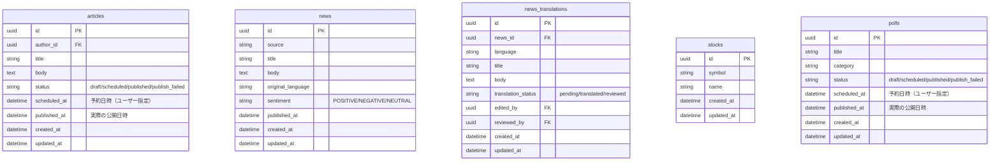

# 検索機能

## 機能概要

記事・ニュース・銘柄・アンケートの統合検索機能。全画面のヘッダーに配置されたグローバル検索バーから、全コンテンツを横断検索し、検索結果画面（S-09）でタブ形式で表示する。

## 目的

ユーザーが能動的に情報を探す際、一箇所から全コンテンツを検索できるようにすることで、情報発見効率を向上させる。

## 機能条件

### 権限

| ロール | 操作可否 |
|--------|----------|
| admin  | ○       |
| writer | ○       |
| user   | ○       |

※ 全ロールで検索・閲覧可能

### 制約事項

- 検索クエリの最小文字数制限: **1文字以上**
  - 銘柄コード（ティッカー）に1〜2文字のものが存在するため、1文字から検索可能とする
  - 1文字未満（空文字）の場合はバリデーションメッセージを表示し、APIリクエストを送信しない

- 検索結果のキャッシュ期間: **3分間**

## 画面設計図
🟡 **中程度**

### グローバル検索バー（全画面共通）

ヘッダーに配置される検索入力欄。

```
┌─────────────────────────────────────┐
│ 🔍 検索...                      │
└─────────────────────────────────────┘
```

- 幅: 400px
- 角丸: 8px
- 背景色: #F5F5F5
- プレースホルダー: 「検索...」
- アイコン: 🔍 (search)

### 検索結果画面（S-09）

```
┌────────────────────────────────────────────────────┐
│ 🔍 [検索キーワード]              ×      │
├────────────────────────────────────────────────────┤
│ [全て][記事][ニュース][銘柄][アンケート]    │
├────────────────────────────────────────────────────┤
│ 検索結果: N件                                  │
│ ┌──────────────────────────────────────────────┐ │
│ │ [記事] タイトル...                        │ │
│ │        サマリーテキスト...                  │ │
│ │        2024/01/15  |  ジャンル名          │ │
│ └──────────────────────────────────────────────┘ │
│ ┌──────────────────────────────────────────────┐ │
│ │ [ニュース] タイトル...                    │ │
│ │          サマリーテキスト...                │ │
│ │          2024/01/15  |  ソース名          │ │
│ └──────────────────────────────────────────────┘ │
│ ...                                           │
└────────────────────────────────────────────────────┘
```

#### タブ構成

| タブ名 | 説明 |
|--------|------|
| 全て | 全ての検索対象を混合表示 |
| 記事 | 記事のみ表示 |
| ニュース | ニュースのみ表示 |
| 銘柄 | 銘柄のみ表示 |
| アンケート | アンケートのみ表示 |

#### 空状態

- 検索キーワード未入力時: プレースホルダーのみ表示
- 検索結果0件時: 「検索結果が見つかりませんでした」メッセージ

## 関連テーブル
%% 正: docs/versions/1_0_0/data-model.md

検索機能では新しいテーブルは作成せず、既存テーブルを検索対象とする。



## フロー図


## シーケンス図


## 機能要件
🟡 **中程度**

### 機能要件1: グローバル検索バー(F-07)
- 機能仕様1: 全画面のヘッダーに検索バーを配置する
- 機能仕様2: 検索バーにはプレースホルダー「検索...」と検索アイコンを表示する
- 機能仕様3: 検索キーワード入力後、Enter押下または検索アイコンクリックで検索を実行する
- 機能仕様4: 検索キーワードはURLクエリパラメータとして保持する（`/search?q=keyword`）

### 機能要件2: 検索実行(F-07)
- 機能仕様1: 記事はタイトルと本文を対象にPGroonga全文検索する
- 機能仕様2: ニュースはタイトル、本文、翻訳タイトル、翻訳本文を対象にPGroonga全文検索する
- 機能仕様3: 銘柄は銘柄コード（前方一致）と銘柄名（PGroonga全文検索）を検索する
- 機能仕様4: アンケートはタイトルを対象にPGroonga全文検索する
- 機能仕様5: ステータスが `published` のコンテンツのみ検索対象とする
- 機能仕様6: 「全て」タブではPGroongaのスコアリングにより関連度順で結果を表示する

### 機能要件3: 検索結果画面表示(F-07)
- 機能仕様1: 検索結果をタブ形式で表示する（全て・記事・ニュース・銘柄・アンケート）
- 機能仕様2: デフォルトは「全て」タブを表示する
- 機能仕様3: 各結果アイテムはタイプ（記事/ニュース/銘柄/アンケート）を視覚的に区別する
- 機能仕様4: 結果アイテムをクリックすると、各コンテンツの詳細画面へ遷移する
- 機能仕様5: 検索結果がない場合は「検索結果が見つかりませんでした」メッセージを表示する

### 機能要件4: 検索結果アイテム表示(F-07)
- 機能仕様1: 記事は「タイトル」「本文サマリー」「公開日時」「ジャンル名」を表示する
- 機能仕様2: ニュースは「タイトル」「本文サマリー」「公開日時」「ソース名」を表示する
- 機能仕様3: 銘柄は「銘柄コード」「銘柄名」を表示する
- 機能仕様4: アンケートは「タイト」「カテゴリ」「公開日時」を表示する
- 機能仕様5: 本文サマリーは検索キーワード周辺のテキストを抽出して表示する（TBD: 実装有無）

### 機能要件5: タブフィルタリング(F-07): TBD
- 機能仕様1: 各タブクリックで該当コンテンツのみ表示に切り替える
- 機能仕様2: アクティブタブはハイライト表示する

## 非機能要件
🟢 **後回し可**

### 非機能要件1: パフォーマンス
- 非機能仕様1: 検索結果は1秒以内に応答することを目標とする
- 非機能仕様2: 大量データ時のパフォーマンス劣化を防止するため、PGroongaインデックスを設計する

- 検索方式
  - **決定: PGroonga（PostgreSQL拡張）** — [ADR-014](../adr/014-search-engine.md) 参照
  - MeCab + IPA辞書による日本語形態素解析で全文検索を実現

### 非機能要件2: ユーザビリティ
- 非機能仕様1: 検索キーワードは入力補完（サジェスト）を提供するか検討
  - **決定: TBD（初期リリースでは未実装の可能性）**

### 非機能要件3: SEO
- 非機能仕様1: 検索結果画面はクロール対象外とする（noindex）

## ログ
🟢 **後回し可**

### 出力タイミング
- 案1: API呼び出し時に全て出力 → 追跡しやすいがログ量増加
- 案2: エラー時のみ出力 → ログ量削減だが正常系追跡困難
- 案3: 重要操作のみ出力 → バランス型
- **決定: TBD**

### ログレベル方針
- 案1: INFO中心 → 詳細追跡可能
- 案2: WARN/ERROR中心 → 異常検知に特化
- **決定: TBD**

## ユースケース
🟡 **中程度**

### シナリオ1: キーワードから記事を検索する（早期決定）
ユーザーが特定のトピックに関する記事を見つけたい場合、グローバル検索バーにキーワードを入力し、検索結果画面から該当記事を閲覧する。

1. ユーザーは任意の画面で検索バーにキーワードを入力
2. Enterを押下すると検索結果画面に遷移
3. 「全て」タブに検索結果が表示される
4. 必要に応じて「記事」タブをクリックして記事のみに絞り込む
5. 目的の記事をクリックして記事詳細画面へ遷移

### シナリオ2: 銘柄コードから銘柄を検索する（早期決定）
ユーザーが銘柄コード（ティッカー）を知っている場合、検索バーから銘柄詳細画面に直接アクセスする。

1. ユーザーは検索バーに銘柄コード（例: AAPL）を入力
2. Enterを押下すると検索結果画面に遷移
3. 「全て」タブまたは「銘柄」タブに該当銘柄が表示される
4. 銘柄をクリックして銘柄詳細画面へ遷移

### シナリオ3: タブでコンテンツ種類を絞り込む（TBD可）
ユーザーが特定のコンテンツ種類（例: ニュースのみ）を探している場合、タブでフィルタリングする。

1. 検索結果画面で任意のタブをクリック
2. 選択したタブのコンテンツのみ表示される

## テストケース
🟡 **中程度**

### 単体テスト（設計段階は大枠のみ、詳細はTDD実装時に追記）

| テスト項目 | 対応仕様 | 観点 | 期待値 |
|------------|----------|------|--------|
| 検索バー表示 | 機能要件1/機能仕様1 | 全画面のヘッダーに検索バーが表示される | 検索バーが表示される |
| 記事検索 | 機能要件2/機能仕様1 | タイトルまたは本文にキーワードを含む記事が検索される | 該当記事が結果に含まれる |
| ニュース検索 | 機能要件2/機能仕様2 | タイトル、本文、翻訳にキーワードを含むニュースが検索される | 該当ニュースが結果に含まれる |
| 銘柄検索（コード） | 機能要件2/機能仕様3 | 銘柄コードが前方一致する銘柄が検索される | 該当銘柄が結果に含まれる |
| 銘柄検索（名前） | 機能要件2/機能仕様3 | 銘柄名にキーワードを含む銘柄が検索される | 該当銘柄が結果に含まれる |
| アンケート検索 | 機能要件2/機能仕様4 | タイトルにキーワードを含むアンケートが検索される | 該当アンケートが結果に含まれる |
| 公開済みのみ検索 | 機能要件2/機能仕様5 | draft/scheduledステータスのコンテンツは検索されない | 結果に含まれない |
| タブフィルタリング | 機能要件3/機能仕様1, 機能要件5 | 各タブで該当コンテンツのみ表示される | 選択タブのコンテンツのみ表示 |
| 結果0件 | 機能要件3/機能仕様5 | 検索結果がない場合のメッセージ表示 | 「検索結果が見つかりませんでした」 |
| 詳細画面遷移 | 機能要件3/機能仕様4 | 結果クリックで各詳細画面へ遷移 | 該当詳細画面が表示される |

### E2Eテスト（実装完了後に記載）

| テストシナリオ | 対応仕様 | 観点 | 期待値 |
|----------------|----------|------|--------|
| 記事検索〜詳細遷移 | 機能要件1/機能仕様4, 機能要件2/機能仕様1, 機能要件3/機能仕様4 | キーワード入力から記事詳細表示まで正常に動作する | 記事詳細画面が表示される |
| 銘柄検索〜詳細遷移 | 機能要件1/機能仕様4, 機能要件2/機能仕様3, 機能要件3/機能仕様4 | 銘柄コード入力から銘柄詳細表示まで正常に動作する | 銘柄詳細画面が表示される |
| タブ切り替え | 機能要件5 | 各タブクリックで表示結果が正しく切り替わる | 選択タブのコンテンツのみ表示される |

## 影響範囲一覧

### 機能影響範囲

| 関連機能 | 影響内容 |
|----------|----------|
| F-04 記事機能 | 記事が検索対象となる |
| F-05 ニュース機能 | ニュースが検索対象となる |
| F-03 個別銘柄ページ | 銘柄が検索対象となる |
| F-06 アンケート機能 | アンケートが検索対象となる |
| F-04-5 記事詳細ページ | 検索結果から遷移元となる |
| F-05-6 ニュース詳細ページ（WANT） | 検索結果から遷移元となる |
| F-03 個別銘柄ページ | 検索結果から遷移元となる |
| F-06-1 アンケート投票画面 | 検索結果から遷移元となる |

### コード影響範囲

- インフラ
  - DockerfileにPGroonga + MeCab + IPA辞書のインストールを追加
  - 検索対象テーブルにPGroongaインデックスを作成（マイグレーション）

- バックエンド
  - 検索APIエンドポイントの追加
  - PGroonga演算子を使用した検索クエリ実装

- フロントエンド
  - グローバル検索バーコンポーネントの追加
  - 検索結果画面コンポーネントの追加
  - 既存ヘッダーコンポーネントの修正（検索バー追加）

## 作業見積もり

### 見積もりサマリー

| 項目 | ストーリーポイント | 目安時間 |
|------|------------------|----------|
| **合計** | 34-42sp | 8.5-10.5時間 |

**目安**: 4sp = 1時間（実装＋単体テスト＋レビューを含む、あくまで参考値）

### タスク一覧

| タスク | ストーリーポイント | 備考 |
|--------|------------------|------|
| **インフラ** |||
| PGroonga + MeCab + IPA辞書のDockerfile構築 | 3 | 初回セットアップ。動作確認含む |
| PGroongaインデックスのマイグレーション作成 | 3 | 5テーブル分のインデックス定義 |
| **バックエンド** |||
| 検索API（GET /api/v1/search）エンドポイント実装 | 5 | ルーティング・ハンドラ・レスポンス構造 |
| PGroonga検索クエリ実装（記事・ニュース・銘柄・アンケート） | 5-8 | 4テーブル横断検索 + スコアリング + publishedフィルタ |
| 検索結果キャッシュ（3分間） | 2-3 | キャッシュ戦略の実装 |
| **フロントエンド** |||
| グローバル検索バーコンポーネント | 3 | ヘッダー統合・バリデーション・URL連携 |
| 検索結果画面（S-09） | 5 | タブUI・結果リスト・空状態・詳細画面遷移 |
| 検索結果アイテムコンポーネント（4種類） | 3 | 記事/ニュース/銘柄/アンケートの表示分岐 |
| **テスト** |||
| 単体テスト | 3-5 | API・検索クエリ・フロントエンドの単体テスト |
| E2Eテスト | 2-3 | 検索〜詳細遷移・タブ切り替え |

### リスク要因

- **PGroonga導入**: 初回セットアップ時のトラブルシュートで見積もり超過の可能性
- **4テーブル横断検索のスコアリング**: 異なるテーブルのスコアを統合する実装が想定より複雑になる可能性

### 依存関係

- PGroonga + MeCab + IPA辞書のDockerfile構築が完了していること
- 既存テーブル（articles, news, news_translations, stocks, polls）のマイグレーションが完了していること
- ヘッダーコンポーネントが実装済みであること
