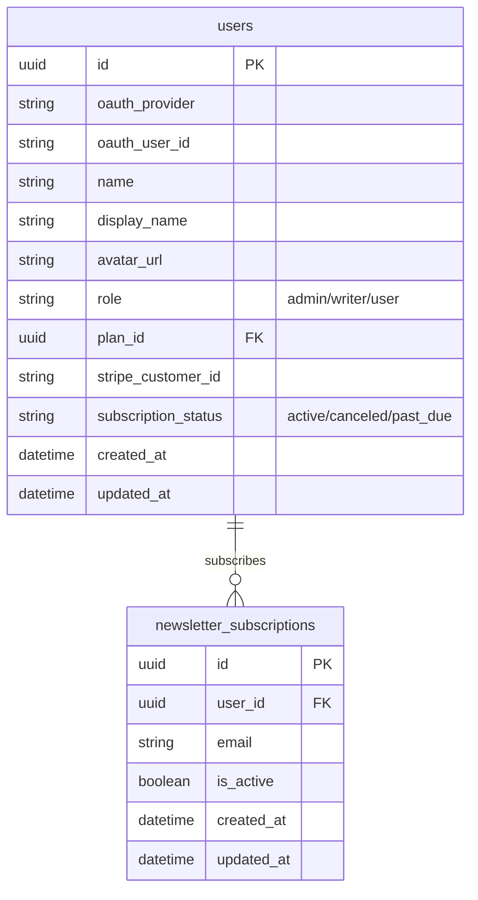
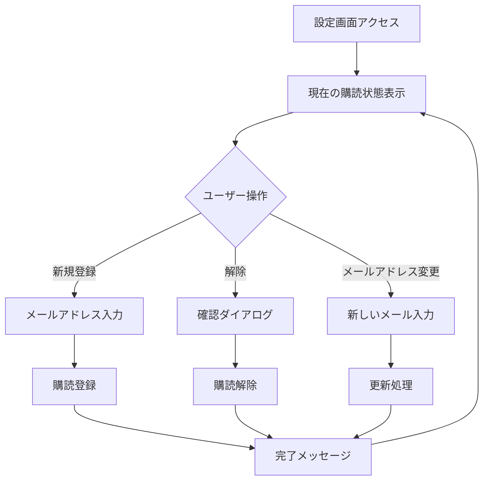
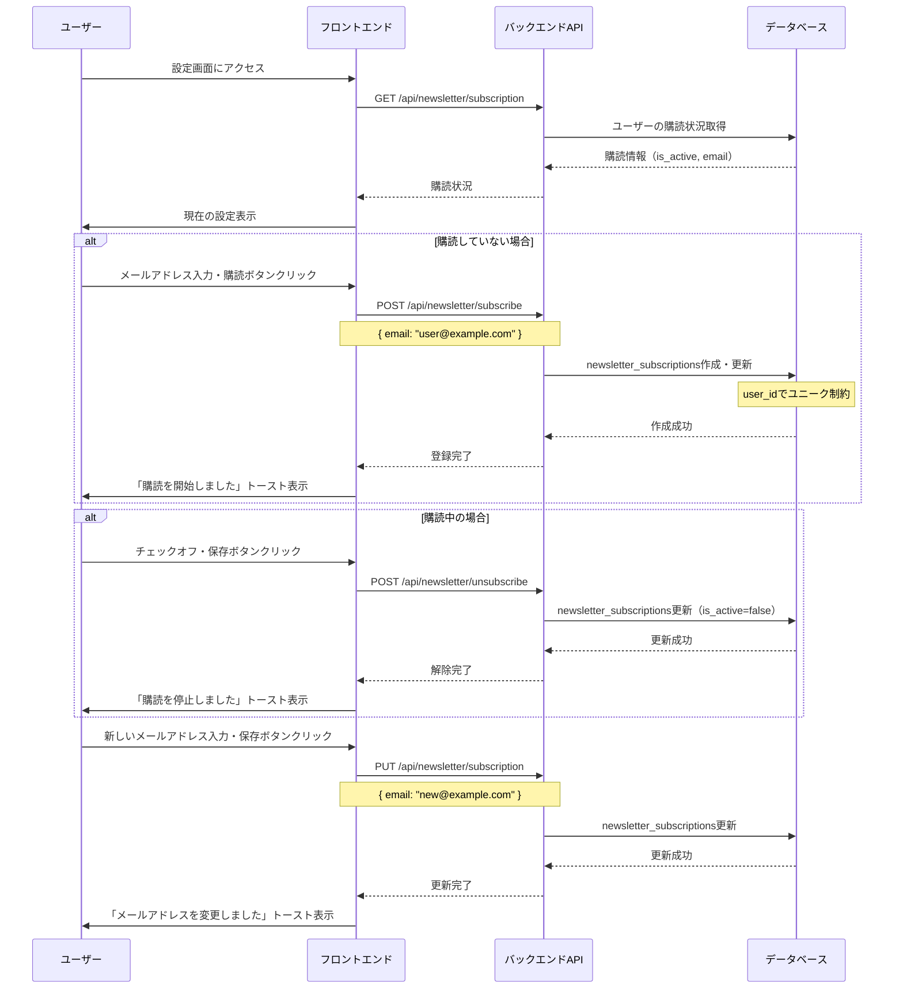

# メールアドレス登録（F-10-3）

## 機能概要

ニュースレター受信用メールアドレスの登録・変更機能。設定画面および各画面に配置されたウィジェットから登録可能。

**ログイン用メールアドレスとの違い**:
- ログイン用: OAuthプロバイダから取得したメールアドレス（表示のみ、変更不可）
- ニュースレター用: ユーザーが別途登録するメールアドレス（変更可能）

## 目的

- ユーザーが能動的にメール配信をオン・オフできるようにする
- 複数の場所から購読登録できるようにし、登録機会を最大化する

## 機能条件

### 権限

| ロール | 閲覧 | 登録・解除 |
|--------|------|-----------|
| admin  | ○ | ○ |
| writer | ○ | ○ |
| user   | ○ | ○ |

### 制約事項
- 1ユーザー1メールアドレス
- メールアドレス形式のバリデーション
- 重複登録不可（user_id単位）

## 画面設計図
🟡 **中程度**

### S-17 設定画面：メールセクション

```
┌────────────────────────────────────────────────────────────────────┐
│ サイドバー    │ メインコンテンツ                                          │
│（共通）       │                                                      │
│             │ ┌──────────────────────────────────────────────────┐ │
│             │ │ 設定                                              │ │
│             │ ├──────────────────────────────────────────────────┤ │
│             │ │                                                  │ │
│             │ │ ┌────────────────────────────────────────────┐   │ │
│             │ │ │ メールアドレス設定                              │   │ │
│             │ │ │                                             │   │ │
│             │ │ │ ┌─────────────────────────────────────────┐ │   │ │
│             │ │ │ │ ログイン用メールアドレス                   │ │   │ │
│             │ │ │ │ oauth@example.com                      │ │   │ │
│             │ │ │ │ （OAuthプロバイダから取得）              │ │   │ │
│             │ │ │ └─────────────────────────────────────────┘ │   │ │
│             │ │ │                                             │   │ │
│             │ │ │ ┌─────────────────────────────────────────┐ │   │ │
│             │ │ │ │ ニュースレター用メールアドレス            │ │   │ │
│             │ │ │ │ ┌─────────────────────────────────────┐│ │   │ │
│             │ │ │ │ │ newsletter@example.com             ││ │   │ │
│             │ │ │ │ └─────────────────────────────────────┘│ │   │ │
│             │ │ │ │                                             │   │ │
│             │ │ │ │ ☑ ニュースレターを受け取る                        │   │ │
│             │ │ │ │ ※毎朝7:30に記事の要約をお届けします                 │   │ │
│             │ │ │ │                                             │   │ │
│             │ │ │ │          [変更を保存]                          │   │ │
│             │ │ │ └─────────────────────────────────────────┘ │   │ │
│             │ │ └─────────────────────────────────────────────┘   │ │
│             └─────────────────────────────────────────────────────┘ │
└─────────────────────────────────────────────────────────────────────┘
```

### メール登録ウィジェット（各画面配置）

```
┌──────────────────────────┐
│ 📧 メールで記事を受け取る │
├──────────────────────────┤
│ 毎朝7:30に記事の要約を   │
│ お届けします。             │
│                        │
│ ┌────────────────────┐   │
│ │ user@example.com   │   │
│ └────────────────────┘   │
│    [購読する]           │
└──────────────────────────┘
```

**配置場所**: ダッシュボード・記事一覧・ニュース一覧等の下部

## 関連テーブル



## フロー図



## シーケンス図



## 機能要件
🟡 **中程度**

### 機能要件1: 購読状況表示(F-10-3)

- 機能仕様1: 現在の購読状況を表示する
  - ログイン用メールアドレス（OAuthプロバイダから取得、表示のみ）
  - ニュースレター用メールアドレス（登録済みの場合）
  - 購読状態（購読中/停止中）

### 機能要件2: メールアドレス登録(F-10-3)

- 機能仕様1: メールアドレスを入力して購読登録する
  - メール形式バリデーション
  - 重複チェック（user_id単位）

- 機能仕様2: ウィジェットから登録する
  - 各画面に配置されたウィジェットから簡易登録可能
  - 登録後は設定画面への誘導を表示

### 機能要件3: 購読解除(F-10-3)

- 機能仕様1: 購読を停止する
  - 物理削除ではなく論理削除（is_active=false）

### 機能要件4: メールアドレス変更(F-10-3)

- 機能仕様1: 登録済みメールアドレスを変更する
  - 新しいメールアドレスのバリデーション

## 非機能要件
🟢 **後回し可**

### 非機能要件1: バリデーション
- 非機能仕様1: メール形式のRFC準拠
- 非機能仕様2: 禁止ドメインのチェック（一時的・使い捨てメール等）

### 非機能要件2: セキュリティ
- 非機能仕様1: メールアドレスは暗号化して保存

## ログ
🟢 **後回し可**

### 出力タイミング
- 案1: 登録・解除時に出力 → 追跡しやすいがログ量増加
- 案2: エラー時のみ出力 → ログ量削減だが正常系追跡困難
- **決定: TBD**

### ログレベル方針
- 案1: INFO中心（登録・解除操作記録） → 詳細追跡可能
- 案2: WARN/ERROR中心 → 異常検知に特化
- **決定: TBD**

## ユースケース
🟡 **中程度**

### シナリオ1: 新規購読登録（早期決定）
1. ユーザーが設定画面にアクセス
2. ニュースレター用メールアドレスを入力
3. 「ニュースレターを受け取る」にチェック
4. 「変更を保存」クリック
5. 「購読を開始しました」トースト表示

### シナリオ2: ウィジェットからの登録（早期決定）
1. ユーザーが記事一覧を閲覧
2. ページ下部のウィジェットを確認
3. メールアドレスを入力
4. 「購読する」クリック
5. 「購読を開始しました」トースト表示

### シナリオ3: 購読解除（早期決定）
1. ユーザーが設定画面にアクセス
2. 「ニュースレターを受け取る」のチェックを外す
3. 「変更を保存」クリック
4. 「購読を停止しました」トースト表示

### シナリオ4: メールアドレス変更（早期決定）
1. ユーザーが設定画面にアクセス
2. 新しいメールアドレスを入力
3. 「変更を保存」クリック
4. 「メールアドレスを変更しました」トースト表示

## テストケース
🟡 **中程度**

**記載タイミング**: 単体テストは大枠のみ設計段階、詳細はTDD実装時。E2Eテストは実装完了後

### 単体テスト（設計段階は大枠のみ、詳細はTDD実装時に追記）

| テスト項目 | 対応仕様 | 観点 | 期待値 |
|------------|----------|------|--------|
| 購読状況取得 | 機能要件1/機能仕様1 | 現在の購読状況取得 | is_activeとemailが返される |
| メールアドレス登録 | 機能要件2/機能仕様1 | 正常なメールアドレスで登録 | newsletter_subscriptionsに作成される |
| メール形式バリデーション | 機能要件2/機能仕様1 | 不正な形式の拒否 | 400エラーが返される |
| 重複登録禁止 | 機能要件2/機能仕様1 | 既存user_idでの再登録 | 論理更新（上書き） |
| 購読解除 | 機能要件3/機能仕様1 | is_active=falseへの更新 | is_activeがfalseになる |
| メールアドレス変更 | 機能要件4/機能仕様1 | emailカラムの更新 | 新しいメールアドレスが保存される |

### E2Eテスト（実装完了後に記載）

| テストシナリオ | 対応仕様 | 観点 | 期待値 |
|----------------|----------|------|--------|
| 新規購読フロー | 機能要件2/機能仕様1 | メール入力→登録→トースト表示 | TBD（実装完了後に記載） |
| ウィジェット登録フロー | 機能要件2/機能仕様2 | ウィジェット入力→登録 | TBD（実装完了後に記載） |
| 購読解除フロー | 機能要件3/機能仕様1 | チェックオフ→保存→トースト表示 | TBD（実装完了後に記載） |

## 影響範囲一覧

### 機能影響範囲

| 関連機能 | 影響内容 |
|----------|----------|
| F-10 | 設定画面の一部として実装 |
| F-11 | ニュースレター配信の購読者データソース |
| F-11-2 | 定期配信バッチの購読者取得元 |
| F-12-3 | 管理者ページでの購読者管理 |

### コード影響範囲
🟢 **後回し可**

- フロントエンド: 設定画面・ウィジェットコンポーネント
- バックエンド: 購読API・解除API・状況取得API
- **決定: TBD**（実装時に確定）

## 作業見積もり

### 見積もりサマリー

| 項目 | ストーリーポイント | 目安時間 |
|------|------------------|----------|
| **合計** | 22-24sp | 5.5-6時間 |

**目安**: 4sp = 1時間（実装＋単体テスト＋レビューを含む、あくまで参考値）

### タスク一覧

| タスク | ストーリーポイント | 備考 |
|--------|------------------|------|
| **バックエンド** |||
| 購読状況取得API（GET） | 2 | 単純なDB読み取り |
| 購読登録API（POST） | 3 | upsert処理＋メールバリデーション |
| 購読解除API（POST） | 1 | is_active=false更新のみ |
| メールアドレス変更API（PUT） | 2 | 更新＋バリデーション |
| メールバリデーション共通処理 | 2 | RFC準拠＋形式チェック |
| **フロントエンド** |||
| 設定画面メールセクション（S-17） | 5 | フォーム・チェックボックス・保存・状態管理 |
| メール登録ウィジェット | 3 | 再利用可能コンポーネント、複数画面配置 |
| **テスト** |||
| 単体テスト | 3 | API 6項目＋フロントエンド |
| E2Eテスト | 1-2 | 3シナリオ（設定画面・ウィジェット・解除） |

### リスク要因

- 暗号化保存（非機能要件2）: 実装する場合＋3sp程度の追加見込み
- 禁止ドメインチェック（非機能要件1-2）: 使い捨てメールリスト管理で＋1-2sp

### 依存関係

- F-10（設定画面）: 設定画面の基盤が必要
- 認証基盤: ユーザーID取得のためログイン機能が前提
