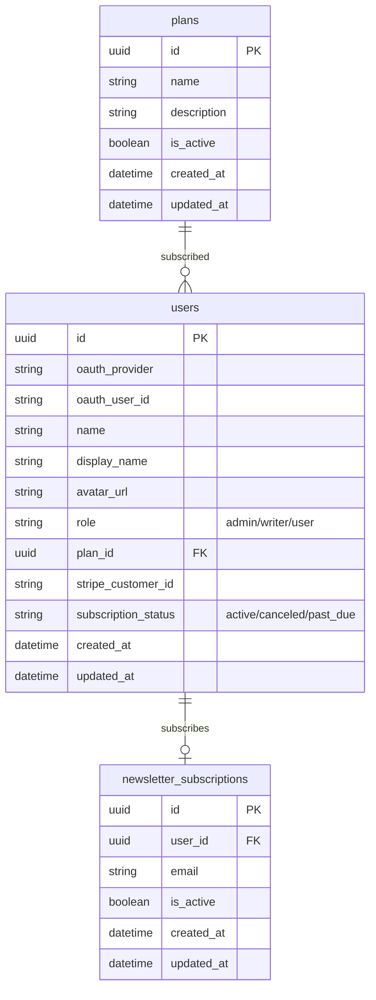
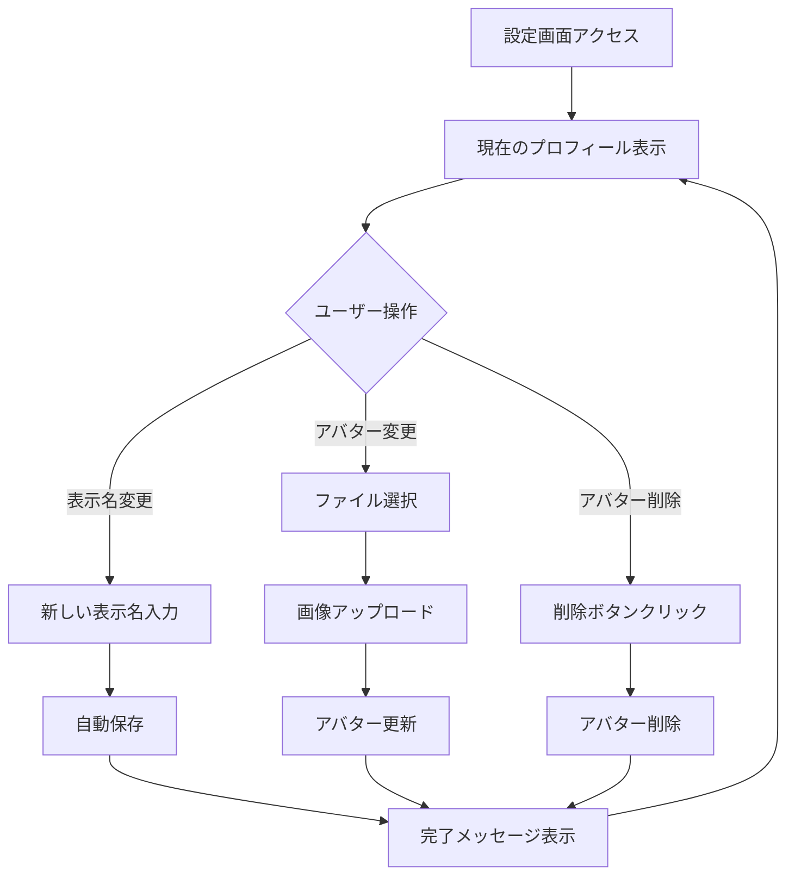
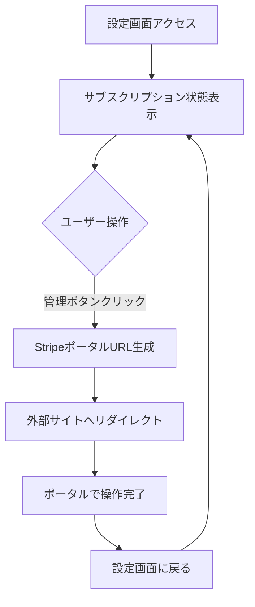
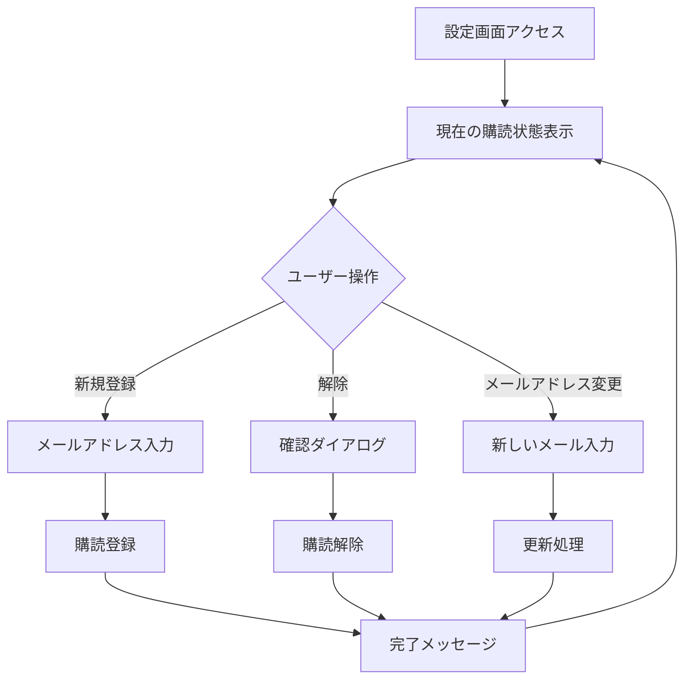
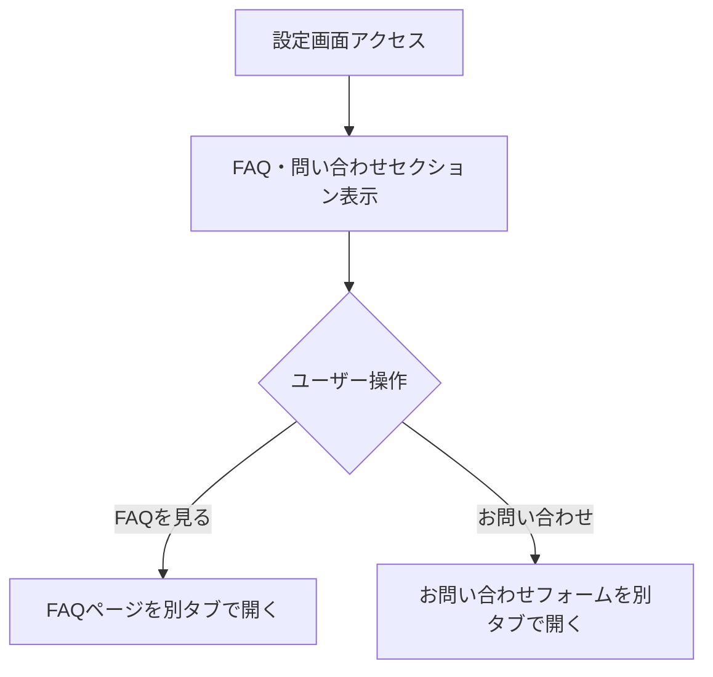
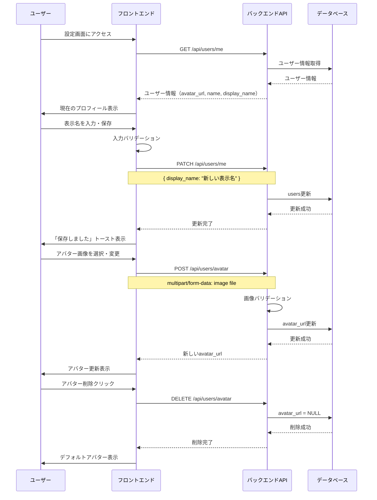
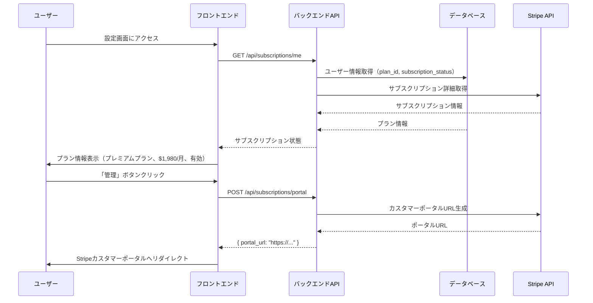
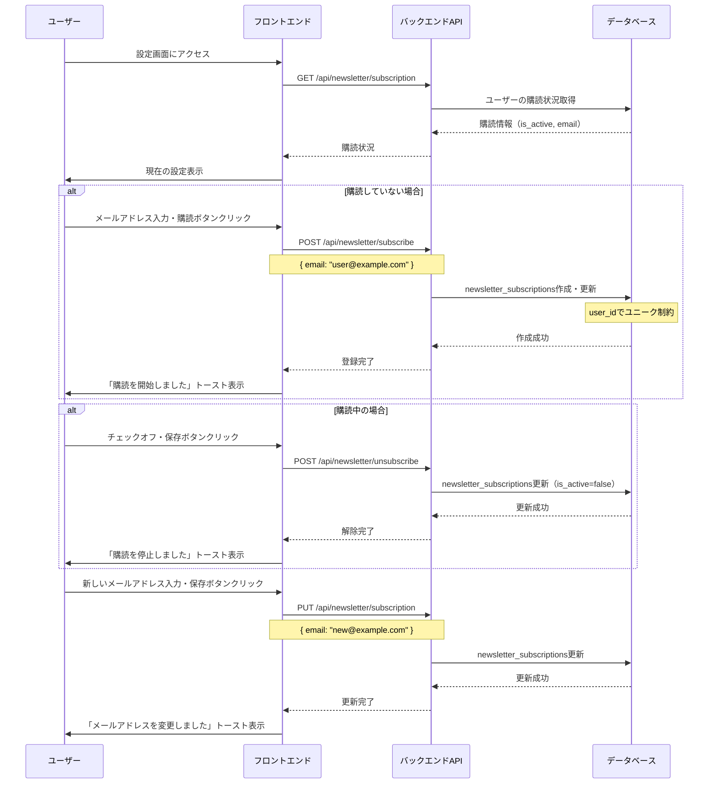

# 設定画面（F-10）

## 機能概要
ユーザー設定の統合管理画面。プロフィール、サブスクリプション、メール配信、FAQ・問い合わせへのアクセスを提供する。

**構成要素**:
- F-10-1: プロフィール設定（アバター、ユーザーID、表示名）
- F-10-2: サブスクリプション管理（Stripe連携）
- F-10-3: メールアドレス登録（ニュースレター用）
- F-10-4: FAQ・問い合わせ（外部リンク）

**F-10-3 補足: ログイン用メールアドレスとの違い**:
- ログイン用: OAuthプロバイダから取得したメールアドレス（表示のみ、変更不可）
- ニュースレター用: ユーザーが別途登録するメールアドレス（変更可能）

## 目的

- ユーザーが自分のアカウント情報を一元管理できるようにする
- サブスクリプションの状態確認・変更を可能にする
- ニュースレター配信のオン・オフを制御できるようにする
- 複数の場所から購読登録できるようにし、登録機会を最大化する

## 機能条件

### 権限

| ロール | 閲覧 | 編集 |
|--------|------|------|
| admin  | ○ | ○ |
| writer | ○ | ○ |
| user   | ○ | ○ |

### 制約事項

- アバター画像: ファイルアップロード方式（S3等のストレージ連携）
- 画像サイズ・形式: 最大1MB, JPEG/PNG/GIF
- メールアドレス表示: ログイン用メールアドレスをそのまま表示、ない場合は非表示

- メールアドレス登録（ニュースレター用）:
  - 1ユーザー1メールアドレス
  - メールアドレス形式のバリデーション
  - 重複登録不可（user_id単位）

## 画面設計図
🟡 **中程度**

**Pencil Node ID**: `kOXOT`

### S-17 設定画面

### 画面構成

```
┌────────────────────────────────────────────────────────────────────┐
│ サイドバー    │ メインコンテンツ                                  │
│（共通）       │                                                    │
│             │ ┌──────────────────────────────────────────────────┐ │
│             │ │ 設定                                              │ │
│             │ ├──────────────────────────────────────────────────┤ │
│             │ │                                                  │ │
│             │ │ ┌────────────────────────────────────────────┐   │ │
│             │ │ │ プロフィール設定                              │   │ │
│             │ │ │                                             │   │ │
│             │ │ │ [アバター]  [変更] [削除]                       │   │ │
│             │ │ │                                             │   │ │
│             │ │ │ ユーザーID                                   │   │ │
│             │ │ │ @yamada_taro（読み取り専用）                   │   │ │
│             │ │ │                                             │   │ │
│             │ │ │ 表示名                                       │   │ │
│             │ │ │ 山田 太郎                                    │   │ │
│             │ │ └─────────────────────────────────────────────┘   │ │
│             │ │                                                  │ │
│             │ │ ┌────────────────────────────────────────────┐   │ │
│             │ │ │ サブスクリプション                            │   │ │
│             │ │ │                                             │   │ │
│             │ │ │ プレミアムプラン                             │   │ │
│             │ │ │ $1,980/月  [有効]                            │   │ │
│             │ │ │                    [管理]                    │   │ │
│             │ │ └─────────────────────────────────────────────┘   │ │
│             │ │                                                  │ │
│             │ │ ┌────────────────────────────────────────────┐   │ │
│             │ │ │ メールアドレス設定（F-10-3）                    │   │ │
│             │ │ │                                             │   │ │
│             │ │ │ ログイン用メールアドレス                       │   │ │
│             │ │ │ oauth@example.com（OAuthプロバイダから取得）  │   │ │
│             │ │ │                                             │   │ │
│             │ │ │ ニュースレター用メールアドレス               │   │ │
│             │ │ │ [newsletter@example.com]                    │   │ │
│             │ │ │ ☑ ニュースレターを受け取る                    │   │ │
│             │ │ │ ※毎朝7:30に記事の要約をお届けします           │   │ │
│             │ │ │                    [変更を保存]               │   │ │
│             │ │ └─────────────────────────────────────────────┘   │ │
│             │ │                                                  │ │
│             │ │ ┌────────────────────────────────────────────┐   │ │
│             │ │ │ FAQ・問い合わせ（外部リンク）                    │   │ │
│             │ │ │                    [FAQを見る] [お問い合わせ]     │   │ │
│             │ │ └─────────────────────────────────────────────┘   │ │
│             │ └──────────────────────────────────────────────────┘ │
│             └─────────────────────────────────────────────────────┘
└─────────────────────────────────────────────────────────────────────┘
```

### メール登録ウィジェット（各画面配置）

```
┌──────────────────────────┐
│ 📧 メールで記事を受け取る │
├──────────────────────────┤
│ 毎朝7:30に記事の要約を   │
│ お届けします。             │
│                        │
│ ┌────────────────────┐   │
│ │ user@example.com   │   │
│ └────────────────────┘   │
│    [購読する]           │
└──────────────────────────┘
```

**配置場所**: ダッシュボード・記事一覧・ニュース一覧等の下部

## 関連テーブル

%% 正: docs/versions/1_0_0/data-model.md



## フロー図

### F-10-1 プロフィール設定



### F-10-2 サブスクリプション管理



### F-10-3 メールアドレス登録



### F-10-4 FAQ・問い合わせ



## シーケンス図

### F-10-1 プロフィール設定



### F-10-2 サブスクリプション管理



### F-10-3 メールアドレス登録



## 機能要件
🟡 **中程度**

### 機能要件1: プロフィール表示(F-10-1)

- 機能仕様1: 現在のプロフィール情報を表示する
  - アバター画像（設定されていない場合はデフォルト画像）
  - ユーザーID（読み取り専用）
  - 表示名

- 機能仕様2: 表示名を編集・保存する
  - 1文字以上50文字以内
  - 空白のみは不可

### 機能要件2: アバター管理(F-10-1)

- 機能仕様1: アバター画像を変更する
  - ファイルアップロード方式（S3等のストレージに保存）
  - 対応形式: JPEG/PNG/GIF
  - 最大サイズ: 1MB

- 機能仕様2: アバター画像を削除する
  - 削除確認なしで即時削除
  - デフォルトアバターに戻る

### 機能要件3: サブスクリプション状態表示(F-10-2)

- 機能仕様1: 現在のサブスクリプション状態を表示する
  - プラン名（例: プレミアムプラン）
  - 料金（例: $1,980/月）
  - ステータスバッジ（有効/期限切れ等）

- 機能仕様2: Stripeカスタマーポータルへ遷移する
  - 「管理」ボタンクリックでポータルURL生成
  - 外部サイトへリダイレクト

### 機能要件4: 購読状況表示(F-10-3)

- 機能仕様1: 現在の購読状況を表示する
  - ログイン用メールアドレス（OAuthプロバイダから取得、表示のみ）
    - メールアドレスがある場合のみ表示、ない場合は非表示
  - ニュースレター用メールアドレス（登録済みの場合）
  - 購読状態（購読中/停止中）

### 機能要件5: メールアドレス登録(F-10-3)

- 機能仕様1: メールアドレスを入力して購読登録する
  - メール形式バリデーション
  - 重複チェック（user_id単位）

- 機能仕様2: ウィジェットから登録する
  - 各画面に配置されたウィジェットから簡易登録可能
  - 登録後は設定画面への誘導を表示

### 機能要件6: 購読解除(F-10-3)

- 機能仕様1: 購読を停止する
  - 物理削除ではなく論理削除（is_active=false）

### 機能要件7: メールアドレス変更(F-10-3)

- 機能仕様1: 登録済みメールアドレスを変更する
  - 新しいメールアドレスのバリデーション

### 機能要件8: FAQ・問い合わせ(F-10-4)

- 機能仕様1: 外部サービスへのリンクを提供する
  - FAQページへのリンク（別タブで開く）
  - お問い合わせフォームへのリンク（別タブで開く）

## 非機能要件
🟢 **後回し可**

### 非機能要件1: バリデーション
- 非機能仕様1: 表示名は1文字以上50文字以内
- 非機能仕様2: アバター画像は最大1MB, JPEG/PNG/GIF形式のみ
- 非機能仕様3: メール形式のRFC準拠
- 非機能仕様4: 禁止ドメインのチェック（一時的・使い捨てメール等）

### 非機能要件2: セキュリティ
- 非機能仕様1: 自分のプロフィールのみ編集可能
- 非機能仕様2: アバターアップロード時のファイル検証
- 非機能仕様3: メールアドレスは暗号化して保存

### 非機能要件3: パフォーマンス
- 非機能仕様1: 画像アップロードのタイムアウト設定は30秒

## ログ
🟢 **後回し可**

### 出力タイミング
- 案1: プロフィール変更時のみ出力 → 最小限
- 案2: 画面アクセス時にも出力 → 利用状況把握
- 案3: 登録・解除時に出力 → 追跡しやすいがログ量増加
- 案4: エラー時のみ出力 → ログ量削減だが正常系追跡困難
- **決定: TBD**

### ログレベル方針
- 案1: INFO中心 → 変更操作を追跡
- 案2: WARN/ERROR中心 → 異常検知に特化
- **決定: TBD**

## ユースケース
🟡 **中程度**

### シナリオ1: 表示名変更（早期決定）
1. ユーザーが設定画面にアクセス
2. プロフィール設定セクションで表示名を入力
3. 入力フィールド外をクリックまたはEnter押下で自動保存
4. 「保存しました」トースト表示

### シナリオ2: アバター変更（早期決定）
1. ユーザーが設定画面にアクセス
2. 「変更」ボタンをクリック
3. ファイル選択ダイアログが表示される
4. 画像ファイルを選択
5. アップロード完了後、アバターが更新される

### シナリオ3: サブスクリプション管理（早期決定）
1. ユーザーが設定画面にアクセス
2. サブスクリプションセクションで現在のプランを確認
3. 「管理」ボタンをクリック
4. Stripeカスタマーポータルが開く
5. プラン変更や支払い方法の更新を行う

### シナリオ4: アバター削除（TBD可）
1. ユーザーが設定画面にアクセス
2. 「削除」ボタンをクリック
3. 確認なしでアバターが削除される
4. デフォルトアバターが表示される

### シナリオ5: 新規購読登録（早期決定）
1. ユーザーが設定画面にアクセス
2. ニュースレター用メールアドレスを入力
3. 「ニュースレターを受け取る」にチェック
4. 「変更を保存」クリック
5. 「購読を開始しました」トースト表示

### シナリオ6: ウィジェットからの登録（早期決定）
1. ユーザーが記事一覧を閲覧
2. ページ下部のウィジェットを確認
3. メールアドレスを入力
4. 「購読する」クリック
5. 「購読を開始しました」トースト表示

### シナリオ7: 購読解除（早期決定）
1. ユーザーが設定画面にアクセス
2. 「ニュースレターを受け取る」のチェックを外す
3. 「変更を保存」クリック
4. 「購読を停止しました」トースト表示

### シナリオ8: メールアドレス変更（早期決定）
1. ユーザーが設定画面にアクセス
2. 新しいメールアドレスを入力
3. 「変更を保存」クリック
4. 「メールアドレスを変更しました」トースト表示

## テストケース
🟡 **中程度**

**記載タイミング**: 単体テストは大枠のみ設計段階、詳細はTDD実装時。E2Eテストは実装完了後

### 単体テスト（設計段階は大枠のみ、詳細はTDD実装時に追記）

| テスト項目 | 対応仕様 | 観点 | 期待値 |
|------------|----------|------|--------|
| プロフィール取得 | 機能要件1/機能仕様1 | 自分の情報取得 | avatar_url, name, display_nameが返される |
| 表示名更新 | 機能要件1/機能仕様2 | 正常な表示名で更新 | users.display_nameが更新される |
| 表示名バリデーション | 機能要件1/機能仕様2 | 空文字・51文字以上 | 400エラーが返される |
| アバター変更 | 機能要件2/機能仕様1 | 有効な画像ファイル | avatar_urlが更新される |
| アバター削除 | 機能要件2/機能仕様2 | 削除実行 | avatar_url = NULLになる |
| サブスクリプション状態取得 | 機能要件3/機能仕様1 | 現在の状態取得 | プラン名・料金・ステータスが返される |
| ポータルURL生成 | 機能要件3/機能仕様2 | 管理ボタンクリック | StripeポータルURLが返される |
| 購読状況取得 | 機能要件4/機能仕様1 | 現在の購読状況取得 | is_activeとemailが返される |
| メールアドレス登録 | 機能要件5/機能仕様1 | 正常なメールアドレスで登録 | newsletter_subscriptionsに作成される |
| メール形式バリデーション | 機能要件5/機能仕様1 | 不正な形式の拒否 | 400エラーが返される |
| 重複登録禁止 | 機能要件5/機能仕様1 | 既存user_idでの再登録 | 論理更新（上書き） |
| 購読解除 | 機能要件6/機能仕様1 | is_active=falseへの更新 | is_activeがfalseになる |
| メールアドレス変更 | 機能要件7/機能仕様1 | emailカラムの更新 | 新しいメールアドレスが保存される |

### E2Eテスト（実装完了後に記載）

| テストシナリオ | 対応仕様 | 観点 | 期待値 |
|----------------|----------|------|--------|
| 表示名変更フロー | 機能要件1/機能仕様2 | 入力→保存→トースト表示 | TBD（実装完了後に記載） |
| アバター変更フロー | 機能要件2/機能仕様1 | ファイル選択→アップロード→表示更新 | TBD（実装完了後に記載） |
| サブスク管理フロー | 機能要件3/機能仕様2 | 管理ボタン→ポータル遷移 | TBD（実装完了後に記載） |
| 新規購読フロー | 機能要件5/機能仕様1 | メール入力→登録→トースト表示 | TBD（実装完了後に記載） |
| ウィジェット登録フロー | 機能要件5/機能仕様2 | ウィジェット入力→登録 | TBD（実装完了後に記載） |
| 購読解除フロー | 機能要件6/機能仕様1 | チェックオフ→保存→トースト表示 | TBD（実装完了後に記載） |

## 影響範囲一覧

### 機能影響範囲

**※ 詳細設計対象の大項目（およびそのサブ機能）を必ず含めること**

| 関連機能 | 影響内容 |
|----------|----------|
| F-10-1 | プロフィール設定（本ドキュメント内） |
| F-10-2 | サブスクリプション管理（本ドキュメント内） |
| F-10-3 | メールアドレス登録（本ドキュメント内） |
| F-10-4 | FAQ・問い合わせ（本ドキュメント内） |
| F-01 | 認証情報（name, display_name, avatar_urlのデータソース） |
| F-11 | ニュースレター配信（newsletter_subscriptionsの購読者データソース） |
| F-11-2 | 定期配信バッチの購読者取得元 |
| F-12-3 | 管理者ページでの購読者管理 |
| 共通UI | サイドバーのアバター・ユーザー名表示（変更を即時反映） |

### コード影響範囲
🟢 **後回し可**

- フロントエンド:
  - 設定画面ページ（/settings）
  - プロフィールフォームコンポーネント
  - アバターアップロードコンポーネント
  - サブスクリプションカードコンポーネント
  - メールセクションコンポーネント
  - メール登録ウィジェットコンポーネント（再利用可能、複数画面配置）
- バックエンド:
  - GET /api/users/me
  - PATCH /api/users/me
  - POST /api/users/avatar
  - DELETE /api/users/avatar
  - GET /api/subscriptions/me
  - POST /api/subscriptions/portal
  - GET /api/newsletter/subscription
  - POST /api/newsletter/subscribe
  - POST /api/newsletter/unsubscribe
  - PUT /api/newsletter/subscription
- **決定: TBD**（実装時に確定）

## 作業見積もり

### 見積もりサマリー

| 項目 | ストーリーポイント | 目安時間 |
|------|------------------|----------|
| **合計** | 47-50sp | 12-13時間 |

**目安**: 4sp = 1時間（実装＋単体テスト＋レビューを含む、あくまで参考値）

### タスク一覧

| タスク | ストーリーポイント | 備考 |
|--------|------------------|------|
| **F-10-1 プロフィール設定（14sp）** |||
| プロフィール取得API（GET /api/users/me） | 1 | DB読み取り、既存パターン流用 |
| 表示名更新API（PATCH /api/users/me） | 2 | バリデーション（1-50文字、空白不可）+ DB更新 |
| アバターアップロードAPI（POST /api/users/avatar） | 5 | S3連携・multipart処理・画像バリデーション（JPEG/PNG/GIF、1MB） |
| アバター削除API（DELETE /api/users/avatar） | 1 | S3削除 + DB更新（NULL設定） |
| プロフィール設定UI | 5 | アバター表示/変更/削除、表示名フォーム、自動保存、トースト |
| **F-10-2 サブスクリプション管理（8sp）** |||
| サブスクリプション状態取得API | 3 | Stripe API連携 + DB統合、2データソース結合 |
| カスタマーポータルURL生成API | 2 | Stripe SDK経由のURL生成 |
| サブスクリプションカードUI | 3 | ステータスバッジ、プラン表示、管理ボタン |
| **F-10-3 メールアドレス登録（17sp）** |||
| 購読状況取得API（GET） | 1 | 単純なDB読み取り |
| 購読登録API（POST） | 3 | upsert処理（user_idユニーク制約）+ メールバリデーション |
| 購読解除API（POST） | 1 | is_active=false更新のみ |
| メールアドレス変更API（PUT） | 2 | バリデーション + DB更新 |
| メールバリデーション共通処理 | 2 | RFC準拠 + 形式チェック |
| 設定画面メールセクションUI | 5 | ログインメール条件表示、ニュースレター入力、チェックボックス、状態管理 |
| メール登録ウィジェットUI | 3 | 再利用可能コンポーネント、複数画面配置 |
| **F-10-4 FAQ・問い合わせ（0.5sp）** |||
| 外部リンクセクションUI | 0.5 | リンクボタン2つのみ |
| **テスト（8-10sp）** |||
| 単体テスト（API） | 5 | 13テスト項目（プロフィール5、サブスク2、メール6） |
| E2Eテスト | 3-5 | 6シナリオ（表示名、アバター、サブスク、購読登録、ウィジェット、解除） |

### リスク要因

- Stripeカスタマーポータル: 初回連携の手間（+1-2sp）
- 暗号化保存: メールアドレスの暗号化実装（+3sp程度）
- 禁止ドメインチェック: 使い捨てメールリスト管理（+1-2sp）

### 依存関係

- F-01（ログイン機能）: ユーザー認証が前提
- Stripe: カスタマーポータル機能の有効化が必要
- ストレージ基盤: アバターアップロード機能に必要
