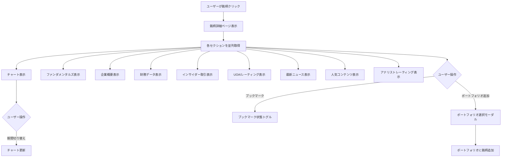
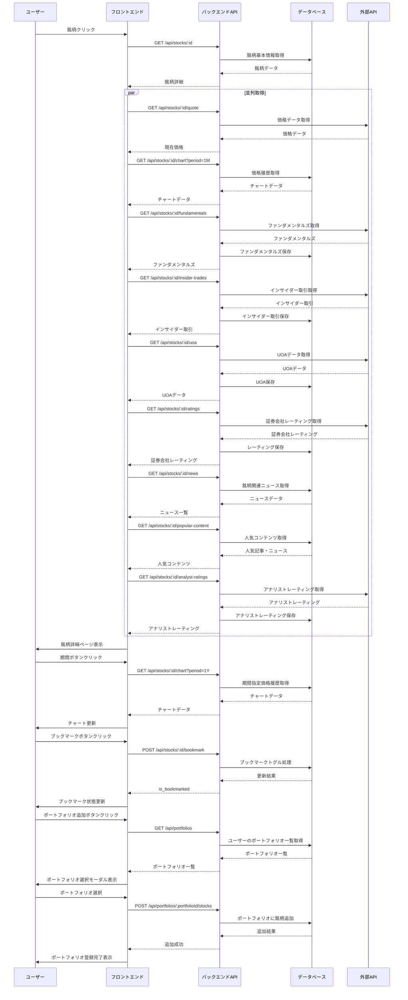

# 個別銘柄ページ

## 機能概要

1つの銘柄に関する全ての情報を1ページで提供する画面。価格チャート、ファンダメンタルズ、企業概要、財務データ、インサイダー取引、UOA/レーティング、最新ニュース、人気コンテンツ、アナリストレーティングを表示する。

## 目的

- 投資初心者が1つの銘柄についての基本情報を1ページで把握できるようにする
- アクティブ投資家（投資上級者）が高度な分析情報（UOA、インサイダー取引、アナリストレーティング）を一箇所で確認できるようにする
- 複数の情報ソースを巡回する手間を削減する
- 投資判断に必要な情報を整理して提供する

## 機能条件

### 権限

| ロール | 閲覧 | ブックマーク | ポートフォリオ登録 |
|--------|------|------------|------------------|
| admin  | ○ | ○ | ○ |
| writer | ○ | ○ | ○ |
| user   | ○ | ○ | ○ |

### 制約事項
🟢 **後回し可**

- リアルタイム価格表示の実装有無: TBD
  - 案1: 表示 → ユーザー価値高、APIコスト増
  - 案2: 非表示 → 実装簡易
  - **決定: TBD**
- 移動平均線の表示の実装有無: TBD
  - **決定: TBD**

## 画面設計図
🟡 **中程度**

Pencil: `docs/versions/1_0_0/SikouLab.pen` ノードID: 0Cn3B

### レイアウト構成

```
┌─────────────────────────────────────────────────────────┐
│ ヘッダー                                                 │
│ [戻る] AAPL Apple Inc.                           [☆]    │
├─────────────────────────────────────────────────────────┤
│ チャートセクション (F-03-1)                              │
│ [1日][1週][1ヶ月][3ヶ月][6ヶ月][1年][YTD][全期間]        │
│ ┌───────────────────────────────────────────────────┐  │
│ │ 価格チャート + ニュースアイコンオーバーレイ (F-03-2)│  │
│ └───────────────────────────────────────────────────┘  │
├─────────────────────────────────────────────────────────┤
│ ファンダメンタルズ (F-03-3)                             │
│ │ 市場価値: $2.8T │ P/E比率: 28.5 │ EPS: 6.05         │
├─────────────────────────────────────────────────────────┤
│ 企業概要 (F-03-4)                                       │
│ 説明文...                                               │
├─────────────────────────────────────────────────────────┤
│ 財務データ (F-03-5)                                     │
│ │ 売上: $365.8B │ 前年比: -2.0%                       │
│ │ 純利益: $94.7B │ 前年比: -7.8%                       │
├─────────────────────────────────────────────────────────┤
│ インサイダー取引 (F-03-6)                               │
│ │ 最近のインサイダー取引一覧...                          │
├─────────────────────────────────────────────────────────┤
│ UOA/レーティング (F-03-7)                               │
│ │ UOA: 45% │ レーティング: 買い保有 28/45              │
├─────────────────────────────────────────────────────────┤
│ 最新ニュース (F-03-2)                                   │
│ │ ニュース記事一覧...                                    │
├─────────────────────────────────────────────────────────┤
│ 人気コンテンツ (F-03-8)                                 │
│ │ 人気記事・ニュース一覧...                              │
├─────────────────────────────────────────────────────────┤
│ アナリストレーティング (F-03-9)                         │
│ │ 価格ターゲット: $210 | コンセンサス: 買い             │
└─────────────────────────────────────────────────────────┘
```

## 関連テーブル

```mermaid
erDiagram
    %% 正: docs/versions/1_0_0/system_datas.md
    stocks ||--o{ stock_prices : "has"
    stocks ||--o{ stock_fundamentals : "has"
    stocks ||--o{ stock_insider_trades : "has"
    stocks ||--o{ stock_uoa : "has"
    stocks ||--o{ stock_ratings : "has"
    stocks ||--o{ analyst_ratings : "has"
    stocks ||--o{ stock_news : "relates"
    stocks ||--o{ stock_articles : "relates"
    stocks ||--o{ portfolio_stocks : "included"
    news ||--o{ stock_news : "has"
    articles ||--o{ stock_articles : "has"
    articles ||--o{ article_views : "receives"
    news ||--o{ news_views : "receives"
    portfolios ||--o{ portfolio_stocks : "contains"

    stocks {
        uuid id PK
        string symbol
        string name
        datetime created_at
        datetime updated_at
    }

    stock_prices {
        uuid id PK
        uuid stock_id FK
        date price_date
        decimal open
        decimal high
        decimal low
        decimal close
        bigint volume
        datetime created_at
        datetime updated_at
    }

    stock_fundamentals {
        uuid id PK
        uuid stock_id FK
        date date
        decimal market_cap
        decimal pe_ratio
        decimal eps
        datetime created_at
        datetime updated_at
    }

    stock_insider_trades {
        uuid id PK
        uuid stock_id FK
        string insider_name
        string insider_title
        string transaction_type
        decimal shares
        decimal price
        date date
        datetime filed_at
        datetime created_at
        datetime updated_at
    }

    stock_uoa {
        uuid id PK
        uuid stock_id FK
        string option_type
        decimal strike
        date expiry
        bigint volume
        datetime detected_at
        datetime created_at
        datetime updated_at
    }

    stock_ratings {
        uuid id PK
        uuid stock_id FK
        string firm_name
        string rating
        decimal target_price
        datetime rated_at
        datetime created_at
        datetime updated_at
    }

    analyst_ratings {
        uuid id PK
        uuid stock_id FK
        string analyst_name
        string grade
        text comment
        datetime rated_at
        datetime created_at
        datetime updated_at
    }

    stock_news {
        uuid id PK
        uuid stock_id FK
        uuid news_id FK
        datetime created_at
        datetime updated_at
    }

    news {
        uuid id PK
        string source
        string title
        text body
        string original_language
        string sentiment "POSITIVE/NEGATIVE/NEUTRAL"
        datetime published_at
        datetime created_at
        datetime updated_at
    }

    news_views {
        uuid id PK
        uuid user_id FK
        uuid news_id FK
        datetime created_at
        datetime updated_at
    }

    stock_articles {
        uuid id PK
        uuid stock_id FK
        uuid article_id FK
        datetime created_at
        datetime updated_at
    }

    articles {
        uuid id PK
        uuid author_id FK
        string title
        text body
        string status "draft/scheduled/published/publish_failed"
        datetime scheduled_at "予約日時（ユーザー指定）"
        datetime published_at "実際の公開日時"
        datetime created_at
        datetime updated_at
    }

    article_views {
        uuid id PK
        uuid user_id FK
        uuid article_id FK
        datetime created_at
        datetime updated_at
    }

    portfolios {
        uuid id PK
        uuid user_id FK
        string name
        datetime created_at
        datetime updated_at
    }

    portfolio_stocks {
        uuid id PK
        uuid portfolio_id FK
        uuid stock_id FK
        decimal purchase_price "取得価格"
        int shares "保有株数"
        datetime created_at
        datetime updated_at
    }
```



## フロー図



## シーケンス図



## 機能要件
🟡 **中程度**

### 機能要件1: 価格チャート表示(F-03-1)
- 機能仕様1: 価格チャートを表示（ローソク足または折れ線グラフ）
- 機能仕様2: 期間切り替えボタン: 1日・1週間・1ヶ月・3ヶ月・6ヶ月・1年・YTD・全期間
- 機能仕様3: チャート上にニュースアイコンをオーバーレイ表示（F-03-2連動）
- 機能仕様4: 移動平均線の表示: TBD
- 機能仕様5: ボリューム表示: TBD

### 機能要件2: ニュース表示・オーバーレイ(F-03-2)
- 機能仕様1: チャート上にニュースアイコンをオーバーレイ表示
- 機能仕様2: アイコンクリックでツールチップまたはニュース詳細へ遷移
- 機能仕様3: 最新ニュース一覧を表示
- 機能仕様4: ニュースクリックでニュース詳細ページへ遷移

### 機能要件3: ファンダメンタルズ表示(F-03-3)
- 機能仕様1: 市場価値（Market Cap）
- 機能仕様2: P/E比率
- 機能仕様3: EPS（1株あたり利益）
- 機能仕様4: 配当利回り
- 機能仕様5: 52週高値・安値

### 機能要件4: 企業概要表示(F-03-4)
- 機能仕様1: 企業名・ティッカー
- 機能仕様2: 業種・セクター
- 機能仕様3: 企業説明文
- 機能仕様4: 本社所在地
- 機能仕様5: 設立年
- 機能仕様6: 従業員数

### 機能要件5: 財務データ表示(F-03-5)
- 機能仕様1: 売上高・前年比
- 機能仕様2: 純利益・前年比
- 機能仕様3: 営業利益率
- 機能仕様4: ROE（自己資本利益率）
- 機能仕様5: 総資産・総負債

### 機能要件6: インサイダー取引表示(F-03-6)
- 機能仕様1: 最近のインサイダー取引一覧
- 機能仕様2: 取引者名・役職
- 機能仕様3: 取引タイプ（売買）
- 機能仕様4: 株式数・価格
- 機能仕様5: 取引日・届出日時

### 機能要件7: UOA/レーティング表示(F-03-7)
- 機能仕様1: UOA（Unusual Options Activity）一覧
  - オプション種別（call/put）
  - 権利行使価格・満期日
  - 取引量・検出日時
- 機能仕様2: 証券会社レーティング一覧
  - 証券会社名
  - レーティング（buy/hold/sell）
  - 目標株価
  - レーティング日時
- 機能仕様3: レーティング集計（買い・保有・売りの数）をフロントエンドで計算

### 機能要件8: 人気コンテンツ表示(F-03-8)
- 機能仕様1: 直近3ヶ月の人気記事・ニュース
- 機能仕様2: 関連銘柄に紐付くコンテンツ
- 機能仕様3: View数順にソート
- 機能仕様4: 記事・ニュースクリックで詳細ページへ遷移

### 機能要件9: アナリストレーティング表示(F-03-9)
- 機能仕様1: アナリスト格付け一覧
  - アナリスト名
  - 格付け（grade）
  - コメント
  - 格付け日時
- 機能仕様2: 格付けの集計をフロントエンドで計算

### 機能要件10: ブックマーク操作(F-08)
- 機能仕様1: ブックマークボタンでトグル操作
- 機能仕様2: ブックマーク状態を表示

### 機能要件11: ポートフォリオ登録(F-09)
- 機能仕様1: ポートフォリオ追加ボタンでポートフォリオ選択モーダルを表示
- 機能仕様2: 既存ポートフォリオから選択して銘柄を追加
- 機能仕様3: ポートフォリオ未作成の場合は新規作成を促す
- 機能仕様4: 登録済みのポートフォリオに含まれる場合は登録済み状態を表示

## 非機能要件
🟢 **後回し可**

### 非機能要件1: パフォーマンス
- 非機能仕様1: 初期表示: 3秒以内
- 非機能仕様2: チャート描画: 2秒以内

### 非機能要件2: UX
- 非機能仕様1: 読み込み中はスケルトン表示
- 非機能仕様2: エラー発生時は適切なエラーメッセージ表示
- 非機能仕様3: 銘柄が存在しない場合は404ページへ遷移

## ログ
🟢 **後回し可**

### 出力タイミング
- 案1: API呼び出し時に全て出力 → 追跡しやすいがログ量増加
- 案2: エラー時のみ出力 → ログ量削減だが正常系追跡困難
- 案3: 重要操作のみ出力 → バランス型
- **決定: TBD**

### ログレベル方針
- 案1: INFO中心 → 詳細追跡可能
- 案2: WARN/ERROR中心 → 異常検知に特化
- **決定: TBD**

## ユースケース
🟡 **中程度**

### シナリオ1: 銘柄詳細閲覧
1. ユーザーが銘柄をクリック
2. 銘柄詳細ページが表示される
3. チャート、ファンダメンタルズ、ニュース等が表示される
4. 必要な情報を確認

### シナリオ2: 期間切り替え
1. ユーザーが期間ボタンをクリック
2. チャートが指定期間のデータで更新される
3. ニュースアイコンも期間に応じて更新

### シナリオ3: 人気コンテンツ閲覧
1. ユーザーが人気コンテンツセクションを確認
2. 関連する人気記事・ニュースが表示される
3. 記事・ニュースをクリックして詳細へ遷移

### シナリオ4: ブックマーク操作
1. ユーザーがブックマークボタンをクリック
2. ブックマーク状態がトグルされる

## テストケース
🟡 **中程度**

**記載タイミング**: 単体テストは大枠のみ設計段階、詳細はTDD実装時。E2Eテストは実装完了後

### 単体テスト（設計段階は大枠のみ、詳細はTDD実装時に追記）

| テスト項目 | 対応仕様 | 観点 | 期待値 |
|------------|----------|------|--------|
| 銘柄詳細取得 | 機能要件1/機能仕様1, 機能要件3/機能仕様1, 機能要件4/機能仕様1 | 銘柄IDを指定して銘柄詳細を取得 | 銘柄情報・価格・ファンダメンタルズが返される |
| チャートデータ取得 | 機能要件1/機能仕様1 | 期間を指定して価格履歴を取得 | 指定期間のチャートデータが返される |
| ニュースオーバーレイ表示 | 機能要件2/機能仕様1 | 銘柄に関連するニュースを取得 | チャート上にニュースアイコンが表示される |
| 人気コンテンツ取得 | 機能要件8/機能仕様1 | 直近3ヶ月の人気コンテンツを取得 | View数順の記事・ニュースが返される |
| インサイダー取引取得 | 機能要件6/機能仕様1 | 最近のインサイダー取引を取得 | インサイダー取引一覧が返される |
| アナリストレーティング取得 | 機能要件9/機能仕様1 | アナリストレーティングを取得 | 価格ターゲット・レーティング集計が返される |
| 期間切り替え | 機能要件1/機能仕様2 | 異なる期間でチャートデータを取得 | 期間に応じたチャートデータが返される |
| ブックマークトグル | 機能要件10/機能仕様1 | ブックマークボタンクリック | ブックマーク状態がトグルされる |
| ポートフォリオ一覧取得 | 機能要件11/機能仕様2 | ユーザーのポートフォリオ一覧を取得 | ポートフォリオ一覧が返される |
| ポートフォリオへ銘柄追加 | 機能要件11/機能仕様2 | 選択したポートフォリオに銘柄を追加 | 銘柄がポートフォリオに追加される |

### E2Eテスト（実装完了後に記載）

| テストシナリオ | 対応仕様 | 観点 | 期待値 |
|----------------|----------|------|--------|
| 銘柄詳細閲覧フロー | 機能要件1〜機能要件9 | 銘柄一覧→銘柄クリック→銘柄詳細表示 | TBD（実装完了後に記載） |
| 期間切り替えフロー | 機能要件1/機能仕様2 | 銘柄詳細→期間ボタンクリック→チャート更新 | TBD（実装完了後に記載） |
| 人気コンテンツ閲覧フロー | 機能要件8/機能仕様4 | 銘柄詳細→人気記事クリック→記事詳細へ遷移 | TBD（実装完了後に記載） |
| ブックマーク操作フロー | 機能要件10/機能仕様1 | 銘柄詳細→ブックマーククリック→状態更新 | TBD（実装完了後に記載） |
| ポートフォリオ登録フロー | 機能要件11/機能仕様1 | 銘柄詳細→ポートフォリオ追加→ポートフォリオ選択→登録完了 | TBD（実装完了後に記載） |

## 影響範囲一覧

### 機能影響範囲

| 関連機能 | 影響内容 |
|----------|----------|
| F-03 | 個別銘柄ページ自身（全サブ機能を含む） |
| F-04-3 | 記事カードから銘柄詳細へ遷移 |
| F-04-4 | 人気記事から銘柄詳細へ遷移 |
| F-04-5 | 関連銘柄から銘柄詳細へ遷移 |
| F-05-3 | ニュースカードから銘柄詳細へ遷移 |
| F-05-4 | トレンドニュースから銘柄詳細へ遷移 |
| F-05-5 | ニュース詳細の関連銘柄から遷移 |
| F-08 | ブックマーク一覧・ブックマーク操作 |
| F-09 | ポートフォリオへの銘柄登録・登録状態表示 |
| F-12-5 | 銘柄閲覧履歴が閲覧数集計に使用される |

### コード影響範囲
🟢 **後回し可**

- 案1: フロントエンド（銘柄詳細画面・チャート・各セクション）＋ バックエンド（銘柄関連API全般） → 単一機能として実装
- **決定: 案1を採用（実装時に確定）**

### 技術選定

| 用途 | ライブラリ | 理由 |
|------|----------|------|
| **株価チャート（ローソク足・ボリューム・ニュースオーバーレイ）** | lightweight-charts | TradingView製、金融チャート専用、超軽量(45KB)、パフォーマンス最高、Series Markers APIでニュースアイコン表示が簡単、MITライセンス（無料・商用利用OK） |
| **ライン/エリア+バブルマーカー** | lightweight-charts | Line Series + Area Series + Series Markersで実現可能 |
| **センチメント時系列チャート（マルチライン）** | lightweight-charts | 複数Line Series追加で実現可能、実線/点線の使い分けも対応 |
| **バブルチャート（散布図・カテゴリカルX軸）** | Recharts | ScatterChart + ZAxisで標準対応、lightweight-chartsは時系列専用で不適 |
| **数値フォーマット** | Intl.NumberFormat | ブラウザ標準API |
| **日付フォーマット** | Intl.DateTimeFormat | ブラウザ標準API |

**参考リンク:**
- [Lightweight Charts 公式](https://www.tradingview.com/lightweight-charts/)
- [Series Markers チュートリアル](https://tradingview.github.io/lightweight-charts/tutorials/how_to/series-markers)
- [Crosshair/ツールチープ チュートリアル](https://tradingview.github.io/lightweight-charts/tutorials/tooltips)
- [Recharts ScatterChart](https://recharts.org/en-US/api/ScatterChart)

## 作業見積もり
🟢 **後回し可**

### 見積もりサマリー

| 項目 | ストーリーポイント | 目安時間 |
|------|------------------|----------|
| **合計** | 54sp | 13.5時間 |

**目安**: 4sp = 1時間（実装＋単体テスト＋レビューを含む、あくまで参考値）

### タスク一覧

| タスク | ストーリーポイント | 備考 |
|--------|------------------|------|
| **バックエンド** | | |
| 銘柄詳細取得API | 3sp | 銘柄基本情報取得、認証 |
| チャートデータ取得API | 4sp | 期間指定データ取得、外部API連携 |
| ファンダメンタルズ取得API | 2sp | データ取得・集計 |
| インサイダー取引取得API | 2sp | データ取得 |
| UOA取得API | 2sp | UOAデータ取得 |
| 証券会社レーティング取得API | 2sp | レーティングデータ取得・集計 |
| 最新ニュース取得API | 2sp | 銘柄関連ニュース取得 |
| 人気コンテンツ取得API | 3sp | 直近3ヶ月×View数で集計、記事・ニュース統合 |
| アナリストレーティング取得API | 2sp | データ取得・集計 |
| ブックマークトグルAPI | 2sp | トグル処理 |
| **フロントエンド** | | |
| 銘柄詳細画面ベース | 3sp | レイアウト、ヘッダー、各セクション枠組み |
| 価格チャート (F-03-1) | 5sp | チャートライブラリ導入、期間切り替え、ニュースオーバーレイ連携 |
| ニュース表示・オーバーレイ (F-03-2) | 3sp | チャート上アイコン表示、ツールチップ、ニュース一覧 |
| ファンダメンタルズ (F-03-3) | 2sp | 指標表示、数値フォーマット |
| 企業概要 (F-03-4) | 2sp | 企業情報表示 |
| 財務データ (F-03-5) | 2sp | 財務指標表示 |
| インサイダー取引 (F-03-6) | 3sp | テーブル表示、ソート |
| UOA/レーティング (F-03-7) | 2sp | UOA表示、レーティング集計表示 |
| 人気コンテンツ (F-03-8) | 2sp | 記事・ニュースカード表示、遷移 |
| アナリストレーティング (F-03-9) | 2sp | 価格ターゲット、コンセンサス、アナリスト別一覧 |
| ブックマーク操作 | 2sp | API連携、状態管理、トグル処理 |
| ポートフォリオ登録 (F-09) | 2sp | ポートフォリオ選択モーダル、登録状態表示 |
| スケルトン・エラー処理 | 2sp | ローディング状態、404ページ |
| **テスト** | | |
| 単体テスト | 3sp | API・状態管理・集計ロジックの単体テスト |
| E2Eテスト | 3sp | 4シナリオ（閲覧・期間切り替え・人気コンテンツ・ブックマーク） |

### リスク要因

- **外部API依存**: 価格データ・チャートデータの外部API連携の信頼性
- **パフォーマンス要件**: 初期表示3秒以内の要件を満たすための並列取得最適化
- **チャートライブラリ習得**: lightweight-chartsのAPI習得とカスタマイズ工数（ツールチップ・ニュースオーバーレイ等）

### 依存関係

#### 機能依存
- F-01（ログイン機能）: 認証機能が必要
- F-04（記事機能）: 人気記事取得・記事詳細ページ遷移
- F-05（ニュース機能）: 人気ニュース取得・ニュース詳細ページ遷移
- F-08（ブックマーク機能）: ブックマーク一覧との整合性
- F-09（ポートフォリオ機能）: ポートフォリオへの銘柄登録

#### 外部ライブラリ依存
```bash
# 金融チャート（株価・センチメント等）
npm install lightweight-charts

# バブルチャート（散布図）
npm install recharts
```
