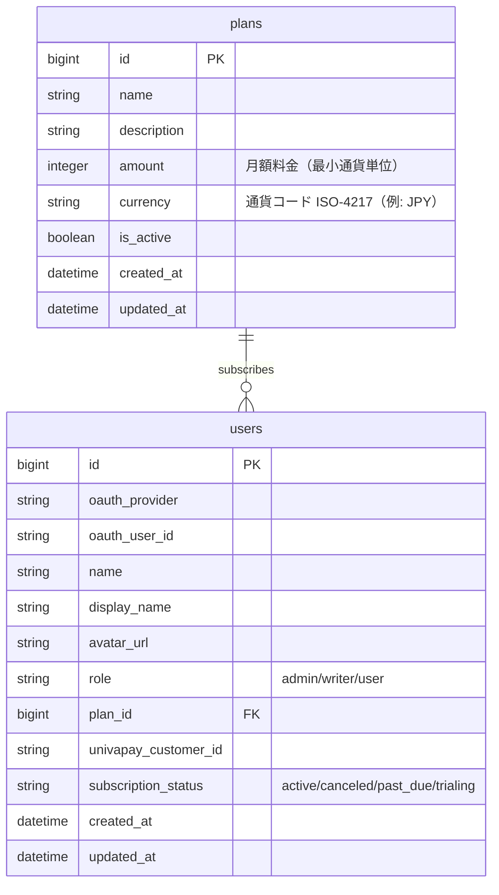
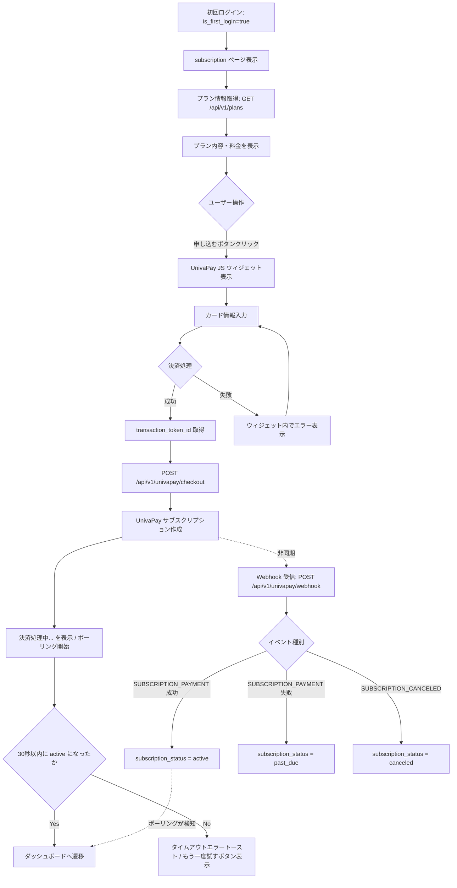
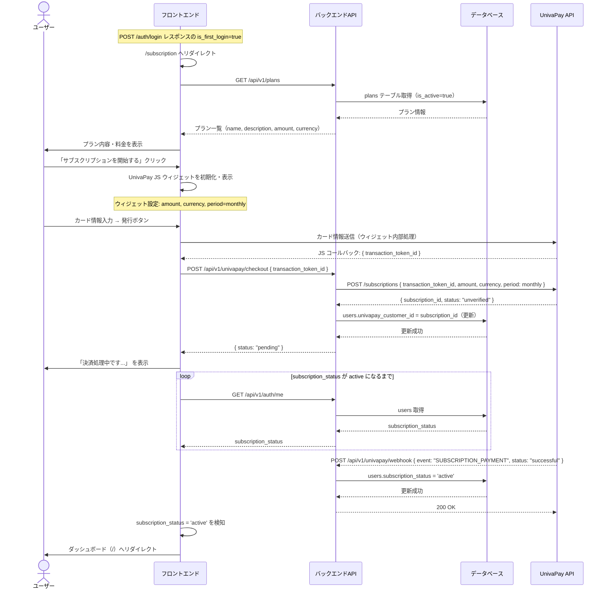

# サブスクリプション登録フロー（初回 Checkout）

## 機能概要

初回ログイン後に表示されるサブスクリプション登録画面。UnivaPay JS ウィジェットを使ってカード情報を入力し、サブスクリプションを開始するフロー。

## 目的

初回ログインユーザーが最短ステップでサブスクリプションを開始できるようにする。完全サブスクリプション制（未加入ユーザーはサービスを利用できない）のため、ログイン直後にブロッキングな登録フローを提供する。

## 機能条件

### 権限

| ロール | 操作可否 |
|--------|----------|
| admin  | ○ |
| writer | ○ |
| user   | ○ |

※ `subscription_status != 'active'` かつ `is_first_login = true` のユーザーが対象。

### 制約事項
🟢 **後回し可**

- 案1: プラン選択画面なし（1プランのみ表示して即申し込み）→ UI がシンプル、スキップが難しい
- 案2: プランの詳細説明ページを挟む → 離脱率が下がる可能性あり
- **決定: 1 プランのみ表示して即申し込み**（選択肢なし）

- プランの月額料金: **TBD**（UnivaPay ダッシュボードで定義後に確定）
- 請求通貨: **TBD**（JPY を想定）
- 決済方法: UnivaPay JS ウィジェット（クレカ・Paidy 等、ウィジェットが対応する全手段）

## 画面設計図
🟡 **中程度**

Pencil 未定義画面（D-05 決定: テキストベースで実装）。

### /subscription ページ

```
┌──────────────────────────────────────────────┐
│ シコウラボ                                      │
├──────────────────────────────────────────────┤
│                                              │
│   ようこそ！サービスをご利用になるには         │
│   サブスクリプションの登録が必要です。         │
│                                              │
│  ┌──────────────────────────────────────┐   │
│  │ プレミアムプラン                        │   │
│  │ ¥X,XXX / 月                           │   │
│  │                                      │   │
│  │ ✓ 記事・ニュース閲覧                   │   │
│  │ ✓ 銘柄詳細ページ                       │   │
│  │ ✓ アンケート機能                       │   │
│  │ ✓ ポートフォリオ管理                    │   │
│  │                                      │   │
│  │    [サブスクリプションを開始する]         │   │
│  └──────────────────────────────────────┘   │
│                                              │
│   ※ クレジットカード・Paidy 等で決済できます   │
│   ※ いつでもキャンセル可能                    │
│                                              │
└──────────────────────────────────────────────┘
```

ボタンクリック後、UnivaPay JS ウィジェットがポップアップで表示される。

## 関連テーブル



**`univapay_customer_id` カラムの用途**:
- 案1: UnivaPay サブスクリプション ID を保存 → 解約・管理に直接使える
- 案2: UnivaPay トランザクショントークン ID を保存 → 請求詳細のトレースに使える
- **決定: サブスクリプション ID を保存**（解約・ポータル URL 生成に必要なため）

## フロー図
🟡 **中程度**



## シーケンス図



### Webhook イベントと DB 更新マッピング

| UnivaPay イベント | 条件 | users.subscription_status |
|------------------|------|--------------------------|
| `SUBSCRIPTION_PAYMENT` | status = successful | `active` |
| `SUBSCRIPTION_PAYMENT` | status = failed | `past_due` |
| `SUBSCRIPTION_FAILED` | - | `past_due` |
| `SUBSCRIPTION_CANCELED` | - | `canceled` |

## 機能要件
🟡 **中程度**

### 機能要件1: プラン情報取得 API（1-5）

- 機能仕様1: アクティブなプランを取得して返す
  - `plans.is_active = true` のプランを全件返す
  - レスポンス: `{ id, name, description, amount, currency }`
  - `amount` と `currency` は `plans` テーブルの同名カラムから返す

### 機能要件2: サブスクリプション作成 API（1-5）

- 機能仕様1: UnivaPay サブスクリプションを作成する
  - リクエスト: `{ transaction_token_id: string }`
  - UnivaPay API にサブスクリプションを作成（amount, currency, period=monthly）
  - 作成した `subscription_id` を `users.univapay_customer_id` に保存
  - レスポンス: `{ status: "pending" }`

- 機能仕様2: 認証済みユーザーのみ操作を許可する
  - Cookie セッション検証（RequireAuth ミドルウェア）
  - 既に `subscription_status = 'active'` のユーザーは 409 を返す

### 機能要件3: Webhook 受信 API（1-5）

- 機能仕様1: UnivaPay の Webhook イベントを受信して subscription_status を更新する
  - エンドポイント: `POST /api/v1/univapay/webhook`
  - **セッション Cookie 認証不要**（UnivaPay サーバーからのリクエストのため）
  - Webhook 認証: `Univapay-Signature` ヘッダーの **HMAC-SHA256 署名検証**
    - UnivaPay がリクエストボディを共有シークレットで HMAC-SHA256 署名して送信する
    - サーバー側で `hmac.Equal` による定数時間比較で検証する（タイミング攻撃対策）
    - 検証失敗時は 401 を返す
    - シークレットは環境変数 `UNIVAPAY_WEBHOOK_SECRET` で管理する
  - 対応イベント: `SUBSCRIPTION_PAYMENT`, `SUBSCRIPTION_FAILED`, `SUBSCRIPTION_CANCELED`
  - イベントと subscription_status のマッピングは上記テーブルに従う

- 機能仕様2: 冪等性を確保する
  - 同一イベントが複数回送られた場合も安全に処理する
  - `users.subscription_status` の上書きで対応（UPSERT 不要）

### 機能要件4: サブスクリプション登録画面（1-8）

- 機能仕様1: プラン情報を表示する
  - `GET /api/v1/plans` でプラン情報を取得して表示
  - プラン名、月額料金、主な機能を列挙

- 機能仕様2: UnivaPay JS ウィジェットを起動する
  - 「サブスクリプションを開始する」ボタンクリックでウィジェットを表示
  - ウィジェット設定: 金額・通貨・課金サイクル（monthly）

- 機能仕様3: 決済完了後にダッシュボードへ遷移する
  - JS コールバックで `transaction_token_id` を受け取り `POST /api/v1/univapay/checkout` を呼ぶ
  - `subscription_status = 'active'` になるまで `GET /api/v1/auth/me` をポーリング（間隔: 2 秒、上限: 30 秒）
  - 完了後 `/` にリダイレクト
  - タイムアウト時はエラートースト表示と「もう一度試す」ボタン表示

## 非機能要件
🟢 **後回し可**

### 非機能要件1: セキュリティ
- 非機能仕様1: Webhook エンドポイントは `Univapay-Signature` ヘッダーの HMAC-SHA256 署名検証で UnivaPay からのリクエストのみを受け付ける
  - `hmac.Equal` による定数時間比較（タイミング攻撃対策）
  - シークレットは環境変数 `UNIVAPAY_WEBHOOK_SECRET` で管理
- 非機能仕様2: `POST /api/v1/univapay/checkout` はセッション Cookie 認証済みユーザーのみ

### 非機能要件2: ポーリング上限
- 非機能仕様1: 30 秒以内に `active` にならない場合はタイムアウトエラーを表示
  - Webhook の遅延対策: タイムアウト後も Webhook は有効なので、ユーザーが再ロードすれば反映される

## ログ
🟢 **後回し可**

### 出力タイミング
- 案1: Webhook 受信時のみ出力（イベント種別・subscription_id・更新後 status）
- 案2: 全 API コールを INFO ログ出力
- **決定: TBD**

## ユースケース
🟡 **中程度**

### シナリオ1: 正常な初回サブスクリプション登録（早期決定）

1. ユーザーが Google ログイン → `is_first_login=true` → `/subscription` にリダイレクト
2. プランの料金・特徴を確認
3. 「サブスクリプションを開始する」クリック → ウィジェットが表示
4. クレジットカード情報を入力して「発行」クリック
5. 「決済処理中...」表示
6. Webhook 受信（数秒以内）→ `subscription_status = 'active'`
7. ダッシュボードへ自動遷移

### シナリオ2: 決済失敗（TBD 可）

1. カード番号が無効 → ウィジェット内でエラー表示（UnivaPay ウィジェット側）
2. ユーザーが修正して再試行

### シナリオ3: Webhook タイムアウト（TBD 可）

1. 決済自体は成功するが Webhook 到達が遅延
2. 30 秒後にタイムアウトエラートースト
3. ユーザーがページをリロード → `active` に更新済みなのでダッシュボードへ遷移

## テストケース
🟡 **中程度**

### 単体テスト

#### Usecase: GetPlans（機能要件1）

| テスト項目 | 対応仕様 | 入力・条件 | 期待値 |
|------------|----------|------------|--------|
| アクティブプランのみ取得できる | 機能要件1/機能仕様1 | DB に is_active=true 1件・is_active=false 1件 | is_active=true の1件のみ返る |
| アクティブプランが0件 | 機能要件1/機能仕様1 | DB に is_active=false のみ存在 | 空スライス（エラーなし） |
| DBエラー時 | 機能要件1/機能仕様1 | repository がエラーを返す | error が返る |

#### Handler: GET /api/v1/plans（機能要件1）

| テスト項目 | 対応仕様 | 入力・条件 | 期待値 |
|------------|----------|------------|--------|
| 正常レスポンス | 機能要件1/機能仕様1 | usecase 正常 | 200, `[{ id, name, description, amount, currency }]` |
| usecase エラー | 機能要件1/機能仕様1 | usecase がエラーを返す | 500 |

#### Usecase: Checkout（機能要件2）

| テスト項目 | 対応仕様 | 入力・条件 | 期待値 |
|------------|----------|------------|--------|
| 正常: サブスク作成 | 機能要件2/機能仕様1 | transaction_token_id="tok_xxx"・user.subscription_status="trialing" | UnivaPay API 呼び出し済み・users.univapay_customer_id に subscription_id が保存される |
| 既に active のユーザー | 機能要件2/機能仕様2 | user.subscription_status="active" | ErrAlreadySubscribed が返る（HTTP 409 相当） |
| UnivaPay API エラー | 機能要件2/機能仕様1 | UnivaPay がエラーレスポンスを返す | error が返る（DB 更新はされない） |
| DB 更新エラー | 機能要件2/機能仕様1 | subscription_id 保存時に DB エラー | error が返る |

#### Handler: POST /api/v1/univapay/checkout（機能要件2）

| テスト項目 | 対応仕様 | 入力・条件 | 期待値 |
|------------|----------|------------|--------|
| 未認証（Cookie なし） | 機能要件2/機能仕様2 | RequireAuth 通過前（Cookie 不在） | 401 |
| transaction_token_id が空文字 | 機能要件2/機能仕様1 | body: `{ "transaction_token_id": "" }` | 400 |
| transaction_token_id フィールドなし | 機能要件2/機能仕様1 | body: `{}` | 400 |
| 正常 | 機能要件2/機能仕様1 | 有効な transaction_token_id・認証済みユーザー | 200, `{ "status": "pending" }` |
| 既に active のユーザー | 機能要件2/機能仕様2 | usecase が ErrAlreadySubscribed を返す | 409 |
| usecase エラー（上記以外） | 機能要件2/機能仕様1 | usecase が予期しないエラーを返す | 500 |

#### Usecase: HandleWebhook（機能要件3）

| テスト項目 | 対応仕様 | 入力・条件 | 期待値 |
|------------|----------|------------|--------|
| SUBSCRIPTION_PAYMENT 成功 | 機能要件3/機能仕様1 | event=SUBSCRIPTION_PAYMENT, status=successful | subscription_status='active' に更新 |
| SUBSCRIPTION_PAYMENT 失敗 | 機能要件3/機能仕様1 | event=SUBSCRIPTION_PAYMENT, status=failed | subscription_status='past_due' に更新 |
| SUBSCRIPTION_FAILED | 機能要件3/機能仕様1 | event=SUBSCRIPTION_FAILED | subscription_status='past_due' に更新 |
| SUBSCRIPTION_CANCELED | 機能要件3/機能仕様1 | event=SUBSCRIPTION_CANCELED | subscription_status='canceled' に更新 |
| 未知イベント種別 | 機能要件3/機能仕様1 | event="UNKNOWN_EVENT" | DB 更新なし・error なし（無視） |
| subscription_id に対応するユーザー不在 | 機能要件3/機能仕様1 | 存在しない subscription_id | DB 更新なし・error なし（ログのみ） |
| 冪等性: 同一イベントを2回受信 | 機能要件3/機能仕様2 | 同じ subscription_id・同じイベントを2回呼び出す | 2回目も正常終了（エラーにならない） |
| DB 更新エラー | 機能要件3/機能仕様1 | repository がエラーを返す | error が返る |

#### Handler: POST /api/v1/univapay/webhook（機能要件3）

| テスト項目 | 対応仕様 | 入力・条件 | 期待値 |
|------------|----------|------------|--------|
| Signature ヘッダーなし | 機能要件3/機能仕様1 | `Univapay-Signature` ヘッダー不在 | 401 |
| Signature が不正値（HMAC 不一致） | 機能要件3/機能仕様1 | `Univapay-Signature: wrong_hmac` | 401 |
| Signature が正しい・正常イベント | 機能要件3/機能仕様1 | 正しい HMAC-SHA256 署名 + 有効なペイロード | 200 |
| usecase エラー | 機能要件3/機能仕様1 | usecase がエラーを返す | 500 |

### E2Eテスト（実装完了後に記載）

| テストシナリオ | 対応仕様 | 観点 | 期待値 |
|----------------|----------|------|--------|
| 初回登録フロー | 機能要件4/機能仕様1〜3 | ログイン→ウィジェット→決済→ダッシュボード | TBD（実装完了後に記載） |
| タイムアウト処理 | 機能要件4/機能仕様3 | 30秒経過後のエラー表示 | TBD（実装完了後に記載） |

## 影響範囲一覧

### 機能影響範囲

| 関連機能 | 影響内容 |
|----------|----------|
| F-01 ログイン機能 | `is_first_login=true` でこの画面へリダイレクト |
| F-10-2 サブスクリプション管理 | `univapay_customer_id`（subscription_id）を管理・解約に流用 |
| 認証ミドルウェア | `RequireSubscription` が `subscription_status='active'` を判定 |
| plans テーブル | プラン情報のデータソース（amount/currency カラム追加済み → data-model.md 更新済み） |

### コード影響範囲
🟢 **後回し可**

- バックエンド:
  - `GET /api/v1/plans` — 新規
  - `POST /api/v1/univapay/checkout` — 新規
  - `POST /api/v1/univapay/webhook` — 新規
  - `internal/usecase/subscription.go` — 新規
  - `internal/handler/subscription.go` — 新規
  - `internal/repository/subscription.go` — 新規（または user.go に追記）
- フロントエンド:
  - `app/subscription/page.tsx` — 新規
  - `components/subscription/CheckoutPage.tsx` — 新規
  - UnivaPay JS SDK の読み込み（`next.config.ts` の Script 設定 TBD）

## OpenAPI との連携

feature-spec 完了後、以下のエンドポイントを `backend/api/openapi.yaml` に追記する。

| メソッド | パス | 概要 |
|---------|------|------|
| `GET` | `/api/v1/plans` | アクティブなプラン一覧取得 |
| `POST` | `/api/v1/univapay/checkout` | UnivaPay サブスクリプション作成 |
| `POST` | `/api/v1/univapay/webhook` | UnivaPay Webhook 受信 |

## ユーザーへの確認事項（実装開始前に必要）

実装開始前に以下の情報が必要です。時期が来たらお知らせください。

| 項目 | 内容 |
|------|------|
| UnivaPay ストア ID / シークレット（テスト環境） | JS ウィジェット初期化に必要 |
| サブスクリプションプラン（amount, currency） | API リクエストに必要 |
| Webhook URL の設定 | `POST /api/v1/univapay/webhook`（バックエンド実装後） |
| Webhook 認証トークン（auth_token） | Webhook 検証に必要 |
