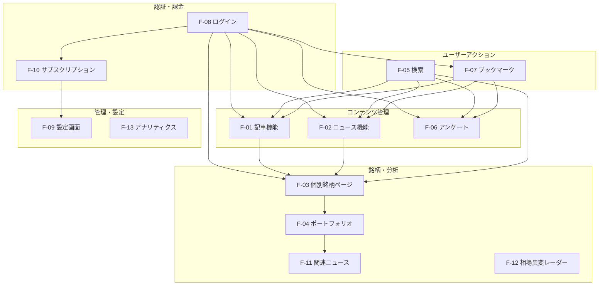
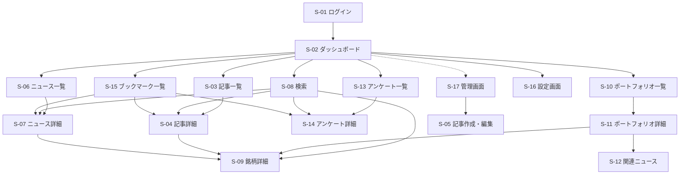
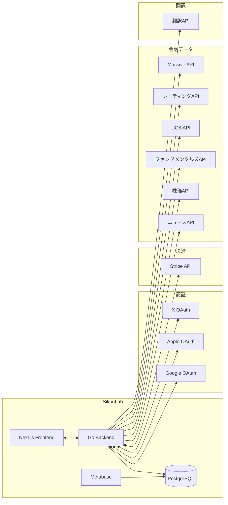

# バージョン 1.0.0 基本設計書

## 1. システム概要

### 1.1 本バージョンの位置づけ

シコウラボの初期リリースバージョン。専門家の記事を購読する「記事購読型コミュニティ」として、ROM専ユーザー（約98.5%）を主要ターゲットとした受動的な情報提供プラットフォームを構築する。

**核心価値**: 専門家の記事を購読すること

### 1.2 前提・制約

- 完全ログイン制（未ログインユーザーは利用不可）
- 完全サブスクリプション制（無料ユーザーは存在しない）
- 上位プランは本バージョンでは不要
- 高級感・専門性を損なわないUI/UX

※ 技術スタック・アーキテクチャ詳細は `docs/development_guidelines.md` を参照

## 2. 機能一覧

### 2.1 機能階層

| ID | 機能名 | 概要 | 対応ストーリー | 優先度 |
|----|--------|------|---------------|--------|
| F-01 | 記事機能 | 記事の作成・編集・公開・予約投稿 | US-01, US-08, US-09 | MUST |
| F-01-1 | 記事作成・編集 | 管理者・記事投稿権限ユーザーによる記事CRUD | US-09 | MUST |
| F-01-2 | 予約投稿 | 公開日時を指定した記事公開 | US-08 | MUST |
| F-01-3 | ジャンル分け | 6ジャンル程度で記事を分類表示 | US-01 | MUST |
| F-01-4 | 人気記事 | 72時間以内×View数で人気記事を表示 | US-01 | MUST |
| F-02 | ニュース機能 | 外部APIから自動取得、日本語翻訳、即時公開 | US-03 | MUST |
| F-02-1 | ニュース自動取得 | 外部APIからニュースを取得しDBに保存 | US-03 | MUST |
| F-02-2 | 日本語翻訳 | ニュースを日本語に翻訳して表示 | US-03 | MUST |
| F-02-3 | 最新ニュース表示 | 36時間以内×View数で注目ニュースを表示 | US-03 | MUST |
| F-02-4 | ニュース編集 | 編集権限者によるニュース内容の修正 | - | MUST |
| F-03 | 個別銘柄ページ | 株価・ファンダメンタルズ・UOA・レーティング表示 | US-02 | MUST |
| F-03-1 | 株価チャート | 時系列での株価推移表示 | US-02 | MUST |
| F-03-2 | ファンダメンタルズ | EPS、時価総額等の基本指標表示 | US-02 | MUST |
| F-03-3 | UOA表示 | Unusual Option Activity表示 | US-02 | MUST |
| F-03-4 | 銘柄関連ニュース | 銘柄に紐づくニュースを日付降順で表示 | US-02, US-07 | MUST |
| F-03-5 | 人気記事/ニュース | 直近3ヶ月×View数で表示 | US-02 | MUST |
| F-03-6 | 証券会社レーティング | 買い/保有/売り、目標株価の表示 | US-02 | MUST |
| F-03-7 | アナリスト格付け | Massive APIによる格付け・コメント表示 | US-02 | MUST |
| F-03-8 | ニュースオーバーレイ | チャート上に値動きがあった日のニュースを表示 | US-02 | MUST |
| F-04 | ポートフォリオ | 銘柄をまとめて管理（最大5つ） | US-04 | MUST |
| F-05 | 検索機能 | 記事／ニュース／銘柄／アンケートの検索 | - | MUST |
| F-06 | アンケート機能 | 最大9択、1ユーザー1回投票 | US-05 | MUST |
| F-07 | ブックマーク機能 | 記事・ニュース・アンケートのブックマーク | US-06 | MUST |
| F-08 | ログイン機能 | OAuth（Google / Apple / X）による認証 | - | MUST |
| F-09 | 設定画面 | アイコン、userId表示、サブスク管理、FAQ、問い合わせ | - | MUST |
| F-10 | サブスクリプション | Stripe連携、プラン管理、決済失敗時の権限制限 | - | MUST |
| F-11 | 関連ニュース機能 | ポートフォリオに関連するニュースを独自ページで表示 | US-07 | MUST |
| F-12 | 相場異変レーダー | 全上場銘柄から異常検出（ダッシュボード内） | - | WANT |
| F-13 | アナリティクス | Metabaseによる閲覧数・MAU・入退会数の可視化 | - | WANT |
| F-14 | アンケート予約投稿 | 管理者によるアンケートの予約投稿 | - | WANT |

### 2.2 機能相関図

### 2.3 機能依存関係

| 機能ID | 依存先 | 依存内容 |
|--------|--------|----------|
| F-01 | F-08 | 認証済みユーザーのみ閲覧可能 |
| F-01-1 | F-08, F-10 | admin/writerロールが必要 |
| F-02 | 外部API | ニュースデータの取得元 |
| F-03 | F-02 | 銘柄関連ニュースの表示 |
| F-03 | 外部API | 株価・ファンダメンタルズ・UOAデータ |
| F-04 | F-03 | 銘柄情報の参照 |
| F-07 | F-01, F-02, F-06 | ブックマーク対象コンテンツ |
| F-10 | Stripe | 決済処理・サブスク状態管理 |
| F-11 | F-04 | ポートフォリオの銘柄リスト |
| F-13 | F-01, F-02 | 閲覧データの集計 |

## 3. 画面設計

**Figma**: [Webアプリ開発 シコウラボ](https://www.figma.com/design/KLDR5porwKHiMz5EWp3ABs/Web%E3%82%A2%E3%83%97%E3%83%AA%E9%96%8B%E7%99%BA%E3%80%80%E3%82%B7%E3%82%B3%E3%82%A6%E3%83%A9%E3%83%9C%E6%A0%AA%E5%BC%8F%E4%BC%9A%E7%A4%BE)

### 3.1 画面一覧

| 画面ID | 画面名 | 概要 | 対応機能 |
|--------|--------|------|----------|
| S-01 | ログイン画面 | OAuth認証の選択 | F-08 |
| S-02 | ダッシュボード | 人気記事・最新ニュース・アンケートの一覧表示 | F-01, F-02, F-06 |
| S-03 | 記事一覧 | ジャンル別記事一覧 | F-01-3, F-01-4 |
| S-04 | 記事詳細 | 記事本文表示、いいね、ブックマーク | F-01, F-07 |
| S-05 | 記事作成・編集 | 記事の入稿・編集・予約設定（管理者/writer向け） | F-01-1, F-01-2 |
| S-06 | ニュース一覧 | 最新ニュース一覧 | F-02-3 |
| S-07 | ニュース詳細 | ニュース本文表示、いいね、ブックマーク | F-02, F-07 |
| S-08 | 検索 | 記事・ニュース・銘柄・アンケートの統合検索 | F-05 |
| S-09 | 銘柄詳細 | 株価・ファンダ・UOA・レーティング表示 | F-03 |
| S-10 | ポートフォリオ一覧 | 作成済みポートフォリオの一覧 | F-04 |
| S-11 | ポートフォリオ詳細 | ポートフォリオ内銘柄・パフォーマンス表示 | F-04 |
| S-12 | 関連ニュース | ポートフォリオ関連ニュースの専用ページ | F-11 |
| S-13 | アンケート一覧 | アンケート一覧・カテゴリ絞り込み | F-06 |
| S-14 | アンケート詳細・投票 | 投票実行・結果表示 | F-06 |
| S-15 | ブックマーク一覧 | ブックマーク済みコンテンツ一覧 | F-07 |
| S-16 | 設定画面 | プロフィール・サブスク管理・FAQ・問い合わせ | F-09, F-10 |
| S-17 | 管理画面 | コンテンツ管理・ユーザー管理・アナリティクス | F-01-1, F-06, F-13 |

### 3.2 画面遷移図

### 3.3 主要画面レイアウト方針

#### S-02 ダッシュボード
- 「今日一番読まれている」記事・ニュースをメインに構成
- 未回答アンケートは初回ログイン時に1度だけ表示
- 検索バーは常時表示

#### S-09 銘柄詳細
- 上部: 株価チャート（ニュースオーバーレイ対応）
- 中部: ファンダメンタルズ・UOA・レーティング
- 下部: 関連記事・ニュース

## 4. データ設計

### 4.1 テーブル一覧

| テーブル名 | 概要 | 関連機能 |
|-----------|------|----------|
| users | ユーザー情報・認証・課金状態 | F-08, F-10 |
| plans | サブスクリプションプラン定義 | F-10 |
| articles | 記事コンテンツ | F-01 |
| article_genres | 記事ジャンル中間テーブル | F-01-3 |
| genres | ジャンルマスタ | F-01-3 |
| news | ニュースコンテンツ | F-02 |
| stocks | 銘柄マスタ | F-03 |
| stock_news | 銘柄×ニュース紐づけ | F-03-4 |
| stock_articles | 銘柄×記事紐づけ | F-03-5 |
| stock_prices | 株価履歴 | F-03-1 |
| stock_fundamentals | ファンダメンタルズ | F-03-2 |
| stock_uoa | Unusual Option Activity | F-03-3 |
| stock_ratings | 証券会社レーティング | F-03-6 |
| analyst_ratings | アナリスト格付け | F-03-7 |
| portfolios | ポートフォリオ | F-04 |
| portfolio_stocks | ポートフォリオ×銘柄 | F-04 |
| polls | アンケート | F-06 |
| poll_options | アンケート選択肢 | F-06 |
| poll_votes | 投票結果 | F-06 |
| likes | いいね | F-01, F-02 |
| bookmarks | ブックマーク | F-07 |
| views | 閲覧履歴（アナリティクス用） | F-13 |

### 4.2 ER図（概要）

```mermaid
erDiagram
    %% ユーザー・認証
    users {
        uuid id PK
        string oauth_provider
        string oauth_user_id
        string name
        string role "admin/writer/user"
        string stripe_customer_id
        string subscription_status "active/canceled/past_due"
        datetime created_at
        datetime updated_at
    }

    plans {
        uuid id PK
        string name
        string description
        boolean is_active
        datetime created_at
        datetime updated_at
    }

    %% コンテンツ
    articles {
        uuid id PK
        uuid author_id FK
        string title
        text body
        string status "draft/scheduled/published"
        datetime published_at
        datetime created_at
        datetime updated_at
    }

    genres {
        uuid id PK
        string name
        int display_order
        datetime created_at
    }

    article_genres {
        uuid id PK
        uuid article_id FK
        uuid genre_id FK
    }

    news {
        uuid id PK
        string source
        string title
        text body
        string original_language
        string translation_status "pending/translated/reviewed"
        uuid edited_by FK
        datetime published_at
        datetime created_at
        datetime updated_at
    }

    %% 銘柄
    stocks {
        uuid id PK
        string symbol
        string name
        datetime created_at
        datetime updated_at
    }

    stock_news {
        uuid id PK
        uuid stock_id FK
        uuid news_id FK
    }

    stock_articles {
        uuid id PK
        uuid stock_id FK
        uuid article_id FK
    }

    stock_prices {
        uuid id PK
        uuid stock_id FK
        decimal open
        decimal high
        decimal low
        decimal close
        bigint volume
        date price_date
    }

    stock_fundamentals {
        uuid id PK
        uuid stock_id FK
        decimal eps
        decimal market_cap
        decimal pe_ratio
        date data_date
    }

    stock_uoa {
        uuid id PK
        uuid stock_id FK
        string option_type
        decimal strike
        date expiry
        bigint volume
        datetime detected_at
    }

    stock_ratings {
        uuid id PK
        uuid stock_id FK
        string firm_name
        string rating "buy/hold/sell"
        decimal target_price
        datetime rated_at
    }

    analyst_ratings {
        uuid id PK
        uuid stock_id FK
        string analyst_name
        string grade
        text comment
        datetime rated_at
    }

    %% ポートフォリオ
    portfolios {
        uuid id PK
        uuid user_id FK
        string name
        datetime created_at
        datetime updated_at
    }

    portfolio_stocks {
        uuid id PK
        uuid portfolio_id FK
        uuid stock_id FK
        datetime added_at
    }

    %% アンケート
    polls {
        uuid id PK
        string title
        string category
        string status "draft/scheduled/published"
        datetime published_at
        datetime created_at
    }

    poll_options {
        uuid id PK
        uuid poll_id FK
        string label
        int display_order
    }

    poll_votes {
        uuid id PK
        uuid poll_id FK
        uuid option_id FK
        uuid user_id FK
        datetime created_at
    }

    %% ユーザーアクション
    likes {
        uuid id PK
        uuid user_id FK
        string target_type "article/news"
        uuid target_id
        datetime created_at
    }

    bookmarks {
        uuid id PK
        uuid user_id FK
        string target_type "article/news/poll"
        uuid target_id
        datetime created_at
    }

    views {
        uuid id PK
        uuid user_id FK
        string target_type "article/news"
        uuid target_id
        datetime viewed_at
    }

    %% リレーション
    users ||--o{ articles : "writes"
    users ||--o{ portfolios : "owns"
    users ||--o{ poll_votes : "votes"
    users ||--o{ likes : "gives"
    users ||--o{ bookmarks : "creates"
    users ||--o{ views : "records"

    articles ||--o{ article_genres : "has"
    genres ||--o{ article_genres : "belongs"
    articles ||--o{ likes : "receives"
    articles ||--o{ bookmarks : "receives"
    articles ||--o{ views : "receives"
    articles ||--o{ stock_articles : "relates"

    news ||--o{ likes : "receives"
    news ||--o{ bookmarks : "receives"
    news ||--o{ views : "receives"
    news ||--o{ stock_news : "relates"

    stocks ||--o{ stock_news : "has"
    stocks ||--o{ stock_articles : "has"
    stocks ||--o{ stock_prices : "has"
    stocks ||--o{ stock_fundamentals : "has"
    stocks ||--o{ stock_uoa : "has"
    stocks ||--o{ stock_ratings : "has"
    stocks ||--o{ analyst_ratings : "has"
    stocks ||--o{ portfolio_stocks : "included"

    portfolios ||--o{ portfolio_stocks : "contains"

    polls ||--o{ poll_options : "has"
    polls ||--o{ poll_votes : "receives"
    polls ||--o{ bookmarks : "receives"
    poll_options ||--o{ poll_votes : "selected"
```

## 5. 外部インターフェース

### 5.1 外部API連携

| 連携先 | 用途 | 対応機能 | 更新頻度 |
|--------|------|----------|----------|
| ニュースAPI | 金融ニュース取得 | F-02-1 | 定期バッチ |
| 株価API | 株価・出来高取得 | F-03-1 | 定期バッチ（30秒〜2分） |
| ファンダメンタルズAPI | EPS・時価総額等取得 | F-03-2 | 日次バッチ |
| UOA API | 大口オプション取引データ | F-03-3 | 定期バッチ |
| レーティングAPI | 証券会社レーティング | F-03-6 | 日次バッチ |
| Massive API | アナリスト格付け | F-03-7 | 日次バッチ |
| 翻訳API | ニュース日本語化 | F-02-2 | ニュース取得時 |
| Stripe API | 決済・サブスク管理 | F-10 | イベント駆動 |
| Google OAuth | 認証 | F-08 | リクエスト時 |
| Apple OAuth | 認証 | F-08 | リクエスト時 |
| X OAuth | 認証 | F-08 | リクエスト時 |

### 5.2 外部システム連携図

## 6. 権限マトリクス

### 6.1 ロール×機能

| 機能 | admin | writer | user |
|------|-------|--------|------|
| 記事閲覧 | ○ | ○ | ○ |
| 記事作成・編集 | ○ | ○（自分のみ） | × |
| 記事削除 | ○（全て） | ○（自分のみ） | × |
| ニュース閲覧 | ○ | ○ | ○ |
| ニュース編集 | ○ | ○ | × |
| ニュース削除 | ○ | × | × |
| 銘柄ページ閲覧 | ○ | ○ | ○ |
| ポートフォリオ操作 | ○ | ○ | ○ |
| アンケート投票 | ○ | ○ | ○ |
| アンケート作成 | ○ | × | × |
| いいね | ○ | ○ | ○ |
| ブックマーク | ○ | ○ | ○ |
| ユーザー管理 | ○ | × | × |
| アナリティクス閲覧 | ○ | × | × |

### 6.2 サブスクリプション状態×アクセス

Stripeのサブスクリプションステータスに基づくアクセス制御。

| ステータス | 状態 | アクセス |
|-----------|------|----------|
| `active` | 支払い成功 | 全機能利用可能 |
| `trialing` | トライアル中 | 全機能利用可能 |
| `past_due` | 請求失敗、リトライ中 | 全機能利用可能（検討中） |
| `canceled` | キャンセル済み | ログイン不可 |
| `unpaid` | リトライ失敗、未払い | ログイン不可 |
| `incomplete` | 初回支払い未完了 | ログイン不可 |
| `incomplete_expired` | 初回支払い期限切れ | ログイン不可 |
| `paused` | 一時停止 | ログイン不可 |

past_dueについて: 請求失敗時にStripeが自動リトライしている期間のステータス。（カード限度額超過、有効期限切れ等が原因）現時点では猶予期間として「全機能利用可能」を想定。

## 7. 用語定義

| 用語 | 定義 |
|------|------|
| ROM専 | Read Only Member。閲覧のみで発言しないユーザー |
| UOA | Unusual Option Activity。大口のオプション取引 |
| ファンダメンタルズ | EPS、時価総額、PER等の企業の基礎的財務指標 |
| レーティング | 証券会社アナリストによる買い/保有/売りの推奨評価 |
| ポートフォリオ | ユーザーが保有・注目する銘柄をまとめたもの（最大5つ作成可能） |
| シコウラボ | 思考／志向／試行 × ラボ。専門家の思考プロセスを覗ける場 |
| admin | 管理者ロール。全機能・全データへのアクセス権限を持つ |
| writer | 記事投稿権限ロール。記事の作成・編集が可能 |
| user | 一般ユーザーロール。閲覧・投票・いいね・ブックマークのみ |

## 8. 次工程への接続

本基本設計をもとに以下を実施する：

1. **機能設計書（feature-spec）**: 各機能の詳細仕様を `docs/functions/` 配下に作成
2. **OpenAPI設計**: バックエンドAPIの詳細定義

### 機能設計の優先順位

1. F-08 ログイン機能（認証基盤）
2. F-10 サブスクリプション（課金基盤）
3. F-01 記事機能（核心価値）
4. F-02 ニュース機能
5. F-03 個別銘柄ページ
6. F-04 ポートフォリオ
7. その他機能
