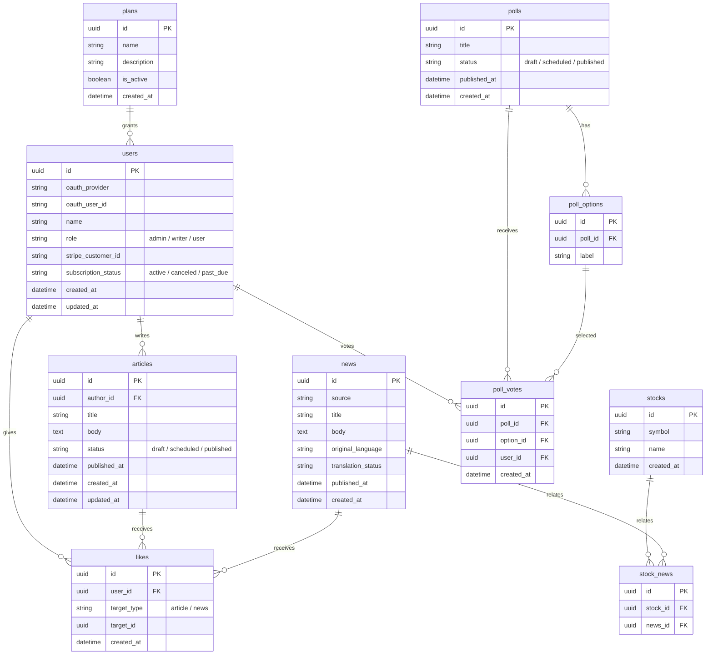

## users
概要: ユーザーの基本情報、認証情報、課金状態を管理する。
* id: ユーザーID（UUID、主キー）
* oauth_provider: OAuth認証プロバイダ（Apple / Google 等）
* oauth_user_id: OAuthプロバイダ側でのユーザー識別子
* name: ユーザーの表示名
* role: ロール区分
  * admin：管理者
  * writer：記事投稿可能
  * user：一般ユーザー
* stripe_customer_id: Stripe上のCustomer ID
  * 課金状態判定の正とする
* subscription_status: サブスクリプション状態
  * active
  * canceled
  * past_due
* created_at: ユーザー作成日時
* updated_at: 最終更新日時

## plans
概要: サブスクリプションプラン定義テーブル。
* id: プランID（UUID、主キー）
* name: プラン名
* description: プラン説明文
* is_active: 有効フラグ
* created_at: 作成日時
* updated_at: 最終更新日時

## articles
概要: 運営・ライターが投稿する記事コンテンツ。
* id: 記事ID（UUID、主キー）
* author_id: 投稿者ユーザーID（users.id）
* title: 記事タイトル
* body: 記事本文
* status: 記事ステータス
  * draft
  * scheduled
  * published
* published_at: 公開日時（予約投稿機能）
* created_at: 作成日時
* updated_at: 更新日時

## news
概要: 外部APIから取得し、自動投稿されるニュース。
* id: ニュースID（UUID、主キー）
* source: ニュース提供元（API名など）
* title: ニュースタイトル
* body: ニュース本文
* original_language: 原文の言語コード
* translation_status: 翻訳ステータス
  * 未翻訳
  * 自動翻訳済
  * レビュー済
* published_at: 公開日時
* created_at: 登録日時

## likes
概要: 記事・ニュースへの「いいね」を管理する。
* id: いいねID（UUID、主キー）
* user_id: いいねをしたユーザーID（users.id）
* target_type: 対象種別
  * article
  * news
* target_id: 対象コンテンツID（articles.id / news.id）
* created_at: いいね日時
* updated_at: 最終更新日時

## stocks
概要: 米国株の銘柄マスタ。
* id: 銘柄ID（UUID、主キー）
* symbol: ティッカーシンボル（例：AAPL）
* name: 銘柄名
* created_at: 登録日時
* updated_at: 最終更新日時

## stock_news
概要: 銘柄とニュースの紐づけテーブル。
* id: 紐づけID（UUID、主キー）
* stock_id: 銘柄ID（stocks.id）
* news_id: ニュースID（news.id）

## polls
概要: アンケート（投票）本体。
* id: アンケートID（UUID、主キー）
* title: アンケートタイトル
* status: ステータス
  * draft
  * scheduled
  * published
* published_at: 公開日時
* created_at: 作成日時

## poll_options
概要: アンケートの選択肢。
* id: 選択肢ID（UUID、主キー）
* poll_id: 対象アンケートID（polls.id）
* label: 選択肢表示文言

## poll_votes
概要: ユーザーの投票結果。
* id: 投票ID（UUID、主キー）
* poll_id: アンケートID（polls.id）
* option_id: 選択された選択肢ID（poll_options.id）
* user_id: 投票したユーザーID（users.id）
* created_at: 投票日時
* updated_at: 最終更新日時

