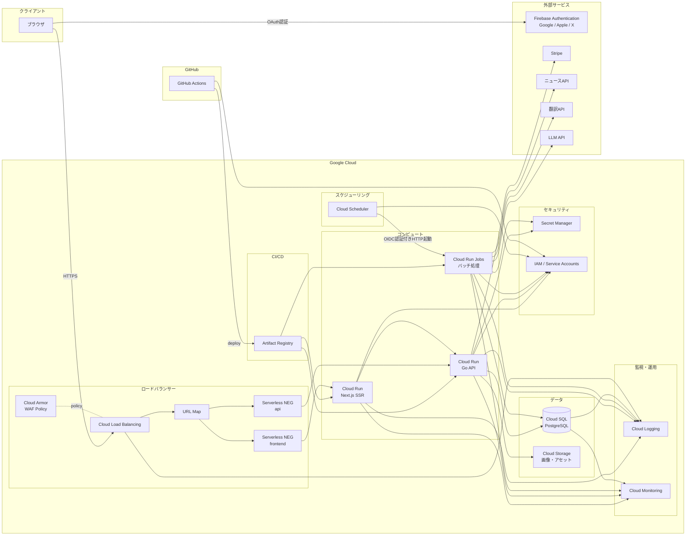

# インフラ設計書（v1.0.0）

## 1. インフラ概要

### 1.1 構成図



### 1.2 リージョン選定

| 項目 | 設定値 | 理由 |
|------|--------|------|
| リージョン | `asia-northeast1`（東京） | ユーザーの大半が日本在住。レイテンシ最小化 |
| Cloud SQL | `asia-northeast1` | コンピュートと同一リージョンで接続レイテンシ削減 |
| Cloud Storage | `asia-northeast1` | コンピュートと同一リージョンでアクセスレイテンシ削減 |
| Artifact Registry | `asia-northeast1` | デプロイ時のイメージ取得速度 |

### 1.3 想定スケール

| 指標 | 初期（v1.0.0） | 3年後 |
|------|----------------|-------|
| 登録ユーザー数 | 1,200人 | 2,400人 |
| アクティブユーザー数 | 800人 | 1,600人 |
| ユーザー特性 | ROM専98.5% | 同左 |
| 平均同時ユーザー数 | ~82 | ~165 |
| 日次リクエスト数 | ~129,000 | ~258,000 |
| SLA目標 | 99.5% | 99.5% |

> ピーク係数はサービス運用後の実測値で決定する。Cloud Run のオートスケーリングでピーク負荷に対応するため、設計値は平均値で管理する。
> 参照: [ADR-015](../../adr/015-deploy-platform.md)、[ADR-010](../../adr/010-quality-metrics.md)

---

## 2. コンピュート（Cloud Run）

> 参照: [ADR-015: デプロイプラットフォームの選定](../../adr/015-deploy-platform.md)

### 2.1 サービス一覧

| サービス名 | 役割 | ランタイム | 備考 |
|-----------|------|-----------|------|
| `sikoulab-frontend` | Next.js SSR | Node.js | standalone output mode |
| `sikoulab-api` | Go API | Go | RESTful API |
| `sikoulab-jobs` | バッチ処理 | Go | Cloud Run Jobsで実行 |

### 2.2 リソース設定

#### フロントエンド（sikoulab-frontend）

| 設定項目 | 値 | 理由 |
|---------|-----|------|
| vCPU | 0.5 | SSRの処理負荷に十分 |
| メモリ | 512MB | Next.js SSRのメモリ使用量を考慮 |
| min-instances | 1 | コールドスタート防止（起動1-3秒） |
| max-instances | 3 | ピーク時のスケーリング上限 |
| リクエストタイムアウト | 60秒 | SSRページ生成のタイムアウト |
| 同時実行数（concurrency） | 80 | Cloud Runのデフォルト値 |
| Startup CPU Boost | 無効 | min-instances=1で起動が稀なため不要 |

#### バックエンド（sikoulab-api）

| 設定項目 | 値 | 理由 |
|---------|-----|------|
| vCPU | 0.5 | APIリクエスト処理に十分 |
| メモリ | 256MB | Goバイナリの省メモリ性 |
| min-instances | 0 | Goの起動は100ms以下。コールドスタートの影響が極めて小さい（[ADR-015](../../adr/015-deploy-platform.md)） |
| max-instances | 3 | ピーク時のスケーリング上限 |
| リクエストタイムアウト | 60秒 | API処理のタイムアウト |
| 同時実行数（concurrency） | 100 | Goの並行処理能力を活用 |
| Startup CPU Boost | 有効 | min-instances=0のためコールドスタート時の起動速度を向上 |

### 2.3 コールドスタート対策

| 対策 | 適用 | 効果 |
|------|------|------|
| min-instances=1 | FEのみ | Node.js起動（1-3秒）のコールドスタート回避 |
| min-instances=0 + Startup CPU Boost | BEのみ | Go起動は100ms以下。Boost併用でさらに短縮。コスト削減優先（[ADR-015](../../adr/015-deploy-platform.md)） |
| マルチステージビルド | Docker | イメージサイズ削減で起動時間短縮 |
| ヘルスチェック | `/health` | 起動完了の確認 |

### 2.4 Dockerイメージ

#### フロントエンド

| 項目 | 設定 |
|------|------|
| ベースイメージ（ビルド） | `node:24-alpine` |
| ベースイメージ（ランタイム） | `node:24-alpine` |
| ビルド方式 | マルチステージビルド |
| output mode | standalone |
| 推定イメージサイズ | ~150MB |

#### バックエンド

| 項目 | 設定 |
|------|------|
| ベースイメージ（ビルド） | `golang:1.25-alpine` |
| ベースイメージ（ランタイム） | `gcr.io/distroless/static-debian12` |
| ビルド方式 | マルチステージビルド |
| バイナリ | 静的リンク（CGO_ENABLED=0） |
| 推定イメージサイズ | ~20MB |

### 2.5 Artifact Registry

| 項目 | 設定 |
|------|------|
| リポジトリ名 | `sikoulab` |
| リージョン | `asia-northeast1` |
| 形式 | Docker |
| イメージ命名規則 | `asia-northeast1-docker.pkg.dev/<project-id>/sikoulab/<service>:<tag>` |
| タグ戦略 | Gitコミットハッシュ（`git rev-parse --short HEAD`） |
| クリーンアップポリシー | 最新10個のイメージを保持、それ以外は自動削除 |

---

## 3. データベース（Cloud SQL）

### 3.1 インスタンス設定

| 項目 | 設定値 | 理由 |
|------|--------|------|
| エンジン | PostgreSQL 16 | PGroonga拡張のサポート（[ADR-014](../../adr/014-search-engine.md)） |
| マシンタイプ | db-f1-micro | 初期規模に十分。スケールアップ容易 |
| ストレージ | SSD 10GB（自動増加有効） | 初期データ量に十分 |
| 最大接続数 | 25（db-f1-micro上限） | min-instances=1×2サービス+Jobs+余裕 |
| 高可用性 | 無効（初期） | コスト抑制。SLA 99.5%はUptimeCheckで担保 |
| メンテナンスウィンドウ | 日曜 03:00-04:00 JST | トラフィック最少時間帯 |

### 3.2 接続方式

Cloud SQL Auth Proxy（サイドカー方式）を採用。

**接続設定**:
- Cloud Run サービスに `--add-cloudsql-instances` フラグでインスタンスを指定
- アプリケーションからは Unix ソケット（`/cloudsql/<INSTANCE_CONNECTION_NAME>`）で接続

### 3.3 バックアップ戦略

| 項目 | 設定値 |
|------|--------|
| 自動バックアップ | 有効（毎日） |
| バックアップ時刻 | 04:00 JST |
| バックアップ保持期間 | 7日間 |
| ポイントインタイムリカバリ | 有効（[ADR-015](../../adr/015-deploy-platform.md)） |
| RPO（目標復旧地点） | ~5分（トランザクションログ間隔） |
| RTO（目標復旧時間） | ~30分（手動リストア） |

### 3.4 マイグレーション運用

| 項目 | 設定 |
|------|------|
| ツール | golang-migrate（[ADR-004](../../adr/004-backend-database.md)） |
| マイグレーションファイル | `backend/migrations/*.sql` |
| 実行タイミング | デプロイ前にCI/CDパイプラインで実行 |
| ロールバック | Down マイグレーションで戻す |
| 本番適用 | Cloud SQL Auth Proxy経由でローカルから実行 or GitHub Actionsで実行 |

---

## 4. ストレージ

### 4.1 Cloud Storageバケット構成

| バケット名 | 用途 | アクセス | ライフサイクル |
|-----------|------|---------|--------------|
| `sikoulab-assets-prod` | 本番用画像（記事・ユーザーアイコン等） | 公開バケット（直接配信） | なし（永続保持） |
| `sikoulab-vrt-baselines` | VRTベースライン画像 | CI/CDからのみ | 90日で自動削除 |

**ディレクトリ構成**（`sikoulab-assets-prod`）:
```
articles/          - 記事画像
users/             - ユーザーアイコン
news/              - ニュースサムネイル
```

> 初期はCloud Storageの公開URLで直接配信する。レイテンシやトラフィック増加が問題になった段階でCloud CDNの導入を検討する。

---

## 5. ネットワーク・セキュリティ

### 5.1 Cloud Runのネットワーク設定

| 項目 | 設定 |
|------|------|
| Ingress | `internal-and-cloud-load-balancing`（LB経由のみ受け入れ） |
| サービス間通信 | Cloud Run内部URL + IAM認証 |

### 5.2 Cloud Load Balancing（最小構成）

カスタムドメイン、SSL終端、Cloud Armorのために使用する。CDNは初期では使用しない。

| 項目 | 設定 |
|------|------|
| タイプ | 外部HTTP(S)ロードバランサー（グローバル） |
| URL Map | `/api/*` → BE Backend Service、`/*` → FE Backend Service |
| Backend Service（FE） | Serverless NEG → Cloud Run（sikoulab-frontend） |
| Backend Service（BE） | Serverless NEG → Cloud Run（sikoulab-api） |
| Cloud CDN | 無効（初期） |
| Cloud Armor | 有効（WAFポリシー適用） |

### 5.3 SSL/TLS

| 項目 | 設定 |
|------|------|
| 証明書 | Google Managed SSL |
| プロトコル | TLS 1.2以上 |
| 自動更新 | Google管理（手動更新不要） |
| HSTS | 有効（max-age=31536000） |

### 5.4 カスタムドメイン設定

| 項目 | 設定 |
|------|------|
| ドメイン | TBD（例: `sikoulab.com`） |
| DNS | Cloud DNSまたは外部DNS |
| ドメイン設定方式 | Cloud Load Balancing の転送ルール + Google マネージド SSL 証明書 |

### 5.5 CORS・セキュリティヘッダー

**CORSポリシー**（Go API側で設定）:

| ヘッダー | 値 |
|---------|-----|
| Access-Control-Allow-Origin | `https://<domain>` |
| Access-Control-Allow-Methods | `GET, POST, PUT, DELETE, OPTIONS` |
| Access-Control-Allow-Headers | `Content-Type, Authorization` |
| Access-Control-Allow-Credentials | `true` |

**セキュリティヘッダー**（Next.js側で設定）:

| ヘッダー | 値 |
|---------|-----|
| X-Content-Type-Options | `nosniff` |
| X-Frame-Options | `DENY` |
| X-XSS-Protection | `0`（CSP推奨のため無効化） |
| Referrer-Policy | `strict-origin-when-cross-origin` |
| Content-Security-Policy | TBD（実装時に詳細設定） |

### 5.6 Cloud Armor（WAF/DDoS対策）

Cloud ArmorをLBに適用し、インフラ層とアプリ層の二重防御を行う。

**Cloud Armorポリシー**:

| ポリシー | 内容 | 優先度 |
|---------|------|--------|
| レート制限 | 1 IPあたり100リクエスト/分 | 1 |
| 地域制限 | 日本からのアクセスのみ許可（初期） | 2 |
| SQLインジェクション防止 | OWASP ModSecurity CRS | 3 |
| XSS防止 | OWASP ModSecurity CRS | 4 |
| デフォルトルール | 許可 | 2147483647 |

> 地域制限は初期段階のもの。海外展開時に解除。

**アプリ層の対策**（Cloud Armorと併用）:

| 対策 | 実装箇所 | 内容 |
|------|---------|------|
| SQLインジェクション防止 | Go API | パラメータ化クエリ（sqlc） |
| XSS防止 | Next.js | Reactの自動エスケープ + CSP |
| 入力バリデーション | Go API | リクエストボディのバリデーション |

### 5.7 Secret Manager

| シークレット名 | 用途 | アクセス元 |
|---------------|------|-----------|
| `database-url` | Cloud SQL接続文字列 | BE, Jobs |
| `jwt-secret` | JWT署名キー | BE |
| `stripe-secret-key` | Stripe APIキー | BE |
| `news-api-key` | ニュースAPI認証キー | Jobs |
| `translate-api-key` | 翻訳API認証キー | Jobs |
| `llm-api-key` | LLM API認証キー | Jobs |

> Firebase Admin SDK は Cloud Run 上では Application Default Credentials（ADC）で自動認証できるため、サービスアカウントキーの Secret Manager 管理は不要。`FIREBASE_PROJECT_ID` は機密情報ではなく環境変数で管理する。Google / Apple / X の OAuth クライアント情報は Firebase コンソールで管理し、バックエンドから直接保持しない。BE の ID トークン検証は Firebase Admin SDK によるローカル JWT 検証（公開鍵キャッシュ利用）であり、リクエストごとに Firebase へのネットワーク呼び出しは発生しない。

**運用ルール**:
- Cloud Run サービスアカウントに `roles/secretmanager.secretAccessor` を付与
- シークレットは環境変数としてCloud Runにマウント
- ローテーション: 手動（初期）。将来的に自動ローテーション検討

---

## 6. 監視・ログ・アラート

> 参照: [ADR-007: ログ監視方式](../../adr/007-log-monitoring.md)、[ADR-010: 品質計測](../../adr/010-quality-metrics.md)

### 6.1 Cloud Logging

| 項目 | 設定値 |
|------|--------|
| ログ出力形式 | 構造化ログ（JSON） |
| 保持期間 | 7日間 |
| ログシンク | なし（初期。将来BigQuery連携検討） |
| フィルタ | `severity >= WARNING` でアラート対象抽出 |

**ログ出力元**:
- Cloud Run（FE/BE）: アプリケーションログ + リクエストログ
- Cloud Run Jobs: バッチ処理ログ
- Cloud SQL: スロークエリログ（1秒以上）

### 6.2 Cloud Monitoring ダッシュボード設計

**SikouLab パフォーマンスダッシュボード**:

| パネル | メトリクス | 表示形式 |
|--------|----------|---------|
| リクエスト数 | `run.googleapis.com/request_count` | 時系列グラフ |
| レイテンシ（p50/p95/p99） | `run.googleapis.com/request_latencies` | 時系列グラフ |
| エラー率 | 5xx / 総リクエスト | 時系列グラフ |
| インスタンス数 | `run.googleapis.com/container/instance_count` | 時系列グラフ |
| CPU使用率 | `run.googleapis.com/container/cpu/utilizations` | ゲージ |
| メモリ使用率 | `run.googleapis.com/container/memory/utilizations` | ゲージ |
| DB接続数 | `cloudsql.googleapis.com/database/postgresql/num_backends` | 時系列グラフ |
| Uptime | Uptime Check成功率 | スコアカード |

### 6.3 アラートポリシー一覧

| アラート名 | 条件 | 通知先 | 重要度 |
|-----------|------|--------|--------|
| サービスダウン | Uptime Check 2回連続失敗 | Cloud Console アプリ | Critical |
| 高エラー率 | 5xxエラーが5分間で10件以上 | Cloud Console アプリ | Critical |
| 高レイテンシ | p95レイテンシ > 2秒が5分間継続 | Cloud Console アプリ | Warning |
| BEコールドスタート遅延 | BE p95レイテンシ > 500msが5分間継続 | Cloud Console アプリ | Warning |
| DB接続数超過 | 接続数 > 20（上限25の80%） | Cloud Console アプリ | Warning |
| バッチ処理失敗 | Cloud Run Jobs失敗 | Cloud Console アプリ | Warning |
| CPU使用率高騰 | CPU > 80%が10分間継続 | Cloud Console アプリ | Warning |
| メモリ使用率高騰 | メモリ > 80%が10分間継続 | Cloud Console アプリ | Warning |
| インスタンス数高騰 | instance_count > 2 が10分間継続 | Cloud Console アプリ | Warning |
| DBストレージ逼迫 | Cloud SQLストレージ使用量 > 80% | Cloud Console アプリ | Warning |

### 6.4 Uptime Check

| 項目 | 設定値 |
|------|--------|
| 対象エンドポイント | `https://<domain>/health` |
| チェック間隔 | 1分 |
| タイムアウト | 10秒 |
| 失敗判定 | 2回連続失敗 |
| チェックリージョン | アジア太平洋（Cloud Monitoring のグローバルプローバーから実行。asia-northeast1 単位での指定不可） |

> 参照: [サービス定義書 6.2](../../service.md)

---

## 7. バッチ処理

### 7.1 Cloud Scheduler + Cloud Run Jobs

**アーキテクチャ**:
```
Cloud Scheduler（cron式でトリガー）
    → Cloud Run Jobs（バッチ処理実行）
        → Cloud SQL / 外部API
```

- Cloud Scheduler がHTTPリクエストでCloud Run Jobsを起動
- ジョブはGoバイナリで実装（APIサーバーと同一リポジトリ）
- サービスアカウントベースの認証

### 7.2 ジョブ一覧

| ジョブ名 | 実行間隔 | 処理内容 | タイムアウト | 参照 |
|---------|---------|---------|------------|------|
| `news-fetch` | TBD（1分/3分/10分） | ニュースAPI取得 → 翻訳 → DB保存 | 5分 | [ニュース自動取得](../../functions/news/fetch.md) |
| `article-publish` | 毎分 | 予約記事の公開処理（`scheduled_at <= NOW`） | 1分 | [予約投稿](../../functions/article/schedule.md) |
| `newsletter-send` | 毎日 07:30 JST | 記事要約生成 → メール配信 | 10分 | [ニュースレター](../../functions/newsletter/home.md) |

### 7.3 リトライポリシー

| ジョブ | リトライ回数 | バックオフ | 失敗時の挙動 |
|-------|------------|----------|-------------|
| `news-fetch` | 3回 | 指数バックオフ（初回30秒） | エラーログ記録、次回スケジュールで再試行 |
| `article-publish` | 3回 | 指数バックオフ（初回10秒） | status=publish_failed に設定、ログ記録 |
| `newsletter-send` | 3回 | 指数バックオフ（初回30秒） | 要約失敗→要約なしで配信、メール失敗→ログ記録して継続 |

**共通ポリシー**:
- ジョブ失敗時はCloud Monitoringでアラート通知
- 二重実行防止: Cloud Schedulerの `attemptDeadline` でジョブ重複を回避

---

## 8. CI/CD

> 参照: [ADR-006: デプロイフロー](../../adr/006-deploy-flow.md)

### 8.1 GitHub Actions ワークフロー設計

| ワークフロー | トリガー | 実行内容 |
|------------|---------|---------|
| `ci.yml` | PR作成/更新 | lint, format, 単体テスト, docker build |
| `ci-main.yml` | mainマージ | lint, format, 単体テスト, docker build, E2E, VRT, Lighthouse CI |
| `deploy.yml` | mainマージ後（承認後） | Dockerイメージビルド → Artifact Registry push → Cloud Run deploy |

**deploy.yml のステップ**:
```
1. チェックアウト
2. Google Cloud 認証（Workload Identity Federation）
3. Docker イメージビルド（FE/BE）
4. Artifact Registry へ push
5. Cloud SQL マイグレーション実行
6. Cloud Run デプロイ（FE）
7. Cloud Run デプロイ（BE）
8. ヘルスチェック確認
9. デプロイ完了通知
```

**認証方式**:
- Workload Identity Federation（サービスアカウントキー不要）
- GitHub OIDC トークンで GCP認証

### 8.2 デプロイフロー

> 参照: [ADR-006: デプロイフロー](../../adr/006-deploy-flow.md)

```
1. ticket → dev マージ（CI実行: lint, format, 単体テスト, docker build）
2. dev → main のPRを作成
3. PRマージ（CI実行: 上記 + E2E, VRT, Lighthouse CI）
4. GitHub Actionsが `environment: production` に到達
5. 承認者に通知 → GitHub UI上で承認
6. デプロイ実行（Artifact Registry → Cloud Run）
```

### 8.3 ロールバック手順

```
1. 問題発生を検知（Cloud Monitoring アラート or 手動）
2. GCPコンソール or gcloud CLI で Cloud Run リビジョン一覧を確認
   gcloud run revisions list --service=<service-name> --region=asia-northeast1
3. 前バージョンのリビジョンにトラフィックを100%切り替え
   gcloud run services update-traffic <service-name> --to-revisions=<revision>=100 --region=asia-northeast1
4. 原因調査 → 修正 → 通常のデプロイフローで再デプロイ
```

**ロールバック所要時間**: ~1分（リビジョン切り替えのみ）

---

## 9. コスト

> 参照: [ADR-015: デプロイプラットフォームの選定](../../adr/015-deploy-platform.md)

### 9.1 月額コスト試算

| 項目 | 月額（USD） | 備考 |
|------|-----------|------|
| Cloud Run（Next.js） | $10-20 | 0.5 vCPU, 512MB, min=1 |
| Cloud Run（Go API） | $5-15 | 0.5 vCPU, 256MB, min=0 |
| Cloud Load Balancing | $18-20 | 転送ルール1つ（カスタムドメイン用） |
| Cloud Armor | $5 | セキュリティポリシー1つ |
| Cloud SQL（PostgreSQL） | $10 | db-f1-micro |
| Cloud Storage | $1-3 | 画像・VRTベースライン |
| Cloud Logging | $0-2 | 7日保持 |
| Cloud Monitoring | $0 | 基本無料 |
| Cloud Scheduler | $0 | 3ジョブ（無料枠内） |
| Secret Manager | $0 | 無料枠内（10,000アクセス/月） |
| Artifact Registry | $0-1 | ストレージ量に依存 |
| Egress | $5-15 | Cloud Run・Cloud Storage → クライアント（$0.085/GB、同一リージョン内は無料） |
| **合計** | **$54-91/月** | |

### 9.2 スケーリング時のコスト影響

| シナリオ | 追加コスト | 対応 |
|---------|----------|------|
| アクティブユーザー2倍（1,600人） | +$10-20/月 | max-instances増加 |
| Cloud CDN追加 | +$1-5/月 | 画像配信のレイテンシ改善が必要な場合 |
| Cloud SQL スケールアップ（db-g1-small） | +$25/月 | 接続数上限が必要な場合 |
| Cloud SQL 高可用性有効化 | +$10/月 | SLA向上が必要な場合 |
| バッチ処理増加 | +$5-10/月 | ジョブ数・実行頻度に依存 |

### 9.3 予算アラート

| 閾値 | アクション |
|------|----------|
| 50%（~$46） | メール通知 |
| 80%（~$73） | メール通知 |
| 100%（$91） | メール通知 + Cloud Consoleアプリ通知 |
| 120%（~$109） | メール通知 + 原因調査 |

**設定場所**: GCPコンソール > Billing > Budgets & Alerts

---

## 10. 構築工数見積もり

| フェーズ | 作業項目 | 工数（時間） |
|---------|---------|------------|
| **Phase 1: 基盤構築** | | **16-20h** |
| | GCPプロジェクト作成・IAM設定 | 2h |
| | Artifact Registry セットアップ | 1h |
| | Cloud SQL インスタンス作成・初期設定 | 2h |
| | Cloud Storage バケット作成 | 1h |
| | Secret Manager シークレット登録 | 2h |
| | Dockerfile作成（FE/BE） | 4-6h |
| | Cloud Run サービスデプロイ（初回） | 4-6h |
| **Phase 2: ネットワーク・セキュリティ** | | **6-10h** |
| | Cloud Load Balancing設定（URL Map + Serverless NEG） | 2-3h |
| | カスタムドメイン + SSL証明書設定 | 2-3h |
| | Cloud Armor ポリシー設定 | 1-2h |
| | セキュリティヘッダー設定 | 1-2h |
| **Phase 3: CI/CD** | | **8-12h** |
| | GitHub Actions ワークフロー作成（CI） | 3-4h |
| | GitHub Actions ワークフロー作成（CD） | 3-4h |
| | Workload Identity Federation設定 | 2-3h |
| | Environment Protection Rules設定 | 0.5h |
| **Phase 4: 監視・運用** | | **6-8h** |
| | Cloud Logging 設定 | 1h |
| | Cloud Monitoring ダッシュボード作成 | 2-3h |
| | アラートポリシー設定 | 2-3h |
| | Uptime Check 設定 | 0.5h |
| | 予算アラート設定 | 0.5h |
| **Phase 5: バッチ処理** | | **4-6h** |
| | Cloud Scheduler ジョブ作成 | 1-2h |
| | Cloud Run Jobs 設定 | 2-3h |
| | リトライ・アラート設定 | 1h |
| **合計** | | **40-56h** |

> ADR-015での見積もり（40-60h）と整合。
> バッチ処理のアプリケーション実装工数は含まない（各詳細設計書を参照）。

---

## 関連ドキュメント

| ドキュメント | パス | 内容 |
|------------|------|------|
| ADR-005: staging環境 | [005-staging-environment.md](../../adr/005-staging-environment.md) | 環境構成（prod/dev） |
| ADR-006: デプロイフロー | [006-deploy-flow.md](../../adr/006-deploy-flow.md) | デプロイフロー、ロールバック |
| ADR-007: ログ監視 | [007-log-monitoring.md](../../adr/007-log-monitoring.md) | ログ監視方式、障害対応フロー |
| ADR-010: 品質計測 | [010-quality-metrics.md](../../adr/010-quality-metrics.md) | SLA目標、パフォーマンス指標 |
| ADR-015: インフラ環境構築 | [015-deploy-platform.md](../../adr/015-deploy-platform.md) | Cloud Run選定、スケール設計、エッジ構成、リソース最適化、コスト試算 |
| サービス定義書 | [service.md](../../service.md) | サービス品質目標値 |
| 開発ガイドライン | [development_guidelines.md](../../development_guidelines.md) | 技術スタック、CI/CD方針 |
