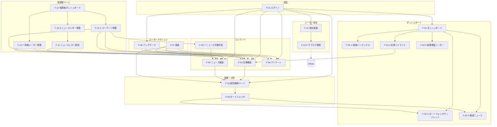
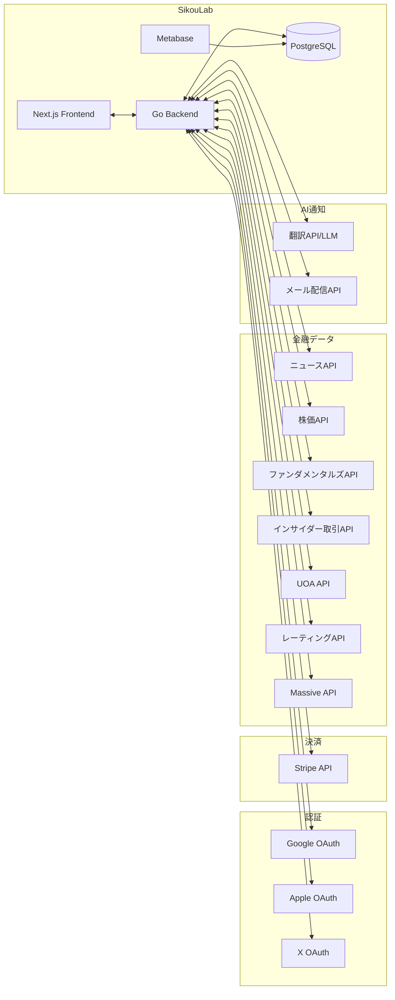

# バージョン 1.0.0 基本設計書

## 1. システム概要

### 1.1 本バージョンの位置づけ

シコウラボの初期リリースバージョン。専門家の記事を購読する「記事購読型コミュニティ」として、ROM専ユーザー（約98.5%）を主要ターゲットとした受動的な情報提供プラットフォームを構築する。

**核心価値**: 専門家の記事を購読すること

### 1.2 前提・制約

- 完全ログイン制（未ログインユーザーは利用不可）
- 完全サブスクリプション制（無料ユーザーは存在しない）
- 上位プランは本バージョンでは不要
- 高級感・専門性を損なわないUI/UX

※ 技術スタック・アーキテクチャ詳細は `docs/development_guidelines.md` を参照

## 2. 機能一覧

### 2.1 機能階層

- 優先度の定義
  - **MUST**: このバージョンで必ず実装する
  - **WANT**: 余裕があれば実装する

- ステータスの定義
  - **未着手**: 詳細設計未実施
  - **設計中**: 詳細設計作成中（feature-spec実行中）
  - **実装中**: 実装作業中
  - **完了**: 実装・テスト完了

| ID | 機能名 | 概要 | 優先度 | ステータス | 詳細設計 |
|----|--------|------|--------|-----------|----------|
| F-01 | ログイン機能 | OAuth（Google / Apple / X）による認証 | MUST | 設計完了 | `auth/login.md` |
| F-02 | ダッシュボード | ログイン後のホーム画面 | MUST | 未着手 | - |
| F-02-1 | 相場インデックス表示 | S&P500等の主要指数の価格・変動率を表示 | MUST | 未着手 | - |
| F-02-2 | 記事・ニュースハイライト | 最新・人気の記事をカード形式で表示 | MUST | 未着手 | - |
| F-02-3 | ポートフォリオウィジェット | 登録ポートフォリオのパフォーマンスサマリーを表示 | MUST | 未着手 | - |
| F-02-4 | 関連ニュースウィジェット | ポートフォリオに関連するニュースをリスト表示 | MUST | 未着手 | - |
| F-02-5 | 相場異変レーダー | 全上場銘柄から異常検出した情報を表示 | MUST | 未着手 | - |
| F-03 | 個別銘柄ページ | 株価・ファンダメンタルズ・UOA・レーティング表示 | MUST | 設計完了 | `stock/home.md` |
| F-03-1 | 株価チャート | 時系列での株価推移表示 | MUST | 設計完了 | `stock/home.md` |
| F-03-2 | ニュースオーバーレイ | チャート上に値動きがあった日のニュースを表示 | MUST | 設計完了 | `stock/home.md` |
| F-03-3 | ファンダメンタルズ | EPS、時価総額等の基本指標表示 | MUST | 設計完了 | `stock/home.md` |
| F-03-4 | インサイダー取引 | 企業内部者の株式売買情報を表示 | MUST | 設計完了 | `stock/home.md` |
| F-03-5 | UOA表示 | Unusual Option Activity表示 | MUST | 設計完了 | `stock/home.md` |
| F-03-6 | 証券会社レーティング | 買い/保有/売り、目標株価の表示 | MUST | 設計完了 | `stock/home.md` |
| F-03-7 | 銘柄の関連ニュース | 銘柄に紐づくニュースを日付降順で表示 | MUST | 設計完了 | `stock/home.md` |
| F-03-8 | 人気記事/ニュース | 直近3ヶ月×View数で表示 | MUST | 設計完了 | `stock/home.md` |
| F-03-9 | アナリスト格付け | Massive APIによる格付け・コメント表示（ポップアップ） | MUST | 設計完了 | `stock/home.md` |
| F-04 | 記事機能 | 記事の作成・編集・公開・予約投稿 | MUST | 設計完了 | `article/home.md` |
| F-04-1 | 記事作成・編集 | Markdownエディタによる記事作成。投稿ユーザー選択対応 | MUST | 設計完了 | `article/create-edit.md` |
| F-04-2 | 予約投稿 | 公開日時を指定した記事公開 | MUST | 設計完了 | `article/schedule.md` |
| F-04-3 | ジャンル分け | 6ジャンル程度で記事を分類表示 | MUST | 設計完了 | `article/home.md` |
| F-04-4 | 人気記事 | 72時間以内×View数で人気記事を表示 | MUST | 設計完了 | `article/home.md` |
| F-04-5 | 記事詳細ページ | 1つの記事の全文を表示する画面 | MUST | 設計完了 | `article/detail.md` |
| F-05 | ニュース機能 | 外部APIからの自動取得に加え、管理者・ライターによる手動投稿にも対応。日本語翻訳、予約投稿、ピン固定機能 | MUST | 設計完了 | `news/home.md` |
| F-05-1 | ニュース自動取得 | 外部APIからニュースを取得しDBに保存 | MUST | 設計完了 | `news/fetch.md` |
| F-05-2 | 日本語翻訳 | ニュースを日本語に翻訳して表示 | MUST | 設計完了 | `news/fetch.md` |
| F-05-3 | トレンドニュース表示 | 直近24時間以内のニュースをスコアリング順に10個表示。ピン固定ニュースは優先上部表示（10件枠内） | MUST | 設計完了 | `news/home.md` |
| F-05-4 | ジャンル別ニュース表示 | 3ジャンルで各5件を最新順に表示 | MUST | 設計完了 | `news/home.md` |
| F-05-5 | ジャンル詳細ページ | ジャンル別のニュース一覧ページ | MUST | 設計完了 | `news/genre-detail.md` |
| F-05-6 | ニュース詳細ページ | ニュースのLLM日本語訳を表示 | WANT | 未着手 | - |
| F-05-7 | ニュース手動作成・編集 | Markdownエディタによるニュース新規作成・編集。投稿ユーザー選択、ジャンル設定、予約投稿対応 | MUST | 未着手 | - |
| F-06 | アンケート機能 | 最大9択、1ユーザー1回投票 | MUST | 設計完了 | `poll/home.md` |
| F-06-1 | アンケート投票画面 | 選択肢別の投票率表示、1ユーザー1回投票 | MUST | 設計完了 | `poll/home.md` |
| F-07 | 検索機能 | 記事／ニュース／銘柄／アンケートの検索 | MUST | 設計完了 | `search/home.md` |
| F-08 | ブックマーク機能 | 記事・ニュース・アンケートのブックマーク | MUST | 設計完了 | `bookmark/home.md` |
| F-09 | ポートフォリオ | 銘柄をまとめて管理（最大5つ） | MUST | 設計完了 | `portfolio/home.md` |
| F-09-1 | ポートフォリオ管理画面 | ポートフォリオの作成・編集・削除、銘柄追加・削除 | MUST | 設計完了 | `portfolio/home.md` |
| F-09-2 | 関連ニュースページ | ポートフォリオに関連するニュースを独自ページで表示 | MUST | 設計完了 | `portfolio/home.md` |
| F-10 | 設定画面 | ユーザー設定の管理画面 | MUST | 設計完了 | `settings/home.md` |
| F-10-1 | プロフィール設定 | アイコン、userId、表示名の確認・編集 | MUST | 設計完了 | `settings/home.md` |
| F-10-2 | サブスクリプション管理 | Stripe連携、プラン確認・変更 | MUST | 設計完了 | `settings/home.md` |
| F-10-3 | メールアドレス登録 | ニュースレター受信用メールアドレスの登録・変更 | MUST | 設計完了 | `settings/home.md` |
| F-10-4 | FAQ・問い合わせ | よくある質問、問い合わせフォームへのリンク | MUST | 設計完了 | `settings/home.md` |
| F-11 | ニュースレター機能 | メール登録ユーザーに選択した記事の要約を毎日配信 | MUST | 設計完了 | `newsletter/home.md` |
| F-11-1 | 記事要約生成 | LLMで記事を200-300文字に要約 | MUST | 設計完了 | `newsletter/home.md` |
| F-11-2 | 定期配信 | 毎日朝7:30に登録ユーザーへメール送信 | MUST | 設計完了 | `newsletter/home.md` |
| F-12 | 管理者ページ | admin/writerが利用する管理画面のアクセス拠点 | MUST | 設計完了 | `admin/home.md` |
| F-12-1 | コンテンツ管理 | 全記事・ニュース・アンケートの管理機能 | MUST | 設計完了 | `admin/home.md` |
| F-12-1-1 | 記事管理 | 全記事の一覧表示、編集、削除、予約投稿管理 | MUST | 設計完了 | `admin/home.md` |
| F-12-1-2 | ニュース管理 | 全ニュースの一覧表示、新規作成、翻訳編集・レビュー、削除、予約投稿管理、ピン固定管理 | MUST | 設計完了 | `admin/home.md` |
| F-12-1-3 | アンケート管理 | アンケートの作成、編集、削除、予約投稿管理 | MUST | 設計完了 | `admin/home.md` |
| F-12-2 | ユーザー管理 | ユーザー一覧、権限付与、アカウント停止 | MUST | 設計完了 | `admin/home.md` |
| F-12-3 | ニュースレター管理 | 配信リスト管理（最大5記事）、配信履歴確認 | MUST | 設計完了 | `admin/home.md` |
| F-12-4 | 設定管理 | システム設定値・ジャンルの管理 | MUST | 設計完了 | `admin/home.md` |
| F-12-5 | アナリティクス | Metabaseによる閲覧数・MAU・入退会数の可視化 | WANT | 設計完了 | `admin/home.md` |
| F-12-6 | お知らせ通知 | 管理者によるメンテナンス・アップデート・重要ニュースのユーザー通知 | MUST | 設計完了 | `admin/home.md` |
| F-12-7 | 投稿ユーザー管理 | 投稿用ユーザー（表示著者）の作成・編集・削除。管理者のみ | MUST | 未着手 | - |

### 2.2 機能相関図



### 2.3 機能依存関係

| 機能ID | 依存先 | 依存内容 |
|--------|--------|----------|
| F-02 | F-01 | 認証済みユーザーのみアクセス可能 |
| F-02-2 | F-04 | 記事データの取得 |
| F-02-3 | F-09 | ポートフォリオデータの取得 |
| F-02-4 | F-09, F-05 | ポートフォリオ銘柄に関連するニュースの取得 |
| F-03 | F-05 | 銘柄関連ニュースの表示 |
| F-03 | 外部API | 株価・ファンダメンタルズ・UOA・インサイダー取引データ |
| F-04-1 | F-01 | admin/writerロールが必要 |
| F-05 | 外部API | ニュースデータの取得元 |
| F-08 | F-04, F-05, F-06 | ブックマーク対象コンテンツ |
| F-09 | F-03 | 銘柄情報の参照 |
| F-09-2 | F-09, F-05 | ポートフォリオの銘柄リストとニュース |
| F-10-2 | Stripe | 決済処理・サブスク状態管理 |
| F-11 | F-04 | 記事要約の生成元 |
| F-12 | F-01 | admin/writerロールが必要 |
| F-12-5 | F-04, F-05 | 閲覧データの集計 |
| F-05-7 | F-01 | admin/writerロールが必要 |
| F-05-7 | F-12-7 | 投稿ユーザーの選択に投稿ユーザーマスタが必要 |
| F-12-6 | F-12 | 管理者ページフレームワークの一部として実装 |
| F-12-7 | F-12 | 管理者ページフレームワークの一部として実装 |

## 3. 画面設計

**Pencil**: `docs/versions/1_0_0/SikouLab.pen`

### 3.1 画面一覧

| 画面ID | 画面名 | 概要 | 対応機能 | Pencil（ノードID） |
|--------|--------|------|----------|-------------------|
| S-01 | ログイン画面 | OAuth認証の選択 | F-01 | `h3Lxa` |
| S-02 | ダッシュボード | ログイン後のホーム画面 | F-02 | `AwSoL` |
| S-02-1 | 相場インデックス | S&P500等の主要指数の価格・変動率を表示 | F-02-1 | 未定義 |
| S-02-2 | 記事・ニュースハイライト | 最新・人気の記事をカード形式で表示 | F-02-2 | 未定義 |
| S-02-3 | ポートフォリオウィジェット | 登録ポートフォリオのパフォーマンスサマリーを表示 | F-02-3 | 未定義 |
| S-02-4 | 関連ニュースウィジェット | ポートフォリオに関連するニュースをリスト表示 | F-02-4 | 未定義 |
| S-02-5 | 相場異変レーダー | 全上場銘柄から異常検出した情報を表示 | F-02-5 | 未定義 |
| S-03 | 記事一覧 | ジャンル別記事一覧 | F-04-3, F-04-4 | `YeKnC` |
| S-04 | 記事詳細 | 記事本文表示、いいね、ブックマーク | F-04-5, F-08 | 未定義 |
| S-05 | 記事作成・編集 | 記事の入稿・編集・予約設定（管理者/writer向け） | F-04-1, F-04-2 | 未定義 |
| S-06 | ニュース一覧 | トレンドニュース、ジャンル別ニュース表示 | F-05-3, F-05-4 | `ZAU4z` |
| S-07 | ニュースジャンル詳細 | ジャンル別のニュース一覧ページ | F-05-5 | 未定義 |
| S-08 | ニュース詳細 | ニュースのLLM日本語訳表示（WANT） | F-05-6, F-08 | 未定義(WANT) |
| S-09 | 検索 | 記事・ニュース・銘柄・アンケートの統合検索 | F-07 | 未定義 |
| S-10 | 銘柄詳細 | 株価・ファンダ・インサイダー・UOA・レーティング表示 | F-03 | `0Cn3B` |
| S-11 | ポートフォリオ一覧 | 作成済みポートフォリオの一覧（ダッシュボード内に含まれる） | F-09 | 未定義 |
| S-12 | ポートフォリオ詳細 | ポートフォリオ内銘柄・パフォーマンス表示・関連ニュース | F-09-1, F-09-2 | 未定義 |
| S-14 | アンケート一覧 | アンケート一覧・カテゴリ絞り込み | F-06 | `OruNZ` |
| S-15 | アンケート詳細・投票 | 投票実行・結果表示 | F-06-1 | 未定義 |
| S-16 | ブックマーク一覧 | ブックマーク済みコンテンツ一覧 | F-08 | 未定義 |
| S-17 | 設定画面 | プロフィール・サブスク管理・メール登録・FAQ・問い合わせ | F-10 | `kOXOT` |
| S-18 | 管理者ダッシュボード | コンテンツ管理・ユーザー管理・ニュースレター管理・設定管理・アナリティクス・お知らせ通知へのアクセス | F-12 | 未定義 |
| S-19 | 記事管理 | 全記事の一覧・編集・削除・予約管理 | F-12-1-1 | 未定義 |
| S-20 | ニュース管理 | 全ニュースの一覧・編集・削除 | F-12-1-2 | 未定義 |
| S-21 | アンケート管理 | アンケートの作成・編集・削除・予約管理 | F-12-1-3 | 未定義 |
| S-22 | ユーザー管理 | ユーザー一覧・権限付与・アカウント停止 | F-12-2 | 未定義 |
| S-23 | ニュースレター管理 | 配信リスト・配信履歴管理 | F-12-3 | 未定義 |
| S-24 | ニュース作成・編集 | ニュースの入稿・編集・予約設定（管理者/writer向け） | F-05-7 | 未定義 |
| S-25 | 投稿ユーザー管理 | 投稿用ユーザーの作成・編集・削除（管理者向け） | F-12-7 | 未定義 |


**ノードIDの使用例**
```bash
# ダッシュボードのみを取得
mcp__pencil__batch_get(filePath="docs/versions/1_0_0/SikouLab.pen", nodeIds=["AwSoL"])
```

### 3.2 画面遷移図

```mermaid
flowchart TD
    %% ログイン
    S01[S-01 ログイン] --> S02[S-02 ダッシュボード]

    %% ダッシュボードのサブ画面（1画面内に包含）
    S02 --> S021[S-02-1 相場インデックス]
    S02 --> S022[S-02-2 記事・ニュースハイライト]
    S02 --> S023[S-02-3 ポートフォリオウィジェット]
    S02 --> S024[S-02-4 関連ニュースウィジェット]
    S02 --> S025[S-02-5 相場異変レーダー]

    %% サイドバーからの遷移（ログイン後）
    SB[サイドバー] --> S02
    SB --> S03[S-03 記事一覧]
    SB --> S06[S-06 ニュース一覧]
    SB --> S14[S-14 アンケート一覧]
    SB --> S16[S-16 ブックマーク一覧]
    SB --> S17[S-17 設定画面]

    %% 記事関連の遷移
    S03 --> S04[S-04 記事詳細]

    %% ニュース関連の遷移
    S06 --> S07[S-07 ニュースジャンル詳細]
    S06 --> S08[S-08 ニュース詳細<br/>※WANT]
    S07 --> S08

    %% アンケート関連の遷移
    S14 --> S15[S-15 アンケート詳細]

    %% ダッシュボード内のポートフォリオ関連の遷移
    S02 --> S11[S-11 ポートフォリオ一覧]
    S11 --> S12[S-12 ポートフォリオ詳細]
    S12 --> S10[S-10 銘柄詳細]

    %% 記事・ニュースから銘柄詳細への遷移
    S04 --> S10
    S08 --> S10

    %% ブックマーク一覧からの遷移
    S16 --> S04
    S16 --> S08
    S16 --> S15

    %% 管理者専用（adminロールのみアクセス可能）
    SB -.-> S18[S-18 管理者ダッシュボード]
    S18 --> S05[S-05 記事作成・編集]
    S18 --> S19[S-19 記事管理]
    S18 --> S20[S-20 ニュース管理]
    S18 --> S21[S-21 アンケート管理]
    S18 --> S22[S-22 ユーザー管理]
    S18 --> S23[S-23 ニュースレター管理]
    S18 --> S24[S-24 ニュース作成・編集]
    S18 --> S25[S-25 投稿ユーザー管理]

    S19 --> S05
    S20 --> S24
```



**補足: グローバル検索（S-09）**
- 全画面（S-02〜S-23）からグローバル検索バー経由でアクセス可能
- 検索結果から記事詳細（S-04）、ニュース詳細（S-08）、銘柄詳細（S-10）、アンケート詳細（S-15）へ遷移

**注記:**
- **S-01, S-05, S-24, S-25**: デザイン未定義（実装のみ）
- **S-08**: WANT機能

### 3.3 共通コンポーネント

#### サイドバー

全画面共通で表示されるナビゲーションコンポーネント。詳細仕様は要件定義書 8.1 を参照。

**構成**
```
┌─────────────────────┐
│ ブランドロゴ         │
├─────────────────────┤
│ ▼ ダッシュボード     │
│ ▶ 記事（折りたたみ）  │
│    ├ ジャンル1       │
│    ├ ジャンル2       │
│    └ ...             │
│ ▼ ニュース           │
│ ▼ 投票               │
├─────────────────────┤
│ [アバター] ユーザー名 │
│ ▼ 設定               │
└─────────────────────┘
```

※ ログアウトは設定画面（F-10）内に配置

**折りたたみ状態の永続化**
- `user_settings`テーブルの`sidebar_article_expanded`カラムで管理
- ログイン時・ページ遷移時に状態を復元

### 3.4 主要画面レイアウト方針

#### S-02 ダッシュボード（親画面）

ログイン後のホーム画面。S-02-1〜S-02-5のサブ画面を包含する。

**全体構成**
- ヘッダー: ロゴ + グローバル検索バー（常時表示）
- サイドバー: ナビゲーション（折りたたみ状態永続化）
- メインコンテンツ: 以下のサブ画面を配置

#### S-02-1 相場インデックス
- 配置: ヘッダー直下の全幅
- 表示内容: S&P500, NASDAQ, DOW JONES等の主要指数
- 表示項目: 指数名・現在値・前日比・変動方向（▲上昇 / ▼下落）
- 更新頻度: 30秒〜2分（外部API連携）

#### S-02-2 記事・ニュースハイライト
- 配置: 相場インデックス直下のメインエリア
- 表示形式: カード形式（サムネイル + タイトル + 日時 + ジャンルラベル）
- 表示条件: 72時間以内、View数 × 公開時間の加重スコアでソート
- 表示数: PC 4〜6件、モバイル 4件

#### S-02-3 ポートフォリオセクション（一覧＋ウィジェット）
- 配置: メインエリアの下部（左または独立セクション）
- 表示内容:
  - **ポートフォリオ一覧**: ユーザーが作成した全ポートフォリオをカード形式で表示（最大5つ）
    - 各カード: ポートフォリオ名、銘柄数、現在価値、損益率
    - 新規作成ボタン
  - **パフォーマンスサマリー**: 選択またはデフォルトポートフォリオのパフォーマンス
    - ポートフォリオ名・銘柄コード（ティッカー色）・変動率
    - 表示形式: 縦積みリスト（最大5銘柄まで）
- 空状態: ポートフォリオ未作成時は「ポートフォリオを作成」CTA
- 遷移: ポートフォリオカードクリックでポートフォリオ詳細（S-12）へ遷移

#### S-02-4 関連ニュースウィジェット
- 配置: メインエリアの下部（右または独立セクション）
- 表示内容: 見出し・日時・関連銘柄ティッカー
- 表示数: 最大5件
- 表示条件: ポートフォリオ登録済みかつ関連ニュース存在時

#### S-02-5 相場異変レーダー
- 配置: メインエリアの下部または独立セクション
- 表示内容: 異常検出銘柄・異常種別・検出時刻

#### S-10 銘柄詳細
- 上部: 株価チャート（ニュースオーバーレイ対応）
- 中部: ファンダメンタルズ・インサイダー取引・UOA・レーティング
- 下部: 関連記事・ニュース

#### S-12 ポートフォリオ詳細
- パフォーマンスサマリー: 現在価値、損益額、損益率
- 銘柄リスト: 各銘柄の現在価値、損益、銘柄追加・削除機能
- 関連ニュースセクション: ポートフォリオ内銘柄に関連するニュース一覧（F-09-2）

#### S-18 管理者ダッシュボード
- コンテンツ管理（記事・ニュース・アンケート）へのリンク
- ユーザー管理へのリンク
- ニュースレター管理へのリンク
- 設定管理へのリンク
- アナリティクス（Metabase）へのリンク（WANT）

## 4. データ設計

データ設計の詳細（ER図・テーブル定義）は別ドキュメントを参照。

📄 **[データ設計書](/docs/versions/1_0_0/system_datas.md)**

- ER図（全テーブルのリレーション）
- テーブル一覧（34テーブル）
- カラム定義（全テーブルの詳細）


## 5. 外部インターフェース

### 5.1 外部API連携

| 連携先 | 用途 | 対応機能 | 更新頻度 |
|--------|------|----------|----------|
| ニュースAPI | 金融ニュース取得 | F-05-1 | 定期バッチ |
| 株価API | 株価・出来高取得 | F-03-1 | 定期バッチ（30秒〜2分） |
| ファンダメンタルズAPI | EPS・時価総額等取得 | F-03-3 | 日次バッチ |
| インサイダー取引API | 企業内部者の売買情報取得 | F-03-4 | 日次バッチ |
| UOA API | 大口オプション取引データ | F-03-5 | 定期バッチ |
| レーティングAPI | 証券会社レーティング | F-03-6 | 日次バッチ |
| Massive API | アナリスト格付け | F-03-9 | 日次バッチ |
| 翻訳API/LLM | ニュース日本語化・記事要約 | F-05-2, F-11-1 | ニュース取得時/配信時 |
| メール配信API | ニュースレター送信 | F-11-2 | 毎日朝7:30 |
| Stripe API | 決済・サブスク管理 | F-10-2 | イベント駆動 |
| Google OAuth | 認証 | F-01 | リクエスト時 |
| Apple OAuth | 認証 | F-01 | リクエスト時 |
| X OAuth | 認証 | F-01 | リクエスト時 |

### 5.2 外部システム連携図



## 6. 権限マトリクス

### 6.1 ロール×機能

| 機能 | admin | writer | user |
|------|-------|--------|------|
| 記事閲覧（F-04） | ○ | ○ | ○ |
| 記事作成・編集（F-04-1） | ○ （全て） | ○（自分のみ） | × |
| 記事管理（F-12-1-1） | ○ | ○ | × |
| ニュース閲覧（F-05） | ○ | ○ | ○ |
| ニュース手動作成・編集（F-05-7） | ○（全て） | ○（自分のみ） | × |
| ニュース管理（F-12-1-2） | ○ | ○ | × |
| 銘柄ページ閲覧（F-03） | ○ | ○ | ○ |
| ポートフォリオ操作（F-09） | ○ | ○ | ○ |
| ポートフォリオ管理画面（F-09-1） | ○ | ○ | ○ |
| アンケート投票（F-06-1） | ○ | ○ | ○ |
| アンケート管理（F-12-1-3） | ○ | × | × |
| 検索機能（F-07） | ○ | ○ | ○ |
| ブックマーク機能（F-08） | ○ | ○ | ○ |
| プロフィール設定（F-10-1） | ○ | ○ | ○ |
| メールアドレス登録（F-10-3） | ○ | ○ | ○ |
| FAQ・問い合わせ（F-10-4） | ○ | ○ | ○ |
| 管理者ページアクセス（F-12） | ○ | ○ | × |
| ユーザー管理（F-12-2） | ○ | × | × |
| ニュースレター管理（F-12-3） | ○ | × | × |
| 設定管理（F-12-4） | ○ | × | × |
| アナリティクス閲覧（F-12-5） | ○ | × | × |
| お知らせ通知（F-12-6） | ○ | × | × |
| 投稿ユーザー管理（F-12-7） | ○ | × | × |
| ジャンル管理 | ○ | ○ | × |

---

### 6.2 サブスクリプション状態×アクセス

Stripeのサブスクリプションステータスに基づくアクセス制御。

| ステータス | 状態 | アクセス |
|-----------|------|----------|
| `active` | 支払い成功 | 全機能利用可能 |
| `trialing` | トライアル中 | 全機能利用可能 |
| `past_due` | 請求失敗、リトライ中 | 全機能利用可能（検討中） |
| `canceled` | キャンセル済み | ログイン不可 |
| `unpaid` | リトライ失敗、未払い | ログイン不可 |
| `incomplete` | 初回支払い未完了 | ログイン不可 |
| `incomplete_expired` | 初回支払い期限切れ | ログイン不可 |
| `paused` | 一時停止 | ログイン不可 |

past_dueについて: 請求失敗時にStripeが自動リトライしている期間のステータス。（カード限度額超過、有効期限切れ等が原因）現時点では猶予期間として「全機能利用可能」を想定。

## 7. 用語定義

| 用語 | 定義 |
|------|------|
| ROM専 | Read Only Member。閲覧のみで発言しないユーザー |
| UOA | Unusual Option Activity。大口のオプション取引 |
| インサイダー取引 | 企業内部者（役員、取締役等）による自社株の売買取引情報。SECへの届出データを表示 |
| ファンダメンタルズ | EPS、時価総額、PER等の企業の基礎的財務指標 |
| レーティング | 証券会社アナリストによる買い/保有/売りの推奨評価 |
| ポートフォリオ | ユーザーが保有・注目する銘柄をまとめたもの（最大5つ作成可能） |
| シコウラボ | 思考／志向／試行 × ラボ。専門家の思考プロセスを覗ける場 |
| admin | 管理者ロール。全機能・全データへのアクセス権限を持つ |
| writer | 記事投稿権限ロール。記事の作成・編集が可能 |
| user | 一般ユーザーロール。閲覧・投票・いいね・ブックマークのみ |
| トレンドニュース | 直近24時間以内のニュースをスコアリング順に表示。スコア=View数×1pt + 人気銘柄紐付き×2pt |
| ニュースジャンル | ニュースを分類するカテゴリ（株式市場・AI・経済等）。初期3ジャンル、追加可能 |
| 人気銘柄 | ユーザーのポートフォリオ登録数が多い銘柄。トレンドニュースのスコアリングに使用 |
| 投稿ユーザー | 記事・ニュースの表示上の著者（バイライン）。実際の操作者とは別概念。管理画面で作成 |
| 手動投稿ニュース | 管理者・ライターが直接作成するニュース。origin=manualで区別 |

## 8. 次工程への接続

本基本設計をもとに以下を実施する：

1. **機能設計書（feature-spec）**: 各機能の詳細仕様を `docs/functions/` 配下に作成
2. **OpenAPI設計**: バックエンドAPIの詳細定義

### 機能設計の優先順位

1. F-01 ログイン機能（認証基盤）
2. F-10-2 サブスクリプション管理（課金基盤）
3. F-04 記事機能（核心価値）
4. F-05 ニュース機能
5. F-03 個別銘柄ページ
6. F-02 ダッシュボード
7. F-09 ポートフォリオ
8. F-12 管理者ページ
9. その他機能
