# データ設計書

## 1. ER図

```mermaid
erDiagram
    %% ユーザー・認証
    users {
        uuid id PK
        string oauth_provider
        string oauth_user_id
        string name
        string display_name
        string avatar_url
        string role "admin/writer/user"
        uuid plan_id FK
        string stripe_customer_id
        string subscription_status "active/canceled/past_due"
        datetime created_at
        datetime updated_at
    }

    plans {
        uuid id PK
        string name
        string description
        boolean is_active
        datetime created_at
        datetime updated_at
    }

    user_settings {
        uuid id PK
        uuid user_id FK
        boolean sidebar_article_expanded "記事タブの折りたたみ状態"
        datetime created_at
        datetime updated_at
    }

    %% ニュースレター購読
    newsletter_subscriptions {
        uuid id PK
        uuid user_id FK
        string email
        boolean is_active
        datetime created_at
        datetime updated_at
    }

    newsletter_articles {
        uuid id PK
        uuid article_id FK
        date scheduled_date
        int display_order
        datetime created_at
        datetime updated_at
    }

    newsletter_logs {
        uuid id PK
        int recipient_count
        text article_ids
        datetime created_at
        datetime updated_at
    }

    %% コンテンツ
    articles {
        uuid id PK
        uuid author_id FK
        string title
        text body
        string status "draft/scheduled/published/publish_failed"
        datetime scheduled_at "予約日時（ユーザー指定）"
        datetime published_at "実際の公開日時"
        datetime created_at
        datetime updated_at
    }

    genres {
        uuid id PK
        string name
        string type "article/news"
        int display_order
        datetime created_at
        datetime updated_at
    }

    article_genres {
        uuid id PK
        uuid article_id FK
        uuid genre_id FK
        datetime created_at
        datetime updated_at
    }

    news {
        uuid id PK
        string source
        string title
        text body
        string original_language
        string sentiment "POSITIVE/NEGATIVE/NEUTRAL"
        datetime published_at
        datetime created_at
        datetime updated_at
    }

    news_translations {
        uuid id PK
        uuid news_id FK
        string language
        string title
        text body
        string translation_status "pending/translated/reviewed"
        uuid edited_by FK
        uuid reviewed_by FK
        datetime created_at
        datetime updated_at
    }

    news_genres {
        uuid id PK
        uuid news_id FK
        uuid genre_id FK
        datetime created_at
        datetime updated_at
    }

    %% 銘柄
    stocks {
        uuid id PK
        string symbol
        string name
        datetime created_at
        datetime updated_at
    }

    stock_news {
        uuid id PK
        uuid stock_id FK
        uuid news_id FK
        datetime created_at
        datetime updated_at
    }

    stock_articles {
        uuid id PK
        uuid stock_id FK
        uuid article_id FK
        datetime created_at
        datetime updated_at
    }

    stock_prices {
        uuid id PK
        uuid stock_id FK
        decimal open
        decimal high
        decimal low
        decimal close
        bigint volume
        date price_date
        datetime created_at
        datetime updated_at
    }

    stock_fundamentals {
        uuid id PK
        uuid stock_id FK
        decimal eps
        decimal market_cap
        decimal pe_ratio
        date date
        datetime created_at
        datetime updated_at
    }

    stock_insider_trades {
        uuid id PK
        uuid stock_id FK
        string insider_name
        string insider_title
        string transaction_type "buy/sell"
        decimal shares
        decimal price
        date date
        datetime filed_at
        datetime created_at
        datetime updated_at
    }

    stock_uoa {
        uuid id PK
        uuid stock_id FK
        string option_type
        decimal strike
        date expiry
        bigint volume
        datetime detected_at
        datetime created_at
        datetime updated_at
    }

    stock_ratings {
        uuid id PK
        uuid stock_id FK
        string firm_name
        string rating "buy/hold/sell"
        decimal target_price
        datetime rated_at
        datetime created_at
        datetime updated_at
    }

    analyst_ratings {
        uuid id PK
        uuid stock_id FK
        string analyst_name
        string grade
        text comment
        datetime rated_at
        datetime created_at
        datetime updated_at
    }

    %% ポートフォリオ
    portfolios {
        uuid id PK
        uuid user_id FK
        string name
        datetime created_at
        datetime updated_at
    }

    portfolio_stocks {
        uuid id PK
        uuid portfolio_id FK
        uuid stock_id FK
        decimal purchase_price "取得価格"
        int shares "保有株数"
        datetime created_at
        datetime updated_at
    }

    %% アンケート
    polls {
        uuid id PK
        string title
        string category
        string status "draft/scheduled/published/publish_failed"
        datetime scheduled_at "予約日時（ユーザー指定）"
        datetime published_at "実際の公開日時"
        datetime created_at
        datetime updated_at
    }

    poll_options {
        uuid id PK
        uuid poll_id FK
        string label
        int display_order
        datetime created_at
        datetime updated_at
    }

    poll_votes {
        uuid id PK
        uuid poll_id FK
        uuid option_id FK
        uuid user_id FK
        datetime created_at
        datetime updated_at
    }

    %% ユーザーアクション
    article_likes {
        uuid id PK
        uuid user_id FK
        uuid article_id FK
        datetime created_at
        datetime updated_at
    }

    news_likes {
        uuid id PK
        uuid user_id FK
        uuid news_id FK
        datetime created_at
        datetime updated_at
    }

    article_bookmarks {
        uuid id PK
        uuid user_id FK
        uuid article_id FK
        datetime created_at
        datetime updated_at
    }

    news_bookmarks {
        uuid id PK
        uuid user_id FK
        uuid news_id FK
        datetime created_at
        datetime updated_at
    }

    poll_bookmarks {
        uuid id PK
        uuid user_id FK
        uuid poll_id FK
        datetime created_at
        datetime updated_at
    }

    article_views {
        uuid id PK
        uuid user_id FK
        uuid article_id FK
        datetime created_at
        datetime updated_at
    }

    news_views {
        uuid id PK
        uuid user_id FK
        uuid news_id FK
        datetime created_at
        datetime updated_at
    }

    %% システム設定
    system_settings {
        uuid id PK
        string key
        text value
        string description
        datetime created_at
        datetime updated_at
    }

    %% リレーション
    plans ||--o{ users : "subscribed"
    users ||--o| user_settings : "has"
    users ||--o{ articles : "writes"
    users ||--o{ portfolios : "owns"
    users ||--o{ poll_votes : "votes"
    users ||--o{ article_likes : "gives"
    users ||--o{ news_likes : "gives"
    users ||--o{ article_bookmarks : "creates"
    users ||--o{ news_bookmarks : "creates"
    users ||--o{ poll_bookmarks : "creates"
    users ||--o{ article_views : "records"
    users ||--o{ news_views : "records"
    users ||--o{ newsletter_subscriptions : "subscribes"

    articles ||--o{ article_genres : "has"
    genres ||--o{ article_genres : "belongs"
    articles ||--o{ article_likes : "receives"
    articles ||--o{ article_bookmarks : "receives"
    articles ||--o{ article_views : "receives"
    articles ||--o{ stock_articles : "relates"
    articles ||--o{ newsletter_articles : "included"

    news ||--o{ news_likes : "receives"
    news ||--o{ news_bookmarks : "receives"
    news ||--o{ news_views : "receives"
    news ||--o{ stock_news : "relates"
    news ||--o{ news_genres : "has"
    news ||--o{ news_translations : "has"
    genres ||--o{ news_genres : "belongs"

    stocks ||--o{ stock_news : "has"
    stocks ||--o{ stock_articles : "has"
    stocks ||--o{ stock_prices : "has"
    stocks ||--o{ stock_fundamentals : "has"
    stocks ||--o{ stock_insider_trades : "has"
    stocks ||--o{ stock_uoa : "has"
    stocks ||--o{ stock_ratings : "has"
    stocks ||--o{ analyst_ratings : "has"
    stocks ||--o{ portfolio_stocks : "included"

    portfolios ||--o{ portfolio_stocks : "contains"

    polls ||--o{ poll_options : "has"
    polls ||--o{ poll_votes : "receives"
    polls ||--o{ poll_bookmarks : "receives"
    poll_options ||--o{ poll_votes : "selected"
```

## 2. テーブル詳細

### 2.1 テーブル一覧

| テーブル名 | 概要 | 関連機能 |
|-----------|------|----------|
| users | ユーザー情報・認証・課金状態 | F-01, F-10-2 |
| user_settings | ユーザー個別設定（サイドバー状態等） | 共通UI |
| plans | サブスクリプションプラン定義 | F-10-2 |
| articles | 記事コンテンツ | F-04 |
| article_genres | 記事ジャンル中間テーブル | F-04-3 |
| genres | ジャンルマスタ | F-04-3, F-05-4 |
| news | ニュースコンテンツ | F-05 |
| news_translations | ニュース翻訳・レビュー | F-05-2, F-12-1-2 |
| news_genres | ニュースジャンル中間テーブル | F-05-4 |
| stocks | 銘柄マスタ | F-03 |
| stock_news | 銘柄×ニュース紐づけ | F-03-7 |
| stock_articles | 銘柄×記事紐づけ | F-03-8 |
| stock_prices | 株価履歴 | F-03-1 |
| stock_fundamentals | ファンダメンタルズ | F-03-3 |
| stock_insider_trades | インサイダー取引情報 | F-03-4 |
| stock_uoa | Unusual Option Activity | F-03-5 |
| stock_ratings | 証券会社レーティング | F-03-6 |
| analyst_ratings | アナリスト格付け | F-03-9 |
| portfolios | ポートフォリオ | F-09 |
| portfolio_stocks | ポートフォリオ×銘柄 | F-09 |
| polls | アンケート | F-06 |
| poll_options | アンケート選択肢 | F-06 |
| poll_votes | 投票結果 | F-06-1 |
| article_likes | 記事いいね | F-04 |
| news_likes | ニュースいいね | F-05 |
| article_bookmarks | 記事ブックマーク | F-08 |
| news_bookmarks | ニュースブックマーク | F-08 |
| poll_bookmarks | アンケートブックマーク | F-08 |
| article_views | 記事閲覧履歴（アナリティクス用） | F-12-5 |
| news_views | ニュース閲覧履歴（アナリティクス用） | F-12-5 |
| newsletter_subscriptions | ニュースレター購読者 | F-10-3, F-11 |
| newsletter_articles | ニュースレター配信記事リスト | F-12-3 |
| newsletter_logs | ニュースレター配信履歴 | F-11-2 |
| system_settings | システム設定値 | F-12-4 |

### 2.2 カラム定義

**users** - ユーザー情報・認証・課金状態

| カラム名 | データ型 | 説明 | 制約 |
|---------|---------|------|------|
| id | uuid | 主キー | PK |
| oauth_provider | string | OAuthプロバイダ（google/apple/x） | NOT NULL |
| oauth_user_id | string | プロバイダ側のユーザーID | NOT NULL |
| name | string | ユーザー名 | |
| display_name | string | 表示名 | |
| avatar_url | string | アバター画像URL | |
| role | string | ロール（admin/writer/user） | NOT NULL, DEFAULT 'user' |
| plan_id | uuid | 加入プランID | FK |
| stripe_customer_id | string | Stripe顧客ID | UNIQUE |
| subscription_status | string | サブスクリプション状態 | NOT NULL |
| created_at | datetime | 作成日時 | NOT NULL |
| updated_at | datetime | 更新日時 | NOT NULL |

**user_settings** - ユーザー個別設定

| カラム名 | データ型 | 説明 | 制約 |
|---------|---------|------|------|
| id | uuid | 主キー | PK |
| user_id | uuid | ユーザーID | FK, NOT NULL, UNIQUE |
| sidebar_article_expanded | boolean | 記事タブの折りたたみ状態 | DEFAULT true |
| created_at | datetime | 作成日時 | NOT NULL |
| updated_at | datetime | 更新日時 | NOT NULL |

**plans** - サブスクリプションプラン定義

| カラム名 | データ型 | 説明 | 制約 |
|---------|---------|------|------|
| id | uuid | 主キー | PK |
| name | string | プラン名 | NOT NULL |
| description | text | プラン説明 | |
| is_active | boolean | 有効フラグ | DEFAULT true |
| created_at | datetime | 作成日時 | NOT NULL |
| updated_at | datetime | 更新日時 | NOT NULL |

**articles** - 記事コンテンツ

| カラム名 | データ型 | 説明 | 制約 |
|---------|---------|------|------|
| id | uuid | 主キー | PK |
| author_id | uuid | 著者ID | FK, NOT NULL |
| title | string | タイトル | NOT NULL |
| body | text | 本文（Markdown） | NOT NULL |
| status | string | 状態（draft/scheduled/published/publish_failed） | NOT NULL |
| scheduled_at | datetime | 予約日時（ユーザー指定） | |
| published_at | datetime | 実際の公開日時（バッチ処理時に設定） | |
| created_at | datetime | 作成日時 | NOT NULL |
| updated_at | datetime | 更新日時 | NOT NULL |

**genres** - ジャンルマスタ

| カラム名 | データ型 | 説明 | 制約 |
|---------|---------|------|------|
| id | uuid | 主キー | PK |
| name | string | ジャンル名 | NOT NULL |
| type | string | タイプ（article/news） | NOT NULL |
| display_order | int | 表示順 | |
| created_at | datetime | 作成日時 | NOT NULL |
| updated_at | datetime | 更新日時 | NOT NULL |

**article_genres** - 記事ジャンル中間テーブル

| カラム名 | データ型 | 説明 | 制約 |
|---------|---------|------|------|
| id | uuid | 主キー | PK |
| article_id | uuid | 記事ID | FK, NOT NULL |
| genre_id | uuid | ジャンルID | FK, NOT NULL |
| created_at | datetime | 作成日時 | NOT NULL |
| updated_at | datetime | 更新日時 | NOT NULL |

**制約**
- 複合ユニーク制約: `UNIQUE(article_id, genre_id)`

**news** - ニュースコンテンツ

| カラム名 | データ型 | 説明 | 制約 |
|---------|---------|------|------|
| id | uuid | 主キー | PK |
| source | string | ソースURL | NOT NULL |
| title | string | タイトル | NOT NULL |
| body | text | 本文 | NOT NULL |
| original_language | string | 原文言語 | NOT NULL |
| sentiment | string | センチメント（POSITIVE/NEGATIVE/NEUTRAL） | DEFAULT 'NEUTRAL' |
| published_at | datetime | 公開日時 | NOT NULL |
| created_at | datetime | 作成日時 | NOT NULL |
| updated_at | datetime | 更新日時 | NOT NULL |

**news_translations** - ニュース翻訳・レビュー

| カラム名 | データ型 | 説明 | 制約 |
|---------|---------|------|------|
| id | uuid | 主キー | PK |
| news_id | uuid | ニュースID | FK, NOT NULL |
| language | string | 翻訳言語 | NOT NULL |
| title | string | 翻訳タイトル | |
| body | text | 翻訳本文 | |
| translation_status | string | 翻訳状態（pending/translated/reviewed） | NOT NULL |
| edited_by | uuid | 編集者ID | FK |
| reviewed_by | uuid | レビュー者ID | FK |
| created_at | datetime | 作成日時 | NOT NULL |
| updated_at | datetime | 更新日時 | NOT NULL |

**制約**
- 複合ユニーク制約: `UNIQUE(news_id, language)` - 1言語1翻訳

**news_genres** - ニュースジャンル中間テーブル

| カラム名 | データ型 | 説明 | 制約 |
|---------|---------|------|------|
| id | uuid | 主キー | PK |
| news_id | uuid | ニュースID | FK, NOT NULL |
| genre_id | uuid | ジャンルID | FK, NOT NULL |
| created_at | datetime | 作成日時 | NOT NULL |
| updated_at | datetime | 更新日時 | NOT NULL |

**制約**
- 複合ユニーク制約: `UNIQUE(news_id, genre_id)`

**stocks** - 銘柄マスタ

| カラム名 | データ型 | 説明 | 制約 |
|---------|---------|------|------|
| id | uuid | 主キー | PK |
| symbol | string | 銘柄コード（ティッカー） | NOT NULL, UNIQUE |
| name | string | 銘柄名 | NOT NULL |
| created_at | datetime | 作成日時 | NOT NULL |
| updated_at | datetime | 更新日時 | NOT NULL |

**stock_news** - 銘柄×ニュース紐づけ

| カラム名 | データ型 | 説明 | 制約 |
|---------|---------|------|------|
| id | uuid | 主キー | PK |
| stock_id | uuid | 銘柄ID | FK, NOT NULL |
| news_id | uuid | ニュースID | FK, NOT NULL |
| created_at | datetime | 作成日時 | NOT NULL |
| updated_at | datetime | 更新日時 | NOT NULL |

**制約**
- 複合ユニーク制約: `UNIQUE(stock_id, news_id)`

**stock_articles** - 銘柄×記事紐づけ

| カラム名 | データ型 | 説明 | 制約 |
|---------|---------|------|------|
| id | uuid | 主キー | PK |
| stock_id | uuid | 銘柄ID | FK, NOT NULL |
| article_id | uuid | 記事ID | FK, NOT NULL |
| created_at | datetime | 作成日時 | NOT NULL |
| updated_at | datetime | 更新日時 | NOT NULL |

**制約**
- 複合ユニーク制約: `UNIQUE(stock_id, article_id)`

**stock_prices** - 株価履歴

| カラム名 | データ型 | 説明 | 制約 |
|---------|---------|------|------|
| id | uuid | 主キー | PK |
| stock_id | uuid | 銘柄ID | FK, NOT NULL |
| open | decimal | 始値 | NOT NULL |
| high | decimal | 高値 | NOT NULL |
| low | decimal | 安値 | NOT NULL |
| close | decimal | 終値 | NOT NULL |
| volume | bigint | 出来高 | NOT NULL |
| price_date | date | 日付 | NOT NULL |
| created_at | datetime | 作成日時 | NOT NULL |
| updated_at | datetime | 更新日時 | NOT NULL |

**stock_fundamentals** - ファンダメンタルズ

| カラム名 | データ型 | 説明 | 制約 |
|---------|---------|------|------|
| id | uuid | 主キー | PK |
| stock_id | uuid | 銘柄ID | FK, NOT NULL |
| eps | decimal | EPS（1株あたり利益） | |
| market_cap | decimal | 時価総額 | |
| pe_ratio | decimal | PER（株価収益率） | |
| date | date | データ日付 | NOT NULL |
| created_at | datetime | 作成日時 | NOT NULL |
| updated_at | datetime | 更新日時 | NOT NULL |

**stock_insider_trades** - インサイダー取引情報

| カラム名 | データ型 | 説明 | 制約 |
|---------|---------|------|------|
| id | uuid | 主キー | PK |
| stock_id | uuid | 銘柄ID | FK, NOT NULL |
| insider_name | string | インサイダー名 | NOT NULL |
| insider_title | string | インサイダーの役職 | |
| transaction_type | string | 取引種別（buy/sell） | NOT NULL |
| shares | decimal | 取引株数 | NOT NULL |
| price | decimal | 取引価格 | NOT NULL |
| date | date | 取引日 | NOT NULL |
| filed_at | datetime | 届出日時 | NOT NULL |
| created_at | datetime | 作成日時 | NOT NULL |
| updated_at | datetime | 更新日時 | NOT NULL |

**stock_uoa** - Unusual Option Activity

| カラム名 | データ型 | 説明 | 制約 |
|---------|---------|------|------|
| id | uuid | 主キー | PK |
| stock_id | uuid | 銘柄ID | FK, NOT NULL |
| option_type | string | オプション種別（call/put） | NOT NULL |
| strike | decimal | 権利行使価格 | NOT NULL |
| expiry | date | 満期日 | NOT NULL |
| volume | bigint | 取引量 | NOT NULL |
| detected_at | datetime | 検出日時 | NOT NULL |
| created_at | datetime | 作成日時 | NOT NULL |
| updated_at | datetime | 更新日時 | NOT NULL |

**stock_ratings** - 証券会社レーティング

| カラム名 | データ型 | 説明 | 制約 |
|---------|---------|------|------|
| id | uuid | 主キー | PK |
| stock_id | uuid | 銘柄ID | FK, NOT NULL |
| firm_name | string | 証券会社名 | NOT NULL |
| rating | string | レーティング（buy/hold/sell） | NOT NULL |
| target_price | decimal | 目標株価 | |
| rated_at | datetime | レーティング日時 | NOT NULL |
| created_at | datetime | 作成日時 | NOT NULL |
| updated_at | datetime | 更新日時 | NOT NULL |

**analyst_ratings** - アナリスト格付け

| カラム名 | データ型 | 説明 | 制約 |
|---------|---------|------|------|
| id | uuid | 主キー | PK |
| stock_id | uuid | 銘柄ID | FK, NOT NULL |
| analyst_name | string | アナリスト名 | NOT NULL |
| grade | string | 格付け | NOT NULL |
| comment | text | コメント | |
| rated_at | datetime | 格付け日時 | NOT NULL |
| created_at | datetime | 作成日時 | NOT NULL |
| updated_at | datetime | 更新日時 | NOT NULL |

**portfolios** - ポートフォリオ

| カラム名 | データ型 | 説明 | 制約 |
|---------|---------|------|------|
| id | uuid | 主キー | PK |
| user_id | uuid | ユーザーID | FK, NOT NULL |
| name | string | ポートフォリオ名 | NOT NULL |
| created_at | datetime | 作成日時 | NOT NULL |
| updated_at | datetime | 更新日時 | NOT NULL |

**portfolio_stocks** - ポートフォリオ×銘柄

| カラム名 | データ型 | 説明 | 制約 |
|---------|---------|------|------|
| id | uuid | 主キー | PK |
| portfolio_id | uuid | ポートフォリオID | FK, NOT NULL |
| stock_id | uuid | 銘柄ID | FK, NOT NULL |
| purchase_price | decimal | 取得価格 | NOT NULL |
| shares | int | 保有株数 | NOT NULL |
| created_at | datetime | 作成日時 | NOT NULL |
| updated_at | datetime | 更新日時 | NOT NULL |

**制約**
- 複合ユニーク制約: `UNIQUE(portfolio_id, stock_id)`

**polls** - アンケート

| カラム名 | データ型 | 説明 | 制約 |
|---------|---------|------|------|
| id | uuid | 主キー | PK |
| title | string | タイトル | NOT NULL |
| category | string | カテゴリ | |
| status | string | 状態（draft/scheduled/published/publish_failed） | NOT NULL |
| scheduled_at | datetime | 予約日時（ユーザー指定） | |
| published_at | datetime | 実際の公開日時（バッチ処理時に設定） | |
| created_at | datetime | 作成日時 | NOT NULL |
| updated_at | datetime | 更新日時 | NOT NULL |

**poll_options** - アンケート選択肢

| カラム名 | データ型 | 説明 | 制約 |
|---------|---------|------|------|
| id | uuid | 主キー | PK |
| poll_id | uuid | アンケートID | FK, NOT NULL |
| label | string | 選択肢ラベル | NOT NULL |
| display_order | int | 表示順 | NOT NULL |
| created_at | datetime | 作成日時 | NOT NULL |
| updated_at | datetime | 更新日時 | NOT NULL |

**poll_votes** - 投票結果

| カラム名 | データ型 | 説明 | 制約 |
|---------|---------|------|------|
| id | uuid | 主キー | PK |
| poll_id | uuid | アンケートID | FK, NOT NULL |
| option_id | uuid | 選択肢ID | FK, NOT NULL |
| user_id | uuid | ユーザーID | FK, NOT NULL |
| created_at | datetime | 投票日時 | NOT NULL |
| updated_at | datetime | 更新日時 | NOT NULL |

**制約**
- 複合ユニーク制約: `UNIQUE(poll_id, user_id)` - 1ユーザー1票

**article_likes** - 記事いいね

| カラム名 | データ型 | 説明 | 制約 |
|---------|---------|------|------|
| id | uuid | 主キー | PK |
| user_id | uuid | ユーザーID | FK, NOT NULL |
| article_id | uuid | 記事ID | FK, NOT NULL |
| created_at | datetime | 作成日時 | NOT NULL |
| updated_at | datetime | 更新日時 | NOT NULL |

**制約**
- 複合ユニーク制約: `UNIQUE(article_id, user_id)` - トグル方式

**news_likes** - ニュースいいね

| カラム名 | データ型 | 説明 | 制約 |
|---------|---------|------|------|
| id | uuid | 主キー | PK |
| user_id | uuid | ユーザーID | FK, NOT NULL |
| news_id | uuid | ニュースID | FK, NOT NULL |
| created_at | datetime | 作成日時 | NOT NULL |
| updated_at | datetime | 更新日時 | NOT NULL |

**制約**
- 複合ユニーク制約: `UNIQUE(news_id, user_id)` - トグル方式

**article_bookmarks** - 記事ブックマーク

| カラム名 | データ型 | 説明 | 制約 |
|---------|---------|------|------|
| id | uuid | 主キー | PK |
| user_id | uuid | ユーザーID | FK, NOT NULL |
| article_id | uuid | 記事ID | FK, NOT NULL |
| created_at | datetime | 作成日時 | NOT NULL |
| updated_at | datetime | 更新日時 | NOT NULL |

**制約**
- 複合ユニーク制約: `UNIQUE(article_id, user_id)` - トグル方式

**news_bookmarks** - ニュースブックマーク

| カラム名 | データ型 | 説明 | 制約 |
|---------|---------|------|------|
| id | uuid | 主キー | PK |
| user_id | uuid | ユーザーID | FK, NOT NULL |
| news_id | uuid | ニュースID | FK, NOT NULL |
| created_at | datetime | 作成日時 | NOT NULL |
| updated_at | datetime | 更新日時 | NOT NULL |

**制約**
- 複合ユニーク制約: `UNIQUE(news_id, user_id)` - トグル方式

**poll_bookmarks** - アンケートブックマーク

| カラム名 | データ型 | 説明 | 制約 |
|---------|---------|------|------|
| id | uuid | 主キー | PK |
| user_id | uuid | ユーザーID | FK, NOT NULL |
| poll_id | uuid | アンケートID | FK, NOT NULL |
| created_at | datetime | 作成日時 | NOT NULL |
| updated_at | datetime | 更新日時 | NOT NULL |

**制約**
- 複合ユニーク制約: `UNIQUE(poll_id, user_id)` - トグル方式

**article_views** - 記事閲覧履歴

| カラム名 | データ型 | 説明 | 制約 |
|---------|---------|------|------|
| id | uuid | 主キー | PK |
| user_id | uuid | ユーザーID | FK, NOT NULL |
| article_id | uuid | 記事ID | FK, NOT NULL |
| created_at | datetime | 閲覧日時 | NOT NULL |
| updated_at | datetime | 更新日時 | NOT NULL |

**news_views** - ニュース閲覧履歴

| カラム名 | データ型 | 説明 | 制約 |
|---------|---------|------|------|
| id | uuid | 主キー | PK |
| user_id | uuid | ユーザーID | FK, NOT NULL |
| news_id | uuid | ニュースID | FK, NOT NULL |
| created_at | datetime | 閲覧日時 | NOT NULL |
| updated_at | datetime | 更新日時 | NOT NULL |

**newsletter_subscriptions** - ニュースレター購読者

| カラム名 | データ型 | 説明 | 制約 |
|---------|---------|------|------|
| id | uuid | 主キー | PK |
| user_id | uuid | ユーザーID | FK, NOT NULL, UNIQUE |
| email | string | メールアドレス | NOT NULL |
| is_active | boolean | 有効フラグ | DEFAULT true |
| created_at | datetime | 作成日時 | NOT NULL |
| updated_at | datetime | 更新日時 | NOT NULL |

**newsletter_articles** - ニュースレター配信記事リスト

| カラム名 | データ型 | 説明 | 制約 |
|---------|---------|------|------|
| id | uuid | 主キー | PK |
| article_id | uuid | 記事ID | FK, NOT NULL |
| scheduled_date | date | 配信予定日 | NOT NULL |
| display_order | int | 表示順 | NOT NULL |
| created_at | datetime | 作成日時 | NOT NULL |
| updated_at | datetime | 更新日時 | NOT NULL |

**newsletter_logs** - ニュースレター配信履歴

| カラム名 | データ型 | 説明 | 制約 |
|---------|---------|------|------|
| id | uuid | 主キー | PK |
| recipient_count | int | 受信者数 | NOT NULL |
| article_ids | text | 記事IDリスト（JSON配列） | |
| created_at | datetime | 配信日時 | NOT NULL |
| updated_at | datetime | 更新日時 | NOT NULL |

**system_settings** - システム設定値

| カラム名 | データ型 | 説明 | 制約 |
|---------|---------|------|------|
| id | uuid | 主キー | PK |
| key | string | 設定キー | NOT NULL, UNIQUE |
| value | text | 設定値 | |
| description | string | 説明 | |
| created_at | datetime | 作成日時 | NOT NULL |
| updated_at | datetime | 更新日時 | NOT NULL |
